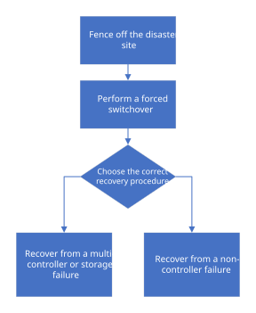

= MetroCluster Arbeitsablauf zur Notfallwiederherstellung
:allow-uri-read: 
:icons: font
:imagesdir: ../media/

[role="lead"]
Verwenden Sie den Workflow für die Durchführung der Disaster Recovery.

