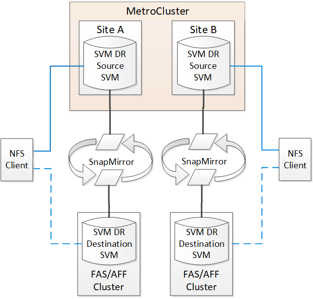

= Überlegungen bei der Verwendung von ONTAP in einer MetroCluster-Konfiguration
:allow-uri-read: 
:icons: font
:imagesdir: ../media/

[role="lead"]
Wenn Sie ONTAP in einer MetroCluster-Konfiguration verwenden, sollten Sie bestimmte Überlegungen bei der Lizenzierung, beim Peering an Cluster außerhalb der MetroCluster-Konfiguration, bei der Durchführung von Volume-Vorgängen, NVFAIL-Vorgängen und anderen ONTAP-Vorgängen beachten.

.Überlegungen zur Lizenzierung
* Beide Standorte sollten für die gleiche Site-lizenzierte Funktionen lizenziert sein.
* Alle Nodes sollten für die gleichen Node-gesperrten Funktionen lizenziert sein.

.Überlegungen zu SnapMirror
* Die Disaster Recovery für SnapMirror SVMs wird nur auf MetroCluster Konfigurationen mit Versionen von ONTAP 9.5 oder höher unterstützt.

== FlexCache-Unterstützung in einer MetroCluster-Konfiguration

Ab ONTAP 9.7 werden FlexCache Volumes von MetroCluster Konfigurationen unterstützt. Sie sollten die Anforderungen für die manuelle Aufhebung nach dem Switchover oder Switchback-Betrieb kennen.

=== SVM wird nach der Umschaltung wieder aufgehoben, wenn sich die FlexCache Herkunft und der Cache innerhalb desselben Standorts befinden. MetroCluster

Nach einer vereinbarten oder ungeplanten Umschaltung muss jede SVM-FlexCache-Peering-Beziehung innerhalb des Clusters manuell konfiguriert werden.

Beispielsweise befinden sich SVMs „vs1“ (Cache) und „vs2“ (Ursprung) auf Site_A Diese SVMs sind Peering-Punkte.

Nach der Umschaltung werden SVMs „vs1-mc“ und „vs2-mc“ am Partner-Standort (Site_B) aktiviert. Sie müssen manuell aufgehoben werden, damit FlexCache mit dem arbeiten kann `vserver peer repeer` Befehl.

=== SVM wird nach dem Switchover aufgehoben oder zurückgeschaltet, wenn sich ein FlexCache Ziel auf einem dritten Cluster befindet und sich im getrennten Modus befindet

Für FlexCache-Beziehungen zu einem Cluster außerhalb der MetroCluster-Konfiguration muss nach einem Switchover das Peering immer manuell neu konfiguriert werden, wenn die betroffenen Cluster während der Umschaltung in einem getrennten Modus sind.

Beispiel:

* Ein Ende der FlexCache (Cache_1 auf vs1) befindet sich auf MetroCluster Site_A.
* Das andere Ende der FlexCache (Origin_1 auf vs2) befindet sich auf site_C (nicht in der MetroCluster-Konfiguration).

Wenn die Umschaltung ausgelöst wird und keine Verbindung zwischen Site_A und Site_C besteht, müssen Sie die SVMs On Site_B (das Switchover-Cluster) und Site_C über die manuell aufheben `vserver peer repeer` Befehl nach der Umschaltung.

Wenn ein Wechsel zurück durchgeführt wird, müssen Sie die SVMs on site_A (das ursprüngliche Cluster) und site_C. erneut aufheben

.Verwandte Informationen
link:https://docs.netapp.com/us-en/ontap/flexcache/index.html["Management von FlexCache Volumes mit der CLI"^]

== FabricPool-Unterstützung in MetroCluster-Konfigurationen

Ab ONTAP 9.7 unterstützen MetroCluster Konfigurationen FabricPool Storage Tiers.

Allgemeine Informationen zur Verwendung von FabricPool finden Sie unter link:https://docs.netapp.com/us-en/ontap/disks-aggregates/index.html["Festplatten- und Tier-Management (Aggregat)"^].

=== Überlegungen bei der Verwendung von FabricPool

* Die Cluster müssen über FabricPool-Lizenzen mit entsprechenden Kapazitätslimits verfügen.
* Die Cluster müssen IPspaces mit übereinstimmenden Namen haben.
+
Dies kann der standardmäßige IP-Speicherplatz oder ein IP-Speicherplatz sein, den eine Verwaltung erstellt hat. Dieser IPspace wird für die Konfiguration des FabricPool-Objektspeichers verwendet.

* Für den ausgewählten IPspace muss für jedes Cluster eine Intercluster-LIF definiert sein, die den externen Objektspeicher erreichen kann

=== Konfigurieren eines Aggregats zur Verwendung in einer gespiegelten FabricPool

NOTE: Bevor Sie das Aggregat konfigurieren, müssen Sie Objektspeicher wie in beschrieben einrichten link:https://docs.netapp.com/us-en/ontap/fabricpool/setup-object-stores-mcc-task.html["Richten Sie Objektspeicher für FabricPool in einer MetroCluster-Konfiguration ein"^].

.Schritte
So konfigurieren Sie ein Aggregat für die Verwendung in einem FabricPool:

. Erstellen Sie das Aggregat oder wählen Sie ein vorhandenes Aggregat aus.
. Spiegeln Sie das Aggregat als ein typisches gespiegeltes Aggregat innerhalb der MetroCluster Konfiguration.
. Erstellen Sie die FabricPool Spiegelung mit dem Aggregat, wie im beschrieben https://docs.netapp.com/ontap-9/topic/com.netapp.doc.dot-cm-psmg/home.html["Festplatten- und Aggregatmanagement"]
+
.. Hängen Sie einen primären Objektspeicher an.
+
Dieser Objektspeicher befindet sich physisch näher am Cluster.

.. Fügen Sie einen Mirror-Objektspeicher hinzu.
+
Dieser Objektspeicher ist physisch weiter entfernt zum Cluster als der primäre Objektspeicher.

NOTE: Es wird empfohlen, dass Sie für gespiegelte Aggregate mindestens 20 % freien Speicherplatz freihalten, um so optimale Storage Performance und Verfügbarkeit zu erzielen. Obwohl die Empfehlung 10 % für nicht gespiegelte Aggregate ist, können die zusätzlichen 10 % des Speicherplatzes vom Dateisystem verwendet werden, um inkrementelle Änderungen aufzunehmen. Inkrementelle Änderungen erhöhen die Speicherplatzauslastung für gespiegelte Aggregate aufgrund der Snapshot-basierten Architektur von ONTAP, die auf dem Copy-on-Write basiert. Die Nichteinhaltung dieser Best Practices kann sich negativ auf die Performance auswirken.

== FlexGroup-Unterstützung in MetroCluster-Konfigurationen

Ab ONTAP 9.6 unterstützen MetroCluster Konfigurationen FlexGroup Volumes.

== Unterstützung von Konsistenzgruppen in MetroCluster Konfigurationen

Ab ONTAP 9.11.1 link:https://docs.netapp.com/us-en/ontap/consistency-groups/index.html["Konsistenzgruppen"^] Werden in MetroCluster-Konfigurationen unterstützt.

== Job-Zeitpläne in einer MetroCluster-Konfiguration

In ONTAP 9.3 und höher werden benutzererstellte Job-Zeitpläne automatisch zwischen Clustern in einer MetroCluster Konfiguration repliziert. Wenn Sie einen Job-Zeitplan auf einem Cluster erstellen, ändern oder löschen, wird derselbe Zeitplan automatisch auf dem Partner-Cluster unter Verwendung des Configuration Replication Service (CRS) erstellt.

NOTE: Systemerstellte Zeitpläne werden nicht repliziert, und Sie müssen manuell denselben Vorgang auf dem Partner-Cluster durchführen, damit Job-Zeitpläne auf beiden Clustern identisch sind.

== Cluster-Peering vom MetroCluster Standort zu einem dritten Cluster

Da die Peering-Konfiguration nicht repliziert wird, müssen Sie auch das Peering auf dem Partner MetroCluster Cluster konfigurieren, wenn Sie eines der Cluster in der MetroCluster Konfiguration zu einem dritten Cluster außerhalb dieser Konfiguration Peer. So bleibt Peering bei einem Switchover erhalten.

Der nicht-MetroCluster Cluster muss ONTAP 8.3 oder höher ausführen. Andernfalls geht Peering verloren, wenn ein Switchover auftritt, selbst wenn Peering für beide MetroCluster-Partner konfiguriert wurde.

== Replikation der LDAP-Client-Konfiguration in einer MetroCluster-Konfiguration

Eine auf einer Storage Virtual Machine (SVM) auf einem lokalen Cluster erstellte LDAP-Client-Konfiguration wird auf die Partnerdaten-SVM auf dem Remote-Cluster repliziert. Wenn beispielsweise die LDAP-Client-Konfiguration auf der Admin-SVM auf dem lokalen Cluster erstellt wird, wird sie auf allen Admin-Daten-SVMs im Remote-Cluster repliziert. Diese MetroCluster Funktion ist vorsätzlich, sodass die LDAP-Client-Konfiguration in allen Partner-SVMs des Remote-Clusters aktiv ist.

== Richtlinien zur Erstellung von Networking und LIF für MetroCluster Konfigurationen

Sie sollten beachten, wie in einer MetroCluster Konfiguration LIFs erstellt und repliziert werden. Außerdem müssen Sie über die Notwendigkeit der Konsistenz Bescheid wissen, damit Sie bei der Konfiguration Ihres Netzwerks richtige Entscheidungen treffen können.

.Verwandte Informationen
* link:https://docs.netapp.com/us-en/ontap/network-management/index.html["Netzwerk- und LIF-Management"^]
* Sie sollten die Anforderungen für das Replizieren von IPspace-Objekten in das Partner-Cluster sowie für die Konfiguration von Subnetzen und IPv6 in einer MetroCluster-Konfiguration kennen.
+
<<ipspace_obj_rep,Anforderungen für die Replikation von IPspace-Objekten und die Subnetz-Konfiguration>>

* Bei der Konfiguration Ihres Netzwerks in einer MetroCluster-Konfiguration sollten Sie die Anforderungen zum Erstellen von LIFs kennen.
+
<<reqs_lif_create,Anforderungen für die LIF-Erstellung in einer MetroCluster-Konfiguration>>

* Sie sollten die LIF-Replizierungsanforderungen in einer MetroCluster-Konfiguration kennen. Sie sollten auch wissen, wie eine replizierte LIF auf einem Partner-Cluster platziert ist. Beachten Sie die Probleme, die bei Ausfall der LIF-Replizierung oder der LIF-Platzierung auftreten.
+
<<lif_rep_place,Anforderungen und Probleme bei der LIF-Replizierung sowie bei der Platzierung>>

=== Anforderungen für die Replikation von IPspace-Objekten und die Subnetz-Konfiguration

Sie sollten die Anforderungen für das Replizieren von IPspace-Objekten in das Partner-Cluster sowie für die Konfiguration von Subnetzen und IPv6 in einer MetroCluster-Konfiguration kennen.

==== IPspace-Replizierung

Beim Replizieren von IPspace-Objekten in das Partner-Cluster müssen Sie die folgenden Richtlinien berücksichtigen:

* Die IPspace-Namen der beiden Standorte müssen übereinstimmen.
* IPspace-Objekte müssen manuell auf das Partner-Cluster repliziert werden.
+
Storage Virtual Machines (SVMs), die vor der Replizierung des IPspaces erstellt und einem IPspace zugewiesen werden, werden nicht zum Partner-Cluster repliziert.

==== Subnetz-Konfiguration

Beim Konfigurieren von Subnetzen in einer MetroCluster-Konfiguration müssen Sie die folgenden Richtlinien berücksichtigen:

* Beide Cluster der MetroCluster-Konfiguration müssen ein Subnetz im selben IPspace mit demselben Subnetz, Subnetz, Broadcast-Domäne und Gateway aufweisen.
* Der IP-Bereich der beiden Cluster muss unterschiedlich sein.
+
Im folgenden Beispiel unterscheiden sich die IP-Bereiche:

+
[listing]
----
cluster_A::> network subnet show

IPspace: Default
Subnet                     Broadcast                   Avail/
Name      Subnet           Domain    Gateway           Total    Ranges
--------- ---------------- --------- ------------      -------  ---------------
subnet1   192.168.2.0/24   Default   192.168.2.1       10/10    192.168.2.11-192.168.2.20

cluster_B::> network subnet show
 IPspace: Default
Subnet                     Broadcast                   Avail/
Name      Subnet           Domain    Gateway           Total    Ranges
--------- ---------------- --------- ------------     --------  ---------------
subnet1   192.168.2.0/24   Default   192.168.2.1       10/10    192.168.2.21-192.168.2.30
----

==== IPv6-Konfiguration

Wenn IPv6 auf einem Standort konfiguriert ist, muss IPv6 auch auf dem anderen Standort konfiguriert werden.

.Verwandte Informationen
* Bei der Konfiguration Ihres Netzwerks in einer MetroCluster-Konfiguration sollten Sie die Anforderungen zum Erstellen von LIFs kennen.
+
<<reqs_lif_create,Anforderungen für die LIF-Erstellung in einer MetroCluster-Konfiguration>>

* Sie sollten die LIF-Replizierungsanforderungen in einer MetroCluster-Konfiguration kennen. Sie sollten auch wissen, wie eine replizierte LIF auf einem Partner-Cluster platziert ist. Beachten Sie die Probleme, die bei Ausfall der LIF-Replizierung oder der LIF-Platzierung auftreten.
+
<<lif_rep_place,Anforderungen und Probleme bei der LIF-Replizierung sowie bei der Platzierung>>

=== Anforderungen für die LIF-Erstellung in einer MetroCluster-Konfiguration

Bei der Konfiguration Ihres Netzwerks in einer MetroCluster-Konfiguration sollten Sie die Anforderungen zum Erstellen von LIFs kennen.

Beim Erstellen von LIFs müssen Sie die folgenden Richtlinien beachten:

* Fibre Channel: Sie müssen gestreckte VSAN-Fabrics oder Stretched Fabrics verwenden
* IP/iSCSI: Sie müssen Layer 2-Strecked-Netzwerk verwenden
* ARP-Sendungen: Sie müssen ARP-Übertragungen zwischen den beiden Clustern aktivieren
* Doppelte LIFs: Sie müssen nicht mehrere LIFs mit derselben IP-Adresse (doppelte LIFs) in einem IPspace erstellen
* NFS- und SAN-Konfigurationen: Es müssen unterschiedliche Storage Virtual Machines (SVMs) sowohl für nicht gespiegelte als auch gespiegelte Aggregate verwendet werden
* Sie sollten ein Subnetz-Objekt erstellen, bevor Sie eine LIF erstellen. Mithilfe eines Subnetzobjekts kann ONTAP Failover-Ziele auf dem Zielcluster ermitteln, da ihm eine Broadcast-Domäne zugeordnet ist.

==== Überprüfen Sie die LIF-Erstellung

Sie können die erfolgreiche Erstellung einer logischen Schnittstelle in einer MetroCluster-Konfiguration bestätigen, indem Sie die ausführen `metrocluster check lif show` Befehl. Falls beim Erstellen des LIF Probleme auftreten, können Sie den verwenden `metrocluster check lif repair-placement` Befehl zum Beheben der Probleme.

.Verwandte Informationen
* Sie sollten die Anforderungen für das Replizieren von IPspace-Objekten in das Partner-Cluster sowie für die Konfiguration von Subnetzen und IPv6 in einer MetroCluster-Konfiguration kennen.
+
<<ipspace_obj_rep,Anforderungen für die Replikation von IPspace-Objekten und die Subnetz-Konfiguration>>

* Sie sollten die LIF-Replizierungsanforderungen in einer MetroCluster-Konfiguration kennen. Sie sollten auch wissen, wie eine replizierte LIF auf einem Partner-Cluster platziert ist. Beachten Sie die Probleme, die bei Ausfall der LIF-Replizierung oder der LIF-Platzierung auftreten.
+
<<lif_rep_place,Anforderungen und Probleme bei der LIF-Replizierung sowie bei der Platzierung>>

=== Anforderungen und Probleme bei der LIF-Replizierung sowie bei der Platzierung

Sie sollten die LIF-Replizierungsanforderungen in einer MetroCluster-Konfiguration kennen. Sie sollten auch wissen, wie eine replizierte LIF auf einem Partner-Cluster platziert ist. Beachten Sie die Probleme, die bei Ausfall der LIF-Replizierung oder der LIF-Platzierung auftreten.

==== Replizierung von LIFs am Partner-Cluster

Wenn Sie eine LIF auf einem Cluster in einer MetroCluster-Konfiguration erstellen, wird diese LIF im Partner-Cluster repliziert. LIFs werden nicht nach Eins-zu-Eins-Namen platziert. Für die Verfügbarkeit von LIFs nach einem Switchover überprüft der Prozess über die LIF-Platzierung, ob die Ports die LIF auf Basis von Erreichbarkeit und Port-Attributprüfungen hosten können.

Das System muss die folgenden Bedingungen erfüllen, um die replizierten LIFs auf das Partner-Cluster zu platzieren:

|===

| Zustand | LIF-Typ: FC | LIF-Typ: IP/iSCSI 

 a| 
Knotenidentifikation
 a| 
ONTAP versucht, die replizierte LIF auf den Disaster Recovery (DR) Partner des Nodes zu platzieren, auf dem sie erstellt wurde. Falls der DR-Partner nicht verfügbar ist, wird der DR-Hilfspartner zur Platzierung verwendet.
 a| 
ONTAP versucht, die replizierte LIF auf den DR-Partner des Nodes, auf dem sie erstellt wurde, zu platzieren. Falls der DR-Partner nicht verfügbar ist, wird der DR-Hilfspartner zur Platzierung verwendet.

 a| 
Port-ID
 a| 
ONTAP identifiziert die verbundenen FC-Ziel-Ports auf dem DR-Cluster.
 a| 
Die Ports auf dem DR-Cluster, die sich im gleichen IPspace wie die Quell-LIF befinden, werden für eine Überprüfung der Erreichbarkeit ausgewählt.

Wenn im DR-Cluster keine Ports im gleichen IPspace vorhanden sind, kann die LIF nicht platziert werden.

Alle Ports im DR-Cluster, die bereits ein LIF im selben IPspace und Subnetz hosten, werden automatisch als erreichbar markiert und können zur Platzierung verwendet werden. Diese Ports sind nicht in der Überprüfung der Erreichbarkeit enthalten.

 a| 
Erreichbarkeit prüfen
 a| 
Die Erreichbarkeit ist bestimmt, indem die Konnektivität der Quell-Fabric-WWN auf den Ports im DR-Cluster geprüft wird.

Wenn dieselbe Fabric nicht am DR-Standort vorhanden ist, wird diese LIF auf einem zufälligen Port des DR-Partners platziert.
 a| 
Die Erreichbarkeit wird durch die Antwort auf ein ARP-Protokoll (Address Resolution Protocol) bestimmt, das von jedem zuvor identifizierten Port des DR-Clusters an die Quell-IP-Adresse der zu platzierten LIF gesendet wird.

Damit Überprüfungen der Erreichbarkeit erfolgreich sind, müssen ARP-Broadcasts zwischen den beiden Clustern zulässig sein.

Jeder Port, der eine Antwort vom Quell-LIF erhält, wird zur Platzierung so markiert.

 a| 
Portauswahl
 a| 
ONTAP kategorisiert die Ports anhand von Attributen wie Adaptertyp und -Geschwindigkeit und wählt dann die Ports mit übereinstimmenden Attributen aus.

Wenn keine Ports mit übereinstimmenden Attributen gefunden werden, wird das LIF auf einem zufällig verbundenen Port des DR-Partners platziert.
 a| 
Von den Ports, die während der Überprüfung der Erreichbarkeit als erreichbar markiert sind, bevorzugt ONTAP Ports, die sich in der Broadcast-Domäne befinden, die mit dem Subnetz der logischen Schnittstelle verknüpft sind.

Wenn auf dem DR-Cluster keine Netzwerkports verfügbar sind, die sich in der Broadcast-Domäne befinden, die mit dem Subnetz der logischen Schnittstelle verknüpft sind, wählt ONTAP Ports aus, die auf die Quell-LIF Bezug verfügen.

Wenn keine Ports mit Reachability zur Quell-LIF vorhanden sind, wird aus der Broadcast-Domäne ein Port ausgewählt, der mit dem Subnetz der Quell-LIF verknüpft ist. Wenn keine solche Broadcast-Domäne vorhanden ist, wird ein zufälliger Port ausgewählt.

ONTAP kategorisiert die Ports anhand von Attributen wie Adaptertyp, Schnittstellentyp und Geschwindigkeit und wählt dann die Ports mit übereinstimmenden Attributen aus.

 a| 
LIF-Platzierung
 a| 
Über die erreichbaren Ports wählt ONTAP den am wenigsten geladenen Port zur Platzierung aus.
 a| 
Von den ausgewählten Ports aus wählt ONTAP den am wenigsten geladenen Port zur Platzierung aus.

|===

==== Platzierung replizierter LIFs, wenn der DR-Partner-Node ausfällt

Wenn auf einem Node, dessen DR-Partner übernommen wurde, eine iSCSI- oder FC-LIF erstellt wird, wird die replizierte LIF auf den zusätzlichen DR-Partner-Knoten platziert. Nach einem nachfolgenden Giveback-Vorgang werden die LIFs nicht automatisch an den DR-Partner übertragen. Dies kann dazu führen, dass sich LIFs auf einen einzelnen Node im Partner-Cluster konzentrieren. Bei einer MetroCluster-Umschaltung versuchen Sie anschließend, die LUNs, die zur SVM (Storage Virtual Machine) gehören, zuzuordnen.

Sie sollten den ausführen `metrocluster check lif show` Befehl nach einem Takeover- oder Giveback-Vorgang, um zu überprüfen, dass die LIF-Platzierung korrekt ist. Wenn Fehler vorhanden sind, können Sie den ausführen `metrocluster check lif repair-placement` Befehl zum Beheben der Probleme.

==== Fehler beim LIF-Platzierung

Fehler beim LIF-Platzierung, die von angezeigt werden `metrocluster check lif show` Der Befehl bleibt nach einem Switchover-Vorgang erhalten. Wenn der `network interface modify`, `network interface rename`, Oder `network interface delete` Befehl wird für ein LIF mit einem Platzierungsfehler ausgegeben, der Fehler wird entfernt und in der Ausgabe des wird nicht angezeigt `metrocluster check lif show` Befehl.

==== Fehler bei der LIF-Replizierung

Sie können außerdem prüfen, ob die LIF-Replizierung mithilfe von erfolgreich war `metrocluster check lif show` Befehl. Wenn die LIF-Replikation fehlschlägt, wird eine EMS-Meldung angezeigt.

Sie können einen Replikationsfehler beheben, indem Sie den ausführen `metrocluster check lif repair-placement` Befehl für jedes LIF, das einen korrekten Port nicht findet. Sie sollten alle LIF-Replizierungsfehler so schnell wie möglich beheben, um die Verfügbarkeit von LIF während eines MetroCluster-Switchover-Vorgangs zu überprüfen.

NOTE: Selbst wenn die Quell-SVM ausfällt, wird die LIF-Platzierung möglicherweise normal fortgesetzt, wenn in einem Port mit demselben IPspace und Netzwerk in der Ziel-SVM eine LIF zu einer anderen SVM gehört.

==== LIFs sind nach einem Switchover nicht zugänglich

Wenn Änderungen in der FC Switch Fabric vorgenommen werden, an die die FC-Ziel-Ports der Quell- und DR-Nodes verbunden sind, sind die FC-LIFs, die am DR-Partner platziert werden, nach einem Switchvorgang möglicherweise für die Hosts unzugänglich.

Sie sollten den ausführen `metrocluster check lif repair-placement` Befehl an der Quelle sowie die DR-Nodes, nachdem eine Änderung in der FC-Switch-Fabric vorgenommen wurde, um die Host-Konnektivität der LIFs zu überprüfen. Die Änderungen in der Switch-Fabric können dazu führen, dass LIFs verschiedene Ziel-FC-Ports am DR-Partner-Node platziert werden.

.Verwandte Informationen
* Sie sollten die Anforderungen für das Replizieren von IPspace-Objekten in das Partner-Cluster sowie für die Konfiguration von Subnetzen und IPv6 in einer MetroCluster-Konfiguration kennen.
+
<<ipspace_obj_rep,Anforderungen für die Replikation von IPspace-Objekten und die Subnetz-Konfiguration>>

* Bei der Konfiguration Ihres Netzwerks in einer MetroCluster-Konfiguration sollten Sie die Anforderungen zum Erstellen von LIFs kennen.
+
<<reqs_lif_create,Anforderungen für die LIF-Erstellung in einer MetroCluster-Konfiguration>>

=== Volume-Erstellung auf einem Root-Aggregat

Das System lässt nicht die Erstellung neuer Volumes im Root-Aggregat (ein Aggregat mit einer HA-Richtlinie von CFO) eines Knotens in einer MetroCluster-Konfiguration zu.

Aufgrund dieser Einschränkung können Root-Aggregate mit dem nicht zu einer SVM hinzugefügt werden `vserver add-aggregates` Befehl.

== SVM Disaster Recovery in einer MetroCluster-Konfiguration

Ab ONTAP 9.5 können aktive Storage Virtual Machines (SVMs) in einer MetroCluster Konfiguration als Quellen mit der Disaster-Recovery-Funktion der SnapMirror SVM verwendet werden. Ziel-SVM muss sich auf dem dritten Cluster außerhalb der MetroCluster Konfiguration befinden.

Ab ONTAP 9.11.1 können beide Standorte innerhalb einer MetroCluster-Konfiguration die Quelle für eine SVM-DR-Beziehung mit einem FAS oder einem AFF-Ziel-Cluster sein, wie im folgenden Image dargestellt.

Bei der Verwendung von SVMs mit SnapMirror Disaster Recovery sollten Sie die folgenden Anforderungen und Einschränkungen beachten:

* Nur eine aktive SVM innerhalb einer MetroCluster-Konfiguration kann als Quelle einer SVM Disaster-Recovery-Beziehung verwendet werden.
+
Eine Quelle kann eine synchrone Quell-SVM vor der Umschaltung oder eine synchrone Ziel-SVM nach der Umschaltung sein.

* Wenn eine MetroCluster-Konfiguration sich in einem stabilen Zustand befindet, kann die MetroCluster SVM, die synchrone Ziel-SVM, nicht als Quelle für eine SVM Disaster-Recovery-Beziehung dienen, da die Volumes nicht online sind.
+
Das folgende Bild zeigt das Verhalten der SVM Disaster Recovery in einem stabilen Zustand:

+
image::../media/svm_dr_normal_behavior.gif[svm-dr – normales Verhalten]

* Wenn die synchrone SVM-Quelle die Quelle einer SVM-DR-Beziehung ist, werden die Quell-SVM-DR-Beziehungsinformationen zum MetroCluster Partner repliziert.
+
Dadurch können die SVM-DR-Updates nach einer Umschaltung fortgesetzt werden, wie im folgenden Image dargestellt:

+
image::../media/svm_dr_image_2.gif[svm-dr-Image 2]

* Während der Switchover- und Switchover-Prozesse kann die Replizierung zur SVM-DR-Ziel fehlschlagen.
+
Nach Abschluss des Switchover- oder Switch-Prozesses werden jedoch die nächsten geplanten SVM-DR-Updates erfolgreich durchgeführt.

Weitere Informationen finden Sie im Abschnitt „`Replizieren der SVM-Konfiguration`“ link:http://docs.netapp.com/ontap-9/topic/com.netapp.doc.pow-dap/home.html["Datensicherung mit der CLI"] Weitere Informationen zur Konfiguration einer SVM-DR-Beziehung.

=== Neusynchronisierung der SVM an einem Disaster-Recovery-Standort

Während der Resynchronisierung wird die Disaster-Recovery-Quelle (DR) der Storage Virtual Machines (SVMs) auf der MetroCluster Konfiguration auf der Ziel-SVM auf dem Standort, der nicht von MetroCluster stammt, wiederhergestellt.

Während der Resynchronisierung fungiert die Quell-SVM (Cluster_A) als Ziel-SVM, wie in dem folgenden Image dargestellt:

image::../media/svm_dr_resynchronization.gif[Resynchronisierung der svm-dr]

==== Wenn während der Neusynchronisierung eine ungeplante Umschaltung erfolgt

Ungeplante Umschalt, die während der Neusynchronisierung auftreten, stoppt die Neusynchronisierung. Wenn eine ungeplante Umschaltung stattfindet, gelten die folgenden Bedingungen:

* Die Ziel-SVM auf dem MetroCluster Standort (als Quell-SVM vor der Resynchronisierung) bleibt als Ziel-SVM erhalten. Der Untertyp der SVM im Partner-Cluster bleibt weiterhin inaktiv.
* Die SnapMirror Beziehung muss manuell und als Ziel mit der SVM für das synchrone Ziel neu erstellt werden.
* Die SnapMirror Beziehung erscheint nicht in der SnapMirror-Ausgabe nach einer Umschaltung am Survivor-Standort, es sei denn, ein SnapMirror Erstellungsvorgang wird ausgeführt.

==== Während der Neusynchronisierung erfolgt der Wechsel zurück nach einer ungeplanten Umschaltung

Um den Switchback-Prozess erfolgreich durchzuführen, muss die Resynchronisierung-Beziehung gebrochen und gelöscht werden. Der Wechsel zurück ist nicht zulässig, wenn in der MetroCluster Konfiguration SnapMirror DR-Ziel-SVMs vorhanden sind oder wenn der Cluster über eine SVM mit dem Untertyp „`dp-Destination`“ verfügt.

== Die Ausgabe des Befehls „Storage Aggregate Plex show“ ist nach einer MetroCluster Umschaltung nicht bestimmt

Wenn Sie den ausführen `storage aggregate plex show` Befehl nach einer MetroCluster-Umschaltung ist der Status von plex0 des Switched über das Root-Aggregat unbestimmt und wird als „fehlgeschlagen“ angezeigt. Während dieser Zeit wird die umschaltete Root nicht aktualisiert. Der tatsächliche Status dieses Plex kann nur nach der MetroCluster-Heilungsphase ermittelt werden.

== Ändern von Volumes zum Festlegen des NV-Fehler-Flags bei Umschalten

Sie können ein Volume so ändern, dass bei einer MetroCluster-Umschaltung das NV-Fehler-Flag auf das Volume gesetzt wird. Das NVFAIL-Flag bewirkt, dass das Volumen von allen Änderungen abgetrennt wird. Dies ist für Volumes erforderlich, die so behandelt werden müssen, als würden bestimmte Schreibvorgänge auf dem Volume nach der Umschaltung verloren gehen.

.Über diese Aufgabe
--
[NOTE]
====
In ONTAP-Versionen vor 9.0 wird für jede Umschaltung das NV-Fehler-Flag verwendet. In ONTAP 9.0 und neueren Versionen kommt die ungeplante Umschaltung (USO) zum Einsatz.

====
--
.Schritt
. Aktivieren Sie die MetroCluster-Konfiguration, um NVFAIL bei der Umschaltung auszulösen, indem Sie den einstellen `vol -dr-force-nvfail` Parameter zu „ein“:
+
`*vol modify -vserver _vserver-name_ -volume _volume-name_ -dr-force-nvfail on*`

