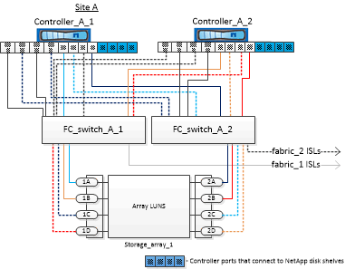

= Beispiel einer MetroCluster-Konfiguration mit vier Nodes und Festplatten und Array LUNs
:allow-uri-read: 
:icons: font
:imagesdir: ../media/

[role="lead"]
Zum Einrichten einer MetroCluster Konfiguration mit vier Nodes mit nativen Festplatten und Array LUNs müssen Sie FC-to-SAS-Bridges verwenden, um die ONTAP Systeme über FC-Switches mit den Festplatten-Shelfs zu verbinden. Sie können Array-LUNs über die FC-Switches mit den ONTAP-Systemen verbinden.

Es sind mindestens acht Initiator-Ports erforderlich, damit ein ONTAP-System sowohl native Festplatten als auch Array-LUNs verbinden kann.

Die folgenden Abbildungen zeigen Beispiele für eine MetroCluster-Konfiguration mit Festplatten und Array LUNs. Beide Lösungen stellen dieselbe MetroCluster-Konfiguration dar. Die Darstellungen von Festplatten und Array-LUNs werden nur zur Vereinfachung getrennt.

In der folgenden Abbildung, die die Konnektivität zwischen ONTAP Systemen und Festplatten zeigt, werden die HBA-Ports 1a bis 1d für die Verbindung mit Festplatten über die FC-to-SAS-Bridges verwendet:

image::../media/mcc_configuration_with_disks_and_array_luns_1.gif[mcc-Konfiguration mit Festplatten und Array luns 1]

In der folgenden Abbildung, die die Konnektivität zwischen ONTAP-Systemen und Array-LUNs zeigt, werden die HBA-Ports 0a bis 0d für die Konnektivität mit Array-LUNs verwendet, da Ports 1a bis 1d für die Konnektivität mit Festplatten verwendet werden:

