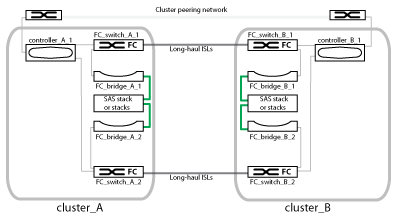

= Teile einer Fabric-MetroCluster-Konfiguration
:allow-uri-read: 
:icons: font
:imagesdir: ../media/

[role="lead"]
Wenn Sie Ihre MetroCluster Konfiguration planen, sollten Sie sich mit den Hardwarekomponenten und den zugehörigen Interconnects vertraut machen.

== Disaster-Recovery-Gruppen (DR)

Eine Fabric MetroCluster Konfiguration besteht aus einer oder zwei DR-Gruppen, abhängig von der Anzahl der Nodes in der MetroCluster Konfiguration. Jede DR-Gruppe besteht aus vier Nodes.

* Eine MetroCluster Konfiguration mit acht Nodes besteht aus zwei DR-Gruppen.
* Eine MetroCluster Konfiguration mit vier Nodes besteht aus einer DR-Gruppe.

Die folgende Abbildung zeigt die Organisation der Nodes in einer MetroCluster Konfiguration mit acht Nodes:

image::../media/mcc_dr_groups_8_node.gif[mcc dr Gruppen 8 Knoten]

Die folgende Abbildung zeigt die Organisation der Nodes in einer MetroCluster Konfiguration mit vier Nodes:

image::../media/mcc_dr_groups_4_node.gif[mcc dr Gruppen 4 Knoten]

== Wichtige Hardwarekomponenten

Eine MetroCluster Konfiguration umfasst die folgenden wichtigen Hardware-Elemente:

* Storage Controller
+
Die Storage Controller sind nicht direkt mit dem Storage verbunden, sondern mit zwei redundanten FC Switch Fabrics verbunden.

* FC-to-SAS-Bridges
+
Die FC-to-SAS-Bridges verbinden die SAS-Storage-Stacks mit den FC-Switches und geben somit die Möglichkeit, die beiden Protokolle zu überbrücken.

* FC Switches
+
Die FC-Switches stellen das Langstrecken-Backbone ISL zwischen den beiden Standorten bereit. Die FC Switches stellen die beiden Storage Fabrics bereit, die die Datenspiegelung zu den Remote Storage Pools ermöglichen.

* Cluster-Peering-Netzwerk
+
Das Cluster-Peering-Netzwerk bietet Konnektivität zur Spiegelung der Cluster-Konfiguration, einschließlich der Storage Virtual Machine (SVM)-Konfiguration. Die Konfiguration aller SVMs auf einem Cluster wird dem Partner-Cluster gespiegelt.

== Fabric MetroCluster Konfiguration mit acht Nodes

Eine Konfiguration mit acht Nodes besteht aus zwei Clustern, eines an jedem geografisch getrennten Standort. „Cluster_A“ befindet sich am ersten MetroCluster-Standort. „Cluster_B“ befindet sich am zweiten MetroCluster-Standort. Jeder Standort verfügt über ein SAS-Storage-Stack. Zusätzliche Storage-Stacks werden unterstützt, aber nur einer wird an jedem Standort angezeigt. Die HA-Paare sind als Cluster ohne Switch konfiguriert, ohne Cluster Interconnect Switches. Eine geschaltete Konfiguration wird unterstützt, wird aber nicht angezeigt.

Eine Konfiguration mit acht Nodes umfasst folgende Verbindungen:

* FC-Verbindungen von den HBAs jedes Controllers und FC-VI-Adaptern zu jedem der FC-Switches
* Eine FC-Verbindung von jeder FC-zu-SAS-Bridge zu einem FC-Switch
* SAS-Verbindungen zwischen jedem SAS Shelf und von oben und unten auf jedem Stack zu einer FC-to-SAS-Bridge
* Ein HA Interconnect zwischen jedem Controller im lokalen HA-Paar
+
Wenn die Controller ein HA-Paar mit einem Gehäuse unterstützen, ist der HA Interconnect intern, was über die Backplane geschieht, sodass ein externer Interconnect nicht erforderlich ist.

* Ethernet-Verbindungen von den Controllern zu dem vom Kunden bereitgestellten Netzwerk, das für Cluster-Peering verwendet wird
+
Die SVM-Konfiguration wird über das Cluster-Peering-Netzwerk repliziert.

* Ein Cluster-Interconnect zwischen jedem Controller im lokalen Cluster

== Fabric MetroCluster Konfiguration mit vier Nodes

Die folgende Abbildung zeigt eine vereinfachte Ansicht einer Fabric MetroCluster Konfiguration mit vier Nodes. Bei einigen Verbindungen stellt eine einzelne Leitung mehrere redundante Verbindungen zwischen den Komponenten dar. Verbindungen zu Daten und Management-Netzwerken werden nicht angezeigt.

image::../media/mcc_hardware_architecture_both_clusters.gif[mcc-Hardwarearchitektur bei beiden Clustern]

Die folgende Abbildung zeigt eine detailliertere Ansicht der Konnektivität in einem einzelnen MetroCluster Cluster (beide Cluster haben dieselbe Konfiguration):

image::../media/mcc_hardware_architecture_cluster_a_with_7500n.gif[mcc Hardware-Architektur Cluster A mit 7500n]

== Fabric MetroCluster Konfiguration mit zwei Nodes

Die folgende Abbildung zeigt eine vereinfachte Ansicht einer Fabric MetroCluster Konfiguration mit zwei Nodes. Bei einigen Verbindungen stellt eine einzelne Leitung mehrere redundante Verbindungen zwischen den Komponenten dar. Verbindungen zu Daten und Management-Netzwerken werden nicht angezeigt.

Eine Konfiguration mit zwei Nodes besteht aus zwei Clustern, eines an jedem geografisch getrennten Standort. „Cluster_A“ befindet sich am ersten MetroCluster-Standort. „Cluster_B“ befindet sich am zweiten MetroCluster-Standort. Jeder Standort verfügt über ein SAS-Storage-Stack. Zusätzliche Storage-Stacks werden unterstützt, aber nur einer wird an jedem Standort angezeigt.

NOTE: In einer Konfiguration mit zwei Nodes sind die Nodes nicht als HA-Paar konfiguriert.

Die folgende Abbildung zeigt eine detailliertere Ansicht der Konnektivität in einem einzelnen MetroCluster Cluster (beide Cluster haben dieselbe Konfiguration):

image::../media/mcc_hardware_architecture_cluster_a_2_node_with_7500n.gif[mcc Hardwarearchitektur Cluster a 2 Node mit 7500n]

Eine Konfiguration mit zwei Nodes umfasst folgende Verbindungen:

* FC-Verbindungen zwischen dem FC-VI-Adapter auf jedem Controller-Modul
* FC-Verbindungen von den HBAs jedes Controller-Moduls mit der FC-to-SAS Bridge für jeden SAS-Shelf-Stack
* SAS-Verbindungen zwischen jedem SAS Shelf und von oben und unten auf jedem Stack zu einer FC-to-SAS-Bridge
* Ethernet-Verbindungen von den Controllern zu dem vom Kunden bereitgestellten Netzwerk, das für Cluster-Peering verwendet wird
+
Die SVM-Konfiguration wird über das Cluster-Peering-Netzwerk repliziert.

