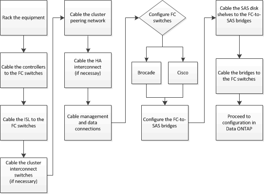

= Fabric-Attached MetroCluster-Konfiguration verkabeln
:allow-uri-read: 
:icons: font
:imagesdir: ../media/

[role="lead"]
Die MetroCluster Komponenten müssen an beiden geografischen Standorten physisch installiert, verkabelt und konfiguriert sein.

