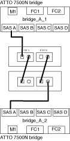

= Installation von FC-to-SAS-Bridges und SAS-Platten-Shelves
:allow-uri-read: 
:icons: font
:imagesdir: ../media/

[role="lead"]
Wenn Sie der Konfiguration neuen Speicher hinzufügen, installieren und verkabeln Sie ATTO FibreBridge Bridges und SAS-Platten-Shelves.

.Über diese Aufgabe
Bei den werkseitig eingegangenen Systemen sind die FC-zu-SAS-Bridges vorkonfiguriert und erfordern keine zusätzliche Konfiguration.

Dieses Verfahren wird mit der Annahme geschrieben, dass Sie die empfohlenen Bridge Management-Schnittstellen verwenden: Die ATTO ExpressNAV GUI und ATTO Quicknav Dienstprogramm.

Sie verwenden die ATTO ExpressNAV GUI, um eine Bridge zu konfigurieren und zu verwalten und die Bridge-Firmware zu aktualisieren. Sie verwenden das ATTO Quicknav Dienstprogramm, um den Bridge Ethernet Management 1 Port zu konfigurieren.

Stattdessen können Sie bei Bedarf andere Managementoberflächen verwenden, z. B. einen seriellen Port oder Telnet, um eine Bridge zu konfigurieren und zu verwalten, den Ethernet Management 1-Port zu konfigurieren und FTP, um die Bridge-Firmware zu aktualisieren.

Bei diesem Verfahren wird folgender Workflow verwendet:

image::../media/workflow_bridge_installation_and_configuration.gif[Workflow Bridge-Installation und -Konfiguration]

== In-Band-Management der FC-to-SAS-Bridges

Ab ONTAP 9.5 mit FibreBridge 7500N oder 7600N Bridges wird das in-Band-Management der Brücken als Alternative zum IP-Management der Brücken unterstützt. Ab ONTAP 9.8 ist das Out-of-Band-Management veraltet.

.Über diese Aufgabe
--

NOTE: Ab ONTAP 9.8 beginnt der `storage bridge` Befehl wird durch ersetzt `system bridge`. Die folgenden Schritte zeigen das `storage bridge` Befehl, aber wenn Sie ONTAP 9.8 oder höher ausführen, der `system bridge` Befehl ist bevorzugt.

--
Bei Verwendung der in-Band-Verwaltung können die Brücken über die FC-Verbindung zur Bridge von der ONTAP-CLI verwaltet und überwacht werden. Der physische Zugriff auf die Bridge über die Bridge-Ethernet-Ports ist nicht erforderlich, wodurch die Sicherheitslücke der Bridge verringert wird.

Die Verfügbarkeit der in-Band-Verwaltung der Brücken hängt von der Version von ONTAP ab:

* Ab ONTAP 9.8 werden Brücken standardmäßig über in-Band-Verbindungen verwaltet und die Out-of-Band-Verwaltung der Brücken über SNMP ist veraltet.
* ONTAP 9.5 bis 9.7: Entweder in-Band-Management oder Out-of-Band-SNMP-Management wird unterstützt.
* Vor ONTAP 9.5 wird nur bandexterne SNMP-Verwaltung unterstützt.

Bridge-CLI-Befehle, z. B. `storage bridge run-cli -namebridge-name-commandbridge-command-name` Befehl, kann über die ONTAP Schnittstelle ausgeführt werden.

NOTE: Die Verwendung von in-Band-Management mit deaktiviertem IP-Zugriff wird empfohlen, um die Sicherheit durch Beschränkung der physischen Konnektivität der Bridge zu verbessern.

== Vorbereitung der Installation

Wenn Sie die Installation der Brücken als Teil Ihres neuen MetroCluster-Systems vorbereiten, müssen Sie sicherstellen, dass Ihr System bestimmte Anforderungen erfüllt, einschließlich der Erfüllung von Setup- und Konfigurationsanforderungen für die Brücken. Weitere Anforderungen sind das Herunterladen der erforderlichen Dokumente, das Dienstprogramm ATTO Quicknav und die Bridge-Firmware.

.Über diese Aufgabe
* Das System muss bereits in einem Rack installiert sein, wenn es nicht in einem Systemschrank ausgeliefert wurde.
* Ihre Konfiguration muss unterstützte Hardware-Modelle und Software-Versionen verwenden.
+
https://mysupport.netapp.com/matrix["NetApp Interoperabilitäts-Matrix-Tool"]

+
Im IMT können Sie im Feld Storage-Lösung die Auswahl Ihrer MetroCluster Lösung verwenden. Sie verwenden den *Komponenten-Explorer*, um die Komponenten und die ONTAP-Version auszuwählen, um Ihre Suche zu verfeinern. Klicken Sie auf *Ergebnisse anzeigen*, um die Liste der unterstützten Konfigurationen anzuzeigen, die den Kriterien entsprechen.

* Jeder FC-Switch muss über einen FC-Port verfügen, damit eine Bridge mit ihm verbunden werden kann.
* Sie müssen sich vertraut machen mit dem Umgang mit SAS-Kabeln und den Überlegungen und Best Practices für die Installation und Verkabelung von Platten-Shelves.
+
Das Handbuch „ _Installation and Service Guide_“ für Ihr Festplatten-Shelf-Modell beschreibt die Überlegungen und Best Practices.

* Der Computer, mit dem Sie die Brücken einrichten, muss einen ATTO-unterstützten Webbrowser betreiben, um die ATTO ExpressNAV GUI nutzen zu können.
+
Die _ATTO Product Release Notes_ verfügen über eine aktuelle Liste der unterstützten Webbrowser. Sie können auf dieses Dokument über die ATTO-Website zugreifen, wie in den folgenden Schritten beschrieben.

.Schritte
. Laden Sie das _Installation and Service Guide_ für Ihr Festplatten-Shelf-Modell herunter:
. Greifen Sie über den Link Ihres FibreBridge-Modells auf die ATTO-Website zu, und laden Sie das Handbuch und das Quicknav-Dienstprogramm herunter.
+

NOTE: Das _ATTO FibreBridge Installations- und Bedienungshandbuch_ für Ihre Modellbrücke enthält weitere Informationen zu Management-Schnittstellen.

+
Sie können auf diesen und andere Inhalte auf der ATTO-Website über den Link auf der Seite ATTO Fibrebridge Beschreibung zugreifen.

. Sammeln Sie die Hardware und Informationen, die benötigt werden, um die empfohlenen Bridge Management-Schnittstellen, die ATTO ExpressNAV GUI und das ATTO Quicknav Dienstprogramm zu verwenden:
+
.. Legen Sie einen nicht standardmäßigen Benutzernamen und ein Kennwort fest (für den Zugriff auf die Brücken).
+
Sie sollten den Standardbenutzernamen und das Standardpasswort ändern.

.. Bei der Konfiguration für die IP-Verwaltung der Brücken benötigen Sie das abgeschirmte Ethernet-Kabel mit den Brücken (das vom Bridge Ethernet Management 1-Port mit Ihrem Netzwerk verbunden wird).
.. Wenn Sie für das IP-Management der Brücken konfigurieren, benötigen Sie eine IP-Adresse, eine Subnetzmaske und Gateway-Informationen für den Ethernet-Management-Port 1 auf jeder Bridge.
.. Deaktivieren Sie VPN-Clients auf dem Computer, den Sie für die Einrichtung verwenden.
+
Aktive VPN-Clients führen zum Fehlschlagen des Quicknav-Scans für Brücken.

== Installation der FC-to-SAS-Bridge und der SAS-Shelfs

Nachdem Sie sichergestellt haben, dass das System alle Anforderungen in „`Vorbereitung auf die Installation`“ erfüllt, können Sie Ihr neues System installieren.

.Über diese Aufgabe
* Die Festplatten- und Shelf-Konfiguration an beiden Standorten sollte identisch sein.
+
Wenn ein nicht gespiegeltes Aggregat verwendet wird, kann die Festplatten- und Shelf-Konfiguration an jedem Standort unterschiedlich sein.

+

NOTE: Alle Festplatten in der Disaster Recovery-Gruppe müssen denselben Verbindungstyp verwenden und für alle Nodes innerhalb der Disaster Recovery-Gruppe sichtbar sein. Dabei spielt es keine Rolle, welche Festplatten für ein gespiegeltes oder nicht gespiegeltes Aggregat verwendet werden.

* Die Anforderungen an die Systemkonnektivität für maximale Entfernungen von Platten-Shelfs, FC-Switches und Backup-Bandgeräten mit 50-Mikron- und Multimode-Glasfaserkabeln gelten auch für FibreBridge-Brücken.
+
https://hwu.netapp.com["NetApp Hardware Universe"]

* Eine Kombination aus IOM12-Modulen und IOM3-Modulen wird im selben Storage-Stack nicht unterstützt. Wenn auf dem System eine unterstützte Version von ONTAP ausgeführt wird, wird im selben Storage Stack eine Kombination aus IOM12-Modulen und IOM6-Modulen unterstützt.

[NOTE]
====
In-Band ACP wird ohne zusätzliche Verkabelung in den folgenden Shelves und FibreBridge 7500N oder 7600N Bridge unterstützt:

* IOM12 (DS460C) hinter einer 7500N bzw. 7600N Brücke mit ONTAP 9.2 und höher
* IOM12 (DS212C und DS224C) hinter einer 7500N oder 7600N Brücke mit ONTAP 9.1 und höher

SAS-Shelves in MetroCluster-Konfigurationen unterstützen keine ACP-Verkabelung.

====

=== Aktivieren des IP-Portzugriffs auf der FibreBridge 7600N-Brücke, falls erforderlich

Wenn Sie eine ONTAP-Version vor 9.5 verwenden oder anderweitig planen, Out-of-Band-Zugriff auf die FibreBridge 7600N-Brücke über Telnet oder andere IP-Port-Protokolle und -Dienste (FTP, ExpressNAV, ICMP oder Quicknav) zu nutzen, können Sie die Zugriffsservices über den Konsolen-Port aktivieren.

.Über diese Aufgabe
Im Gegensatz zu den Bridges ATTO FibreBridge 7500N und 6500N wird die FibreBridge 7600N mit allen IP-Port-Protokollen und -Diensten ausgeliefert.

Ab ONTAP 9.5 wird _in-Band-Management_ der Brücken unterstützt. Das bedeutet, dass die Brücken über die FC-Verbindung zur Bridge von der ONTAP-CLI konfiguriert und überwacht werden können. Physischer Zugang zur Bridge über die Bridge-Ethernet-Ports ist nicht erforderlich und die Bridge-Benutzeroberflächen sind nicht erforderlich.

Ab ONTAP 9.8 wird _in-Band-Management_ der Bridges standardmäßig unterstützt und out-of-Band SNMP-Management ist veraltet.

Diese Aufgabe ist erforderlich, wenn Sie zur Verwaltung der Brücken * nicht* verwenden. In diesem Fall müssen Sie die Bridge über den Ethernet-Management-Port konfigurieren.

.Schritte
. Greifen Sie auf die Konsolenschnittstelle der Bridge zu, indem Sie ein serielles Kabel an den seriellen Port der FibreBridge 7600N anschließen.
. Aktivieren Sie die Zugriffsservices über die Konsole, und speichern Sie die Konfiguration:
+
`set closeport none`

+
`saveconfiguration`

+
Der `set closeport none` Befehl aktiviert alle Zugriffsservices auf der Bridge.

. Deaktivieren Sie einen Dienst, falls gewünscht, durch Ausgabe  `set closeport _service_` Und den Befehl ggf. wiederholen, bis alle gewünschten Dienste deaktiviert sind:
+
`set closeport _service_`

+
Der `set closeport` Durch den Befehl wird ein einzelner Dienst gleichzeitig deaktiviert. Der Service kann durch eine der folgenden Optionen festgelegt werden:

+
** expressnav
** ftp
** icmp
** quicknav
** snmp
** telnet

+
Sie können mithilfe der überprüfen, ob ein bestimmtes Protokoll aktiviert oder deaktiviert ist `get closeport` Befehl.

. Wenn Sie SNMP aktivieren, müssen Sie auch den Befehl Set SNMP Enabled eingeben:
+
`set SNMP enabled`

+
SNMP ist das einzige Protokoll, das einen separaten Enable-Befehl erfordert.

. Konfiguration speichern:
+
`saveconfiguration`

=== Konfiguration der FC-to-SAS-Bridges

Bevor Sie das Modell der FC-zu-SAS-Brücken verkabeln, müssen Sie die Einstellungen in der FibreBridge-Software konfigurieren.

.Bevor Sie beginnen
Sie sollten entscheiden, ob Sie die bandinterne Verwaltung der Brücken verwenden.

.Über diese Aufgabe
--

NOTE: Ab ONTAP 9.8 beginnt der `storage bridge` Befehl wird durch ersetzt `system bridge`. Die folgenden Schritte zeigen das `storage bridge` Befehl, aber wenn Sie ONTAP 9.8 oder höher ausführen, der `system bridge` Befehl ist bevorzugt.

--
Wenn Sie die bandinterne Verwaltung der Bridge anstelle der IP-Verwaltung verwenden, können die Schritte zur Konfiguration des Ethernet-Ports und der IP-Einstellungen übersprungen werden, wie in den entsprechenden Schritten angegeben.

.Schritte
. Wenn Sie für die bandinterne Verwaltung konfiguriert sind, schließen Sie ein Kabel vom seriellen FibreBridge RS-232-Port an den seriellen (COM)-Port eines PCs an.
+
Die serielle Verbindung wird für die Erstkonfiguration verwendet. Anschließend können die Bridge über ONTAP in-Band-Management und die FC-Ports überwacht und verwaltet werden.

. Wenn Sie die IP-Verwaltung konfigurieren, schließen Sie den Ethernet-Management-1-Port an jeder Bridge über ein Ethernet-Kabel an das Netzwerk an.
+
In Systemen mit ONTAP 9.5 oder höher kann das in-Band-Management verwendet werden, um auf die Bridge über die FC-Ports statt über den Ethernet-Port zuzugreifen. Ab ONTAP 9.8 wird nur in-Band-Management unterstützt und SNMP-Management ist veraltet.

+
Der Ethernet Management 1 Port ermöglicht es Ihnen, schnell die Bridge-Firmware (über ATTO ExpressNAV oder FTP Management-Schnittstellen) herunterzuladen und Core-Dateien und Extrahieren von Logs abzurufen.

. Bei der Konfiguration für die IP-Verwaltung konfigurieren Sie den Ethernet-Management-1-Port für jede Bridge, indem Sie den Vorgang in Abschnitt 2.0 des _ATTO FibreBridge Installations- und Bedienungshandbuchs_ für Ihr Bridge-Modell befolgen.
+
In Systemen mit ONTAP 9.5 oder höher kann das in-Band-Management verwendet werden, um auf die Bridge über die FC-Ports statt über den Ethernet-Port zuzugreifen. Ab ONTAP 9.8 wird nur in-Band-Management unterstützt und SNMP-Management ist veraltet.

+
Wenn Quicknav zum Konfigurieren eines Ethernet-Management-Ports ausgeführt wird, wird nur der über das Ethernet-Kabel verbundene Ethernet-Management-Port konfiguriert. Wenn Sie beispielsweise auch den Ethernet-Management-2-Port konfigurieren möchten, müssen Sie das Ethernet-Kabel mit Port 2 verbinden und Quicknav ausführen.

. Konfigurieren Sie die Bridge.
+
Notieren Sie sich den Benutzernamen und das Kennwort, den Sie bestimmen.

+

NOTE: Konfigurieren Sie die Zeitsynchronisierung auf ATTO FibreBridge 7600N oder 7500N nicht. Die Zeitsynchronisierung für ATTO FibreBridge 7600N oder 7500N ist auf die Cluster-Zeit eingestellt, nachdem die Brücke von ONTAP erkannt wurde. Sie wird auch regelmäßig einmal täglich synchronisiert. Die verwendete Zeitzone ist GMT und kann nicht geändert werden.

+
.. Konfigurieren Sie bei der Konfiguration für die IP-Verwaltung die IP-Einstellungen der Bridge.
+
In Systemen mit ONTAP 9.5 oder höher kann das in-Band-Management verwendet werden, um auf die Bridge über die FC-Ports statt über den Ethernet-Port zuzugreifen. Ab ONTAP 9.8 wird nur in-Band-Management unterstützt und SNMP-Management ist veraltet.

+
Um die IP-Adresse ohne Quicknav-Dienstprogramm einzustellen, benötigen Sie eine serielle Verbindung mit der FibreBridge.

+
Bei Verwendung der CLI müssen Sie die folgenden Befehle ausführen:

+
`set ipaddress mp1 ip-address`

+
`set ipsubnetmask mp1 subnet-mask`

+
`set ipgateway mp1 x.x.x.x`

+
`set ipdhcp mp1 disabled``set ethernetspeed mp1 1000`

.. Konfigurieren Sie den Brückennamen.
+
Die Brücken sollten in der MetroCluster-Konfiguration einen eindeutigen Namen haben.

+
Beispiel für Brückennamen für eine Stapelgruppe auf jedem Standort:

+
--
*** Bridge_A_1a
*** Bridge_A_1b
*** Bridge_B_1a
*** Bridge_B_1b

--
+
Bei Verwendung der CLI müssen Sie den folgenden Befehl ausführen:

+
`set bridgename bridgename`

.. Wenn ONTAP 9.4 oder früher ausgeführt wird, aktivieren Sie SNMP auf der Bridge:
+
`set SNMP enabled`

+
In Systemen mit ONTAP 9.5 oder höher kann das in-Band-Management verwendet werden, um auf die Bridge über die FC-Ports statt über den Ethernet-Port zuzugreifen. Ab ONTAP 9.8 wird nur in-Band-Management unterstützt und SNMP-Management ist veraltet.

. Konfigurieren Sie die Bridge-FC-Ports.
+
.. Konfigurieren Sie die Datenrate/Geschwindigkeit der Bridge-FC-Ports.
+
Die unterstützte FC-Datenrate hängt von Ihrer Modellbrücke ab.

+
*** Die FibreBridge 7600 unterstützt bis zu 32, 16 oder 8 Gbit/s.
*** Die FibreBridge 7500 unterstützt bis zu 16, 8 oder 4 Gbit/s.
*** Die FibreBridge 6500 unterstützt bis zu 8, 4 oder 2 Gbit/s.
+

NOTE: Die von Ihnen ausgewählte FCDataRate-Geschwindigkeit ist auf die maximale Geschwindigkeit beschränkt, die sowohl von der Bridge als auch vom FC-Port des Controller-Moduls unterstützt wird, mit dem der Bridge-Port verbunden wird. Die Verkabelungsstrecken dürfen die Grenzen der SFPs und anderer Hardware nicht überschreiten.

. Bei Verwendung der CLI müssen Sie den folgenden Befehl ausführen:
+
`set FCDataRate port-numberport-speed`

+
.. Wenn Sie eine FibreBridge 7500N oder 6500N-Bridge konfigurieren, konfigurieren Sie den Verbindungsmodus, den der Port für ptp verwendet.
+
[NOTE]
====
Die Einstellung FCConnMode ist nicht erforderlich, wenn Sie eine FibreBridge 7600N-Bridge konfigurieren. Wenn Sie die CLI verwenden, müssen Sie den folgenden Befehl ausführen:

`set FCConnMode port-number ptp`

====
.. Wenn Sie eine FibreBridge 7600N oder 7500N-Bridge konfigurieren, müssen Sie den FC2-Port konfigurieren oder deaktivieren.
+
*** Wenn Sie den zweiten Port verwenden, müssen Sie die vorherigen Teilschritte für den FC2-Port wiederholen.
*** Wenn Sie den zweiten Port nicht verwenden, müssen Sie den Port deaktivieren:
+
`FCPortDisable port-number`

+
Im folgenden Beispiel wird die Deaktivierung von FC-Port 2 gezeigt:

+
[listing]
----
FCPortDisable 2

Fibre Channel Port 2 has been disabled.
----

.. Wenn Sie eine FibreBridge 7600N oder 7500N-Bridge konfigurieren, deaktivieren Sie die nicht verwendeten SAS-Ports:
+
`SASPortDisable sas-port`

+
SAS-Ports A bis D sind standardmäßig aktiviert. Sie müssen die SAS-Ports, die nicht verwendet werden, deaktivieren.

+
Wenn nur SAS-Port A verwendet wird, müssen die SAS-Ports B, C und D deaktiviert sein. Im folgenden Beispiel wird die Deaktivierung von SAS Port B gezeigt Sie müssen die SAS-Ports C und D ähnlich deaktivieren:

+
[listing]
----
SASPortDisable b

SAS Port B has been disabled.
----

. Sichern Sie den Zugriff auf die Bridge, und speichern Sie die Konfiguration der Bridge. Wählen Sie je nach Version des ONTAP, auf dem Ihr System ausgeführt wird, eine der folgenden Optionen aus.
+
[cols="1,3"]
|===

| ONTAP-Version | Schritte 

 a| 
*ONTAP 9.5 oder höher*
 a| 
.. Den Status der Brücken anzeigen:
+
`storage bridge show`

+
Der Ausgang zeigt an, welche Brücke nicht gesichert ist.

.. Sichern Sie die Brücke:
+
`securebridge`

 a| 
*ONTAP 9.4 oder früher*
 a| 
.. Den Status der Brücken anzeigen:
+
`storage bridge show`

+
Der Ausgang zeigt an, welche Brücke nicht gesichert ist.

.. Überprüfen Sie den Status der Ports der ungesicherten Brücke:
+
`info`

+
Die Ausgabe zeigt den Status der Ethernet-Ports MP1 und MP2 an.

.. Wenn Ethernet-Port MP1 aktiviert ist, führen Sie folgende Schritte aus:
+
`set EthernetPort mp1 disabled`

+
Wenn auch der Ethernet-Port MP2 aktiviert ist, wiederholen Sie den vorherigen Unterschritt für Port MP2.

.. Die Konfiguration der Bridge speichern.
+
Sie müssen die folgenden Befehle ausführen:

+
`SaveConfiguration`

+
`FirmwareRestart`

+
Sie werden aufgefordert, die Bridge neu zu starten.

|===
. Verwenden Sie nach Abschluss der MetroCluster-Konfiguration das `flashimages` Befehl zum Überprüfen der Version der FibreBridge-Firmware und, wenn die Brücken nicht die neueste unterstützte Version verwenden, aktualisieren Sie die Firmware auf allen Brücken in der Konfiguration.
+
link:../maintain/index.html["Warten von MetroCluster-Komponenten"]

.Verwandte Informationen
link:task_fb_new_install.html["In-Band-Management der FC-to-SAS-Bridges"]

=== Verkabelung von Platten-Shelves zu den Bridges

Für die Verkabelung Ihrer Platten-Shelves müssen die richtigen FC-to-SAS-Bridges verwendet werden.

==== Verkabelung einer FibreBridge 7600N oder 7500N Bridge mit Platten-Shelves mit IOM12-Modulen

Nach der Konfiguration der Bridge können Sie mit der Verkabelung Ihres neuen Systems beginnen.

.Über diese Aufgabe
Bei Festplatten-Shelfs stecken Sie einen SAS-Kabelanschluss mit nach unten (auf der Unterseite des Connectors) gerichteter Zuglasche.

.Schritte
. Schalten Sie die Festplatten-Shelfs in den einzelnen Stacks in Reihe:
+
.. Beginnend mit dem logischen ersten Shelf im Stack verbinden Sie IOM A-Port 3 mit Dem IOM A-Port 1 des nächsten Shelfs, bis jedes IOM A im Stack verbunden ist.
.. Wiederholen Sie den vorherigen Unterschritt für IOM B.
.. Wiederholen Sie die vorherigen Unterschritte für jeden Stack.

+
Das _Installation and Service Guide_ für Ihr Festplatten-Shelf-Modell bietet detaillierte Informationen zum Verketten von Platten-Shelfs in Reihe.

. Schalten Sie die Festplatten-Shelfs ein und legen Sie dann die Shelf-IDs fest.
+
** Sie müssen jedes Festplatten-Shelf aus- und wieder einschalten.
** Shelf-IDs müssen für jedes SAS-Festplatten-Shelf innerhalb jeder MetroCluster DR-Gruppe (einschließlich beider Standorte) eindeutig sein.

. Verkabeln Sie die Platten-Shelves mit den FibreBridge Bridges.
+
.. Verkabeln Sie für den ersten Stack der Festplatten-Shelfs IOM A des ersten Shelfs zu SAS-Port A auf FibreBridge A und verkabeln Sie IOM B des letzten Shelfs zum SAS-Port A auf FibreBridge B
.. Wiederholen Sie für weitere Shelf-Stacks den vorherigen Schritt mit dem nächsten verfügbaren SAS-Port der FibreBridge-Brücken, wobei Port B für den zweiten Stack, Port C für den dritten Stack und Port D für den vierten Stack verwendet wird.
.. Schließen Sie während der Verkabelung die auf IOM12- und IOM3-/IOM6-Modulen basierenden Stacks an dieselbe Bridge an, solange sie mit separaten SAS-Ports verbunden sind.
+
--

NOTE: Jeder Stack kann unterschiedliche IOM-Modelle verwenden. Alle Festplatten-Shelfs in einem Stack müssen jedoch dasselbe Modell verwenden.

--
+
Die folgende Abbildung zeigt die mit einem Paar FibreBridge 7600N- oder 7500N-Brücken verbundenen Platten-Shelves:

+
image::../media/mcc_cabling_bridge_and_sas3_stack_with_7500n_and_multiple_stacks.gif[mcc-Kabelbrücke und sas3-Stack mit 7500n und mehreren Stacks]

==== Verkabelung einer FibreBridge 7600N oder 7500N Bridge mit Shelfs unter Verwendung von IOM6- oder IOM3-Modulen

Nach der Konfiguration der Bridge können Sie mit der Verkabelung Ihres neuen Systems beginnen. Die FibreBridge 7600N oder 7500N Bridge nutzt Mini-SAS-Anschlüsse und unterstützt Shelfs, die IOM6- oder IOM3-Module verwenden.

.Über diese Aufgabe
IOM3-Module werden von FibreBridge 7600N-Brücken nicht unterstützt.

Bei Festplatten-Shelfs stecken Sie einen SAS-Kabelanschluss mit nach unten (auf der Unterseite des Connectors) gerichteter Zuglasche.

.Schritte
. Schalten Sie die Regale in den einzelnen Stapeln in Reihe.
+
.. Verkabeln Sie beim ersten Stapel von Shelves IOM Einen quadratischen Port des ersten Shelfs zu SAS-Port A auf FibreBridge A
.. Verkabeln Sie für den ersten Stapel von Shelves IOM B-Kreis-Port des letzten Shelfs zu SAS-Port A auf FibreBridge B.
+
Das _Installation and Service Guide_ für Ihr Shelf-Modell enthält detaillierte Informationen zum Verketten von Shelfs.

+
https://library.netapp.com/ecm/ecm_download_file/ECMP1119629["Installation und Service Guide für SAS-Platten-Shelfs für DS4243, DS2246, DS4486 und DS4246"^]

+
Die folgende Abbildung zeigt eine Reihe von Brücken, die mit einem Regal verbunden sind:

+

. Wiederholen Sie für weitere Shelf-Stacks die vorherigen Schritte mithilfe des nächsten verfügbaren SAS-Ports der FibreBridge-Brücken, wobei Port B für einen zweiten Stack, Port C für einen dritten Stack und Port D für einen vierten Stack verwendet wird.
+
Die folgende Abbildung zeigt vier Stapel, die mit einem Paar FibreBridge 7600N oder 7500N-Brücken verbunden sind.

+
image::../media/mcc_cabling_bridge_and_sas_stack_with_7500n_four_stacks.gif[mcc-Verkabelung, Bridge und sas Stack mit 7500n vier Stacks]

==== Verkabelung einer FibreBridge 6500N Bridge mit Festplatten-Shelfs unter Verwendung von IOM6- oder IOM3-Modulen

Nach der Konfiguration der Bridge können Sie mit der Verkabelung Ihres neuen Systems beginnen. Die FibreBridge 6500N nutzt QSFP-Anschlüsse.

.Bevor Sie beginnen
Warten Sie mindestens 10 Sekunden, bevor Sie den Anschluss anschließen. Die SAS-Kabelanschlüsse sind codiert. Wenn sie sich korrekt in einen SAS-Port orientieren, klicken sie auf ihren Platz und die Festplatten-Shelf-SAS-Port LNK-LED leuchtet grün. Bei Festplatten-Shelfs stecken Sie einen SAS-Kabelanschluss mit nach unten (auf der Unterseite des Connectors) gerichteter Zuglasche.

.Über diese Aufgabe
Die FibreBridge 6500N unterstützt keine Platten-Shelfs mit IOM12.

.Schritte
. Schalten Sie die Festplatten-Shelfs in den einzelnen Stacks in Reihe.
+
Informationen über das Verketten von Platten-Shelfs finden Sie im „ _Installation and Service Guide_“ für Ihr Festplatten-Shelf-Modell.

. Verkabeln Sie für jeden Stack der Festplatten-Shelfs das IOM Mit Einem quadratischen Port des ersten Shelfs zum SAS-Port A bei FibreBridge A
. Verkabeln Sie für jeden Stack der Festplatten-Shelfs den IOM B-Kreis-Port des letzten Shelfs mit dem SAS-Port A auf FibreBridge B
+
Jede Bridge verfügt über einen Pfad zu ihrem Festplatten-Shelf: Bridge A wird über das erste Shelf mit Der A-Seite des Stacks verbunden, und Bridge B wird über das letzte Shelf mit der B-Seite des Stacks verbunden.

+

NOTE: Die SAS-Port B-Bridge ist deaktiviert.

+
Die folgende Abbildung zeigt eine Reihe von Bridges, die mit einem Stack von vier Festplatten-Shelfs verbunden sind:

+
image::../media/mcc_cabling_bridge_and_sas_stack.gif[mcc-Verkabelung – Bridge und sas Stack]

=== Überprüfen der Bridge-Konnektivität und Verkabelung der Bridge-FC-Ports

Sie sollten überprüfen, ob jede Bridge alle Festplattenlaufwerke erkennen kann, und jede Bridge mit den lokalen FC-Switches verkabeln.

.Schritte
. [[step1_verify_Bridges]] Stellen Sie sicher, dass jede Bridge alle Laufwerke und Platten-Shelfs erkennt, mit denen sie verbunden ist:
+
[cols="1,3"]
|===
| Wenn Sie den... | Dann... 

 a| 
ATTO ExpressNAV GUI
 a| 
.. Geben Sie in einem unterstützten Webbrowser die IP-Adresse einer Bridge in das Browserfenster ein.
+
Sie werden auf die ATTO FibreBridge Homepage der Brücke gebracht, für die Sie die IP-Adresse eingegeben haben, die einen Link hat.

.. Klicken Sie auf den Link, und geben Sie dann Ihren Benutzernamen und das Passwort ein, das Sie beim Konfigurieren der Bridge festgelegt haben.
+
Die ATTO FibreBridge-Statusseite der Brücke wird mit einem Menü links angezeigt.

.. Klicken Sie Auf *Erweitert*.
.. Zeigen Sie die angeschlossenen Geräte mithilfe des an `sastargets` Befehl, und klicken Sie dann auf *Senden*.

 a| 
Serieller Anschluss
 a| 
Anzeigen der angeschlossenen Geräte:

`sastargets`

|===
+
Die Ausgabe zeigt die Geräte (Festplatten und Festplatten-Shelfs) an, mit denen die Bridge verbunden ist. Ausgabelinien werden nacheinander nummeriert, sodass Sie die Geräte schnell zählen können. Die folgende Ausgabe zeigt beispielsweise, dass 10 Festplatten verbunden sind:

+
[listing]
----
Tgt VendorID ProductID        Type        SerialNumber
  0 NETAPP   X410_S15K6288A15 DISK        3QP1CLE300009940UHJV
  1 NETAPP   X410_S15K6288A15 DISK        3QP1ELF600009940V1BV
  2 NETAPP   X410_S15K6288A15 DISK        3QP1G3EW00009940U2M0
  3 NETAPP   X410_S15K6288A15 DISK        3QP1EWMP00009940U1X5
  4 NETAPP   X410_S15K6288A15 DISK        3QP1FZLE00009940G8YU
  5 NETAPP   X410_S15K6288A15 DISK        3QP1FZLF00009940TZKZ
  6 NETAPP   X410_S15K6288A15 DISK        3QP1CEB400009939MGXL
  7 NETAPP   X410_S15K6288A15 DISK        3QP1G7A900009939FNTT
  8 NETAPP   X410_S15K6288A15 DISK        3QP1FY0T00009940G8PA
  9 NETAPP   X410_S15K6288A15 DISK        3QP1FXW600009940VERQ
----
+

NOTE: Wenn die abgeschnittene Textantwort zu Beginn der Ausgabe angezeigt wird, können Sie Telnet verwenden, um eine Verbindung mit der Bridge herzustellen, und geben Sie denselben Befehl ein, um die gesamte Ausgabe anzuzeigen.

. Überprüfen Sie, ob die Befehlsausgabe zeigt, dass die Bridge mit allen Festplatten und Festplatten-Shelfs im Stack verbunden ist, mit denen die Verbindung hergestellt werden soll.
+
[cols="1,3"]
|===
| Wenn die Ausgabe... | Dann... 

 a| 
Das Ist Korrekt
 a| 
Wiederholen <<step1_verify_bridges,Schritt 1>> Für jede verbleibende Brücke.

 a| 
Nicht richtig
 a| 
.. Überprüfen Sie, ob sich lose SAS-Kabel befinden oder korrigieren Sie die SAS-Verkabelung, indem Sie die Verkabelung wiederholen.
+
link:task_fb_new_install.html["Verkabelung von Platten-Shelves zu den Bridges"]

.. Wiederholen <<step1_verify_bridges,Schritt 1>>.

|===
. Verkabeln Sie jede Bridge mit den lokalen FC-Switches. Verwenden Sie dabei die in der Tabelle vorhandenen Kabel für Ihr Konfigurations- und Switch-Modell und das FC-to-SAS-Bridge-Modell:
+

IMPORTANT: Die zweite FC-Port-Verbindung auf der FibreBridge 7500N-Brücke sollte erst nach Abschluss des Zoning verkabelt werden.

+
Weitere Informationen finden Sie in den Portzuweisungen für Ihre Version von ONTAP.

. Wiederholen Sie den vorherigen Schritt auf den Brücken am Partnerstandort.

.Verwandte Informationen
link:concept_port_assignments_for_fc_switches_when_using_ontap_9_1_and_later.html["Port-Zuweisungen für FC-Switches bei Verwendung von ONTAP 9.1 und höher"]

link:concept_port_assignments_for_fc_switches_when_using_ontap_9_0.html["Port-Zuweisungen für FC-Switches bei Verwendung von ONTAP 9.0"]

== Sichern oder Entricken der FibreBridge-Brücke

Um potenziell unsichere Ethernet-Protokolle auf einer Bridge einfach zu deaktivieren, können Sie ab ONTAP 9.5 die Bridge sichern. Dadurch werden die Ethernet-Ports der Bridge deaktiviert. Sie können auch den Ethernet-Zugriff erneut aktivieren.

.Über diese Aufgabe
* Durch das Sichern der Brücke werden Telnet und andere IP-Port-Protokolle und -Dienste (FTP, ExpressNAV, ICMP oder Quicknav) auf der Brücke deaktiviert.
* Bei diesem Verfahren wird die Out-of-Band-Verwaltung mithilfe der ONTAP-Eingabeaufforderung verwendet, die ab ONTAP 9.5 verfügbar ist.
+
Sie können die Befehle aus der Bridge-CLI ausgeben, wenn Sie keine Out-of-Band-Verwaltung verwenden.

* Der `unsecurebridge` Mit dem Befehl können die Ethernet-Ports erneut aktiviert werden.
* In ONTAP 9.7 und früher, Ausführen der `securebridge` Durch den Befehl auf der ATTO FibreBridge wird der Bridge-Status auf dem Partner-Cluster möglicherweise nicht korrekt aktualisiert. Führen Sie in diesem Fall den aus `securebridge` Befehl aus dem Partner-Cluster.

NOTE: Ab ONTAP 9.8 beginnt der `storage bridge` Befehl wird durch ersetzt `system bridge`. Die folgenden Schritte zeigen das `storage bridge` Befehl, aber wenn Sie ONTAP 9.8 oder höher ausführen, der `system bridge` Befehl ist bevorzugt.

.Schritte
. Sichern Sie die Bridge an der ONTAP-Eingabeaufforderung des Clusters mit der Bridge oder unsichern Sie sie.
+
Mit dem folgenden Befehl wird Bridge_A_1 gesichert:

+
[listing]
----
cluster_A> storage bridge run-cli -bridge bridge_A_1 -command securebridge
----
+
Mit dem folgenden Befehl wird Bridge_A_1 aufgehoben:

+
[listing]
----
cluster_A> storage bridge run-cli -bridge bridge_A_1 -command unsecurebridge
----
. Speichern Sie in der ONTAP-Eingabeaufforderung des Clusters, der die Bridge enthält, die Bridge-Konfiguration:
+
`storage bridge run-cli -bridge bridge-name -command saveconfiguration`

+
Mit dem folgenden Befehl wird Bridge_A_1 gesichert:

+
[listing]
----
cluster_A> storage bridge run-cli -bridge bridge_A_1 -command saveconfiguration
----
. Starten Sie an der ONTAP-Eingabeaufforderung des Clusters, das die Bridge enthält, die Firmware der Bridge neu:
+
`storage bridge run-cli -bridge bridge-name -command firmwarerestart`

+
Mit dem folgenden Befehl wird Bridge_A_1 gesichert:

+
[listing]
----
cluster_A> storage bridge run-cli -bridge bridge_A_1 -command firmwarerestart
----

