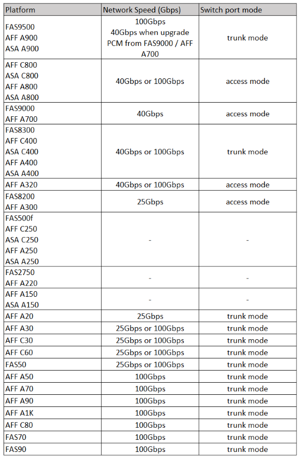

= Plattformspezifische Netzwerkgeschwindigkeiten und Switch Port-Modi für MetroCluster-konforme Switches
:allow-uri-read: 
:icons: font
:imagesdir: ../media/

[role="lead"]
Wenn Sie MetroCluster-kompatible Switches verwenden, sollten Sie die plattformspezifischen Netzwerkgeschwindigkeiten und die Anforderungen für den Switch-Port-Modus kennen.

Die folgende Tabelle bietet plattformspezifische Netzwerkgeschwindigkeiten und Switch Port-Modi für MetroCluster-konforme Switches. Sie sollten den Switch-Port-Modus gemäß der Tabelle konfigurieren.

[NOTE]
====
* Fehlende Werte geben an, dass die Plattform nicht mit einem MetroCluster-konformen Switch verwendet werden kann.
* Für die Systeme AFF A30, AFF C30, AFF C60 und FAS50 ist ein QSFP-zu-SFP+ Adapter in der Karte des Controllers erforderlich, um eine Netzwerkgeschwindigkeit von 25 Gbit/s zu unterstützen.

====

