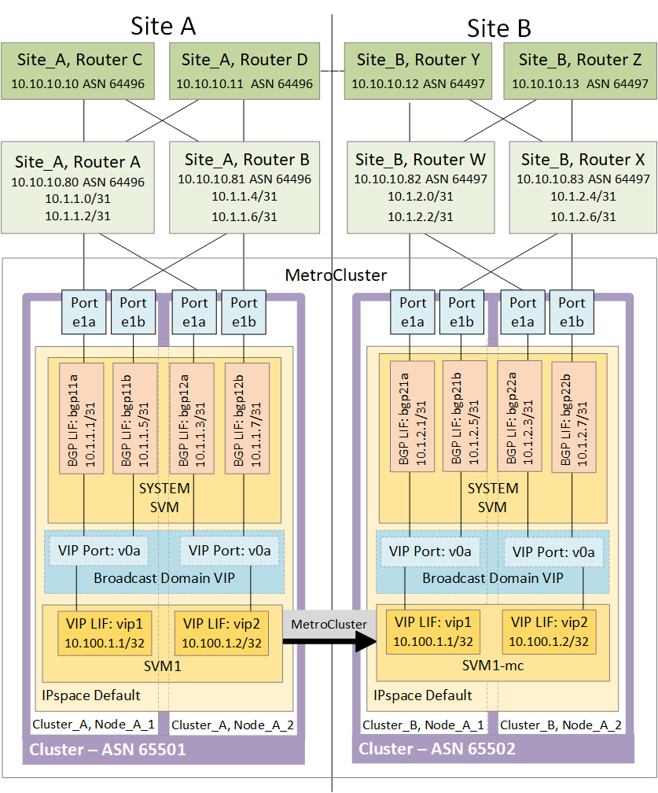

= Überlegungen zur Verwendung von virtuellem IP- und Border-Gateway-Protokoll mit einer MetroCluster-Konfiguration
:allow-uri-read: 
:icons: font
:imagesdir: ../media/

[role="lead"]
Ab ONTAP 9.5 unterstützt ONTAP Layer-3-Konnektivität mithilfe von Virtual IP (VIP) und Border Gateway Protocol (BGP). Die Kombination aus VIP und BGP für Redundanz im Front-End-Netzwerk und der Back-End MetroCluster-Redundanz bietet eine Layer 3 Disaster Recovery-Lösung.

Lesen Sie die folgenden Richtlinien und Illustrationen bei der Planung Ihrer Layer 3-Lösung. Einzelheiten zur Implementierung von VIP und BGP in ONTAP finden Sie im folgenden Abschnitt:

http://docs.netapp.com/ontap-9/topic/com.netapp.doc.dot-cm-nmg/GUID-A8EF6D34-1717-4813-BBFA-AA33E104CF6F.html["*Konfigurieren der virtuellen IP (VIP)-LIFs*"]

*ONTAP Einschränkungen*

ONTAP überprüft nicht automatisch, ob alle Nodes auf beiden Standorten der MetroCluster Konfiguration mit BGP-Peering konfiguriert sind.

ONTAP führt keine Route-Aggregation durch, kündigt aber alle einzelnen virtuellen LIF-IPs jederzeit als eindeutige Host-Routen an.

ONTAP unterstützt keine True Anycast - nur ein einzelner Node im Cluster weist eine bestimmte virtuelle LIF-IP auf (wird aber von allen physischen Schnittstellen akzeptiert, unabhängig davon, ob es sich um BGP LIFs handelt, vorausgesetzt, der physische Port ist Teil des korrekten IPspace). Verschiedene LIFs können unabhängig voneinander zu unterschiedlichen Hosting-Nodes migriert werden.

*Richtlinien für die Verwendung dieser Layer 3-Lösung mit einer MetroCluster-Konfiguration*

Sie müssen Ihr BGP und VIP korrekt konfigurieren, um die erforderliche Redundanz zu gewährleisten.

Einfachere Bereitstellungsszenarien werden gegenüber komplexeren Architekturen bevorzugt (beispielsweise ist ein BGP Peering Router über einen zwischengeschalteten, nicht BGP Router erreichbar). ONTAP ist jedoch nicht durch Einschränkungen in Netzwerkdesign oder Topologie eingeschränkt.

VIP LIFs decken nur das Frontend-/Datennetzwerk ab.

Je nach Ihrer Version von ONTAP müssen Sie BGP Peering LIFs in der Node-SVM konfigurieren, nicht jedoch das System oder die Daten-SVM. Im Jahr 9.8 sind die BGP LIFs in der Cluster (System) SVM sichtbar und die Node-SVMs sind nicht mehr vorhanden.

Jede Daten-SVM erfordert die Konfiguration aller potenziellen First-Hop-Gateway-Adressen (normalerweise der BGP-Router, der IP-Adresse Peering), sodass der Return-Datenpfad bei einer LIF-Migration oder einem MetroCluster-Failover verfügbar ist.

BGP LIFs sind Node-spezifisch, ähnlich wie Intercluster LIFs – jeder Node verfügt über eine eindeutige Konfiguration, die nicht auf DR-Standort-Nodes repliziert werden muss.

Konfiguriert, überprüft die Existenz der v0a (v0b usw.) kontinuierlich die Konnektivität und garantiert, dass eine LIF-Migration oder ein Failover erfolgreich ist (im Gegensatz zu L2, wo eine kaputte Konfiguration nur nach dem Ausfall sichtbar ist).

Ein großer Unterschied in der Architektur besteht darin, dass Clients nicht mehr dasselbe IP Subnetz wie die VIP der Daten-SVMs teilen sollten. Ein L3-Router mit den entsprechenden Resiliency- und Redundanzfunktionen der Enterprise-Klasse (z. B. VRRP/HSRP) sollte sich auf dem Weg zwischen Speicher und Clients befinden, damit der VIP ordnungsgemäß funktioniert.

Der zuverlässige Aktualisierungsprozess von BGP ermöglicht reibungslosere LIF-Migrationen, da sie geringfügig schneller sind und die Wahrscheinlichkeit einer Unterbrechung für einige Clients niedriger ist

Sie können BGP so konfigurieren, dass einige Klassen von Netzwerk- oder Switch-Fehlverhalten schneller als LACP erkannt werden, wenn diese entsprechend konfiguriert werden.

Externe BGP (EBGP) verwendet unterschiedliche Zahlen als Nummern zwischen ONTAP-Knoten und Peering-Routern und ist die bevorzugte Bereitstellung, um die Routenaggregation und -Umverteilung auf den Routern zu vereinfachen. Interne BGP (IBGP) und die Verwendung von Routenreflektoren ist nicht unmöglich, aber außerhalb des Umfangs einer einfachen VIP-Einrichtung.

Nach der Implementierung müssen Sie prüfen, ob auf die Daten-SVM zugegriffen werden kann, wenn die zugehörige virtuelle LIF zwischen allen Nodes an jedem Standort (einschließlich MetroCluster-Umschaltung) migriert wird. So müssen Sie sicherstellen, dass die korrekte Konfiguration der statischen Routen zu derselben Daten-SVM korrekt ist.

VIP funktioniert für die meisten IP-basierten Protokolle (NFS, SMB, iSCSI).
