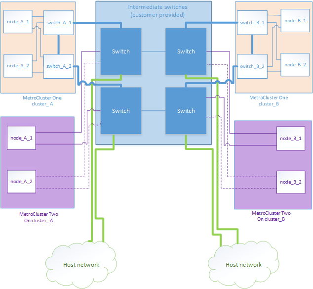

= Überlegungen für die gemeinsame Nutzung privater Layer 2-Netzwerke
:allow-uri-read: 
:icons: font
:imagesdir: ../media/

[role="lead"]
Ab ONTAP 9.6 können MetroCluster IP-Konfigurationen mit unterstützten Cisco Switches bestehende Netzwerke für ISLs gemeinsam nutzen, anstatt dedizierte MetroCluster-ISLs zu verwenden. Bei früheren ONTAP Versionen sind dedizierte ISLs erforderlich.

Die MetroCluster IP Switches sind dediziert für die MetroCluster-Konfiguration und können nicht gemeinsam genutzt werden. Daher kann eine Reihe von MetroCluster IP-Switches nur eine MetroCluster-Konfiguration verbinden. Mit den gemeinsam genutzten Switches können nur die MetroCluster-ISL-Ports in den MetroCluster IP-Switches verbunden werden.

CAUTION: Bei Verwendung eines gemeinsam genutzten Netzwerks ist der Kunde für die Erfüllung der MetroCluster Netzwerkanforderungen im gemeinsam genutzten Netzwerk verantwortlich.

== ISL-Anforderungen

Sie müssen die Anforderungen in folgenden Bereichen erfüllen:

* link:../install-ip/concept_considerations_isls.html#basic-metrocluster-isl-requirements["Grundlegende Anforderungen für MetroCluster-ISL"]
* link:../install-ip/concept_considerations_isls.html#isl-requirements-in-shared-layer-2-networks["ISL-Anforderungen in gemeinsam genutzten Layer-2-Netzwerken"]

== Erforderliche Einstellungen an Zwischenschaltern

Bei der gemeinsamen Nutzung des ISL-Datenverkehrs in einem gemeinsam genutzten Netzwerk muss die Konfiguration der vom Kunden bereitgestellten Zwischenschalter sicherstellen, dass der MetroCluster-Traffic (RDMA und Storage) die erforderlichen Service-Level über den gesamten Pfad zwischen den MetroCluster Standorten erfüllt.

Die folgenden Beispiele gelten für Cisco Nexus 3000-Switches und IP Broadcom-Switches. Je nach Switch-Anbieter und -Modellen müssen Sie sicherstellen, dass Ihre Zwischenschalter eine vergleichbare Konfiguration haben.

=== Cisco Nexus Switches

Das folgende Diagramm gibt einen Überblick über die erforderlichen Einstellungen für ein gemeinsam genutztes Netzwerk, wenn es sich bei den externen Switches um Cisco-Switches handelt.

image::../media/switch_traffic_with_cisco_switches.png[Switch-Datenverkehr mit cisco Switches]

In diesem Beispiel werden für den MetroCluster-Datenverkehr die folgenden Richtlinien und Zuordnungen erstellt:

* Auf Ports am intermediären Switch, die eine Verbindung mit den MetroCluster IP Switches herstellen, wird eine MetroerIP_Ingress-Richtlinie angewendet.
+
Die MetroClusterIP_Ingress Richtlinie ordnet den eingehenden markierten Datenverkehr am Intermediate Switch der entsprechenden Warteschlange zu. Das Tagging findet auf dem Node-Port statt auf der ISL statt. Nicht-MetroCluster-Datenverkehr, der dieselben Ports auf der ISL nutzt, bleibt in der Standardwarteschlange.

* Für Ports am intermediären Switch, die eine Verbindung zu ISLs zwischen Zwischenschaltern herstellen, wird eine MetroClusterIP_Egress-Richtlinie angewendet

Sie müssen die Zwischen-Switches mit übereinstimmenden QoS-Zugriffskarten, Klassenkarten und Richtlinienzuordnungen zwischen den MetroCluster IP-Switches konfigurieren. Die Zwischen-Switches weisen den RDMA-Datenverkehr auf COS5 und den Storage-Datenverkehr auf COS4 zu.

Das folgende Beispiel zeigt die Konfiguration eines vom Kunden bereitgestellten Cisco Nexus 3000 Switch. Wenn Sie Cisco Switches haben, können Sie den Switch mithilfe des Beispiels ohne große Schwierigkeiten entlang des Pfads konfigurieren. Wenn Sie keine Cisco Switches haben, müssen Sie die entsprechende Konfiguration auf Ihre Zwischenschalter festlegen und anwenden.

Das folgende Beispiel zeigt die Klassenzuordnung-Definitionen:

NOTE: Dieses Beispiel gilt für Konfigurationen mit Cisco MetroCluster IP-Switches. Sie können diesem Beispiel unabhängig von den Switch-Typen der Switches folgen, die MetroCluster-Datenverkehr enthalten, die keine Verbindung zu einem MetroCluster-IP-Switch herstellen.

[listing]
----
class-map type qos match-all rdma
   match cos 5
class-map type qos match-all storage
   match cos 4
----
Das folgende Beispiel zeigt die Definitionen für die Richtlinienzuordnung:

[listing]
----
policy-map type qos MetroClusterIP_Ingress
   class rdma
      set dscp 40
      set cos 5
      set qos-group 5
   class storage
      set dscp 32
      set cos 4
      set qos-group 4
policy-map type queuing MetroClusterIP_Egress
   class type queuing c-out-8q-q7
      priority level 1
   class type queuing c-out-8q-q6
      priority level 2
   class type queuing c-out-8q-q5
      priority level 3
      random-detect threshold burst-optimized ecn
   class type queuing c-out-8q-q4
      priority level 4
      random-detect threshold burst-optimized ecn
   class type queuing c-out-8q-q3
      priority level 5
   class type queuing c-out-8q-q2
      priority level 6
   class type queuing c-out-8q-q1
      priority level 7
   class type queuing c-out-8q-q-default
      bandwidth remaining percent 100
      random-detect threshold burst-optimized ecn
----

=== MetroCluster IP Broadcom-Switches

Das folgende Diagramm gibt einen Überblick über die erforderlichen Einstellungen für ein gemeinsames Netzwerk, wenn es sich bei den externen Switches um IP Broadcom-Switches handelt.

image::../media/switch_traffic_with_broadcom_switches.png[Switch-Datenverkehr mit broadcom-Switches]

Bei Konfigurationen, die MetroCluster IP Broadcom-Switches verwenden, ist eine zusätzliche Konfiguration erforderlich:

* Bei externen Switches müssen Sie die Zugriffs- und Klassenkarten so konfigurieren, dass der Datenverkehr beim Eindringen in das Kundennetzwerk klassifiziert wird.
+

NOTE: Dies ist bei Konfigurationen mit MetroCluster IP Switches nicht erforderlich.

+
Das folgende Beispiel zeigt, wie die Zugriffs- und Klassenkarten auf den ersten und letzten Kunden-Switches konfiguriert werden, die die ISLs zwischen den MetroCluster IP Broadcom Switches verbinden.

[listing]
----
ip access-list storage
  10 permit tcp any eq 65200 any
  20 permit tcp any any eq 65200
ip access-list rdma
  10 permit tcp any eq 10006 any
  20 permit tcp any any eq 10006

class-map type qos match-all storage
  match access-group name storage
class-map type qos match-all rdma
  match access-group name rdma
----
* Sie müssen die Ingress-Richtlinie dem ISL-Switch-Port am ersten Kunden-Switch zuweisen.
+
Das folgende Beispiel zeigt die Klassenzuordnung-Definitionen:

+

NOTE: Dieses Beispiel gilt für Konfigurationen mit Cisco MetroCluster IP-Switches. Sie können diesem Beispiel unabhängig von den Switch-Typen der Switches folgen, die MetroCluster-Datenverkehr enthalten, die keine Verbindung zu einem MetroCluster-IP-Switch herstellen.

+
[listing]
----
class-map type qos match-all rdma
   match cos 5
class-map type qos match-all storage
   match cos 4
----
+
Das folgende Beispiel zeigt die Definitionen für die Richtlinienzuordnung:

+
[listing]
----
policy-map type qos MetroClusterIP_Ingress
   class rdma
      set dscp 40
      set cos 5
      set qos-group 5
   class storage
      set dscp 32
      set cos 4
      set qos-group 4
policy-map type queuing MetroClusterIP_Egress
   class type queuing c-out-8q-q7
      priority level 1
   class type queuing c-out-8q-q6
      priority level 2
   class type queuing c-out-8q-q5
      priority level 3
      random-detect threshold burst-optimized ecn
   class type queuing c-out-8q-q4
      priority level 4
      random-detect threshold burst-optimized ecn
   class type queuing c-out-8q-q3
      priority level 5
   class type queuing c-out-8q-q2
      priority level 6
   class type queuing c-out-8q-q1
      priority level 7
   class type queuing c-out-8q-q-default
      bandwidth remaining percent 100
      random-detect threshold burst-optimized ecn
----

=== Kunden-Zwischenschalter

* Bei zwischengeschalteten Kunden-Switches müssen Sie die Richtlinien für den ausgehenden Datenverkehr den ISL Switch-Ports zuweisen.
* Folgen Sie bei allen anderen Innenschaltern entlang des Pfads, die MetroCluster-Datenverkehr tragen, den Beispielen für Klassenzuordnung und Richtlinienzuordnung im Abschnitt _Cisco Nexus 3000 Switches_.

== Beispiele für MetroCluster Netzwerktopologien

Ab ONTAP 9.6 werden einige gemeinsame ISL-Netzwerkkonfigurationen für MetroCluster IP-Konfigurationen unterstützt.

=== Konfiguration für gemeinsam genutztes Netzwerk mit direkten Links

In dieser Topologie sind zwei unterschiedliche Standorte durch direkte Links verbunden. Diese Verbindungen können zwischen Wellenlängen-Multiplex-Geräten (xWDM) oder Schaltern sein. Die Kapazität der ISLs ist nicht auf den MetroCluster-Verkehr dediziert, sondern wird mit anderem Verkehr geteilt.

Die ISL-Kapazität muss die Mindestanforderungen erfüllen. Je nachdem, ob Sie xWDM-Geräte oder -Switches verwenden, kann eine andere Kombination von Netzwerkkonfigurationen angewendet werden.

image::../media/mcc_ip_networking_with_shared_isls.gif[mcc ip-Netzwerk mit gemeinsam genutzten isls]

=== Gemeinsam genutzte Infrastruktur mit Zwischennetzen

In dieser Topologie werden der MetroCluster IP-Core-Switch-Datenverkehr und der Host-Datenverkehr durch ein Netzwerk geleitet, das nicht von NetApp bereitgestellt wird. Die Netzwerkinfrastruktur und die Links (einschließlich geleaster Direct Links) befinden sich außerhalb der MetroCluster Konfiguration. Das Netzwerk kann aus einer Reihe von xWDM und Switches bestehen, aber anders als bei der gemeinsamen Konfiguration mit direkten ISLs sind die Links nicht direkt zwischen den Standorten. Je nach Infrastruktur zwischen den Standorten ist eine beliebige Kombination von Netzwerkkonfigurationen möglich. Die Zwischeninfrastruktur wird als „`Cloud`“ dargestellt (es können mehrere Geräte zwischen den Standorten existieren), unterliegt aber immer noch der Kontrolle des Kunden. Die Kapazität durch diese Zwischeninfrastruktur ist nicht dem MetroCluster Verkehr gewidmet, sondern wird gemeinsam mit anderem Verkehr genutzt.

Die VLAN- und Netzwerk-xWDM- oder Switch-Konfiguration muss die Mindestanforderungen erfüllen.

image::../media/mcc_ip_networking_with_intermediate_private_networks.gif[mcc ip-Vernetzung mit zwischengeschalteten privaten Netzwerken]

=== Zwei MetroCluster-Konfigurationen, die sich ein Zwischennetzwerk teilen

In dieser Topologie teilen sich zwei separate MetroCluster-Konfigurationen dasselbe Zwischennetzwerk. Im Beispiel stellen MetroCluster One Switch_A_1 und MetroCluster Two Switch_A_1 beide eine Verbindung zum gleichen Zwischenschalter her.

Das Beispiel ist nur zu Illustrationszwecken vereinfacht:

image::../media/mcc_ip_two_mccs_sharing_the_same_shared_network_sx.gif[mcc ip zwei mccs teilen sich dasselbe gemeinsam genutzte Netzwerk sx]

=== Zwei MetroCluster-Konfigurationen mit einer Verbindung direkt zum Zwischennetz

Diese Topologie wird ab ONTAP 9.7 unterstützt. Zwei separate MetroCluster-Konfigurationen nutzen das gleiche Zwischennetzwerk, und die Knoten einer MetroCluster-Konfiguration sind direkt mit dem Zwischenschalter verbunden.

MetroCluster One ist eine MetroCluster Konfiguration mit validierten Switches von NetApp, ONTAP 9.6 und einer gemeinsamen Topologie. MetroCluster Two ist eine MetroCluster Konfiguration mit NetApp-kompatiblen Switches und ONTAP 9.7.

NOTE: Die Zwischenschalter müssen den Spezifikationen von NetApp entsprechen.

Das Beispiel ist nur zu Illustrationszwecken vereinfacht:

