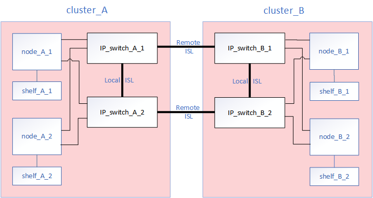

= Teile einer MetroCluster IP-Konfiguration
:allow-uri-read: 
:icons: font
:imagesdir: ../media/

[role="lead"]
Bei der Planung Ihrer MetroCluster IP-Konfiguration sollten Sie sich mit den Hardwarekomponenten und den zugehörigen Verbindungen vertraut machen.

== Wichtige Hardwarekomponenten

Eine MetroCluster IP-Konfiguration umfasst die folgenden wichtigen Hardwarekomponenten:

* Storage Controller
+
Die Storage Controller sind als zwei-Node-Cluster konfiguriert.

* IP-Netzwerk
+
Dieses Back-End-IP-Netzwerk bietet Konnektivität für zwei unterschiedliche Anwendungen:

+
** Standardmäßige Cluster-Konnektivität für die Cluster-interne Kommunikation
+
Dies ist dieselbe Cluster-Switch-Funktion, die auch in nicht-MetroCluster-ONTAP-Clustern mit Switch verwendet wird.

** MetroCluster Back-End-Konnektivität für die Replizierung von Storage-Daten und nichtflüchtigem Cache

* Cluster-Peering-Netzwerk
+
Das Cluster-Peering-Netzwerk bietet Konnektivität zur Spiegelung der Cluster-Konfiguration, einschließlich der Storage Virtual Machine (SVM)-Konfiguration. Die Konfiguration aller SVMs auf einem Cluster wird dem Partner-Cluster gespiegelt.

image::../media/mcc_ip_hardware_architecture_mcc_ip.gif[mcc ip Hardwarearchitektur mcc ip]

== Disaster-Recovery-Gruppen (DR)

Eine MetroCluster IP-Konfiguration besteht aus einer DR-Gruppe mit vier Nodes.

Die folgende Abbildung zeigt die Organisation der Nodes in einer MetroCluster Konfiguration mit vier Nodes:

image::../media/mcc_dr_groups_4_node.gif[mcc dr Gruppen 4 Knoten]

== Darstellung der lokalen HA-Paare in einer MetroCluster Konfiguration

Jeder MetroCluster Standort besteht aus Storage Controllern, die als HA-Paar konfiguriert sind. Dadurch wird lokale Redundanz ermöglicht, sodass der lokale HA-Partner übernimmt, wenn ein Storage Controller ausfällt. Solche Ausfälle können ohne MetroCluster-Switchover-Operation behoben werden.

Lokale HA-Failover- und Giveback-Vorgänge werden mit Storage Failover-Befehlen auf gleiche Weise durchgeführt wie eine andere Konfiguration von MetroCluster.

image::../media/mcc_ip_hardware_architecture_ha_pairs.gif[mcc ip Hardware-Architektur ha-Paare]

https://docs.netapp.com/ontap-9/topic/com.netapp.doc.dot-cm-concepts/home.html["ONTAP-Konzepte"]

== Darstellung des MetroCluster IP- und Cluster Interconnect-Netzwerks

ONTAP Cluster verfügen normalerweise über ein Cluster-Interconnect-Netzwerk für den Datenverkehr zwischen den Nodes im Cluster. In MetroCluster IP-Konfigurationen wird dieses Netzwerk auch für das übertragen von Daten-Replizierungsdatenverkehr zwischen den MetroCluster Standorten verwendet.

Jeder Node in der MetroCluster IP-Konfiguration verfügt über spezielle LIFs für die Verbindung mit dem Back-End-IP-Netzwerk:

* Zwei MetroCluster IP-Schnittstellen
* Ein Intercluster-LIF

Die folgende Abbildung zeigt diese Schnittstellen. Die angegebene Port-Nutzung gilt für ein AFF A700 oder FAS9000 System.

image::../media/mcc_ip_lif_usage.gif[Verwendung von mcc ip-Lif]

link:concept_considerations_mcip.html["Überlegungen für MetroCluster IP-Konfigurationen"]

== Illustration des Cluster-Peering-Netzwerks

Die beiden Cluster in der MetroCluster Konfiguration werden über ein vom Kunden bereitgestellter Cluster-Peering-Netzwerk Peering Peering durchgeführt. Cluster Peering unterstützt die synchrone Spiegelung von Storage Virtual Machines (SVMs, früher Vserver genannt) zwischen den Standorten.

Intercluster-LIFs müssen auf jedem Node in der MetroCluster-Konfiguration konfiguriert werden, und die Cluster müssen für Peering konfiguriert sein. Die Ports mit den Intercluster-LIFs sind mit dem vom Kunden bereitgestellten Cluster-Peering-Netzwerk verbunden. Die Replizierung der SVM-Konfiguration erfolgt über dieses Netzwerk über den Configuration Replication Service.

image::../media/mcc_ip_hardware_architecture_cluster_peering_network.gif[mcc ip-Hardwarearchitektur Cluster-Peering-Netzwerk]

http://docs.netapp.com/ontap-9/topic/com.netapp.doc.exp-clus-peer/home.html["Express-Konfiguration für Cluster und SVM-Peering"]

link:concept_considerations_peering.html["Überlegungen für die Konfiguration von Cluster-Peering"]

link:task_cable_other_connections.html["Verkabeln der Cluster-Peering-Verbindungen"]

link:task_sw_config_configure_clusters.html#peering-the-clusters["Peering der Cluster"]
