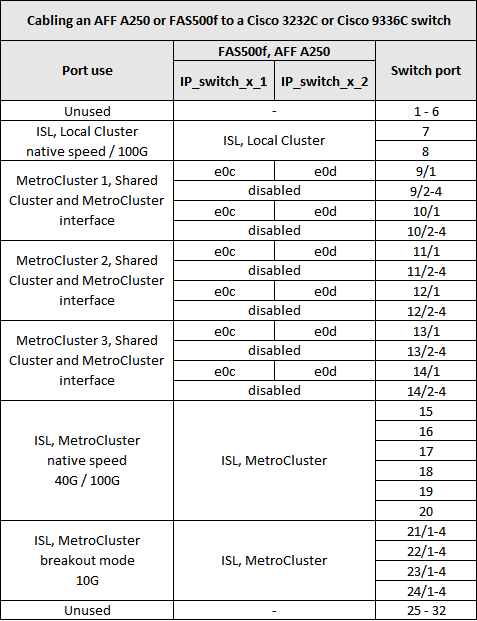
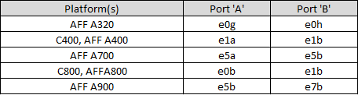

= Plattform-Port-Zuweisungen für Cisco 3232C- oder Cisco 9336C-Switches
:allow-uri-read: 
:icons: font
:imagesdir: ../media/

[role="lead"]
Die Portnutzung in einer MetroCluster IP-Konfiguration hängt vom Switch-Modell und dem Plattformtyp ab.

Lesen Sie vor der Verwendung der Tabellen diese Überlegungen durch:

* In den folgenden Tabellen wird die Portnutzung für Standort A angezeigt Für Standort B wird dieselbe Verkabelung verwendet
* Die Switches können nicht mit Ports unterschiedlicher Geschwindigkeit konfiguriert werden (beispielsweise mit einer Mischung aus 100-Gbit/s-Ports und 40-Gbit/s-Ports).
* Wenn Sie eine einzelne MetroCluster mit den Switches konfigurieren, verwenden Sie die Portgruppe *MetroCluster 1*.
+
Verfolgen Sie die MetroCluster-Portgruppe (MetroCluster 1, MetroCluster 2 oder MetroCluster 3). Sie benötigen sie, wenn Sie das RcfFileGenerator-Tool verwenden, wie später in diesem Konfigurationsvorgang beschrieben.

* Der RcfFileGenerator für MetroCluster IP bietet auch eine Übersicht über die Verkabelung pro Port für jeden Switch.
+
Verwenden Sie diese Verkabelungsübersicht, um Ihre Verkabelung zu überprüfen.

== Verkabelung von zwei MetroCluster-Konfigurationen mit den Switches

Wenn Sie mehrere MetroCluster-Konfigurationen mit einem Cisco 3132Q-V-Switch verkabeln, verkabeln Sie dann jedes MetroCluster entsprechend der entsprechenden Tabelle. Wenn Sie beispielsweise eine FAS2750 und eine A700 mit demselben Cisco 3132Q-V Switch verkabeln. Anschließend werden die FAS2750 wie in Tabelle 1 unter „MetroCluster 1“ und die A700 mit „MetroCluster 2“ oder „MetroCluster 3“ in Tabelle 2 verkabeln. Sie können die FAS2750 und die A700 nicht mit „MetroCluster 1“ verkabeln.

== Verkabelung eines FAS2750 oder AFF A220 Systems mit einem Cisco 3232C oder Cisco 9336C Switch

image::../media/mcc_ip_cabling_an_aff_a220_or_fas2750_to_a_cisco_3232c_or_cisco_9336c_switch.png[mcc ip-Verkabelung: Eine AFF a220 oder fas2750 zu einem cisco 3232c oder cisco 9336c Switch]

== Verkabelung eines AFF A300 oder FAS8200 mit einem Cisco 3232C oder Cisco 9336C Switch

image::../media/mcc_ip_cabling_a_aff_a300_or_fas8200_to_a_cisco_3232c_or_cisco_9336c_switch.png[mcc ip-Verkabelung – AFF a300 oder fas8200 – mit einem cisco 3232c oder cisco 9336c Switch]

== Verkabelung eines AFF A250 oder FAS500f zu einem Cisco 3232C oder Cisco 9336C Switch

== Verkabeln einer AFF A320 mit einem Cisco 3232C- oder Cisco 9336C-Switch

image::../media/cabling_a_aff_a320_to_a_cisco_3232c_or_cisco_9336c_switch.png[Verkabeln einer AFF a320 mit einem cisco 3232c- oder cisco 9336c-Switch]

== Verkabelung einer AFF A400, FAS8300 oder FAS8700 mit einem Cisco 3232C oder Cisco 9336C Switch

image::../media/cabling_a_mcc_ip_aff_a400_fas8300_or_fas8700_to_a_cisco_3232c_or_cisco_9336c_switch.png[Verkabelung eines mcc ip AFF a400 fas8300 oder fas8700 zu einem cisco 3232c-switch oder cisco 9336c-Switch]

== Verkabelung einer AFF A700 oder FAS9000 mit einem Cisco 3232C oder Cisco 9336C Switch

image::../media/mcc_ip_cabling_a_aff_a700_or_fas9000_to_a_cisco_3232c_or_cisco_9336c_switch.png[mcc ip-Verkabelung, wie eine AFF a700 oder fas9000 auf einen cisco 3232c oder cisco 9336c Switch stattfindet]

== Verkabeln einer AFF A800 mit einem Cisco 3232C- oder Cisco 9336C-Switch

image::../media/cabling_an_aff_a800_to_a_cisco_3232c_or_cisco_9336c_switch.png[Verkabelung einer AFF a800 mit einem cisco 3232c- oder cisco 9336c-Switch]

== Verkabelung eines AFF A900 oder FAS9500 zu einem Cisco 3232C oder Cisco 9336C Switch

NOTE: Sie haben die Möglichkeit, die Ports e5a und e7a in einer MetroCluster IP-Konfiguration als Intercluster LIFs zu verwenden.

image:../media/cabling_an_aff_a900_or_FAS9500_to_a_cisco_3232c_or_cisco_9336c_switch.png[""]

== Verkabelung eines AFF A320, AFF A400, AFF A700 oder AFF A800 mit einem gemeinsamen Cisco 9336C-FX2 Switch

image::../media/mcc_ip_cabling_aff_a320_a400_a700_a800_to_cisco_9336c_shared_switch.png[mcc ip-Verkabelung AFF a320 a700 a800 zu cisco 9336c Shared Switch]

