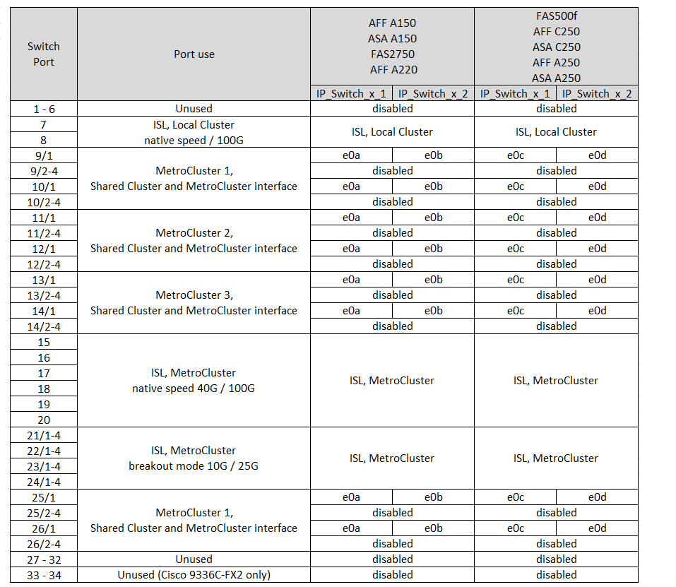

= Plattform-Port-Zuweisungen für Cisco 3232C- oder Cisco 9336C-Switches
:allow-uri-read: 
:icons: font
:imagesdir: ../media/

[role="lead"]
Die Portnutzung in einer MetroCluster IP-Konfiguration hängt vom Switch-Modell und dem Plattformtyp ab.

Lesen Sie vor der Verwendung der Tabellen diese Überlegungen durch:

* In den folgenden Tabellen wird die Portnutzung für Standort A angezeigt Für Standort B wird dieselbe Verkabelung verwendet
* Die Switches können nicht mit Ports unterschiedlicher Geschwindigkeit konfiguriert werden (beispielsweise mit einer Mischung aus 100-Gbit/s-Ports und 40-Gbit/s-Ports).
* Wenn Sie eine einzelne MetroCluster mit den Switches konfigurieren, verwenden Sie die Portgruppe *MetroCluster 1*.
+
Verfolgen Sie die MetroCluster-Portgruppe (MetroCluster 1, MetroCluster 2, MetroCluster 3 oder MetroCluster 4). Sie benötigen sie, wenn Sie das RcfFileGenerator-Tool verwenden, wie später in diesem Konfigurationsvorgang beschrieben.

* Der RcfFileGenerator für MetroCluster IP bietet auch eine Übersicht über die Verkabelung pro Port für jeden Switch.
+
Verwenden Sie diese Verkabelungsübersicht, um Ihre Verkabelung zu überprüfen.

* RCF-Dateiversion Version 2.10 oder höher ist für den 25G-Breakout-Modus für MetroCluster-ISLs erforderlich.
* Für die Verwendung einer anderen Plattform als FAS8200 oder AFF A300 in der Gruppe „MetroCluster 4“ sind ONTAP 9.13.1 oder höher und RCF-Dateiversion 2.00 erforderlich.

NOTE: Die Version der RCF-Datei unterscheidet sich von der Version des RCFfilegenerator-Tools, mit dem die Datei generiert wird. Beispielsweise können Sie eine RCF-Datei Version 2.00 mit RCFfilegenerator v1.6c generieren.

== Verkabelung von zwei MetroCluster-Konfigurationen mit den Switches

Wenn Sie mehrere MetroCluster-Konfigurationen mit einem Cisco 3132Q-V Switch verkabeln, müssen Sie jede MetroCluster gemäß der entsprechenden Tabelle verkabeln. Beispiel: Wenn Sie eine FAS2750 und eine AFF A700 mit demselben Cisco 3132Q-V Switch verkabeln. Anschließend müssen Sie die FAS2750 gemäß „MetroCluster 1“ in Tabelle 1 und die AFF A700 gemäß „MetroCluster 2“ oder „MetroCluster 3“ in Tabelle 2 verkabeln. Die FAS2750 und die AFF A700 können nicht physisch als „MetroCluster 1“ verkabelt werden.

== Wählen Sie die richtige Verkabelungstabelle für Ihre Konfiguration aus

Ermitteln Sie anhand der folgenden Tabelle, welche Verkabelungstabelle Sie befolgen sollten.

[cols="2*"]
|===
| Wenn Ihr System... | Verwenden Sie diese Verkabelungstabelle... 

 a| 
AFF A150, ASA A150, FAS2750, AFF A220

FAS500f, AFF C250, ASA C250, AFF A250, ASA A250
| <<table_1_cisco_3232c_9336c,Schnittstellen-Zuordnungen der Cisco 3232C- oder Cisco 9336C-Plattform (Gruppe 1)>> 

| FAS8200, AFF A300 | <<table_2_cisco_3232c_9336c,Schnittstellen-Zuordnungen der Cisco 3232C- oder Cisco 9336C-Plattform (Gruppe 2)>> 

| AFF A320 FAS8300, AFF C400, ASA C400, FAS8700 AFF A400, ASA A400 | <<table_3_cisco_3232c_9336c,Schnittstellen-Zuordnungen der Cisco 3232C- oder Cisco 9336C-Plattform (Gruppe 3)>> 

| FAS9000, AFF A700 AFF C800, ASA C800, AFF A800, ASA A800 FAS9500, AFF A900, ASA A900 | <<table_4_cisco_3232c_9336c,Schnittstellen-Zuordnungen der Cisco 3232C- oder Cisco 9336C-Plattform (Gruppe 4)>> 

| AFF A70 AFF A90 AFF A1K *Hinweis:* Diese Systeme erfordern ONTAP 9.15.1 oder höher. | <<table_5_cisco_3232c_9336c,Schnittstellen-Zuordnungen der Cisco 3232C- oder Cisco 9336C-Plattform (Gruppe 5)>> 
|===
.Schnittstellen-Zuordnungen der Cisco 3232C- oder Cisco 9336C-Plattform (Gruppe 1)
Prüfen der Plattform-Port-Zuordnungen zur Verkabelung von AFF A150, ASA A150, FAS2750, AFF A220, FAS500f, AFF C250, ASA C250, AFF A250 oder ASA A250 mit einem Cisco 3232C oder 9336C Switch:

.Schnittstellen-Zuordnungen der Cisco 3232C- oder Cisco 9336C-Plattform (Gruppe 2)
Lesen Sie die Zuweisungen der Plattform-Ports, um ein FAS8200 oder AFF A300 System mit einem Cisco 3232C- oder 9336C-Switch zu verkabeln:

image::../media/mcc-ip-cabling-a-aff-a300-or-fas8200-to-a-cisco-3232c-or-cisco-9336c-switch.png[Zeigt die Schnittstellen der Cisco 3232C- oder Cisco 9336C-Plattform]

Wenn Sie ein Upgrade von älteren RCF-Dateien durchführen, verwendet die Verkabelungskonfiguration möglicherweise Ports in der Gruppe „MetroCluster 4“ (Ports 25/26 und 29/30).

.Schnittstellen-Zuordnungen der Cisco 3232C- oder Cisco 9336C-Plattform (Gruppe 3)
Prüfen der Port-Zuordnungen der Plattformen zur Verkabelung der AFF A320, FAS8300, AFF C400, ASA C400, FAS8700 AFF A400 oder ASA A400 System auf einen Cisco 3232C oder 9336C Switch:

image::../media/mcc_ip_cabling_a320_a400_cisco_3232C_or_9336c_switch.png[Zeigt die Schnittstellen der Cisco 3232C- oder Cisco 9336C-Plattform]

*Hinweis 1*: Wenn Sie einen X91440A Adapter (40Gbps) verwenden, verwenden Sie entweder die Ports e4a und e4e oder e4a und e8a. Wenn Sie einen X91153A-Adapter (100 Gbit/s) verwenden, verwenden Sie entweder die Ports e4a und e4b oder e4a und e8a.

NOTE: Für die Verwendung von Ports in der Gruppe „MetroCluster 4“ ist ONTAP 9.13.1 oder höher erforderlich.

.Schnittstellen-Zuordnungen der Cisco 3232C- oder Cisco 9336C-Plattform (Gruppe 4)
Plattform-Port-Zuordnungen zur Verkabelung von FAS9000, AFF A700, AFF C800, ASA C800, AFF A800 prüfen, ASA A800, FAS9500, AFF A900 oder ASA A900 System mit einem Cisco 3232C oder 9336C Switch:

image::../media/mcc_ip_cabling_fas9000_a700_fas9500_a800_a900_cisco_3232C_or_9336c_switch.png[Zeigt die Schnittstellen der Cisco 3232C- oder Cisco 9336C-Plattform]

*Hinweis 1*: Wenn Sie einen X91440A Adapter (40Gbps) verwenden, verwenden Sie entweder die Ports e4a und e4e oder e4a und e8a. Wenn Sie einen X91153A-Adapter (100 Gbit/s) verwenden, verwenden Sie entweder die Ports e4a und e4b oder e4a und e8a.

NOTE: Für die Verwendung von Ports in der Gruppe „MetroCluster 4“ ist ONTAP 9.13.1 oder höher erforderlich.

.Schnittstellen-Zuordnungen der Cisco 3232C- oder Cisco 9336C-Plattform (Gruppe 5)
Überprüfen Sie die Zuweisung der Plattformports, um ein AFF A70-, AFF A90- oder AFF A1K-System mit einem Cisco 3232C- oder 9336C-Switch zu verkabeln:

NOTE: Für die in dieser Tabelle aufgeführten Systeme ist ONTAP 9.15.1 oder höher erforderlich.

image::../media/mcc_ip_cabling_a90_a70_a1k_cisco_3232C_or_9336c_switch.png[Zeigt die Schnittstellen der Cisco 3232C- oder Cisco 9336C-Plattform]
