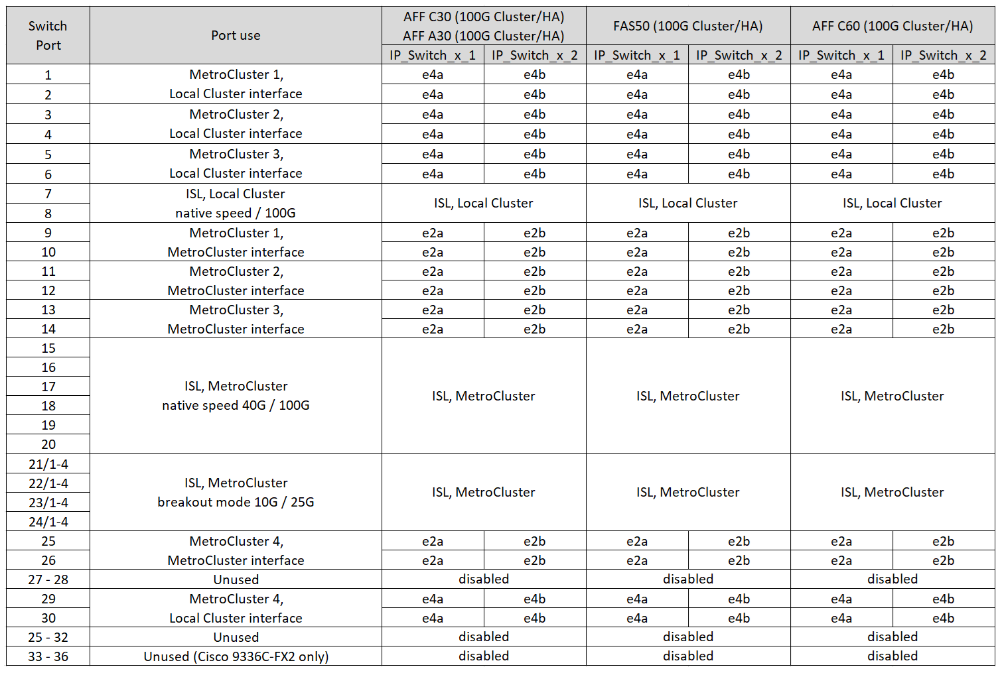
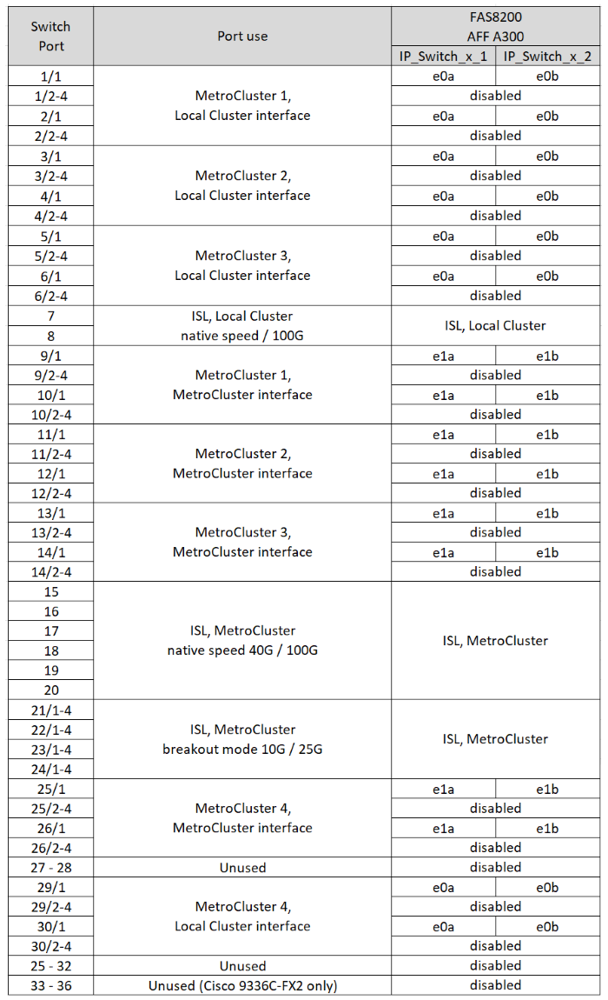

= Plattform-Portzuweisungen für Cisco 3232C- oder 36-Port-Switches Cisco 9336C-FX2
:allow-uri-read: 
:icons: font
:imagesdir: ../media/

[role="lead"]
Die Portnutzung in einer MetroCluster IP-Konfiguration hängt vom Switch-Modell und dem Plattformtyp ab.

Lesen Sie die folgenden Überlegungen, bevor Sie die Konfigurationstabellen verwenden:

* Die Tabellen in diesem Abschnitt gelten für Cisco 3232C-Switches oder 36-Port-Cisco 9336C-FX2-Switches, die keinen NS224-Speicher verbinden.
+
Wenn Sie einen 12-Port Cisco 9336C-FX2 Switch haben, verwenden Sie die Tabellen in link:port-usage-9336c-fx-2-12-port.html["Plattform-Portzuweisungen für 12-Port Cisco 9336C-FX2-Switches"] .

+
Wenn Sie einen Cisco 9336C-FX2-Switch mit 36 Ports haben und mindestens eine MetroCluster-Konfiguration oder DR-Gruppe NS224-Shelves mit dem MetroCluster-Switch verbindet, verwenden Sie die Tabellen in link:port_usage_9336c_shared.html["Plattform-Portzuweisungen für einen 36-Port Cisco 9336C-FX2-Switch, der NS224-Speicher verbindet"] .

* In den folgenden Tabellen wird die Portnutzung für Standort A angezeigt Für Standort B wird dieselbe Verkabelung verwendet
* Sie können die Switches nicht mit Ports unterschiedlicher Geschwindigkeit konfigurieren (z. B. eine Mischung aus 100-Gbit/s-Ports und 40-Gbit/s-Ports).
* Wenn Sie eine einzelne MetroCluster mit den Switches konfigurieren, verwenden Sie die Portgruppe *MetroCluster 1*.
+
Verfolgen Sie die MetroCluster-Portgruppe (MetroCluster 1, MetroCluster 2, MetroCluster 3 oder MetroCluster 4). Sie benötigen sie, wenn Sie das RcfFileGenerator-Tool verwenden, wie später in diesem Konfigurationsvorgang beschrieben.

* Der RcfFileGenerator für MetroCluster IP bietet auch eine Übersicht über die Verkabelung pro Port für jeden Switch.
+
Verwenden Sie diese Verkabelungsübersicht, um Ihre Verkabelung zu überprüfen.

* RCF-Dateiversion Version 2.10 oder höher ist für den 25G-Breakout-Modus für MetroCluster-ISLs erforderlich.
* Für die Verwendung einer anderen Plattform als FAS8200 oder AFF A300 in der Gruppe „MetroCluster 4“ sind ONTAP 9.13.1 oder höher und RCF-Dateiversion 2.00 erforderlich.

NOTE: Die Version der RCF-Datei unterscheidet sich von der Version des RCFfilegenerator-Tools, mit dem die Datei generiert wird. Beispielsweise können Sie eine RCF-Datei Version 2.00 mit RCFfilegenerator v1.6c generieren.

== Wählen Sie die richtige Verkabelungstabelle für Ihre Konfiguration aus

Ermitteln Sie anhand der folgenden Tabelle, welche Verkabelungstabelle Sie befolgen sollten.

[cols="25,75"]
|===
| Wenn Ihr System... | Verwenden Sie diese Verkabelungstabelle... 

| AFF A150, ASA A150 FAS2750, AFF A220 FAS500f, AFF C250, ASA C250 AFF A250, ASA A250 | <<table_1_cisco_3232c_9336c,Cisco 3232C- oder Cisco 9336C-FX2-Plattform-Port-Zuordnungen (Gruppe 1)>> 

| AFF A20 | <<table_2_cisco_3232c_9336c,Cisco 3232C- oder Cisco 9336C-FX2-Plattform-Port-Zuordnungen (Gruppe 2)>> 

| AFF A30, AFF C30 FAS50 AFF C60  a| 
Die folgende Tabelle hängt davon ab, ob Sie eine 25G (Gruppe 3a) oder 100G (Gruppe 3b) Ethernet-Karte verwenden.

* <<table_3a_cisco_3232c_9336c,Cisco 3232C- oder Cisco 9336C-FX2-Plattform-Port-Zuordnungen (Gruppe 3a - 25G)>>
* <<table_3b_cisco_3232c_9336c,Cisco 3232C- oder Cisco 9336C-FX2-Plattform-Port-Zuweisungen (Gruppe 3b - 100G)>>

| FAS8200, AFF A300 | <<table_4_cisco_3232c_9336c,Cisco 3232C- oder Cisco 9336C-FX2-Plattform-Port-Zuordnungen (Gruppe 4)>> 

| AFF A320 FAS8300, AFF C400, ASA C400, FAS8700 AFF A400, ASA A400 | <<table_5_cisco_3232c_9336c,Cisco 3232C- oder Cisco 9336C-FX2-Plattform-Port-Zuordnungen (Gruppe 5)>> 

| AFF A50 | <<table_6_cisco_3232c_9336c,Cisco 3232C- oder Cisco 9336C-FX2-Plattform-Port-Zuordnungen (Gruppe 6)>> 

| FAS9000, AFF A700 AFF C800, ASA C800, AFF A800, ASA A800 FAS9500, AFF A900, ASA A900 | <<table_7_cisco_3232c_9336c,Cisco 3232C- oder Cisco 9336C-FX2-Plattform-Port-Zuordnungen (Gruppe 7)>> 

| FAS70, AFF A70 AFF C80 FAS90, AFF A90 AFF A1K | <<table_8_cisco_3232c_9336c,Cisco 3232C- oder Cisco 9336C-FX2-Plattform-Port-Zuordnungen (Gruppe 8)>> 
|===
.Cisco 3232C- oder Cisco 9336C-FX2-Plattform-Port-Zuordnungen (Gruppe 1)
Prüfen der Plattform-Port-Zuordnungen zur Verkabelung von AFF A150, ASA A150, FAS2750, AFF A220, FAS500f, AFF C250, ASA C250, AFF A250 oder ASA A250 mit einem Cisco 3232C oder 9336C-FX2 Switch:

image:../media/mcc-ip-cabling-a150-a220-a250-to-a-cisco-3232c-or-cisco-9336c-switch-9161.png["Zeigt die Zuweisung der Cisco 3232C- oder Cisco 9336C-FX2-Plattformschnittstelle"]

.Cisco 3232C- oder Cisco 9336C-FX2-Plattform-Port-Zuordnungen (Gruppe 2)
Überprüfen Sie die Zuweisung der Plattformschnittstelle, um ein AFF A20-System mit einem Cisco 3232C- oder 9336C-FX2-Switch zu verkabeln:

image:../media/mcc-ip-cabling-aff-a20-9161.png["Zeigt die Zuweisung der Cisco 3232C- oder Cisco 9336C-FX2-Plattformschnittstelle"]

.Cisco 3232C oder Cisco 9336C-FX2 – Plattform-Port-Zuordnungen (Gruppe 3a)
Überprüfen Sie die Zuordnungen der Plattformports, um ein AFF A30-, AFF C30-, AFF C60- oder FAS50-System über eine 25-Gbit-Ethernet-Karte mit vier Ports mit einem Cisco 3232C- oder 9336C-FX2-Switch zu verkabeln.

NOTE: Diese Konfiguration erfordert eine 25-Gbit-Ethernet-Karte mit vier Ports in Steckplatz 4, um das lokale Cluster und die HA-Schnittstellen anzuschließen.

image:../media/mccip-cabling-a30-c30-fas50-c60-25G.png["Zeigt die Zuweisung der Cisco 3232C- oder Cisco 9336C-FX2-Plattformschnittstelle"]

.Cisco 3232C oder Cisco 9336C-FX2 – Plattform-Port-Zuordnungen (Gruppe 3b)
Überprüfen Sie die Zuweisung der Plattform-Ports, um ein AFF A30-, AFF C30-, AFF C60- oder FAS50-System mit einem Cisco 3232C- oder 9336C-FX2-Switch über eine 100-GB-Ethernet-Karte mit zwei Ports zu verkabeln.

NOTE: Für diese Konfiguration ist eine 100-GB-Ethernet-Karte mit zwei Ports in Steckplatz 4 erforderlich, um das lokale Cluster und die HA-Schnittstellen zu verbinden.

.Cisco 3232C- oder Cisco 9336C-FX2-Plattform-Port-Zuordnungen (Gruppe 4)
Überprüfen Sie die Zuordnungen der Plattformports, um ein FAS8200- oder AFF A300-System mit einem Cisco 3232C- oder 9336C-FX2-Switch zu verkabeln:

Wenn Sie ein Upgrade von älteren RCF-Dateien durchführen, verwendet die Verkabelungskonfiguration möglicherweise Ports in der Gruppe „MetroCluster 4“ (Ports 25/26 und 29/30).

.Cisco 3232C- oder Cisco 9336C-FX2-Plattform-Port-Zuordnungen (Gruppe 5)
Prüfen der Port-Zuordnungen der Plattformen zur Verkabelung der AFF A320, FAS8300, AFF C400, ASA C400, FAS8700 AFF A400 oder ASA A400 System auf einen Cisco 3232C oder 9336C-FX2 Switch:

image::../media/mcc_ip_cabling_a320_a400_cisco_3232C_or_9336c_switch.png[Zeigt die Zuweisung der Cisco 3232C- oder Cisco 9336C-FX2-Plattformschnittstelle]

NOTE: Für die Verwendung von Ports in der Gruppe „MetroCluster 4“ ist ONTAP 9.13.1 oder höher erforderlich.

.Cisco 3232C- oder Cisco 9336C-FX2-Plattform-Port-Zuordnungen (Gruppe 6)
Überprüfen Sie die Zuweisung der Plattformschnittstelle, um ein AFF A50-System mit einem Cisco 3232C- oder 9336C-FX2-Switch zu verkabeln:

image::../media/mcc-ip-cabling-aff-a50-cisco-3232c-9336c-9161.png[Zeigt die Zuweisung der Cisco 3232C- oder Cisco 9336C-FX2-Plattformschnittstelle]

.Cisco 3232C- oder Cisco 9336C-FX2-Plattform-Port-Zuordnungen (Gruppe 7)
Plattform-Port-Zuordnungen zur Verkabelung von FAS9000, AFF A700, AFF C800, ASA C800, AFF A800 prüfen, ASA A800, FAS9500, AFF A900 oder ASA A900 System mit einem Cisco 3232C oder 9336C-FX2 Switch:

image::../media/mcc_ip_cabling_fas9000_a700_fas9500_a800_a900_cisco_3232C_or_9336c_switch.png[Zeigt die Zuweisung der Cisco 3232C- oder Cisco 9336C-FX2-Plattformschnittstelle]

*Hinweis 1*: Verwenden Sie entweder die Ports e4a und e4e oder e4a und e8a, wenn Sie einen X91440A Adapter (40Gbps) verwenden. Verwenden Sie entweder die Ports e4a und e4b oder e4a und e8a, wenn Sie einen X91153A-Adapter (100 Gbit/s) verwenden.

NOTE: Für die Verwendung von Ports in der Gruppe „MetroCluster 4“ ist ONTAP 9.13.1 oder höher erforderlich.

.Cisco 3232C- oder Cisco 9336C-FX2-Plattform-Port-Zuordnungen (Gruppe 8)
Prüfen Sie die Zuordnungen der Plattform-Ports, um ein AFF A70-, FAS70-, AFF C80-, FAS90-, AFF A90- oder AFF A1K-System mit einem Cisco 3232C- oder 9336C-FX2 Switch zu verkabeln:

image:../media/mccip-cabling-a70-fas70-a90-c80-fas90-a1k-updated.png["Zeigt die Zuweisung der Cisco 3232C- oder Cisco 9336C-FX2-Plattformschnittstelle"]
