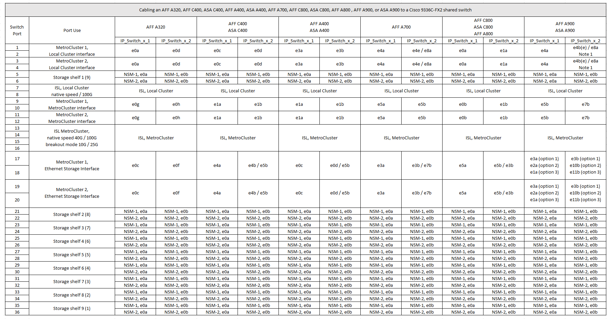

= Plattform-Port-Zuweisungen für einen gemeinsamen Cisco 9336C-FX2-Switch
:allow-uri-read: 
:icons: font
:imagesdir: ../media/

[role="lead"]
Die Portnutzung in einer MetroCluster IP-Konfiguration hängt vom Switch-Modell und dem Plattformtyp ab.

Lesen Sie vor der Verwendung der Tabellen diese Überlegungen durch:

* Mindestens eine MetroCluster-Konfiguration oder DR-Gruppe muss über Switch verbundene NS224-Shelfs unterstützen.
* Plattformen, die Switch-Attached NS224 Shelfs nicht unterstützen, können nur als zweite MetroCluster-Konfiguration oder als zweite DR-Gruppe verbunden werden.
* Der RcfFileGenerator zeigt nur geeignete Plattformen an, wenn die erste Plattform ausgewählt ist.
* Für das Verbinden von MetroCluster Konfigurationen mit einem oder zwei vier Nodes ist ONTAP 9.14.1 oder höher erforderlich.

== Verkabelung einer AFF A320, AFF C400, ASA C400, AFF A400, ASA A400 AFF A700, AFF C800, ASA C800, AFF A800, AFF A900 oder ASA A900-System auf einen Cisco 9336C-FX2 Shared Switch

*Hinweis 1*: Wenn Sie einen X91440A Adapter (40Gbps) verwenden, verwenden Sie entweder die Ports e4a und e4e oder e4a und e8a. Wenn Sie einen X91153A-Adapter (100 Gbit/s) verwenden, verwenden Sie entweder die Ports e4a und e4b oder e4a und e8a.

== Verkabelung eines AFF Systems A150, ASA A150, FAS2750 oder AFF A220 mit einem gemeinsamen Cisco 9336C-FX2 Switch

image::../media/mcc_ip_cabling_a_aff_a150_asa_a150_fas27500_aff_a220_to_a_cisco_9336c_shared_switch.png[mcc ip-Verkabelung eines AFF a150 ASA a150 fas27500 AFF a220 zu einem cisco 9336c Shared Switch]

== Verkabelung eines FAS500f-, AFF C250-, ASA C250-, AFF A250- oder ASA A250-Systems mit einem gemeinsamen Cisco 9336C-FX2-Switch

image::../media/mcc_ip_cabling_c250_asa_c250_a250_asa_a250_to_cisco_9336c_shared_switch.png[mcc ip-Verkabelung C250 ASA C250 a250 ASA a250 zu cisco 9336c Shared Switch]

== Verkabelung eines FAS8200 oder AFF A300 Systems mit einem gemeinsamen Cisco 9336C-FX2 Switch

image::../media/mcc_ip_cabling_fas8200_affa300_to_cisco_9336c_shared_switch.png[mcc ip-Verkabelung fas8200 affa300 zu cisco 9336c Shared Switch]

== Verkabelung eines FAS8300, FAS8700, FAS9000 oder FAS9500 Systems mit einem Cisco 9336C-FX2 Shared Switch

image::../media/mcc_ip_cabling_fas8300_fas8700_fas9000_fas9500_to_cisco_9336c_shared_switch.png[mcc ip-Verkabelung fas8300 fas8700 fas9000 fas9500 zu cisco 9336c Shared Switch]

*Hinweis 1*: Wenn Sie einen X91440A Adapter (40Gbps) verwenden, verwenden Sie entweder die Ports e4a und e4e oder e4a und e8a. Wenn Sie einen X91153A-Adapter (100 Gbit/s) verwenden, verwenden Sie entweder die Ports e4a und e4b oder e4a und e8a.
