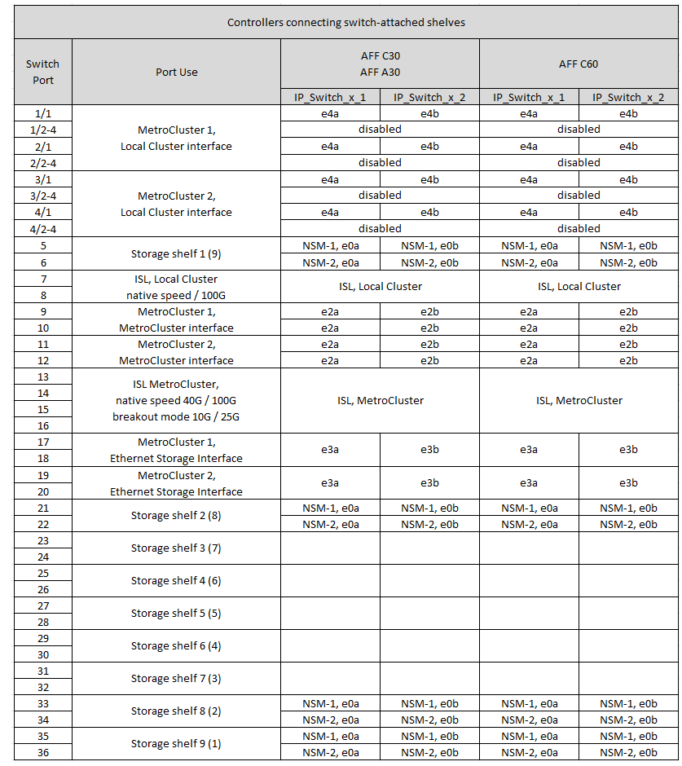
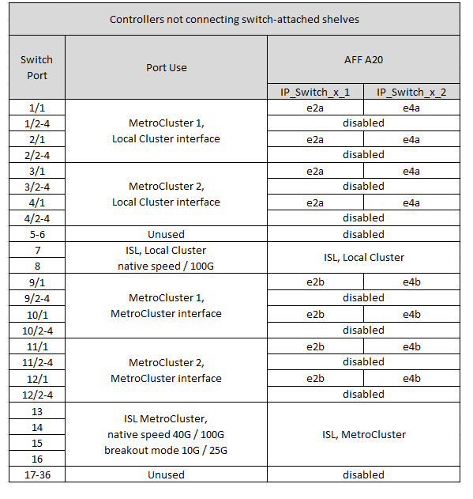
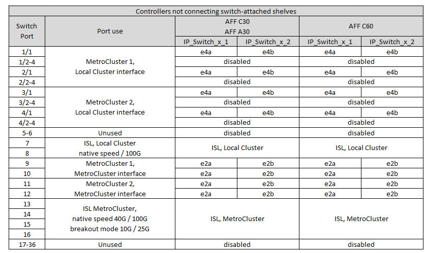

= Plattform-Port-Zuweisungen für einen gemeinsamen Cisco 9336C-FX2-Switch
:allow-uri-read: 
:icons: font
:imagesdir: ../media/

[role="lead"]
Die Portnutzung in einer MetroCluster IP-Konfiguration hängt vom Switch-Modell und dem Plattformtyp ab.

Lesen Sie die folgenden Überlegungen, bevor Sie die Konfigurationstabellen verwenden:

* Mindestens eine MetroCluster-Konfiguration oder DR-Gruppe muss über Switch verbundene NS224-Shelfs unterstützen.
* Plattformen, die Switch-Attached NS224 Shelfs nicht unterstützen, können nur als zweite MetroCluster-Konfiguration oder als zweite DR-Gruppe verbunden werden.
* Der RcfFileGenerator zeigt nur geeignete Plattformen an, wenn die erste Plattform ausgewählt ist.
* Für das Verbinden von MetroCluster Konfigurationen mit einem oder zwei vier Nodes ist ONTAP 9.14.1 oder höher erforderlich.

== Wählen Sie die richtige Verkabelungstabelle für Ihre Konfiguration aus

Überprüfen Sie die Tabelle mit den korrekten Portzuweisungen für Ihre Konfiguration. In diesem Abschnitt gibt es zwei Sätze von Verkabelungstabellen:

* <<tables_connecting_ns224,Verkabelungstabellen für Controller, die mit Switch-verbundenen NS224-Shelfs verbunden werden>>
* <<tables_not_connecting_ns224,Verkabelungstabellen für Controller, die keine Verbindung zu Switch-verbundenen NS224-Shelfs herstellen>>

=== Controller, die mit Switch-Attached NS224 Shelfs verbunden sind

Legen Sie fest, welche Portzuweisungstabelle Sie für Controller befolgen sollten, die mit Switch-verbundenen NS224-Shelfs verbunden werden.

[cols="2*"]
|===
| Plattform | Verwenden Sie diese Verkabelungstabelle... 

| AFF C30, AFF A30 AFF C60 | <<table_1_cisco_9336c_fx2,Cisco 9336C-FX2 – Plattform-Port-Zuweisungen für gemeinsam genutzte Switches (Gruppe 1)>> 

| AFF A320 AFF C400, ASA C400 AFF A400, ASA A400 | <<table_2_cisco_9336c_fx2,Cisco 9336C-FX2 – Plattform-Port-Zuweisungen für gemeinsame Switches (Gruppe 2)>> 

| AFF A50 | <<table_3_cisco_9336c_fx2,Cisco 9336C-FX2 – Plattform-Port-Zuweisungen für gemeinsame Switches (Gruppe 3)>> 

| AFF A700 AFF C800, ASA C800, AFF A800 AFF A900, ASA A900 | <<table_4_cisco_9336c_fx2,Cisco 9336C-FX2 – Port-Zuweisungen für gemeinsam genutzte Switch-Plattform (Gruppe 4)>> 

| AFF A70 AFF C80 AFF A90 AFF A1K | <<table_5_cisco_9336c_fx2,Cisco 9336C-FX2 – Port-Zuweisungen für gemeinsam genutzte Switch-Plattform (Gruppe 5)>> 
|===
.Cisco 9336C-FX2 – Plattform-Port-Zuweisungen für gemeinsam genutzte Switches (Gruppe 1)
Überprüfen Sie die Zuordnungen der Plattform-Ports, um ein AFF C30-, AFF A30- oder AFF C60-System zu verkabeln, das Switch-angeschlossene NSS24-Shelfs mit einem gemeinsam genutzten Cisco 9336C-FX2-Switch verbindet:

.Cisco 9336C-FX2 – Plattform-Port-Zuweisungen für gemeinsame Switches (Gruppe 2)
Prüfen Sie die Zuordnungen der Plattform-Ports zum Anschließen eines AFF A320-, AFF C400-, ASA C400-, AFF A400- oder ASA A400-Systems zum Verbinden der Switch-Attached NSS24-Shelfs mit einem gemeinsamen Cisco 9336C-FX2-Switch:

image::../media/mcc_ip_cabling_a320_c400_a400_to_cisco_9336c_shared_switch.png[Zeigt die Port-Zuweisungen der Cisco 9336C-FX2-Plattform für gemeinsame Switches]

.Cisco 9336C-FX2 – Plattform-Port-Zuweisungen für gemeinsame Switches (Gruppe 3)
Prüfen Sie die Zuordnungen der Plattform-Ports, um ein AFF A50-System zu verkabeln, das Switch-verbundene NSS24-Shelfs mit einem Cisco 9336C-FX2 Shared-Switch verbindet:

image:../media/mcc-ip-cabling-aff-a50-cisco-9336fx2-switch-attached.png["Zeigt die Port-Zuweisungen der Cisco 9336C-FX2-Plattform für gemeinsame Switches"]

.Cisco 9336C-FX2 – Plattform-Port-Zuweisungen für gemeinsame Switches (Gruppe 4)
Sehen Sie sich die Plattform-Port-Zuordnungen zur Verkabelung bei AFF A700, AFF C800, ASA C800, AFF A800, AFF A900 an. oder ASA A900 System zum Verbinden von Switch-Attached NSS24 Shelfs mit einem Cisco 9336C-FX2 Shared-Switch:

image:../media/mcc_ip_cabling_a700_c800_a800_a900_to_cisco_9336c_shared_switch.png["Zeigt die Port-Zuweisungen der Cisco 9336C-FX2-Plattform für gemeinsame Switches"]

*Hinweis 1*: Verwenden Sie entweder die Ports e4a und e4e oder e4a und e8a, wenn Sie einen X91440A Adapter (40Gbps) verwenden. Verwenden Sie entweder die Ports e4a und e4b oder e4a und e8a, wenn Sie einen X91153A-Adapter (100 Gbit/s) verwenden.

.Cisco 9336C-FX2 – Plattform-Port-Zuweisungen für gemeinsame Switches (Gruppe 5)
Prüfen Sie die Zuweisungen der Plattform-Ports, um ein AFF A70-, AFF C80-, AFF A90- oder AFF A1K-System zu verkabeln, bei dem die Switch-Attached NSS24-Shelfs mit einem gemeinsamen Cisco 9336C-FX2-Switch verbunden werden:

=== Controller, keine Verbindung zu Switch-Attached NS224 Shelfs

Legen Sie fest, welche Portzuweisungstabelle Sie für Controller befolgen sollten, die keine Verbindung zu Switch-verbundenen NS224-Shelfs herstellen.

[cols="2*"]
|===
| Plattform | Verwenden Sie diese Verkabelungstabelle... 

| AFF A150, ASA A150 FAS2750, AFF A220 | <<table_6_cisco_9336c_fx2,Cisco 9336C-FX2 – Plattform-Port-Zuweisungen für gemeinsame Switches (Gruppe 6)>> 

| AFF A20 | <<table_7_cisco_9336c_fx2,Cisco 9336C-FX2 – Plattform-Port-Zuweisungen für gemeinsame Switches (Gruppe 7)>> 

| FAS500f AFF C250, ASA C250 AFF A250, ASA A250 | <<table_8_cisco_9336c_fx2,Cisco 9336C-FX2 – Plattform-Port-Zuweisungen für gemeinsame Switches (Gruppe 8)>> 

| AFF C30, AFF A30 AFF C60 | <<table_9_cisco_9336c_fx2,Cisco 9336C-FX2 – Plattform-Port-Zuweisungen für gemeinsame Switches (Gruppe 9)>> 

| FAS8200, AFF A300 | <<table_10_cisco_9336c_fx2,Cisco 9336C-FX2 – Port-Zuweisungen für gemeinsam genutzte Switch-Plattform (Gruppe 10)>> 

| AFF A320 FAS8300, AFF C400, ASA C400, FAS8700 AFF A400, ASA A400 | <<table_11_cisco_9336c_fx2,Cisco 9336C-FX2 – Port-Zuweisungen für gemeinsam genutzte Switch-Plattform (Gruppe 11)>> 

| AFF A50 | <<table_12_cisco_9336c_fx2,Cisco 9336C-FX2 – Port-Zuweisungen für gemeinsam genutzte Switch-Plattform (Gruppe 12)>> 

| FAS9000, AFF A700 AFF C800, ASA C800, AFF A800, ASA A800 FAS9500, AFF A900, ASA A900 | <<table_13_cisco_9336c_fx2,Cisco 9336C-FX2 – Port-Zuweisungen für gemeinsam genutzte Switch-Plattform (Gruppe 13)>> 

| FAS70, AFF A70 AFF C80 FAS90, AFF A90 AFF A1K | <<table_14_cisco_9336c_fx2,Cisco 9336C-FX2 – Port-Zuweisungen für gemeinsam genutzte Switch-Plattform (Gruppe 14)>> 
|===
.Cisco 9336C-FX2 – Plattform-Port-Zuweisungen für gemeinsame Switches (Gruppe 6)
Plattform-Port-Zuordnungen am Kabel eines AFF A150, ASA A150, FAS2750 oder AFF A220 Systems prüfen, bei dem keine Switch-Attached NSS24 Shelfs mit einem Cisco 9336C-FX2 Shared Switch verbunden sind:

image::../media/mcc-ip-cabling-a-aff-a150-asa-a150-fas2750-aff-a220-to-a-cisco-9336c-shared-switch.png[Zeigt die Port-Zuweisungen der Cisco 9336C-FX2-Plattform für gemeinsame Switches]

.Cisco 9336C-FX2 – Plattform-Port-Zuweisungen für gemeinsame Switches (Gruppe 7)
Überprüfen Sie die Zuordnungen der Plattform-Ports, um ein AFF A20-System zu verkabeln, das keine Switch-angeschlossenen NSS24-Shelfs mit einem Cisco 9336C-FX2 Shared-Switch verbindet:

.Cisco 9336C-FX2 – Plattform-Port-Zuweisungen für gemeinsame Switches (Gruppe 8)
Prüfen Sie die Zuweisungen der Plattform-Ports, um ein FAS500f-, AFF C250-, ASA C250-, AFF A250- oder ASA A250-System zu verkabeln, bei dem keine Switch-Attached NSS24-Shelfs mit einem gemeinsamen Cisco 9336C-FX2-Switch verbunden sind.

image::../media/mcc-ip-cabling-c250-asa-c250-a250-asa-a250-to-cisco-9336c-shared-switch.png[Zeigt die Port-Zuweisungen der Cisco 9336C-FX2-Plattform für gemeinsame Switches]

.Cisco 9336C-FX2 – Plattform-Port-Zuweisungen für gemeinsame Switches (Gruppe 9)
Überprüfen Sie die Zuweisungen der Plattform-Ports, um ein AFF A30-, AFF C30- oder AFF C60-System zu verkabeln, das keine Switch-angeschlossenen NSS24-Shelfs mit einem Cisco 9336C-FX2-Shared-Switch verbindet:

.Cisco 9336C-FX2 – Port-Zuweisungen für gemeinsam genutzte Switch-Plattform (Gruppe 10)
Plattform-Port-Zuweisungen prüfen, um ein FAS8200 oder AFF A300 System ohne Verbindung von Switch-Attached NSS24 Shelfs zu einem Cisco 9336C-FX2 Shared Switch zu verkabeln:

image::../media/mcc-ip-cabling-fas8200-affa300-to-cisco-9336c-shared-switch.png[Zeigt die Port-Zuweisungen der Cisco 9336C-FX2-Plattform für gemeinsame Switches]

.Cisco 9336C-FX2 – Port-Zuweisungen für gemeinsam genutzte Switch-Plattform (Gruppe 11)
Prüfen der Port-Zuordnungen der Plattformen zur Verkabelung der AFF A320, FAS8300, AFF C400, ASA C400, FAS8700 AFF A400 oder ASA A400 System, das keine Switch-Attached NSS24 Shelfs mit einem Cisco 9336C-FX2 Shared Switch verbindet:

image::../media/mcc_ip_cabling_a320_fas8300_a400_fas8700_to_a_cisco_9336c_shared_switch.png[Zeigt die Port-Zuweisungen der Cisco 9336C-FX2-Plattform für gemeinsame Switches]

.Cisco 9336C-FX2 – Port-Zuweisungen für gemeinsam genutzte Switch-Plattform (Gruppe 12)
Prüfen Sie die Zuordnungen der Plattform-Ports, um ein AFF A50-System zu verkabeln, das keine Switch-angeschlossenen NSS24-Shelfs mit einem Cisco 9336C-FX2 Shared-Switch verbindet:

image::../media/mcc-ip-cabling-aff-a50-cisco-9336c-shared-switch-not-connecting.png[Zeigt die Port-Zuweisungen der Cisco 9336C-FX2-Plattform für gemeinsame Switches]

.Cisco 9336C-FX2 – Port-Zuweisungen für gemeinsam genutzte Switch-Plattform (Gruppe 13)
Plattform-Port-Zuordnungen zur Verkabelung von FAS9000, AFF A700, AFF C800, ASA C800, AFF A800 prüfen, ASA A800, FAS9500, AFF A900 oder ASA A900 System, das keine Switch-Attached NSS24 Shelfs mit einem Cisco 9336C-FX2 Shared Switch verbindet:

image::../media/mcc_ip_cabling_a700_a800_fas9000_fas9500_to_cisco_9336c_shared_switch.png[Zeigt die Port-Zuweisungen der Cisco 9336C-FX2-Plattform für gemeinsame Switches]

*Hinweis 1*: Verwenden Sie entweder die Ports e4a und e4e oder e4a und e8a, wenn Sie einen X91440A Adapter (40Gbps) verwenden. Verwenden Sie entweder die Ports e4a und e4b oder e4a und e8a, wenn Sie einen X91153A-Adapter (100 Gbit/s) verwenden.

.Cisco 9336C-FX2 – Port-Zuweisungen für gemeinsam genutzte Switch-Plattform (Gruppe 14)
Plattform-Port-Zuweisungen prüfen, um ein AFF A70-, FAS70-, AFF C80-, FAS90-, AFF A90- oder AFF A1K-System zu verkabeln, bei dem keine Switch-Attached NSS24-Shelfs mit einem gemeinsamen Cisco 9336C-FX2-Switch verbunden sind:

image::../media/mcc-ip-cabling-aff-a70-fas70-c80-fas90-a90-a1k-cisco-9336c-shared-switch-not-connecting-updated.png[Zeigt die Port-Zuweisungen der Cisco 9336C-FX2-Plattform für gemeinsame Switches]
