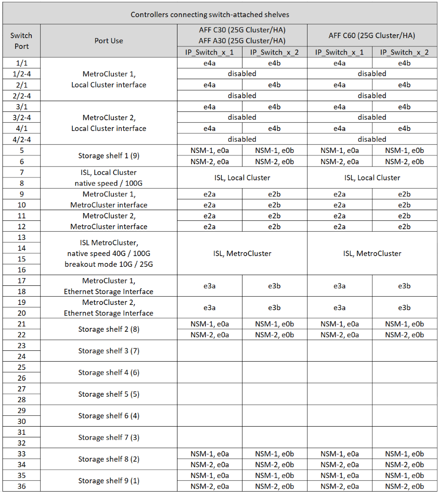
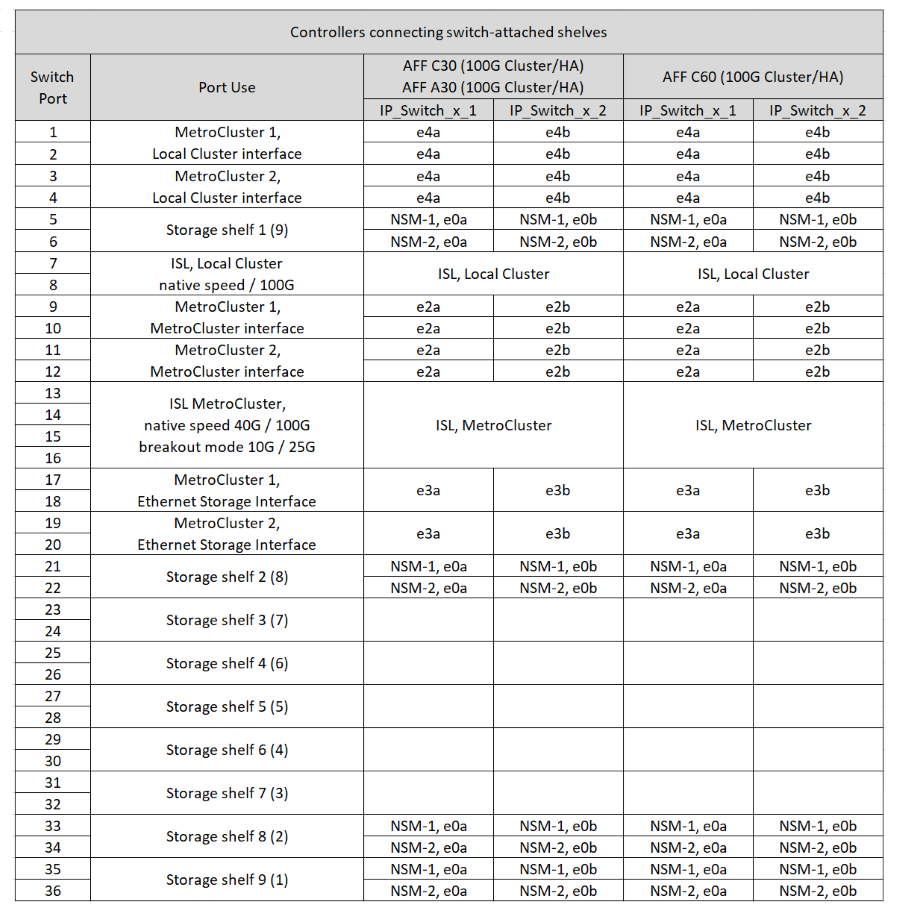

= Zuweisung von Plattform-Ports für einen Cisco 9336C-FX2-Switch, der NS224-Speicher verbindet
:allow-uri-read: 
:icons: font
:imagesdir: ../media/

[role="lead"]
Die Portnutzung in einer MetroCluster IP-Konfiguration hängt vom Switch-Modell und dem Plattformtyp ab.

Lesen Sie die folgenden Überlegungen, bevor Sie die Konfigurationstabellen verwenden:

* Wenn Sie einen Cisco 9336C-FX2-Switch verbinden, der NS224-Speicher verbindet, können Sie nur über maximal zwei MetroCluster-Konfigurationen oder DR-Gruppen verfügen. Mindestens eine MetroCluster-Konfiguration oder DR-Gruppe muss Switch-verbundene NS224-Shelfs unterstützen. Plattformen, die Switch-Attached NS224 Shelfs nicht unterstützen, können nur als zweite MetroCluster-Konfiguration oder als zweite DR-Gruppe verbunden werden.
+

CAUTION: Sie verwenden diese Tabellen nur, wenn mindestens eine MetroCluster-Konfiguration oder DR-Gruppe NS224-Shelfs mit dem MetroCluster-Switch verbindet. Wenn Sie dedizierte Speicherschalter zum Anschließen der NS224-Shelfs verwenden, verkabeln Sie die Switches gemäß den Tabellen inlink:port_usage_3232c_9336c.html["Zuweisung der Plattform-Ports für Cisco 3232C- oder Cisco 9336C-FX2-Switches"].

* Der RcfFileGenerator zeigt nur geeignete Plattformen an, wenn die erste Plattform ausgewählt ist.
* Für das Verbinden von MetroCluster Konfigurationen mit einem oder zwei vier Nodes ist ONTAP 9.14.1 oder höher erforderlich.

== Wählen Sie die richtige Verkabelungstabelle für Ihre Konfiguration aus

Überprüfen Sie die Tabelle mit den korrekten Portzuweisungen für Ihre Konfiguration. In diesem Abschnitt gibt es zwei Sätze von Verkabelungstabellen:

* <<tables_connecting_ns224,Verkabelungstabellen für Controller, die NS224-Shelfs mit Switch verbinden>>
* <<tables_not_connecting_ns224,Verkabelungstabellen für Controller, die keine Switch-verbundenen NS224-Shelfs anschließen>>

=== Controller, die Switch-Attached NS224 Shelfs verbinden

Legen Sie fest, welche Portzuweisungstabelle Sie für Controller befolgen sollten, die Switch-verbundene NS224-Shelfs verbinden.

[cols="25,75"]
|===
| Plattform | Verwenden Sie diese Verkabelungstabelle... 

| AFF C30, AFF A30 AFF C60  a| 
Die folgende Tabelle hängt davon ab, ob Sie eine 25G (Gruppe 1a) oder 100G (Gruppe 1b) Ethernet-Karte verwenden.

* <<table_1a_cisco_9336c_fx2,Cisco 9336C-FX2-Switch zur Verbindung von Port-Zuordnungen der NS224-Speicherplattform (Gruppe 1a - 25G)>>
* <<table_1b_cisco_9336c_fx2,Cisco 9336C-FX2-Switch zur Verbindung von NS224-Storage-Plattform-Port-Zuordnungen (Gruppe 1b - 100G)>>

| AFF A320 AFF C400, ASA C400 AFF A400, ASA A400 | <<table_2_cisco_9336c_fx2,Cisco 9336C-FX2-Switch zur Verbindung von NS224-Port-Zuordnungen der Speicherplattform (Gruppe 2)>> 

| AFF A50 | <<table_3_cisco_9336c_fx2,Cisco 9336C-FX2-Switch zur Verbindung von NS224-Port-Zuordnungen der Speicherplattform (Gruppe 3)>> 

| AFF A700 AFF C800, ASA C800, AFF A800 AFF A900, ASA A900 | <<table_4_cisco_9336c_fx2,Cisco 9336C-FX2-Switch zur Verbindung von NS224-Port-Zuordnungen der Speicherplattform (Gruppe 4)>> 

| AFF A70 AFF C80 AFF A90 AFF A1K | <<table_5_cisco_9336c_fx2,Cisco 9336C-FX2-Switch zur Verbindung von NS224-Port-Zuordnungen der Speicherplattform (Gruppe 5)>> 
|===
.Cisco 9336C-FX2-Switch, der NS224-Speicherplattform-Port-Zuweisungen verbindet (Gruppe 1a)
Überprüfen Sie die Zuordnungen der Plattform-Ports, um ein AFF A30-, AFF C30- oder AFF C60-System zu verkabeln, bei dem Switch-verbundene NSS24-Shelfs über eine 25-Gbit-Ethernet-Karte mit vier Ports an einen Cisco 9336C-FX2-Switch angeschlossen werden.

NOTE: Diese Konfiguration erfordert eine 25-Gbit-Ethernet-Karte mit vier Ports in Steckplatz 4, um das lokale Cluster und die HA-Schnittstellen anzuschließen.

.Cisco 9336C-FX2-Switch zur Verbindung von NS224-Speicherplattform-Portzuweisungen (Gruppe 1b)
Überprüfen Sie die Zuweisung der Plattform-Ports, um ein AFF A30-, AFF C30- oder AFF C60-System zu verkabeln, das Switch-angeschlossene NSS24-Shelfs mit einem Cisco 9336C-FX2-Switch über eine 100G-Ethernet-Karte mit zwei Ports verbindet.

NOTE: Für diese Konfiguration ist eine 100-GB-Ethernet-Karte mit zwei Ports in Steckplatz 4 erforderlich, um das lokale Cluster und die HA-Schnittstellen zu verbinden.

.Cisco 9336C-FX2-Switch zur Verbindung von NS224-Port-Zuordnungen der Speicherplattform (Gruppe 2)
Plattform-Port-Zuweisungen prüfen, um ein AFF A320-, AFF C400-, ASA C400-, AFF A400- oder ASA A400-System zu verkabeln, bei dem die Switch-Attached NSS24-Shelfs mit einem Cisco 9336C-FX2-Switch verbunden werden:

image::../media/mcc_ip_cabling_a320_c400_a400_to_cisco_9336c_shared_switch.png[Zeigt den Cisco 9336C-FX2-Switch an, der die Port-Zuordnungen der NS224-Speicherplattform verbindet]

.Cisco 9336C-FX2-Switch zur Verbindung von NS224-Port-Zuordnungen der Speicherplattform (Gruppe 3)
Prüfen Sie die Zuordnungen der Plattform-Ports, um ein AFF A50-System zu verkabeln, das Switch-verbundene NSS24-Shelfs mit einem Cisco 9336C-FX2-Switch verbindet:

image:../media/mccip-cabling-greeley-connecting-a50-updated.png["Zeigt den Cisco 9336C-FX2-Switch an, der die Port-Zuordnungen der NS224-Speicherplattform verbindet"]

.Cisco 9336C-FX2-Switch zur Verbindung von NS224-Port-Zuordnungen der Speicherplattform (Gruppe 4)
Plattform-Port-Zuweisungen prüfen, um ein AFF A700-, AFF C800-, ASA C800-, AFF A800-, AFF A900- oder ASA A900-System zu verkabeln, bei dem die Switch-Attached NSS24-Shelfs mit einem Cisco 9336C-FX2-Switch verbunden werden:

image:../media/mcc_ip_cabling_a700_c800_a800_a900_to_cisco_9336c_shared_switch.png["Zeigt den Cisco 9336C-FX2-Switch an, der die Port-Zuordnungen der NS224-Speicherplattform verbindet"]

*Hinweis 1*: Verwenden Sie entweder die Ports e4a und e4e oder e4a und e8a, wenn Sie einen X91440A Adapter (40Gbps) verwenden. Verwenden Sie entweder die Ports e4a und e4b oder e4a und e8a, wenn Sie einen X91153A-Adapter (100 Gbit/s) verwenden.

.Cisco 9336C-FX2-Switch zur Verbindung von NS224-Port-Zuordnungen der Speicherplattform (Gruppe 5)
Prüfen Sie die Zuweisungen der Plattform-Ports, um ein AFF A70-, AFF C80-, AFF A90- oder AFF A1K-System zu verkabeln, bei dem die Switch-Attached NSS24-Shelfs mit einem Cisco 9336C-FX2-Switch verbunden werden:

image::../media/mccip-cabling-greeley-connecting-a70-c80-a-90-fas90-a1k.png[Zeigt den Cisco 9336C-FX2-Switch an, der die Port-Zuordnungen der NS224-Speicherplattform verbindet]

=== Controller verbinden keine Switch-Attached NS224 Shelfs

Legen Sie fest, welche Portzuweisungstabelle Sie für Controller befolgen sollten, die keine Switch-verbundenen NS224-Shelfs verbinden.

[cols="25,75"]
|===
| Plattform | Verwenden Sie diese Verkabelungstabelle... 

| AFF A150, ASA A150 FAS2750, AFF A220 | <<table_6_cisco_9336c_fx2,Cisco 9336C-FX2-Switch verbindet NS224-Speicherplattform-Port-Zuweisungen nicht (Gruppe 6)>> 

| AFF A20 | <<table_7_cisco_9336c_fx2,Cisco 9336C-FX2-Switch verbindet NS224-Speicherplattform-Port-Zuweisungen nicht (Gruppe 7)>> 

| FAS500f AFF C250, ASA C250 AFF A250, ASA A250 | <<table_8_cisco_9336c_fx2,Cisco 9336C-FX2-Switch verbindet NS224-Speicherplattform-Port-Zuweisungen nicht (Gruppe 8)>> 

| AFF C30, AFF A30 FAS50 AFF C60  a| 
Die folgende Tabelle hängt davon ab, ob Sie eine 25G (Gruppe 9a) oder 100G (Gruppe 9b) Ethernet-Karte verwenden.

* <<table_9a_cisco_9336c_fx2,Cisco 9336C-FX2-Switch verbindet NS224-Speicherplattform-Port-Zuweisungen nicht (Gruppe 9a)>>
* <<table_9b_cisco_9336c_fx2,Cisco 9336C-FX2-Switch verbindet NS224-Speicherplattform-Port-Zuweisungen nicht (Gruppe 9b)>>

| FAS8200, AFF A300 | <<table_10_cisco_9336c_fx2,Cisco 9336C-FX2-Switch verbindet NS224-Speicherplattform-Port-Zuweisungen nicht (Gruppe 10)>> 

| AFF A320 FAS8300, AFF C400, ASA C400, FAS8700 AFF A400, ASA A400 | <<table_11_cisco_9336c_fx2,Cisco 9336C-FX2-Switch verbindet NS224-Speicherplattform-Port-Zuweisungen nicht (Gruppe 11)>> 

| AFF A50 | <<table_12_cisco_9336c_fx2,Cisco 9336C-FX2-Switch verbindet NS224-Speicherplattform-Port-Zuweisungen nicht (Gruppe 12)>> 

| FAS9000, AFF A700 AFF C800, ASA C800, AFF A800, ASA A800 FAS9500, AFF A900, ASA A900 | <<table_13_cisco_9336c_fx2,Cisco 9336C-FX2-Switch verbindet NS224-Speicherplattform-Port-Zuweisungen nicht (Gruppe 13)>> 

| FAS70, AFF A70 AFF C80 FAS90, AFF A90 AFF A1K | <<table_14_cisco_9336c_fx2,Cisco 9336C-FX2-Switch verbindet NS224-Speicherplattform-Port-Zuweisungen nicht (Gruppe 14)>> 
|===
.Cisco 9336C-FX2-Switch verbindet NS224-Speicherplattform-Port-Zuweisungen nicht (Gruppe 6)
Plattform-Port-Zuweisungen prüfen, um ein AFF A150-, ASA A150-, FAS2750- oder AFF A220-System zu verkabeln, bei dem keine Switch-Attached NSS24-Shelfs mit einem Cisco 9336C-FX2-Switch verbunden sind:

image::../media/mcc-ip-cabling-a-aff-a150-asa-a150-fas2750-aff-a220-to-a-cisco-9336c-shared-switch.png[Zeigt den Cisco 9336C-FX2-Switch an, der keine NS224-Port-Zuordnungen der Speicherplattform verbindet]

.Cisco 9336C-FX2-Switch verbindet NS224-Speicherplattform-Port-Zuweisungen nicht (Gruppe 7)
Prüfen Sie die Zuordnungen der Plattform-Ports, um ein AFF A20-System zu verkabeln, bei dem keine Switch-angeschlossenen NSS24-Shelfs mit einem Cisco 9336C-FX2-Switch verbunden sind:

image:../media/mcc-ip-aff-a20-to-a-cisco-9336c-shared-switch-not-connecting.png["Zeigt den Cisco 9336C-FX2-Switch an, der keine NS224-Port-Zuordnungen der Speicherplattform verbindet"]

.Cisco 9336C-FX2-Switch verbindet NS224-Speicherplattform-Port-Zuweisungen nicht (Gruppe 8)
Plattform-Port-Zuweisungen prüfen, um ein FAS500f-, AFF C250-, ASA C250-, AFF A250- oder ASA A250-System zu verkabeln, bei dem keine Switch-Attached NSS24-Shelfs mit einem Cisco 9336C-FX2-Switch verbunden sind:

image::../media/mcc-ip-cabling-c250-asa-c250-a250-asa-a250-to-cisco-9336c-shared-switch.png[Zeigt den Cisco 9336C-FX2-Switch an, der keine NS224-Port-Zuordnungen der Speicherplattform verbindet]

.Cisco 9336C-FX2-Switch verbindet NS224-Speicherplattform-Port-Zuweisungen nicht (Gruppe 9a)
Prüfen Sie die Zuordnungen der Plattform-Ports, um ein AFF A30-, AFF C30-, AFF C60- oder FAS50-System zu verkabeln, bei dem keine Switch-Attached NSS24-Shelfs über eine 25-Gbit-Ethernet-Karte mit vier Ports an einen Cisco 9336C-FX2-Switch angeschlossen sind.

NOTE: Diese Konfiguration erfordert eine 25-Gbit-Ethernet-Karte mit vier Ports in Steckplatz 4, um das lokale Cluster und die HA-Schnittstellen anzuschließen.

image:../media/mccip-cabling-greeley-not-connecting-a30-c30-fas50-c60-25G.png["Zeigt den Cisco 9336C-FX2-Switch an, der keine NS224-Port-Zuordnungen der Speicherplattform verbindet"]

.Cisco 9336C-FX2-Switch verbindet NS224-Speicherplattform-Port-Zuweisungen nicht (Gruppe 9b)
Prüfen Sie die Zuweisung der Plattform-Ports, um ein AFF A30-, AFF C30-, AFF C60- oder FAS50-System zu verkabeln, bei dem keine Switch-Attached NSS24-Shelfs über eine 100-GB-Ethernet-Karte mit zwei Ports an einen Cisco 9336C-FX2-Switch angeschlossen sind.

NOTE: Für diese Konfiguration ist eine 100-GB-Ethernet-Karte mit zwei Ports in Steckplatz 4 erforderlich, um das lokale Cluster und die HA-Schnittstellen zu verbinden.

image:../media/mccip-cabling-greeley-not-connecting-a30-c30-fas50-c60-100G.png["Zeigt den Cisco 9336C-FX2-Switch an, der die Port-Zuordnungen der NS224-Speicherplattform verbindet"]

.Cisco 9336C-FX2-Switch verbindet NS224-Speicherplattform-Port-Zuweisungen nicht (Gruppe 10)
Plattform-Port-Zuordnungen prüfen, um ein FAS8200- oder AFF A300-System zu verkabeln, bei dem keine Switch-Attached NSS24-Shelfs mit einem Cisco 9336C-FX2-Switch verbunden sind:

image::../media/mcc-ip-cabling-fas8200-affa300-to-cisco-9336c-shared-switch.png[Zeigt den Cisco 9336C-FX2-Switch an, der die Port-Zuordnungen der NS224-Speicherplattform verbindet]

.Cisco 9336C-FX2-Switch verbindet NS224-Speicherplattform-Port-Zuweisungen nicht (Gruppe 11)
Plattform-Port-Zuweisungen prüfen, um ein AFF A320-, FAS8300-, AFF C400-, ASA C400-, FAS8700-, AFF A400- oder ASA A400-System zu verkabeln, bei dem keine Switch-Attached NSS24-Shelfs mit einem Cisco 9336C-FX2-Switch verbunden sind:

image::../media/mcc_ip_cabling_a320_fas8300_a400_fas8700_to_a_cisco_9336c_shared_switch.png[Zeigt den Cisco 9336C-FX2-Switch an, der keine NS224-Port-Zuordnungen der Speicherplattform verbindet]

.Cisco 9336C-FX2-Switch verbindet NS224-Speicherplattform-Port-Zuweisungen nicht (Gruppe 12)
Prüfen Sie die Zuweisungen der Plattform-Ports, um ein AFF A50-System zu verkabeln, bei dem keine Switch-Attached NSS24-Shelfs mit einem Cisco 9336C-FX2-Switch verbunden sind.

image::../media/mcc-ip-cabling-aff-a50-cisco-9336c-shared-switch-not-connecting.png[Zeigt den Cisco 9336C-FX2-Switch an, der keine NS224-Port-Zuordnungen der Speicherplattform verbindet]

.Cisco 9336C-FX2-Switch verbindet NS224-Speicherplattform-Port-Zuweisungen nicht (Gruppe 13)
Plattform-Port-Zuordnungen prüfen, um ein FAS9000, AFF A700, AFF C800, ASA C800, AFF A800, ASA A800, FAS9500, AFF A900 oder ASA A900 System zu verkabeln, bei dem keine Switch-Attached NSS24-Shelfs mit einem Cisco 9336C-FX2 Switch verbunden sind:

image::../media/mcc_ip_cabling_a700_a800_fas9000_fas9500_to_cisco_9336c_shared_switch.png[Zeigt den Cisco 9336C-FX2-Switch an, der keine NS224-Port-Zuordnungen der Speicherplattform verbindet]

*Hinweis 1*: Verwenden Sie entweder die Ports e4a und e4e oder e4a und e8a, wenn Sie einen X91440A Adapter (40Gbps) verwenden. Verwenden Sie entweder die Ports e4a und e4b oder e4a und e8a, wenn Sie einen X91153A-Adapter (100 Gbit/s) verwenden.

.Cisco 9336C-FX2-Switch verbindet NS224-Speicherplattform-Port-Zuweisungen nicht (Gruppe 14)
Prüfen Sie die Plattform-Port-Zuweisungen, um ein AFF A70-, FAS70-, AFF C80-, FAS90-, AFF A90- oder AFF A1K-System zu verkabeln, bei dem keine Switch-Attached NSS24-Shelfs mit einem Cisco 9336C-FX2 Switch verbunden sind:

image::../media/mccip-cabling-greeley-not-connecting-a70-c80-a-90-fas90-a1k.png[Zeigt den Cisco 9336C-FX2-Switch an, der keine NS224-Port-Zuordnungen der Speicherplattform verbindet]
