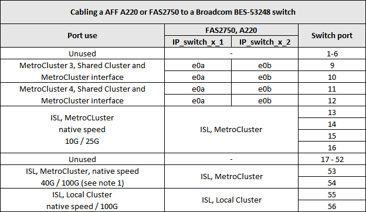

= Plattformportzuweisungen für Broadcom unterstützte BES-53248 IP-Switches
:allow-uri-read: 
:icons: font
:imagesdir: ../media/

[role="lead"]
Die Portnutzung in einer MetroCluster IP-Konfiguration hängt vom Switch-Modell und dem Plattformtyp ab.

Die Switches können nicht mit Remote-ISL-Ports mit unterschiedlichen Geschwindigkeiten verwendet werden (z. B. ein 25-Gbit/s-Port, der mit einem 10-Gbit/s-ISL-Port verbunden ist).

.Hinweise für die folgenden Tabellen:
. Für einige Plattformen können Sie die Ports 49 - 54 für MetroCluster-ISLs oder MetroCluster-Schnittstellenverbindungen verwenden.
+
Für diese Ports ist eine zusätzliche Lizenz erforderlich.

. Mit dem Switch kann nur eine einzelne MetroCluster mit vier Nodes über A320-Systeme verbunden werden.
+
Funktionen, für die ein geswitchter Cluster erforderlich ist, werden in dieser Konfiguration nicht unterstützt, einschließlich Verfahren zur Umstellung von MetroCluster FC auf IP und zur Technologieaktualisierung.

. Bei AFF A320 Systemen, die mit Broadcom BES-53248-Switches konfiguriert sind, werden möglicherweise nicht alle Funktionen unterstützt.
+
Jede Konfiguration oder Funktion, die erfordert, dass die lokalen Cluster-Verbindungen mit einem Switch verbunden sind, wird nicht unterstützt. Beispielsweise werden die folgenden Konfigurationen und Verfahren nicht unterstützt:

+
** MetroCluster Konfigurationen mit acht Nodes
** Der Wechsel von MetroCluster FC- zu MetroCluster IP-Konfigurationen
** Aktualisieren einer MetroCluster IP-Konfiguration mit vier Nodes (ONTAP 9.8 und höher)

. Wenn Sie zwei MetroCluster-Konfigurationen miteinander verbinden und beide den gleichen Controller-Typ verwenden, müssen Sie MetroCluster-Port-Gruppen 3 und 4 verwenden. Wenn die Controller voneinander abweichen, müssen Sie entweder MetroCluster-Port-Gruppen 3 und 4 für einen Typ und MetroCluster-Port-Gruppen 1 und 2 für den anderen verwenden.
+
** Beispiel, wenn Sie eine Verbindung herstellen:
+
*** Zwei MetroCluster-Konfigurationen, die nur FAS2750/AFF A220 oder nur FAS500f/AFF A250 umfassen, müssen die MetroCluster-Port-Gruppen 3 und 4 ausgewählt werden.
*** Zwei MetroCluster-Konfigurationen, bei denen eine MetroCluster FAS2750/AFF A220 und FAS500f/AFF A250 ist, müssen die Portgruppen 3 und 4 für eine Konfiguration und die Portgruppen 1 und 2 für die andere ausgewählt werden. Im https://mysupport.netapp.com/site/tools/tool-eula/rcffilegenerator["RCfFileGenerator für MetroCluster-IP"], Dropdown-Felder 1 und 2 nur mit der unterstützten Plattform füllen, nachdem Sie Plattformen in den Dropdown-Feldern 3 und 4 ausgewählt haben. Siehe link:../install-ip/using_rcf_generator.html["Verwenden der Porttabellen mit dem RcfFileGenerator-Tool oder mehreren MetroCluster-Konfigurationen"] Weitere Informationen zur Verwendung der Porttabellen finden Sie unter.

== Verwendung von Switch-Ports für AFF A220 oder FAS2750 Systeme

== Verwendung der Switch-Ports für AFF A250 oder FAS500f-Systeme

image::../media/mcc_ip_cabling_a_aff_a250_or_fas500f_to_a_broadcom_bes_53248_switch.png[mcc ip-Verkabelung A AFF a250 oder fas500f zu einem broadcom bes 53248-Switch]

== Verwendung von Switch-Ports für die kombinierte Verwendung von AFF A250 oder FAS500f- und AFF A220- oder FAS2750-Systemen

image::../media/mcc_ip_cabling_aff_a250_and_ a220_to_a_broadcom_bes_53248_switch.png[mcc ip-Verkabelung AFF a250 und a220 mit einem broadcom bes 53248 Switch]

== Verwendung von Switch-Ports für AFF A300 oder FAS8200 Systeme

image::../media/mcc_ip_cabling_a_aff_a300_or_fas8200_to_a_broadcom_bes_53248_switch.png[mcc ip-Verkabelung einer AFF a300 oder fas8200 mit einem broadcom bes 53248-Switch]

image::../media/mcc_ip_cabling_a_aff_a320_to_a_broadcom_bes_53248_switch.png[mcc ip-Verkabelung, AFF a320 und broadcom bes 53248-Switch]

== Switch-Port-Verwendung für AFF A400-, FAS8300- oder FAS8700-Systeme

image::../media/mcc_ip_cabling_a_fas8300_a400_or_fas8700_to_a_broadcom_bes_53248_switch.png[mcc ip-Verkabelung, fas8300 a400 oder fas8700, zu einem broadcom bes 53248-Switch]
