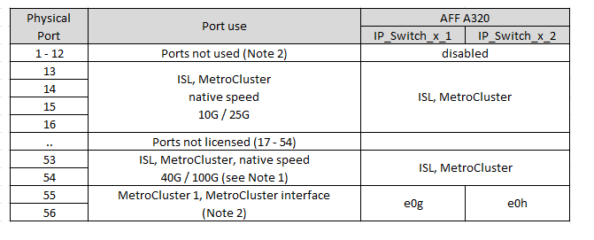

= Plattformportzuweisungen für Broadcom unterstützte BES-53248 IP-Switches
:allow-uri-read: 
:icons: font
:imagesdir: ../media/

[role="lead"]
Die Portnutzung in einer MetroCluster IP-Konfiguration hängt vom Switch-Modell und dem Plattformtyp ab.

Die Switches können nicht mit Remote-ISL-Ports mit unterschiedlichen Geschwindigkeiten verwendet werden (z. B. ein 25-Gbit/s-Port, der mit einem 10-Gbit/s-ISL-Port verbunden ist).

.Überprüfen Sie diese Informationen, bevor Sie die Tabellen verwenden:
* Wenn Sie den Switch für den Übergang von MetroCluster FC zu IP konfigurieren, werden die folgenden Ports je nach gewählter Zielplattform verwendet:
+
[cols="75,25"]
|===
| Zielplattform | Port 

| FAS500f, AFF C250, ASA C250, AFF A250, ASA A250, FAS8300, AFF C400, ASA C400, AFF A400, ASA A400 oder FAS8700 Plattformen eingesetzt | Ports 1 bis 6, 10 Gbit/s 

| FAS8200 oder AFF A300 Plattformen | Ports 3 - 4 und 9 - 12, 10 Gbit/s 
|===
* Bei AFF A320 Systemen, die mit Broadcom BES-53248-Switches konfiguriert sind, werden möglicherweise nicht alle Funktionen unterstützt.
+
Jede Konfiguration oder Funktion, die erfordert, dass die lokalen Cluster-Verbindungen mit einem Switch verbunden sind, wird nicht unterstützt. Beispielsweise werden die folgenden Konfigurationen und Verfahren nicht unterstützt:

+
** MetroCluster Konfigurationen mit acht Nodes
** Der Wechsel von MetroCluster FC- zu MetroCluster IP-Konfigurationen
** Aktualisieren einer MetroCluster IP-Konfiguration mit vier Nodes (ONTAP 9.8 und höher)

.Hinweise, auf die in den Tabellen verwiesen wird:
* *Hinweis 1*: Die Verwendung dieser Ports erfordert eine zusätzliche Lizenz.
* *Hinweis 2*: Nur ein MetroCluster mit vier Knoten kann mit AFF A320 Systemen an den Switch angeschlossen werden.
+
Funktionen, die einen Switch-Cluster erfordern, werden in dieser Konfiguration nicht unterstützt, einschließlich der Verfahren zur Umstellung von MetroCluster FC auf IP und zur Technologieaktualisierung.

* *Hinweis 3*: Der BES-53248 Switch erfordert, dass alle Ports in einer Gruppe mit vier Ports mit der gleichen Geschwindigkeit arbeiten. Zur Verbindung verschiedener Plattformen wie AFF 150, ASA A150, FAS2750, AFF A220 und FAS500f, AFF C250, ASA C250, AFF A250 und ASA A250 müssen Switch Ports in separaten Gruppen mit vier Ports verwendet werden. Wenn Sie diese Art von Konfiguration benötigen, gilt Folgendes:
+
** Im https://mysupport.netapp.com/site/tools/tool-eula/rcffilegenerator["RCfFileGenerator für MetroCluster-IP"], Drop-down-Felder für "MetroCluster 1" und "MetroCluster 2" werden erst ausgefüllt, wenn Sie eine Plattform für MetroCluster 3 oder "MetroCluster 4" auswählen.  Siehe link:../install-ip/using_rcf_generator.html["Verwenden der Porttabellen mit dem RcfFileGenerator-Tool oder mehreren MetroCluster-Konfigurationen"] Weitere Informationen zur Verwendung der Porttabellen finden Sie unter.
** Wenn beide MetroCluster-Konfigurationen dieselbe Plattform verwenden, empfiehlt NetApp, die Gruppe „MetroCluster 3“ für eine Konfiguration und die Gruppe „MetroCluster 4“ für die andere Konfiguration auszuwählen. Wenn die Plattformen unterschiedlich sind, müssen Sie für die erste Konfiguration „MetroCluster 3“ oder „MetroCluster 4“ auswählen und für die zweite Konfiguration „MetroCluster 1“ oder „MetroCluster 2“ auswählen.

== Verkabelung von AFF A150, ASA A150, FAS2750, AFF A220, FAS500f AFF C250, ASA C250, AFF A250 oder ASA A250 auf einen Broadcom BES-53248-Switch

image::../media/mcc_ip_cabling_a_aff_asa_a150_a220_c250_a250_fas2750_to_a_broadcom_bes_53248_switch.png[mcc-ip-Verkabelung eines AFF ASA a150 a220 c250 a250 fas2750 zu einem broadcom Bes 53248-Switch]

== Verkabelung eines Systems der FAS8200, AFF A300 oder AFF A320 mit einem Broadcom BES-53248-Switch

image::../media/mcc_ip_cabling_a_aff_a300_or_fas8200_to_a_broadcom_bes_53248_switch.png[mcc ip-Verkabelung einer AFF a300 oder fas8200 mit einem broadcom bes 53248-Switch]

== Verkabelung eines FAS8300, AFF C400, ASA C400, AFF A400, ASA A400 oder FAS8700 Systems mit einem Broadcom BES-53248 Switch

image::../media/mcc_ip_cabling_a_fas8300_a400_c400_or_fas8700_to_a_broadcom_bes_53248_switch.png[mcc ip-Verkabelung eines fas8300 a400 c400 oder fas8700 zu einem broadcom bes 53248-Switch]
