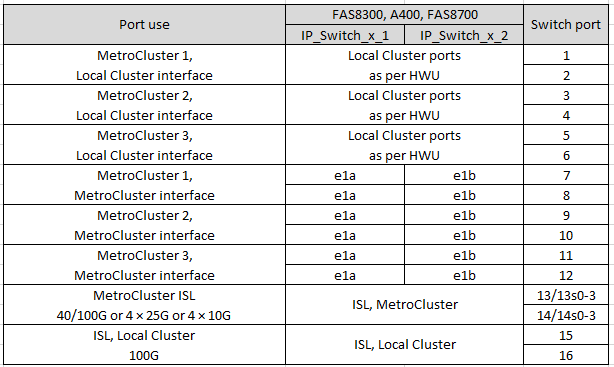

= Plattform-Port-Zuweisungen für von NVIDIA unterstützte SN2100 IP-Switches
:allow-uri-read: 
:icons: font
:imagesdir: ../media/

[role="lead"]
Die Portnutzung in einer MetroCluster IP-Konfiguration hängt vom Switch-Modell und dem Plattformtyp ab.

== Unterstützte Konfigurationen

Folgende Plattformen werden aktuell unterstützt:

* FAS500f/AFF A250
* FAS8300/AFF A400
* FAS8700
* FAS9000/AFF A700
* AFF A800

Die folgenden Plattformen und Konfigurationen werden derzeit nicht unterstützt:

* MetroCluster FC-to-IP-Transition
* MetroCluster Konfiguration mit acht Nodes

.Lesen Sie diese Überlegungen durch, bevor Sie die Konfigurationstabellen verwenden
Wenn Sie mehrere MetroCluster-Konfigurationen verkabeln, folgen Sie dann der entsprechenden Tabelle. Beispiel:

* Wenn Sie zwei MetroCluster Konfigurationen mit vier Nodes des Typs AFF A700 verkabeln, verbinden Sie dann die erste MetroCluster mit dem Namen „MetroCluster 1“ und die zweite MetroCluster (MetroCluster 2) in der Tabelle „AFF A700“.

NOTE: Die Ports 13 und 14 können im nativen Geschwindigkeitsmodus mit Unterstützung von 40 Gbit/s und 100 Gbit/s oder im Breakout-Modus zur Unterstützung von 4 × 25 Gbit/s oder 4 × 10 Gbit/s verwendet werden. Wenn sie den nativen Geschwindigkeitsmodus verwenden, werden sie als Port 13 und 14 dargestellt. Wenn sie Breakout-Modus verwenden, entweder 4 × 25 Gbps oder 4 × 10 Gbps, dann werden sie als 13s0-3 und 14s0-3 dargestellt.

In den folgenden Abschnitten wird die Beschreibung der physischen Verkabelung beschrieben. Sie können auch auf die verweisen https://mysupport.netapp.com/site/tools/tool-eula/rcffilegenerator["RCfFileGenerator"] Für detaillierte Informationen zur Verkabelung.

== Verwendung der Switch-Ports für AFF A250 oder FAS500f-Systeme

image::../media/mcc_ip_cabling_A250_MSN2100.png[mcc ip-Verkabelung A250 MSN2100]

== Switch-Port-Verwendung für AFF A400-, FAS8300- oder FAS8700-Systeme

== Verwendung des Switch-Ports für AFF A700 oder FAS9000

image::../media/mcc_ip_cabling_A700_MSN2100.png[mcc ip-Verkabelung A700 MSN2100]

== Verwendung von Switch-Ports für AFF A800

image::../media/mcc_ip_cabling_A800_MSN2100.png[mcc ip-Verkabelung A800 MSN2100]
