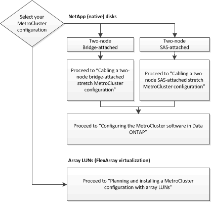

= Auswahl des richtigen Installationsverfahrens für Ihre Konfiguration
:allow-uri-read: 
:icons: font
:imagesdir: ../media/

[role="lead"]
Sie müssen die korrekte Installation basierend darauf auswählen, ob Sie FlexArray LUNs verwenden und wie die Storage-Controller mit Storage-Shelfs verbinden.

|===

| Für diesen Installationstyp... | Verwenden Sie diese Verfahren... 

 a| 
Stretch-Konfiguration mit zwei Nodes und FC-zu-SAS-Bridges
 a| 
. link:task_configure_the_mcc_hardware_components_2_node_stretch_atto.html["Verkabelung einer Stretch MetroCluster Konfiguration mit zwei über Bridge angebundenen Nodes"]
. link:concept_configuring_the_mcc_software_in_ontap.html["Konfigurieren der MetroCluster-Software in ONTAP"]

 a| 
Stretch-Konfiguration mit zwei Nodes und Direct-Attached SAS-Verkabelung
 a| 
. link:task_configure_the_mcc_hardware_components_2_node_stretch_sas.html["Verkabelung einer Stretch MetroCluster Konfiguration mit zwei Nodes über SAS"]
. link:concept_configuring_the_mcc_software_in_ontap.html["Konfigurieren der MetroCluster-Software in ONTAP"]

 a| 
Installation mit Array LUNs
 a| 
link:concept_stretch_mcc_configuration_with_array_luns.html["Verbindungen in Stretch-MetroCluster-Konfigurationen mit Array-LUNs"]

|===