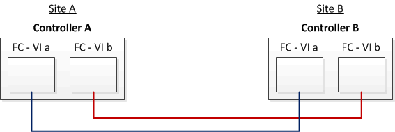

= Beispiel einer Stretch-MetroCluster-Konfiguration mit Array-LUNs
:allow-uri-read: 
:icons: font
:imagesdir: ../media/

[role="lead"]
Bei einer Stretch-MetroCluster-Konfiguration mit Array-LUNs müssen Sie die FC-VI-Ports verkabeln, um die direkte Verbindung zwischen den Controllern zu erreichen. Darüber hinaus müssen Sie jeden Controller-HBA-Port verkabeln, um Switch-Ports auf den entsprechenden FC-Switches zu Switch. Die Verkabelung zu den Array-LUNs erfolgt wie bei einem Fabric-Attached MetroCluster, mit Ausnahme von Array-LUNs der E-Serie, die direkt verbunden werden können.

Die folgende Abbildung zeigt die FC-VI-Ports, die in einer Stretch-MetroCluster-Konfiguration über die Controller A und B hinweg verkabelt sind:

NOTE: Die FAS9000 Storage-Systeme Controller-Module verwenden jeweils vier FC-VI-Ports.

Bei Konfigurationen mit E-Series Array LUNs können Sie die E-Series LUNs direkt anschließen.

https://["Direct Attach-Support für Stretch-MetroCluster-Konfiguration mit NetApp E-Series Arrays"]

Mit Ausnahme der Verbindung der FC-VI-Ports werden während des weiteren Verfahrens eine MetroCluster-Konfiguration mit den Array-LUNs eingerichtet, die keine LUNs der E-Series verwenden. Dazu müssen FC Switches verwendet werden, die mit den Array-LUNs in Fabric-Attached-Konfigurationen identisch sind.

https://["Installation und Konfiguration von Fabric-Attached MetroCluster"]
