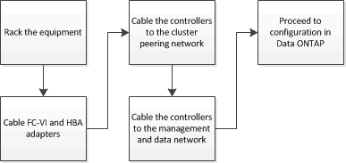

= Verkabelung einer Stretch MetroCluster Konfiguration mit zwei Nodes über SAS
:allow-uri-read: 
:icons: font
:imagesdir: ../media/

[role="lead"]
Die MetroCluster Komponenten müssen an beiden geografischen Standorten physisch installiert, verkabelt und konfiguriert sein. Die Schritte unterscheiden sich für ein System mit nativen Festplatten-Shelfs im Gegensatz zu einem System mit Array-LUNs.

