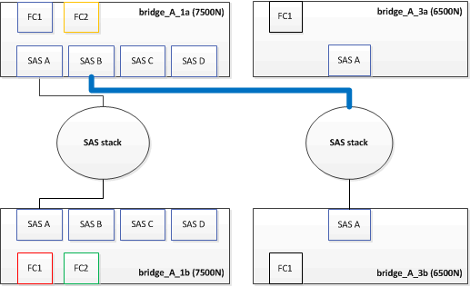

= Austausch von zwei FibreBridge 6500N-Brücken durch 7600N- oder 7500N-Brücken
:allow-uri-read: 
:icons: font
:imagesdir: ../media/

[role="lead"]
Um die zusätzlichen FC2-Anschlüsse der FibreBridge 7600N oder 7500N-Brücken zu nutzen und die Rack-Auslastung zu verringern, können Sie 6500N-Brücken unterbrechungsfrei ersetzen und bis zu vier Speicher-Stacks hinter einem einzigen FibreBridge 7600N- oder 7500N-Paar konsolidieren.

.Bevor Sie beginnen
Sie benötigen das Admin-Passwort und den Zugriff auf einen FTP- oder SCP-Server.

.Über diese Aufgabe
Sie sollten dieses Verfahren verwenden, wenn:

* Sie ersetzen ein Paar FibreBridge 6500N-Brücken durch FibreBridge 7600N oder 7500N-Brücken.
+
Nach dem Austausch müssen beide Brücken im Paar das gleiche Modell sein.

* Sie haben zuvor eine einzelne FibreBridge 6500N durch eine 7600N- oder 7500N-Brücke ersetzt und ersetzen nun die zweite Brücke im Paar.
* Sie verfügen über zwei Bridges aus FibreBridge 7600N oder 7500N mit verfügbaren SAS-Ports und Sie konsolidieren SAS-Storage-Stacks, die derzeit über FibreBridge 6500N-Brücken verbunden sind.

Dieser Vorgang läuft unterbrechungsfrei ab und dauert ungefähr zwei Stunden.

.Verwandte Informationen
link:task_replace_a_sle_fc_to_sas_bridge.html["Austauschen einer einzelnen FC-to-SAS-Bridge"]

== Überprüfung der Storage-Konnektivität

Vor dem Austausch von Brücken sollten Sie die Verbindung zu Bridge und Storage überprüfen. Wenn Sie sich die Befehlsausgabe vertraut machen, können Sie die Konnektivität nach Konfigurationsänderungen nachträglich überprüfen.

Sie können diese Befehle von der Admin-Eingabeaufforderung eines der Controller-Module in der MetroCluster-Konfiguration am Standort, der gewartet wird, ausgeben.

. Überprüfen Sie die Verbindung zu den Festplatten, indem Sie auf einem der MetroCluster-Knoten den folgenden Befehl eingeben:
+
`run local sysconfig -v`

+
In der Ausgabe werden die mit den Initiator-Ports des Controllers verbundenen Festplatten angezeigt und die mit den FC-to-SAS-Bridges verbundenen Shelfs werden angezeigt:

+
[listing]
----

node_A_1> run local sysconfig -v
NetApp Release 9.3.2X18: Sun Dec 13 01:23:24 PST 2017
System ID: 4068741258 (node_A_1); partner ID: 4068741260 (node_B_1)
System Serial Number: 940001025471 (node_A_1)
System Rev: 70
System Storage Configuration: Multi-Path HA**<=== Configuration should be multi-path HA**
.
.
.
slot 0: FC Host Adapter 0g (QLogic 8324 rev. 2, N-port, <UP>)**<=== Initiator port**
		Firmware rev:      7.5.0
		Flash rev:         0.0.0
		Host Port Id:      0x60130
		FC Node Name:      5:00a:098201:bae312
		FC Port Name:      5:00a:098201:bae312
		SFP Vendor:        UTILITIES CORP.
		SFP Part Number:   FTLF8529P3BCVAN1
		SFP Serial Number: URQ0Q9R
		SFP Capabilities:  4, 8 or 16 Gbit
		Link Data Rate:    16 Gbit
		Switch Port:       brcd6505-fcs40:1
  **<List of disks visible to port\>**
		 ID     Vendor   Model            FW    Size
		brcd6505-fcs29:12.126L1527     : NETAPP   X302_HJUPI01TSSM NA04 847.5GB (1953525168 512B/sect)
		brcd6505-fcs29:12.126L1528     : NETAPP   X302_HJUPI01TSSA NA02 847.5GB (1953525168 512B/sect)
		.
		.
		.
		**<List of FC-to-SAS bridges visible to port\>**
		FC-to-SAS Bridge:
		brcd6505-fcs40:12.126L0        : ATTO     FibreBridge6500N 1.61  FB6500N102980
		brcd6505-fcs42:13.126L0        : ATTO     FibreBridge6500N 1.61  FB6500N102980
		brcd6505-fcs42:6.126L0         : ATTO     FibreBridge6500N 1.61  FB6500N101167
		brcd6505-fcs42:7.126L0         : ATTO     FibreBridge6500N 1.61  FB6500N102974
		.
		.
		.
  **<List of storage shelves visible to port\>**
		brcd6505-fcs40:12.shelf6: DS4243  Firmware rev. IOM3 A: 0200  IOM3 B: 0200
		brcd6505-fcs40:12.shelf8: DS4243  Firmware rev. IOM3 A: 0200  IOM3 B: 0200
		.
		.
		.
----

== Hot-Swap FibreBridge 6500N-Brücken, um ein Paar FibreBridge 7600N oder 7500N-Brücken zu bilden

Um eine oder zwei FibreBridge 6500N Hot-Swap durchzuführen, um eine Konfiguration mit zwei FibreBridge 7600N oder 7500N Brücken zu erstellen, müssen Sie die Brücken nacheinander austauschen und den korrekten Kabelvorgang befolgen. Die neue Verkabelung unterscheidet sich von der ursprünglichen Verkabelung.

.Über diese Aufgabe
Sie können dieses Verfahren auch verwenden, wenn die folgenden Bedingungen erfüllt sind:

* Sie ersetzen ein Paar FibreBridge 6500N-Brücken, die beide mit demselben SAS-Speicher verbunden sind.
* Sie haben zuvor eine FibreBridge 6500N-Brücke im Paar ersetzt, und Ihr Speicherstapel ist mit einer FibreBridge 6500N-Brücke und einer FibreBridge 7600N oder 7500N-Brücke konfiguriert.
+
In diesem Fall sollten Sie mit dem folgenden Schritt beginnen, um die untere FibreBridge 6500N-Brücke mit einer FibreBridge 7600N oder 7500N Hot-Swap zu starten.

Das folgende Diagramm zeigt ein Beispiel für die Erstkonfiguration, in der vier FibreBridge 6500N-Brücken zwei SAS-Storage-Stacks verbinden:

image::../media/consolidating_stacks_before.gif[Konsolidierung von Stacks vor dem Austausch von FibreBridge]

.Schritte
. Gemäß den folgenden Richtlinien tauschen Sie die obere FibreBridge 6500N Bridge unter Verwendung des Verfahrens in mit einer FibreBridge 7600N oder 7500N aus link:task_replace_a_sle_fc_to_sas_bridge.html#hot_swap_6500n["Hot-Swap einer FibreBridge 6500N-Bridge mit FibreBridge 7600N oder 7500N-Brücke"]:
+
** Verbinden Sie den Anschluss FibreBridge 7600N oder 7500N Bridge FC1 mit dem Switch oder Controller.
+
Dies ist die gleiche Verbindung, die zum Anschluss FibreBridge 6500N Bridge FC1 hergestellt wurde.

** Schließen Sie den Anschluss FibreBridge 7600N oder 7500N Bridge FC2 derzeit nicht an. Das folgende Diagramm zeigt, dass Bridge_A_1a ersetzt wurde und nun eine FibreBridge 7600N oder 7500N-Brücke ist:

+
image::../media/consolidating_stacks_1st_7500n_in_place.gif[Konsolidierung von Stacks mit der ersten installierten FibreBridge 7500N]

. Überprüfen Sie die Verbindung zu den mit der Bridge verbundenen Festplatten und die Tatsache, dass die neue FibreBridge 7500N in der Konfiguration sichtbar ist:
+
`run local sysconfig -v`

+
[listing]
----

node_A_1> run local sysconfig -v
NetApp Release 9.3.2X18: Sun Dec 13 01:23:24 PST 2015
System ID: 0536872165 (node_A_1); partner ID: 0536872141 (node_B_1)
System Serial Number: 940001025465 (node_A_1)
System Rev: 70
System Storage Configuration: Multi-Path HA**<=== Configuration should be multi-path HA**
.
.
.
slot 0: FC Host Adapter 0g (QLogic 8324 rev. 2, N-port, <UP>)**<=== Initiator port**
		Firmware rev:      7.5.0
		Flash rev:         0.0.0
		Host Port Id:      0x60100
		FC Node Name:      5:00a:098201:bae312
		FC Port Name:      5:00a:098201:bae312
		SFP Vendor:        FINISAR CORP.
		SFP Part Number:   FTLF8529P3BCVAN1
		SFP Serial Number: URQ0R1R
		SFP Capabilities:  4, 8 or 16 Gbit
		Link Data Rate:    16 Gbit
		Switch Port:       brcd6505-fcs40:1
  **<List of disks visible to port\>**
		 ID     Vendor   Model            FW    Size
		brcd6505-fcs40:12.126L1527     : NETAPP   X302_HJUPI01TSSM NA04 847.5GB (1953525168 512B/sect)
		brcd6505-fcs40:12.126L1528     : NETAPP   X302_HJUPI01TSSA NA02 847.5GB (1953525168 512B/sect)
		.
		.
		.
		**<List of FC-to-SAS bridges visible to port\>**
		FC-to-SAS Bridge:
		brcd6505-fcs40:12.126L0        : ATTO     FibreBridge7500N A30H  FB7500N100104**<===**
		brcd6505-fcs42:13.126L0        : ATTO     FibreBridge6500N 1.61  FB6500N102980
		brcd6505-fcs42:6.126L0         : ATTO     FibreBridge6500N 1.61  FB6500N101167
		brcd6505-fcs42:7.126L0         : ATTO     FibreBridge6500N 1.61  FB6500N102974
		.
		.
		.
  **<List of storage shelves visible to port\>**
		brcd6505-fcs40:12.shelf6: DS4243  Firmware rev. IOM3 A: 0200  IOM3 B: 0200
		brcd6505-fcs40:12.shelf8: DS4243  Firmware rev. IOM3 A: 0200  IOM3 B: 0200
		.
		.
		.
----
. Gemäß den folgenden Richtlinien tauschen Sie die untere FibreBridge 6500N-Brücke mit einer FibreBridge 7600N oder 7500N unter Verwendung des Verfahrens in im laufenden Betrieb aus link:task_replace_a_sle_fc_to_sas_bridge.html#hot_swap_6500n["Hot-Swap einer FibreBridge 6500N-Bridge mit FibreBridge 7600N oder 7500N-Brücke"]:
+
** Verbinden Sie den Anschluss FibreBridge 7600N oder 7500N Bridge FC2 mit dem Switch oder Controller.
+
Dies ist die gleiche Verbindung, die zum Anschluss FibreBridge 6500N Bridge FC1 hergestellt wurde.

** Schließen Sie den FC1-Port der FibreBridge 7600N oder 7500N Bridge zu diesem Zeitpunkt nicht an.image:../media/consolidating_stacks_2nd_7500n_in_place.gif["Konsolidierung von Stapeln mit einer zweiten FibreBridge 7500N"]

. Überprüfen Sie die Verbindung zu den mit der Bridge verbundenen Festplatten:
+
`run local sysconfig -v`

+
In der Ausgabe werden die mit den Initiator-Ports des Controllers verbundenen Festplatten angezeigt und die mit den FC-to-SAS-Bridges verbundenen Shelfs werden angezeigt:

+
[listing]
----

node_A_1> run local sysconfig -v
NetApp Release 9.3.2X18: Sun Dec 13 01:23:24 PST 2015
System ID: 0536872165 (node_A_1); partner ID: 0536872141 (node_B_1)
System Serial Number: 940001025465 (node_A_1)
System Rev: 70
System Storage Configuration: Multi-Path HA**<=== Configuration should be multi-path HA**
.
.
.
slot 0: FC Host Adapter 0g (QLogic 8324 rev. 2, N-port, <UP>)**<=== Initiator port**
		Firmware rev:      7.5.0
		Flash rev:         0.0.0
		Host Port Id:      0x60100
		FC Node Name:      5:00a:098201:bae312
		FC Port Name:      5:00a:098201:bae312
		SFP Vendor:        FINISAR CORP.
		SFP Part Number:   FTLF8529P3BCVAN1
		SFP Serial Number: URQ0R1R
		SFP Capabilities:  4, 8 or 16 Gbit
		Link Data Rate:    16 Gbit
		Switch Port:       brcd6505-fcs40:1
  **<List of disks visible to port\>**
		 ID     Vendor   Model            FW    Size
		brcd6505-fcs40:12.126L1527     : NETAPP   X302_HJUPI01TSSM NA04 847.5GB (1953525168 512B/sect)
		brcd6505-fcs40:12.126L1528     : NETAPP   X302_HJUPI01TSSA NA02 847.5GB (1953525168 512B/sect)
		.
		.
		.
		**<List of FC-to-SAS bridges visible to port\>**
		FC-to-SAS Bridge:
		brcd6505-fcs40:12.126L0        : ATTO     FibreBridge7500N A30H  FB7500N100104
		brcd6505-fcs42:13.126L0        : ATTO     FibreBridge7500N A30H  FB7500N100104
		.
		.
		.
  **<List of storage shelves visible to port\>**
		brcd6505-fcs40:12.shelf6: DS4243  Firmware rev. IOM3 A: 0200  IOM3 B: 0200
		brcd6505-fcs40:12.shelf8: DS4243  Firmware rev. IOM3 A: 0200  IOM3 B: 0200
		.
		.
		.
----

== Verkabelung der Bridge-SAS-Ports bei Storage-Konsolidierung hinter FibreBridge 7600N- oder 7500N-Bridges

Wenn Sie mehrere SAS Storage Stacks hinter einem einzigen FibreBridge 7600N- oder 7500N-Paar mit verfügbaren SAS-Ports konsolidieren, müssen Sie die oberen und unteren SAS-Kabel auf die neuen Brücken bringen.

.Über diese Aufgabe
Die FibreBridge 6500N Bridge SAS-Ports verwenden QSFP-Anschlüsse. Die SAS-Ports FibreBridge 7600N oder 7500N verwenden Mini-SAS-Anschlüsse.

IMPORTANT: Wenn Sie ein SAS-Kabel in den falschen Port stecken, müssen Sie das Kabel von einem SAS-Port entfernen und mindestens 120 Sekunden warten, bevor Sie das Kabel an einen anderen SAS-Port anschließen. Wenn Sie dies nicht tun, erkennt das System nicht, dass das Kabel auf einen anderen Port verschoben wurde.

NOTE: Warten Sie mindestens 10 Sekunden, bevor Sie den Anschluss anschließen. Die SAS-Kabelanschlüsse sind codiert. Wenn sie sich korrekt in einen SAS-Port orientieren, klicken sie auf ihren Platz und die Festplatten-Shelf-SAS-Port LNK-LED leuchtet grün. Bei Festplatten-Shelfs stecken Sie einen SAS-Kabelanschluss mit nach unten (auf der Unterseite des Connectors) gerichteter Zuglasche.

.Schritte
. Entfernen Sie das Kabel, das den SAS A-Port der oberen FibreBridge 6500N-Bridge mit dem oberen SAS-Shelf verbindet. Achten Sie darauf, den SAS-Port am Storage-Shelf zu notieren, mit dem er verbunden ist.
+
Das Kabel wird im folgenden Beispiel blau angezeigt:

+
image::../media/consolidating_stacks_sas_top_before.gif[Konsolidierung von SAS-Stacks vor der Verkabelung mit FibreBridge 7500N]

. Verbinden Sie mithilfe eines Kabels mit einem Mini-SAS-Anschluss denselben SAS-Port am Storage Shelf mit dem SAS B-Port der oberen FibreBridge 7600N oder 7500N-Brücke.
+
Das Kabel wird im folgenden Beispiel blau angezeigt:

+

. Entfernen Sie das Kabel, das den SAS A-Port der unteren FibreBridge 6500N-Bridge mit dem oberen SAS-Shelf verbindet. Achten Sie darauf, den SAS-Port am Storage-Shelf zu notieren, mit dem er verbunden ist.
+
Das Kabel wird im folgenden Beispiel grün angezeigt:

+
image::../media/consolidating_stacks_sas_bottom_before.gif[Grüne SAS-Verkabelung vor der Konsolidierung im unteren Regal]

. Verbinden Sie mithilfe eines Kabels mit einem Mini-SAS-Anschluss denselben SAS-Port am Storage Shelf mit dem SAS B-Port der unteren FibreBridge 7600N oder 7500N-Brücke.
+
Das Kabel wird im folgenden Beispiel grün angezeigt:

+
image::../media/consolidating_stacks_sas_bottom_after.gif[SAS-Unterverkabelung nach der Konsolidierung]

. Überprüfen Sie die Verbindung zu den mit der Bridge verbundenen Festplatten:
+
`run local sysconfig -v`

+
In der Ausgabe werden die mit den Initiator-Ports des Controllers verbundenen Festplatten angezeigt und die mit den FC-to-SAS-Bridges verbundenen Shelfs werden angezeigt:

+
[listing]
----

node_A_1> run local sysconfig -v
NetApp Release 9.3.2X18: Sun Dec 13 01:23:24 PST 2015
System ID: 0536872165 (node_A_1); partner ID: 0536872141 (node_B_1)
System Serial Number: 940001025465 (node_A_1)
System Rev: 70
System Storage Configuration: Multi-Path HA**<=== Configuration should be multi-path HA**
.
.
.
slot 0: FC Host Adapter 0g (QLogic 8324 rev. 2, N-port, <UP>)**<=== Initiator port**
		Firmware rev:      7.5.0
		Flash rev:         0.0.0
		Host Port Id:      0x60100
		FC Node Name:      5:00a:098201:bae312
		FC Port Name:      5:00a:098201:bae312
		SFP Vendor:        FINISAR CORP.
		SFP Part Number:   FTLF8529P3BCVAN1
		SFP Serial Number: URQ0R1R
		SFP Capabilities:  4, 8 or 16 Gbit
		Link Data Rate:    16 Gbit
		Switch Port:       brcd6505-fcs40:1
  **<List of disks visible to port\>**
		 ID     Vendor   Model            FW    Size
		brcd6505-fcs40:12.126L1527     : NETAPP   X302_HJUPI01TSSM NA04 847.5GB (1953525168 512B/sect)
		brcd6505-fcs40:12.126L1528     : NETAPP   X302_HJUPI01TSSA NA02 847.5GB (1953525168 512B/sect)
		.
		.
		.
		**<List of FC-to-SAS bridges visible to port\>**
		FC-to-SAS Bridge:
		brcd6505-fcs40:12.126L0        : ATTO     FibreBridge7500N A30H  FB7500N100104
		brcd6505-fcs42:13.126L0        : ATTO     FibreBridge7500N A30H  FB7500N100104
		.
		.
		.
  **<List of storage shelves visible to port\>**
		brcd6505-fcs40:12.shelf6: DS4243  Firmware rev. IOM3 A: 0200  IOM3 B: 0200
		brcd6505-fcs40:12.shelf8: DS4243  Firmware rev. IOM3 A: 0200  IOM3 B: 0200
		.
		.
		.
----
. Entfernen Sie die alten FibreBridge 6500N-Brücken, die nicht mehr mit dem SAS-Speicher verbunden sind.
. Warten Sie zwei Minuten, bis das System die Änderungen erkennt.
. Wenn das System nicht ordnungsgemäß verkabelt war, entfernen Sie das Kabel, korrigieren Sie die Verkabelung und schließen Sie dann das korrekte Kabel wieder an.
. Wiederholen Sie bei Bedarf die vorherigen Schritte, um bis zu zwei weitere SAS-Stacks hinter den neuen FibreBridge 7600N oder 7500N-Brücken zu bewegen, und zwar mit den SAS-Ports C und dann D.
+
Jeder SAS-Stack muss mit demselben SAS-Port an der oberen und unteren Brücke verbunden sein. Wenn zum Beispiel die obere Verbindung des Stacks mit dem oberen Bridge-SAS B-Port verbunden ist, muss die untere Verbindung mit dem SAS B-Port der unteren Brücke verbunden sein.

+
image::../media/consolidation_sas_bottom_connection_4_stacks.gif[SAS-Bodenverkabelung für vier Stapel]

== Zoning wird aktualisiert, wenn eine Konfiguration FibreBridge 7600N oder 7500N-Brücken hinzugefügt wird

Das Zoning muss geändert werden, wenn Sie FibreBridge 6500N-Bridges durch FibreBridge 7600N oder 7500N-Brücken ersetzen und beide FC-Ports auf den FibreBridge 7600N oder 7500N-Bridges verwenden. Die erforderlichen Änderungen hängen davon ab, ob Sie eine ONTAP-Version vor 9.1 oder 9.1 und höher ausführen.

=== Aktualisieren des Zoning beim Hinzufügen von FibreBridge 7500N-Bridges zu einer Konfiguration (vor ONTAP 9.1)

Das Zoning muss geändert werden, wenn Sie FibreBridge 6500N-Brücken durch FibreBridge 7500N-Brücken ersetzen und beide FC-Ports auf den FibreBridge 7500N verwenden. Jede Zone kann nicht mehr als vier Initiator-Ports enthalten. Das Zoning, das Sie verwenden, hängt davon ab, ob Sie ONTAP vor Version 9.1 oder 9.1 und höher ausführen

.Über diese Aufgabe
Das spezifische Zoning in dieser Aufgabe gilt für Versionen von ONTAP vor Version 9.1.

Die Änderungen beim Zoning sind erforderlich, um Probleme mit ONTAP zu vermeiden, die erfordern, dass nicht mehr als vier FC-Initiator-Ports einen Pfad zu einer Festplatte haben können. Nach Neuordnung zur Konsolidierung der Shelves würde das vorhandene Zoning dazu führen, dass jede Festplatte über acht FC-Ports erreichbar ist. Sie müssen das Zoning ändern, um die Initiator-Ports in jeder Zone auf vier zu reduzieren.

Das folgende Diagramm zeigt das Zoning vor den Änderungen an Site_A:

image::../media/zoning_consolidation_site_a_before.gif[Zonenkonsolidierung am Standort A vor FibreBridge-Änderungen]

.Schritte
. Aktualisieren Sie die Speicherzonen für die FC-Switches, indem Sie die Hälfte der Initiator-Ports aus jeder vorhandenen Zone entfernen und neue Zonen für die FibreBridge 7500N FC2-Ports erstellen.
+
Die Zonen für die neuen FC2-Ports enthalten die Initiator-Ports, die aus den vorhandenen Zonen entfernt wurden. In den Diagrammen werden diese Zonen mit gestrichelten Linien dargestellt.

+
Informationen zu den Zoning-Befehlen finden Sie in den FC-Switch-Abschnitten des link:../install-fc/index.html["Installation und Konfiguration von Fabric-Attached MetroCluster"] Oder link:../install-stretch/concept_considerations_differences.html["Installation und Konfiguration von Stretch MetroCluster"].

+
Die folgenden Beispiele zeigen die Storage-Zonen und die Ports in jeder Zone vor und nach der Konsolidierung. Die Ports werden durch _Domain, Port_-Paare identifiziert.

+
** Domäne 5 besteht aus Switch FC_Switch_A_1.
** Domäne 6 besteht aus Switch FC_Switch_A_2.
** Domäne 7 besteht aus Switch FC_Switch_B_1.
** Domäne 8 besteht aus Switch FC_Switch_B_2.

|===

| Vor oder nach der Konsolidierung | Zone | Domänen und Ports | Farben in Diagrammen (die Diagramme zeigen nur Standort A an) 

 a| 
Zonen vor der Konsolidierung. An den vier FibreBridge 6500N-Brücken gibt es für jeden FC-Port eine Zone.
 a| 
STOR_A_1A-FC1
 a| 
5,1; 5,2; 5,4; 5,5; 7,1; 7,2; 7,4; 7,5; 5,6
 a| 
Lila + gestrichelt lila + blau

 a| 
STOR_A_1B-FC1
 a| 
6,1; 6,2; 6,4; 6,5; 8,1; 8,2; 8,4; 8,5; 6,6
 a| 
Braun + gestrichelt braun + grün

 a| 
STOR_A_2A-FC1
 a| 
5,1; 5,2; 5,4; 5,5; 7,1; 7,2; 7,4; 7,5; 5,7
 a| 
Violett + gestrichelt lila + rot

 a| 
STOR_A_2B-FC1
 a| 
6,1; 6,2; 6,4; 6,5; 8,1; 8,2; 8,4; 8,5; 6,7
 a| 
Braun + gestrichelt braun + orange

 a| 
Zonen nach der Konsolidierung. An den beiden FibreBridge 7500N-Brücken gibt es eine Zone für jeden FC-Port.
 a| 
STOR_A_1A-FC1
 a| 
7,1; 7,4; 5,1; 5,4; 5,6
 a| 
Violett + blau

 a| 
STOR_A_1B-FC1
 a| 
7,2; 7,5; 5,2; 5,5; 5,7
 a| 
Violett + rot gestrichelt

 a| 
STOR_A_1A-FC2
 a| 
8,1; 8,4; 6,1; 6,4; 6,6
 a| 
Braun + grün

 a| 
STOR_A_1B-FC2
 a| 
8,2; 8,5; 6,2; 6,5; 6,7
 a| 
Gestrichelt braun + orange

|===
Das folgende Diagramm zeigt das Zoning von Site_A nach der Konsolidierung:

image::../media/zoning_consolidation_site_a_after.gif[Zonenkonsolidierung am Standort A nach FibreBridge-Änderungen]

=== Aktualisieren des Zoning beim Hinzufügen von FibreBridge 7600N oder 7500N-Bridges zu einer Konfiguration (ONTAP 9.1 und höher)

Das Zoning muss geändert werden, wenn Sie FibreBridge 6500N-Bridges durch FibreBridge 7600N oder 7500N-Brücken ersetzen und beide FC-Ports auf den FibreBridge 7600N oder 7500N-Bridges verwenden. Jede Zone kann nicht mehr als vier Initiator-Ports enthalten.

.Über diese Aufgabe
* Diese Aufgabe gilt für ONTAP 9.1 und höher.
* FibreBridge 7600N-Brücken werden in ONTAP 9.6 und höher unterstützt.
* Das spezifische Zoning in dieser Aufgabe gilt für ONTAP 9.1 und höher.
* Die Änderungen beim Zoning sind erforderlich, um Probleme mit ONTAP zu vermeiden, die erfordern, dass nicht mehr als vier FC-Initiator-Ports einen Pfad zu einer Festplatte haben können.
+
Nach Neuordnung zur Konsolidierung der Shelves würde das vorhandene Zoning dazu führen, dass jede Festplatte über acht FC-Ports erreichbar ist. Sie müssen das Zoning ändern, um die Initiator-Ports in jeder Zone auf vier zu reduzieren.

.Schritt
. Aktualisieren Sie die Speicherzonen für die FC-Switches, indem Sie die Hälfte der Initiator-Ports aus jeder vorhandenen Zone entfernen und neue Zonen für die FibreBridge 7600N- oder 7500N-FC2-Ports erstellen.
+
Die Zonen für die neuen FC2-Ports enthalten die Initiator-Ports, die aus den vorhandenen Zonen entfernt wurden.

+
Informationen finden Sie im Abschnitt zum FC-Switch von link:../install-fc/index.html["Installation und Konfiguration von Fabric-Attached MetroCluster"] Weitere Informationen zu den Zoning-Befehlen.

== Verkabelung des zweiten Bridge-FC-Ports beim Hinzufügen von FibreBridge 7600N- oder 7500N-Bridges zu einer Konfiguration

Um mehrere Pfade zu den Speicherstapeln bereitzustellen, können Sie den zweiten FC-Port an jeder FibreBridge 7600N oder 7500N-Brücke verkabeln, wenn Sie der Konfiguration die FibreBridge 7600N oder 7500N-Brücke hinzugefügt haben.

.Bevor Sie beginnen
Das Zoning muss angepasst werden, um Zonen für die zweiten FC-Ports bereitzustellen.

.Schritte
. Schließen Sie den FC2-Port der oberen Brücke an den richtigen Port an FC_Switch_A_2 an.
+
image::../media/consolidating_stacks_sas_ports_recabled.gif[FC2-Portverkabelung nach der Konsolidierung zu FC_switch_A_2]

. Schließen Sie den FC1-Port der unteren Brücke an den richtigen Port an FC_Switch_A_1 an.
+
image::../media/consolidating_stacks_final.gif[Endgültige Stack-Konsolidierungsverkabelung]

. Überprüfen Sie die Verbindung zu den mit der Bridge verbundenen Festplatten:
+
`run local sysconfig -v`

+
In der Ausgabe werden die mit den Initiator-Ports des Controllers verbundenen Festplatten angezeigt und die mit den FC-to-SAS-Bridges verbundenen Shelfs werden angezeigt:

+
[listing]
----

node_A_1> run local sysconfig -v
NetApp Release 9.3.2X18: Sun Dec 13 01:23:24 PST 2015
System ID: 0536872165 (node_A_1); partner ID: 0536872141 (node_B_1)
System Serial Number: 940001025465 (node_A_1)
System Rev: 70
System Storage Configuration: Multi-Path HA**<=== Configuration should be multi-path HA**
.
.
.
slot 0: FC Host Adapter 0g (QLogic 8324 rev. 2, N-port, <UP>)**<=== Initiator port**
		Firmware rev:      7.5.0
		Flash rev:         0.0.0
		Host Port Id:      0x60100
		FC Node Name:      5:00a:098201:bae312
		FC Port Name:      5:00a:098201:bae312
		SFP Vendor:        FINISAR CORP.
		SFP Part Number:   FTLF8529P3BCVAN1
		SFP Serial Number: URQ0R1R
		SFP Capabilities:  4, 8 or 16 Gbit
		Link Data Rate:    16 Gbit
		Switch Port:       brcd6505-fcs40:1
  **<List of disks visible to port\>**
		 ID     Vendor   Model            FW    Size
		brcd6505-fcs40:12.126L1527     : NETAPP   X302_HJUPI01TSSM NA04 847.5GB (1953525168 512B/sect)
		brcd6505-fcs40:12.126L1528     : NETAPP   X302_HJUPI01TSSA NA02 847.5GB (1953525168 512B/sect)
		.
		.
		.
		**<List of FC-to-SAS bridges visible to port\>**
		FC-to-SAS Bridge:
		brcd6505-fcs40:12.126L0        : ATTO     FibreBridge7500N A30H  FB7500N100104
		brcd6505-fcs42:13.126L0        : ATTO     FibreBridge7500N A30H  FB7500N100104
		.
		.
		.
  **<List of storage shelves visible to port\>**
		brcd6505-fcs40:12.shelf6: DS4243  Firmware rev. IOM3 A: 0200  IOM3 B: 0200
		brcd6505-fcs40:12.shelf8: DS4243  Firmware rev. IOM3 A: 0200  IOM3 B: 0200
		.
		.
		.
----

== Deaktivieren nicht verwendeter SAS-Ports an den FC-to-SAS-Bridges

Nachdem Sie die Verkabelung geändert haben, sollten Sie alle nicht verwendeten SAS-Ports in den FC-zu-SAS-Bridges deaktivieren, um Warnmeldungen zur Systemzustandsüberwachung zu den nicht verwendeten Ports zu vermeiden.

.Schritte
. Nicht genutzte SAS-Ports auf der oberen FC-to-SAS-Bridge deaktivieren:
+
.. Melden Sie sich bei der Bridge-CLI an.
.. Deaktivieren Sie alle nicht verwendeten Ports.
+
[NOTE]
====
Wenn Sie eine ATTO 7500N-Bridge konfiguriert haben, sind standardmäßig alle SAS-Ports (A bis D) aktiviert, und Sie müssen die nicht verwendeten SAS-Ports deaktivieren:

`SASPortDisable _sas port_`

====
+
Wenn SAS-Ports A und B verwendet werden, müssen die SAS-Ports C und D deaktiviert werden. Im folgenden Beispiel sind die nicht verwendeten SAS-Ports C und D deaktiviert:

+
[listing]
----
Ready. *
SASPortDisable C

SAS Port C has been disabled.

Ready. *
SASPortDisable D

SAS Port D has been disabled.

Ready. *
----
.. Bridge-Konfiguration speichern: +
`SaveConfiguration`
+
Im folgenden Beispiel wird gezeigt, dass die SAS-Ports C und D deaktiviert wurden. Beachten Sie, dass das Sternchen nicht mehr angezeigt wird, was darauf hinweist, dass die Konfiguration gespeichert wurde.

+
[listing]
----
Ready. *
SaveConfiguration

Ready.
----

. Wiederholen Sie den vorherigen Schritt auf der unteren FC-zu-SAS-Brücke.

