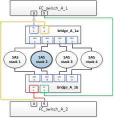

= Unterbrechungsfreier Austausch eines Shelfs in einer Fabric-Attached MetroCluster-Konfiguration
:allow-uri-read: 
:icons: font
:imagesdir: ../media/

[role="lead"]
Möglicherweise müssen Sie wissen, wie ein Shelf in einer Fabric-Attached MetroCluster-Konfiguration unterbrechungsfrei ersetzt werden kann.

NOTE: Diese Vorgehensweise gilt nur für die Verwendung in einer Fabric-Attached MetroCluster-Konfiguration.

== Deaktivieren des Zugriffs auf das Shelf

Sie müssen den Zugriff auf das Shelf deaktivieren, bevor Sie die Shelf-Module ersetzen.

Überprüfen Sie den Gesamtzustand der Konfiguration. Wenn das System nicht in einem ordnungsgemäßen Zustand angezeigt wird, beheben Sie zuerst das Problem, bevor Sie fortfahren.

.Schritte
. Von beiden Clustern offline sind alle Plexe mit Festplatten auf dem betroffenen Shelf-Stack:
+
`aggr offline _plex_name_`

+
Das Beispiel zeigt die Befehle zum Offline-Ausstellen von Plexen für einen Controller, auf dem ONTAP ausgeführt wird.

+
[listing]
----

cluster_A_1::> storage aggregate plex offline -aggr aggrA_1_0 -plex plex0
cluster_A_1::> storage aggregate plex offline -aggr dataA_1_data -plex plex0
cluster_A_2::> storage aggregate plex offline -aggr aggrA_2_0 -plex plex0
cluster_A_2::> storage aggregate plex offline -aggr dataA_2_data -plex plex0
----
. Überprüfen Sie, ob die Plexe offline sind:
+
`aggr status _-raggr_name_`

+
Das Beispiel zeigt die Befehle zur Überprüfung, ob die Aggregate für einen Controller, auf dem cMode ausgeführt wird, offline sind.

+
[listing]
----

Cluster_A_1::> storage aggregate show -aggr aggrA_1_0
Cluster_A_1::> storage aggregate show -aggr dataA_1_data
Cluster_A_2::> storage aggregate show -aggr aggrA_2_0
Cluster_A_2::> storage aggregate show -aggr dataA_2_data
----
. Deaktivieren Sie die SAS-Ports oder Switch-Ports, je nachdem, ob die Bridges, die das Ziel-Shelf verbinden, einen einzelnen SAS-Stack oder zwei oder mehr SAS-Stacks verbinden:
+
** Wenn die Brücken einen einzelnen SAS-Stack anschließen, deaktivieren Sie die Switch-Ports, an die die Brücken angeschlossen sind. Verwenden Sie dazu den entsprechenden Befehl für Ihren Switch.
+
Das folgende Beispiel zeigt ein Bridges-Paar, das einen einzelnen SAS-Stack mit dem Ziel-Shelf verbindet:

+
image::../media/mcc_shelf_replacement_bridges_with_a_single_stack.gif[Regalwechselbrücken mit Einzelstapel]

+
Die Switch-Ports 8 und 9 an jedem Switch verbinden die Brücken mit dem Netzwerk.

+
Im folgenden Beispiel sind die Ports 8 und 9 bei einem Brocade Switch deaktiviert.

+
[listing]
----
FC_switch_A_1:admin> portDisable 8
FC_switch_A_1:admin> portDisable 9

FC_switch_A_2:admin> portDisable 8
FC_switch_A_2:admin> portDisable 9
----
+
Das folgende Beispiel zeigt, dass Port 8 und 9 auf einem Cisco Switch deaktiviert sind.

+
[listing]
----
FC_switch_A_1# conf t
FC_switch_A_1(config)# int fc1/8
FC_switch_A_1(config)# shut
FC_switch_A_1(config)# int fc1/9
FC_switch_A_1(config)# shut
FC_switch_A_1(config)# end

FC_switch_A_2# conf t
FC_switch_A_2(config)# int fc1/8
FC_switch_A_2(config)# shut
FC_switch_A_2(config)# int fc1/9
FC_switch_A_2(config)# shut
FC_switch_A_2(config)# end
----
** Wenn die Brücken zwei oder mehr SAS-Stacks verbinden, deaktivieren Sie die SAS-Ports, die die Bridges mit dem Ziel-Shelf verbinden: +
`SASportDisable _port number_`
+
Das folgende Beispiel zeigt ein Paar Brücken, die vier SAS-Stacks miteinander verbinden. SAS-Stack 2 enthält das Ziel-Shelf:

+

+
SAS-Port B verbindet die Brücken mit dem Ziel-Shelf. Indem nur SAS Port B auf beiden Shelves deaktiviert wird, können die anderen SAS-Stacks während des Austauschvorgangs weiterhin Daten bereitstellen.

+
Deaktivieren Sie in diesem Fall den SAS-Port, der die Bridge mit dem Ziel-Shelf verbindet:

+
`SASportDisable _port number_`

+
Das folgende Beispiel zeigt, dass SAS-Port B von der Bridge deaktiviert ist und dass sie ebenfalls deaktiviert ist. Sie müssen den Befehl auf beiden Brücken wiederholen.

+
[listing]
----
Ready. *
SASPortDisable B

SAS Port B has been disabled.
----

. Wenn Sie die Switch-Ports zuvor deaktiviert haben, vergewissern Sie sich, dass sie deaktiviert sind:
+
`switchShow`

+
Das Beispiel zeigt, dass die Switch-Ports bei einem Brocade Switch deaktiviert sind.

+
[listing]
----

FC_switch_A_1:admin> switchShow
FC_switch_A_2:admin> switchShow
----
+
Das Beispiel zeigt, dass die Switch-Ports auf einem Cisco Switch deaktiviert sind.

+
[listing]
----

FC_switch_A_1# show interface fc1/6
FC_switch_A_2# show interface fc1/6
----
. Warten Sie, bis ONTAP erkennt, dass die Festplatte fehlt.
. Schalten Sie das Shelf aus, das Sie ersetzen möchten.

== Austauschen des Shelfs

Alle Kabel und das Shelf müssen physisch entfernt werden, bevor die neuen Shelf- und Shelf-Module eingesetzt und verkabelt werden.

.Schritte
. Entfernen Sie alle Festplatten, und trennen Sie alle Kabel vom zu ersetzenden Shelf.
. Entfernen Sie die Shelf-Module.
. Setzen Sie das neue Shelf ein.
. Setzen Sie die neuen Festplatten in das neue Shelf ein.
. Setzen Sie die Shelf-Module ein.
. Verbinden Sie das Shelf (SAS oder Stromversorgung).
. Schalten Sie das Shelf ein.

== Den Zugriff erneut aktivieren und den Vorgang überprüfen

Nach dem Austausch des Shelfs müssen Sie den Zugriff erneut aktivieren und überprüfen, ob das neue Shelf ordnungsgemäß funktioniert.

.Schritte
. Überprüfen Sie, ob das Shelf ordnungsgemäß eingeschaltet wird und die Links auf den IOM-Modulen vorhanden sind.
. Aktivieren Sie die Switch-Ports oder den SAS-Port gemäß den folgenden Szenarien:
+
[cols="1,3"]
|===

| Option | Schritt 

 a| 
*Wenn Sie zuvor Switch-Ports deaktiviert haben*
 a| 
.. Aktivieren Sie die Switch-Ports:
+
`portEnable _port number_`

+
Das Beispiel zeigt, dass der Switch-Port auf einem Brocade Switch aktiviert ist.

+
[listing]
----

Switch_A_1:admin> portEnable 6
Switch_A_2:admin> portEnable 6
----
+
Das Beispiel zeigt, dass der Switch-Port auf einem Cisco Switch aktiviert ist.

+
[listing]
----

Switch_A_1# conf t
Switch_A_1(config)# int fc1/6
Switch_A_1(config)# no shut
Switch_A_1(config)# end

Switch_A_2# conf t
Switch_A_2(config)# int fc1/6
Switch_A_2(config)# no shut
Switch_A_2(config)# end
----

 a| 
*Wenn Sie zuvor einen SAS-Port deaktiviert haben*
 a| 
.. Aktivieren Sie den SAS-Port, der den Stack mit dem Shelf-Speicherort verbindet:
+
`SASportEnable _port number_`

+
Das Beispiel zeigt, dass SAS-Port A von der Bridge aus aktiviert ist und ob sie aktiviert ist.

+
[listing]
----
Ready. *
SASPortEnable A

SAS Port A has been enabled.
----

|===
. Wenn Sie die Switch-Ports zuvor deaktiviert haben, vergewissern Sie sich, dass sie aktiviert und online sind und dass und alle Geräte korrekt angemeldet sind:
+
`switchShow`

+
Das Beispiel zeigt das `switchShow` Befehl zur Überprüfung, ob ein Brocade Switch online ist.

+
[listing]
----

Switch_A_1:admin> SwitchShow
Switch_A_2:admin> SwitchShow
----
+
Das Beispiel zeigt das `switchShow` Befehl zur Überprüfung, ob ein Cisco Switch online ist.

+
[listing]
----

Switch_A_1# show interface fc1/6
Switch_A_2# show interface fc1/6
----
+

NOTE: Nach einigen Minuten erkennt ONTAP, dass neue Festplatten eingesetzt wurden, und zeigt für jede neue Festplatte eine Meldung an.

. Überprüfen Sie, ob die Festplatten von ONTAP erkannt wurden:
+
`sysconfig -a`

. Online die Plexe, die früher offline waren:
+
`aggr online__plex_name__`

+
Das Beispiel zeigt die Befehle, mit denen Plexe auf einen Controller platziert werden, auf dem cMode wieder online geschaltet wird.

+
[listing]
----

Cluster_A_1::> storage aggregate plex online -aggr aggr1 -plex plex2
Cluster_A_1::> storage aggregate plex online -aggr aggr2 -plex plex6
Cluster_A_1::> storage aggregate plex online -aggr aggr3 -plex plex1
----
+
Die Plexe beginnen sich zu resynchronisieren.

+

NOTE: Sie können den Fortschritt der Neusynchronisierung mit dem überwachen `aggr status _-raggr_name_` Befehl.

