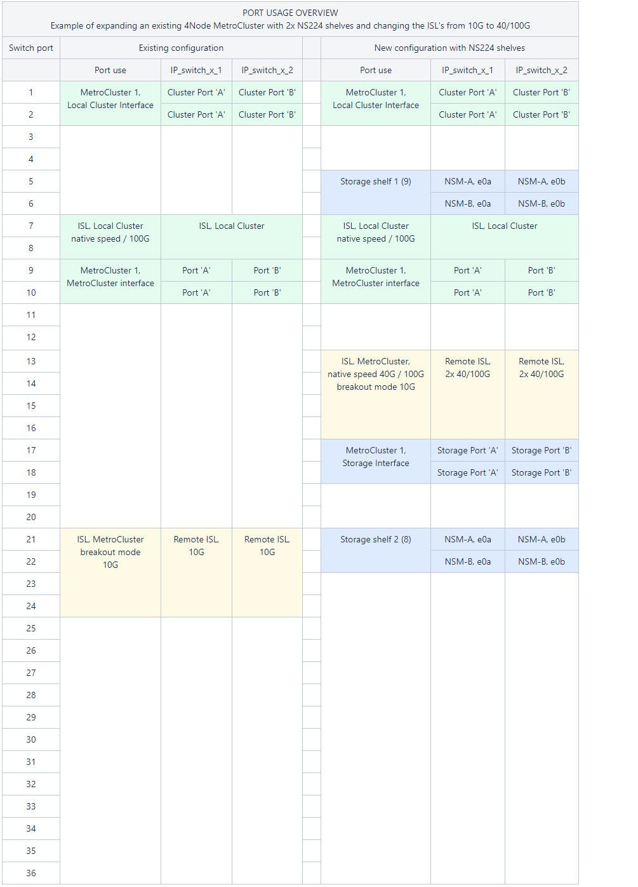

= Ersetzen Sie einen IP-Switch oder ändern Sie die Verwendung vorhandener MetroCluster IP-Switches
:allow-uri-read: 
:icons: font
:imagesdir: ../media/

[role="lead"]
Möglicherweise müssen Sie einen ausgefallenen Switch ersetzen, einen Switch aktualisieren oder herunterstufen oder die Verwendung vorhandener MetroCluster IP-Switches ändern.

Dieses Verfahren gilt, wenn Sie NetApp Validated Switches verwenden. Wenn Sie MetroCluster-konforme Switches verwenden, wenden Sie sich an den Switch-Anbieter.

Dieses Verfahren unterstützt die folgenden Konvertierungen:

* Ändern des Switch-Anbieters, -Typs oder beider Typen. Der neue Switch kann mit dem alten Schalter identisch sein, wenn ein Switch ausgefallen ist, oder Sie können den Switch-Typ ändern (Upgrade oder Downgrade des Schalters).
+
Um beispielsweise eine MetroCluster IP-Konfiguration von einer Konfiguration mit vier Nodes mit AFF A400 Controllern und BES-53248 Switches auf eine Konfiguration mit acht Nodes mit AFF A400 Controllern zu erweitern, müssen Sie die Switches auf einen unterstützten Typ für die Konfiguration ändern, da BES-53248 Switches in der neuen Konfiguration nicht unterstützt werden.

+
Wenn Sie einen defekten Switch durch denselben Switch-Typ ersetzen möchten, tauschen Sie nur den ausgefallenen Switch aus. Wenn Sie einen Switch aktualisieren oder herunterstufen möchten, müssen Sie zwei Switches anpassen, die sich im gleichen Netzwerk befinden. Zwei Switches befinden sich im selben Netzwerk, wenn sie mit einer ISL (Inter-Switch Link) verbunden sind und sich nicht am selben Standort befinden. Netzwerk 1 umfasst z. B. IP_Switch_A_1 und IP_Switch_B_1, Netzwerk 2 enthält IP_Switch_A_2 und IP_Switch_B_2, wie in der folgenden Abbildung dargestellt:

+
image::../media/mcc_ip_hardware_architecture_ip_interconnect.png[mcc ip-Hardwarearchitektur ip-Interconnect]

+

NOTE: Wenn Sie einen Switch ersetzen oder auf verschiedene Switches aktualisieren, können Sie die Switches vorkonfigurieren, indem Sie die Switch-Firmware und die RCF-Datei installieren.

* Konvertieren einer MetroCluster IP-Konfiguration in eine MetroCluster IP-Konfiguration mit MetroCluster-Switches für Shared Storage.
+
Wenn Sie beispielsweise über eine regelmäßige MetroCluster IP-Konfiguration mit AFF A700 Controllern verfügen und die MetroCluster neu konfigurieren möchten, um NS224-Shelfs mit denselben Switches zu verbinden.

+
[NOTE]
====
** Wenn Sie Shelfs in einer MetroCluster IP-Konfiguration mithilfe von MetroCluster IP-Switches für gemeinsamen Speicher hinzufügen oder entfernen, führen Sie die Schritte in aus link:https://docs.netapp.com/us-en/ontap-metrocluster/maintain/task_add_shelves_using_shared_storage.html["Hinzufügen von Shelfs zu einer MetroCluster IP mithilfe von MetroCluster-Switches mit Shared-Storage"]
** Die MetroCluster IP-Konfiguration stellt möglicherweise bereits eine direkte Verbindung zu NS224-Shelfs oder zu dedizierten Storage-Switches her.

====

.Arbeitsblatt zur Portnutzung
Im Folgenden finden Sie ein Beispiel-Arbeitsblatt zum Konvertieren einer MetroCluster IP-Konfiguration in eine Konfiguration mit gemeinsamem Speicher, bei der zwei NS224-Shelfs unter Verwendung der vorhandenen Switches verbunden werden.

Arbeitsblattdefinitionen:

* Vorhandene Konfiguration: Verkabelung der vorhandenen MetroCluster-Konfiguration.
* Neue Konfiguration mit NS224 Shelfs: Die Zielkonfiguration, bei der die Switches zwischen Storage und MetroCluster gemeinsam genutzt werden

Die hervorgehobenen Felder in diesem Arbeitsblatt geben Folgendes an:

* Grün: Sie müssen die Verkabelung nicht ändern.
* Gelb: Sie müssen Ports mit derselben oder einer anderen Konfiguration verschieben.
* Blau: Ports, die neue Verbindungen sind.

.Schritte
. [[all_step1]]Überprüfen Sie den Zustand der Konfiguration.
+
.. Vergewissern Sie sich, dass die MetroCluster für jedes Cluster im normalen Modus konfiguriert ist: `*metrocluster show*`
+
[listing]
----
cluster_A::> metrocluster show
Cluster                   Entry Name          State
------------------------- ------------------- -----------
 Local: cluster_A         Configuration state configured
                          Mode                normal
                          AUSO Failure Domain auso-on-cluster-disaster
Remote: cluster_B         Configuration state configured
                          Mode                normal
                          AUSO Failure Domain auso-on-cluster-disaster
----
.. Vergewissern Sie sich, dass die Spiegelung auf jedem Knoten aktiviert ist: `*metrocluster node show*`
+
[listing]
----
cluster_A::> metrocluster node show
DR                           Configuration  DR
Group Cluster Node           State          Mirroring Mode
----- ------- -------------- -------------- --------- --------------------
1     cluster_A
              node_A_1       configured     enabled   normal
      cluster_B
              node_B_1       configured     enabled   normal
2 entries were displayed.
----
.. Prüfen Sie, ob die MetroCluster-Komponenten ordnungsgemäß sind: `*metrocluster check run*`
+
[listing]
----
cluster_A::> metrocluster check run

Last Checked On: 10/1/2014 16:03:37

Component           Result
------------------- ---------
nodes               ok
lifs                ok
config-replication  ok
aggregates          ok
4 entries were displayed.

Command completed. Use the "metrocluster check show -instance" command or sub-commands in "metrocluster check" directory for detailed results.
To check if the nodes are ready to do a switchover or switchback operation, run "metrocluster switchover -simulate" or "metrocluster switchback -simulate", respectively.
----
.. Vergewissern Sie sich, dass es keine Systemzustandsmeldungen gibt: `*system health alert show*`

. Konfigurieren Sie den neuen Switch vor der Installation.
+
Wenn Sie vorhandene Switches erneut verwenden, fahren Sie mit fort <<existing_step4,Schritt 4>>.

+

NOTE: Wenn Sie die Switches aktualisieren oder verkleinern, müssen Sie alle Switches im Netzwerk konfigurieren.

+
Befolgen Sie die Schritte im Abschnitt _Konfigurieren der IP-Switches_ im link:https://docs.netapp.com/us-en/ontap-metrocluster/install-ip/using_rcf_generator.html["Installation und Konfiguration von MetroCluster IP"]

+
Stellen Sie sicher, dass Sie die korrekte RCF-Datei für den Schalter _A_1, _A_2, _B_1 oder _B_2 anwenden. Wenn der neue Switch mit dem alten Switch identisch ist, müssen Sie dieselbe RCF-Datei anwenden.

+
Wenn Sie einen Switch aktualisieren oder herunterstufen, wenden Sie die neueste unterstützte RCF-Datei für den neuen Switch an.

. Führen Sie den Befehl Port show aus, um Informationen zu den Netzwerkports anzuzeigen:
+
`*network port show*`

. [[existing_step4]]Trennen Sie die Verbindungen vom alten Switch.
+

NOTE: Sie trennen nur Verbindungen, die nicht denselben Port in der alten und neuen Konfiguration verwenden. Wenn Sie neue Switches verwenden, müssen Sie alle Verbindungen trennen.

+
Entfernen Sie die Anschlüsse in der folgenden Reihenfolge:

+
** Wenn die lokalen Cluster-Schnittstellen mit einem Switch verbunden sind:
+
*** Trennen Sie die lokalen Cluster-Schnittstellen
*** Trennen Sie die lokalen Cluster-ISLs

** Trennen Sie die MetroCluster IP-Schnittstellen
** Trennen Sie die MetroCluster-ISLs
+
Im Beispiel <<port_usage_worksheet>>Die Schalter ändern sich nicht. Die MetroCluster-ISLs werden verschoben und müssen getrennt werden. Sie müssen die grün markierten Verbindungen auf dem Arbeitsblatt nicht trennen.

. Wenn Sie neue Schalter verwenden, schalten Sie den alten Schalter aus, entfernen Sie die Kabel, und entfernen Sie den alten Schalter.
+
Wenn Sie vorhandene Switches erneut verwenden, fahren Sie mit fort <<existing_step6,Schritt 6>>.

+

NOTE: Verkabeln Sie die neuen Switches mit Ausnahme der Verwaltungsschnittstelle (falls verwendet) nicht.

. [[existing_step6]]Konfigurieren Sie die vorhandenen Switches.
+
Wenn Sie die Switches bereits vorkonfiguriert haben, können Sie diesen Schritt überspringen.

+
Führen Sie zum Konfigurieren der vorhandenen Switches die Schritte zum Installieren und Aktualisieren der Firmware- und RCF-Dateien aus:

+
** link:https://docs.netapp.com/us-en/ontap-metrocluster/maintain/task_upgrade_firmware_on_mcc_ip_switches.html["Aktualisieren der Firmware auf MetroCluster IP Switches"]
** link:https://docs.netapp.com/us-en/ontap-metrocluster/maintain/task_upgrade_rcf_files_on_mcc_ip_switches.html["Aktualisieren Sie RCF-Dateien auf MetroCluster IP-Switches"]

. Verkabeln Sie die Schalter.
+
Sie können die Schritte im Abschnitt _verkabeln der IP-Switches_ in befolgen link:https://docs.netapp.com/us-en/ontap-metrocluster/install-ip/using_rcf_generator.html["Installation und Konfiguration von MetroCluster IP"].

+
Verkabeln Sie die Schalter in der folgenden Reihenfolge (falls erforderlich):

+
.. Verkabeln Sie die ISLs mit dem Remote-Standort.
.. Verkabeln Sie die MetroCluster IP-Schnittstellen.
.. Verkabeln Sie die lokalen Cluster-Schnittstellen.
+
[NOTE]
====
*** Die verwendeten Ports können von denen auf dem alten Switch abweichen, wenn der Switch-Typ anders ist. Wenn Sie die Switches aktualisieren oder verkleinern, müssen Sie die lokalen ISLs nicht * verkabeln. Verkabeln Sie die lokalen ISLs nur, wenn Sie die Switches im zweiten Netzwerk aktualisieren oder herunterstufen und beide Switches an einem Standort den gleichen Typ und die gleiche Verkabelung aufweisen.
*** Wenn Sie Switch-A1 und Switch-B1 aktualisieren, müssen Sie die Schritte 1 bis 6 für Schalter A2 und Switch-B2 ausführen.

====

. Schließen Sie die lokale Clusterverkabelung ab.
+
.. Wenn die lokalen Cluster-Schnittstellen mit einem Switch verbunden sind:
+
... Verkabeln Sie die lokalen Cluster-ISLs.

.. Wenn die lokalen Clusterschnittstellen *nicht* mit einem Switch verbunden sind:
+
... Verwenden Sie die link:https://docs.netapp.com/us-en/ontap-systems-switches/switch-bes-53248/migrate-to-2n-switched.html["Migration zu einer NetApp Cluster-Umgebung mit Switch"] Vorgehensweise zum Konvertieren eines Clusters ohne Switches in ein Cluster mit Switches. Verwenden Sie die in angegebenen Anschlüsse link:https://docs.netapp.com/us-en/ontap-metrocluster/install-ip/using_rcf_generator.html["Installation und Konfiguration von MetroCluster IP"] Oder die RCF-Verkabelungsdateien, um die lokale Clusterschnittstelle zu verbinden.

. Schalten Sie den Schalter ein oder schalten Sie den Schalter ein.
+
Wenn der neue Schalter gleich ist, schalten Sie den neuen Schalter ein. Wenn Sie die Schalter aktualisieren oder verkleinern, schalten Sie beide Schalter ein. Die Konfiguration kann mit zwei verschiedenen Switches an jedem Standort betrieben werden, bis das zweite Netzwerk aktualisiert wird.

. Wiederholen Sie die Schritte, um zu überprüfen, ob die MetroCluster-Konfiguration ordnungsgemäß ist <<all_step1,Schritt 1>>.
+
Wenn Sie die Switches im ersten Netzwerk aktualisieren oder verkleinern, werden möglicherweise einige Warnmeldungen im Zusammenhang mit dem lokalen Clustering angezeigt.

+

NOTE: Wenn Sie die Netzwerke aktualisieren oder herunterstufen, dann wiederholen Sie alle Schritte für das zweite Netzwerk.

. Verschieben Sie optional die NS224-Shelfs.
+
Wenn Sie eine MetroCluster IP-Konfiguration neu konfigurieren, bei der keine NS224-Shelfs mit den MetroCluster IP-Switches verbunden werden, gehen Sie wie folgt vor, um die NS224-Shelfs hinzuzufügen oder zu verschieben:

+
** link:https://docs.netapp.com/us-en/ontap-metrocluster/maintain/task_add_shelves_using_shared_storage.html["Hinzufügen von Shelfs zu einer MetroCluster IP mithilfe von MetroCluster-Switches mit Shared-Storage"]
** link:https://docs.netapp.com/us-en/ontap-systems-switches/switch-cisco-9336c-fx2-shared/migrate-from-switchless-cluster-dat-storage.html["Migrieren Sie von einem Cluster ohne Switches mit Direct-Attached Storage"^]
** link:https://docs.netapp.com/us-en/ontap-systems-switches/switch-cisco-9336c-fx2-shared/migrate-from-switchless-configuration-sat-storage.html["Migrieren Sie mit der erneuten Nutzung der Storage-Switches von einer Konfiguration ohne Switches mit Switch-Attached Storage"^]

