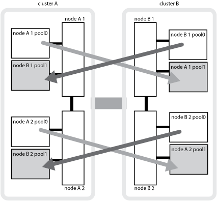

= MetroCluster Datensicherung und Disaster Recovery verstehen
:allow-uri-read: 
:icons: font
:imagesdir: ../media/

[role="lead"]
Es ist hilfreich zu verstehen, wie MetroCluster die Daten sichert und transparentes Recovery bei Ausfällen bietet, sodass Sie Ihre Switchover- und Switchover-Aktivitäten einfach und effizient managen können.

MetroCluster verwendet Spiegelung, um die Daten in einem Cluster zu schützen. Es bietet Disaster Recovery über einen einzigen MetroCluster-Befehl, bei dem ein sekundäres System am Survivor-Standort aktiviert wird und so die gespiegelten Daten anliefert, die ursprünglich einem primären Standort gehören, von einem Ausfall betroffen sind.

== MetroCluster Konfigurationen mit acht oder vier Nodes bieten lokalen Failover und Switchover

MetroCluster Konfigurationen mit acht oder vier Nodes sichern Daten auf lokaler Ebene und auf Cluster-Ebene. Bei der Einrichtung einer MetroCluster Konfiguration müssen Sie wissen, wie MetroCluster Konfigurationen Ihre Daten schützen.

MetroCluster Konfigurationen sichern Daten durch zwei physisch getrennte, gespiegelte Cluster. Jedes Cluster spiegelt synchron die Daten- und Storage Virtual Machine (SVM)-Konfiguration des anderen Clusters. Im Falle eines Ausfalls an einem Standort kann ein Administrator die gespiegelte SVM aktivieren und damit beginnen, die gespiegelten Daten vom verbleibenden Standort aus bereitzustellen. Darüber hinaus werden die Nodes in jedem Cluster als HA-Paar konfiguriert, wodurch ein Level des lokalen Failover bereitgestellt wird.

=== Funktionsweise der lokalen HA-Datensicherung in einer MetroCluster Konfiguration

Sie müssen verstehen, wie HA-Paare in der MetroCluster Konfiguration funktionieren.

Die beiden Cluster im Peering-Netzwerk bieten bidirektionale Disaster Recovery, bei der jedes Cluster als Quelle und Backup des anderen Clusters verwendet werden kann. Jedes Cluster enthält zwei Nodes, die als HA-Paar konfiguriert sind. Bei einem Ausfall oder einer erforderlichen Wartung innerhalb der Konfiguration eines einzelnen Node kann der Storage Failover die Vorgänge des Nodes an seinen lokalen HA-Partner übertragen.

Die folgende Abbildung zeigt eine MetroCluster FC-Konfiguration. Die HA-Funktion ist in MetroCluster IP-Konfigurationen identisch, mit der Ausnahme, dass der HA Interconnect durch die Cluster Switches bereitgestellt wird.

image::../media/mcc_hw_architecture_local_ha.gif[mcc hw-Architektur lokal ha]

.Verwandte Informationen
https://docs.netapp.com/ontap-9/topic/com.netapp.doc.dot-cm-hacg/home.html["Hochverfügbarkeitskonfiguration"^]

== Durchführen von Daten- und Konfigurations-Replizierung mit MetroCluster Konfigurationen

MetroCluster Konfigurationen nutzen eine Vielzahl von ONTAP Funktionen für die synchrone Replizierung von Daten und Konfiguration zwischen den beiden MetroCluster Standorten.

=== Konfigurationsschutz mit dem Configuration Replication Service

Der ONTAP Configuration Replication Service (CRS) schützt die MetroCluster-Konfiguration, indem die Informationen automatisch an den DR-Partner repliziert werden.

Die CRS repliziert die lokale Node-Konfiguration synchron zum DR-Partner im Partner-Cluster. Diese Replikation wird über das Cluster-Peering-Netzwerk durchgeführt.

Zu den replizierten Informationen gehören die Cluster-Konfiguration und die SVM-Konfiguration.

=== Replizierung von SVMs während des MetroCluster-Betriebs

Der ONTAP Configuration Replication Service (CRS) bietet eine redundante Konfiguration des Datenservers und eine Spiegelung der zu der SVM gehörenden Daten-Volumes. Bei einer Umschaltung wird die Quell-SVM heruntergefahren und die Ziel-SVM, die sich im verbleibenden Cluster befindet, wird aktiv.

NOTE: Ziel-SVMs in der MetroCluster-Konfiguration haben das Suffix „`-mc`“ automatisch an ihren Namen angehängt, um sie zu identifizieren. Eine MetroCluster-Konfiguration hängt das Suffix „`-mc`“ an den Namen der Ziel-SVMs an. Wenn der SVM-Name einen Zeitraum enthält, wird das Suffix „`-mc`“ vor dem ersten Zeitraum angewendet. Wenn der SVM-Name beispielsweise SVM.DNS.NAME lautet, wird das Suffix „`-mc`“ als SVM-MC.DNS.NAME angehängt.

Das folgende Beispiel zeigt die SVMs für eine MetroCluster-Konfiguration: „`SVM_Cluster_A`“ ist eine SVM auf dem Quellstandort und „`SVM_Cluster_A-mc`“ ist ein Synchronisationskreiseziel-Aggregat auf dem Disaster-Recovery-Standort.

* SVM_Cluster_A stellt Daten auf Cluster A bereit
+
Es handelt sich um eine synchrone Quell-SVM, die die SVM-Konfiguration (LIFs, Protokolle und Services) und die Daten in Volumes der SVM darstellt. Die Konfiguration und die Daten werden zu SVM_Cluster_A-mc repliziert, einer synchronen Ziel-SVM auf Cluster B.

* SVM_Cluster_B stellt Daten auf Cluster B bereit
+
Es handelt sich um eine synchrone Quell-SVM, die Konfiguration und Daten für SVM_Cluster_B-mc auf Cluster A darstellt

* SVM_Cluster_B-mc ist eine synchrone Ziel-SVM, die während des normalen, ordnungsgemäßen Betriebs der MetroCluster-Konfiguration angehalten wird.
+
Bei einer erfolgreichen Umschaltung von Cluster B zu Cluster A wird SVM_Cluster_B angehalten und SVM_Cluster_B-mc aktiviert, und beginnt mit der Bereitstellung von Daten aus Cluster A

* SVM_Cluster_A-mc ist eine synchrone Ziel-SVM, die während des normalen, ordnungsgemäßen Betriebs der MetroCluster-Konfiguration angehalten wird.
+
Bei einer erfolgreichen Umschaltung von Cluster A auf Cluster B wird SVM_Cluster_A angehalten und SVM_Cluster_A-mc aktiviert, sodass die Daten von Cluster B bereit werden

image::../media/mcc_mirroring_of_svms.gif[Spiegelung von svms mit mcc]

Tritt eine Umschaltung auf, wird der Remote-Plex auf dem verbleibenden Cluster online geschaltet, und die sekundäre SVM stellt die Daten bereit.

image::../media/mcc_svms_after_switchover.gif[mcc svms nach Umschaltung]

Die Verfügbarkeit von Remote-Plexen nach Umschaltung hängt vom Konfigurationstyp MetroCluster ab:

* Bei MetroCluster FC-Konfigurationen bleiben lokale und Remote-Plexe nach Umschaltung online, wenn auf den Disaster-Site-Storage über ISLs zugegriffen werden kann.
+
Wenn die ISLs ausfallen und der Storage am Disaster-Standort nicht verfügbar ist, beginnt die SVM des synchronen Ziels, die Daten vom verbleibenden Standort bereitzustellen.

* Bei MetroCluster IP-Konfigurationen hängt die Verfügbarkeit der Remote-Plexe von der ONTAP-Version ab:
+
** Ab ONTAP 9.5 bleiben sowohl lokale als auch Remote-Plexe online, wenn die Knoten des Disaster-Standorts weiterhin gestartet werden.
** Vor ONTAP 9.5 ist der Storage nur aus dem lokalen Plex auf dem überlebenden Standort verfügbar.
+
Die SVM auf dem synchronen Ziel beginnt, Daten vom verbleibenden Standort bereitzustellen.

.Verwandte Informationen
https://docs.netapp.com/ontap-9/topic/com.netapp.doc.dot-cm-sag/home.html["Systemadministration"^]

=== MetroCluster-Konfigurationen nutzen SyncMirror zur Bereitstellung von Datenredundanz

Gespiegelte Aggregate mit der SyncMirror-Funktionalität bieten Datenredundanz und enthalten die Volumes der Quell- und Ziel-Storage Virtual Machine (SVM). Daten werden in Festplatten-Pools im Partner-Cluster repliziert. Auch nicht gespiegelte Aggregate werden unterstützt.

In der folgenden Tabelle ist der Status (online oder offline) eines nicht gespiegelten Aggregats nach einer Umschaltung dargestellt:

|===

| Art der Umschaltung | Bundesland 

 a| 
Ausgehandelte Umschaltung (NSO)
 a| 
Online

 a| 
Automatische ungeplante Umschaltung (AUSO)
 a| 
Online

 a| 
Ungeplante Umschaltung (USO)
 a| 
* Wenn kein Speicher verfügbar ist: Offline
* Wenn Speicher verfügbar ist: Online

|===

NOTE: Wenn sich das nicht gespiegelte Aggregat nach einer Umschaltung auf den DR-Partnerknoten befindet und ein Inter-Switch-Link-Ausfall (ISL) auftritt, kann ein lokaler Node ausfallen.

Die folgende Abbildung zeigt, wie Disk Pools zwischen den Partner-Clustern gespiegelt werden. Daten auf lokalen Plexen (in Pool0) werden auf Remote-Plexe (in Pool1) repliziert.

IMPORTANT: Bei Verwendung von hybriden Aggregaten kann es zu einer Performance-Verschlechterung kommen, nachdem ein SyncMirror Plex fehlgeschlagen ist. Dabei ist die SSD-Schicht (Solid State Disk) gefüllt.

=== Funktionsweise von NVRAM- oder NVMEM-Cache-Spiegelung und Dynamic Mirroring in MetroCluster Konfigurationen

Der nicht-flüchtige Speicher (NVRAM oder NVMEM, je nach Plattformmodell) in den Storage Controllern wird sowohl lokal bei einem lokalen HA-Partner als auch am Remote-Standort zu einem DR-Partner (Remote Disaster Recovery) am Partnerstandort gespiegelt. Bei einem lokalen Failover oder einer Umschaltung können Daten aus diesem nicht-flüchtigen Cache beibehalten.

In einem HA-Paar, das nicht Teil einer MetroCluster Konfiguration ist, behält jeder Storage Controller zwei nicht-flüchtige Cache-Partitionen bei: Eine für sich und eine für seinen HA-Partner.

Der nicht-flüchtige Cache eines jeden Storage-Controllers ist in eine MetroCluster-Konfiguration mit vier Nodes unterteilt. In einer MetroCluster-Konfiguration mit zwei Nodes werden die HA-Partnerpartition und die DR-Zusatzpartition nicht verwendet, da die Storage Controller nicht als HA-Paar konfiguriert sind.

|===

2+| Nicht-flüchtige Caches für einen Storage Controller 

| In einer MetroCluster-Konfiguration | In einem nicht-MetroCluster HA-Paar 

 a| 
image:../media/mcc_nvram_quartering.gif[""]
 a| 
image:../media/mcc_nvram_split_in_non_mcc_ha_pair.gif[""]

|===
Die nicht-flüchtigen Caches speichern folgenden Inhalt:

* Die lokale Partition enthält Daten, die der Speicher-Controller noch nicht auf die Festplatte geschrieben hat.
* Die HA-Partnerpartition ist eine Kopie des lokalen Caches des HA-Partners des Storage Controllers.
+
In einer MetroCluster Konfiguration mit zwei Nodes gibt es keine HA-Partnerpartition, da die Storage Controller nicht als HA-Paar konfiguriert sind.

* Die DR-Partnerpartition enthält eine Kopie des lokalen Caches des DR-Partners des Storage Controllers.
+
Der DR-Partner ist ein Knoten im Partner-Cluster, der mit dem lokalen Knoten gepaart wird.

* Die zusätzliche DR-Partnerpartition enthält eine Kopie des lokalen Caches des DR-Hilfspartners des Storage-Controllers.
+
Der DR-Hilfspartner ist der HA-Partner des DR-Partners des lokalen Knotens. Dieser Cache ist erforderlich, wenn ein HA-Takeover vorliegt (entweder wenn die Konfiguration im normalen Betrieb oder nach einer MetroCluster-Umschaltung).

+
In einer MetroCluster Konfiguration mit zwei Nodes gibt es keine zusätzliche DR-Partnerpartition, da die Storage Controller nicht als HA-Paar konfiguriert sind.

Beispielsweise wird der lokale Cache eines Node (Node_A_1) sowohl lokal als auch Remote an den MetroCluster Standorten gespiegelt. Die folgende Abbildung zeigt, dass der lokale Cache von Node_A_1 für den HA-Partner (Node_A_2) und DR-Partner (Node_B_1) gespiegelt wird:

image::../media/mcc_nvram_mirroring_example.gif[Beispiel: mcc nvram Mirroring]

==== Dynamische Spiegelung im Falle einer lokalen HA-Übernahme

Wenn eine lokale HA-Übernahme in einer MetroCluster Konfiguration mit vier Nodes stattfindet, kann der übernnahmene Node nicht mehr als Spiegelung für seinen DR-Partner fungieren. Damit die DR-Spiegelung fortgesetzt werden kann, wechselt die Spiegelung automatisch zum DR-Hilfspartner. Nach erfolgreicher Rückgabe wird die Spiegelung automatisch an den DR-Partner zurückgeführt.

Beispiel: Node_B_1 schlägt fehl und wird von Node_B_2 übernommen. Der lokale Cache von Node_A_1 kann nicht mehr auf Node_B_1 gespiegelt werden. Die Spiegelung wechselt zum DR-Hilfspartner Node_B_2.

image::../media/mcc_nvram_mirroring_example_dynamic_dr_aux.gif[mcc nvram Mirroring Beispiel Dynamic dr AUX]

== Arten von Disaster- und Recovery-Methoden

Sie müssen mit verschiedenen Arten von Ausfällen und Katastrophen vertraut sein, damit Sie die MetroCluster Konfiguration entsprechend nutzen können.

* Single-Node-Ausfall
+
Eine einzelne Komponente im lokalen HA-Paar fällt aus.

+
In einer MetroCluster-Konfiguration mit vier Nodes kann dieser Ausfall je nach ausgefallener Komponente zu einer automatischen oder ausgehandelten Übernahme des beeinträchtigten Knotens führen. Die Datenwiederherstellung wird im _High Availability Configuration Guide_ beschrieben.

+
In einer MetroCluster-Konfiguration mit zwei Nodes führt dieser Ausfall zu einer automatischen ungeplanten Umschaltung (AUSO).

* Site-weiter Controller-Ausfall
+
Alle Controller-Module werden an einem Standort aufgrund eines Stromausfalls, des Austauschs von Geräten oder eines Notfalls ausfallen. Normalerweise können MetroCluster-Konfigurationen Ausfälle und Ausfälle nicht unterscheiden. Witness-Software wie die MetroCluster Tiebreaker Software kann jedoch zwischen ihnen unterscheiden. Ein standortweiter Controller-Ausfall kann zu einem automatischen Switchover führen, wenn Inter-Switch Link (ISL)-Links und -Switches verfügbar sind und der Storage zugänglich ist.

+
Der _High-Availability Configuration Guide_ enthält weitere Informationen zur Wiederherstellung nach standortweiten Controller-Ausfällen, die keine Controller-Ausfälle umfassen, sowie Fehler, die einen oder mehrere Controller umfassen.

* ISL-Fehler
+
Die Verbindungen zwischen den Sites schlagen fehl. Die MetroCluster-Konfiguration hat keine Aktion. Jeder Node stellt weiterhin Daten normal bereit. Die Spiegelungen werden jedoch nicht auf die entsprechenden Disaster Recovery-Standorte geschrieben, da der Zugriff auf sie verloren geht.

* Mehrere sequenzielle Ausfälle
+
Mehrere Komponenten schlagen nacheinander fehl. Ein Controller-Modul, ein Switch Fabric und ein Shelf versagen beispielsweise in einer Sequenz und führen zu einem Storage Failover, Fabric-Redundanz und einem SyncMirror-System, das sequenziell gegen Ausfallzeiten und Datenverlust schützt.

In der folgenden Tabelle sind die Fehlertypen und der entsprechende Disaster Recovery-Mechanismus (DR) und Wiederherstellungsmethode aufgeführt:

NOTE: AUSO (automatische ungeplante Umschaltung) wird in MetroCluster IP-Konfigurationen nicht unterstützt.

|===

.2+| Fehlertyp 2+| DR-Mechanismus 2+| Zusammenfassung der Wiederherstellungsmethode 

| Konfiguration mit vier Nodes | Konfiguration mit zwei Nodes | Konfiguration mit vier Nodes | Konfiguration mit zwei Nodes 

| Single-Node-Ausfall | Lokaler HA-Failover | AUSO | Ist nicht erforderlich, wenn automatisches Failover und Giveback aktiviert ist. | Nach dem Wiederherstellen des Node erfolgt die manuelle Reparatur und wechseln mit dem zurück `metrocluster heal -phase aggregates`, `metrocluster heal -phase root-aggregates`, und `metrocluster switchback` Diese Befehle sind erforderlich. HINWEIS: Der `metrocluster heal` Befehle sind für MetroCluster IP Konfigurationen mit ONTAP 9.5 oder höher nicht erforderlich. 

| Standortausfall 2+| MetroCluster Umschaltung 2.3+| Nach dem Wiederherstellen des Node erfolgt die manuelle Reparatur und wechseln mit dem zurück `metrocluster healing` Und `metrocluster switchback` Diese Befehle sind erforderlich. Der `metrocluster heal` Bei MetroCluster IP-Konfigurationen, auf denen ONTAP 9.5 ausgeführt wird, sind keine Befehle erforderlich. 

| Site-weiter Controller-Ausfall | AUSO nur, wenn der Storage am Disaster-Site zugänglich ist. | AUSO (wie bei Ausfall eines einzelnen Nodes) 

| Mehrere sequenzielle Ausfälle | Lokales HA-Failover, gefolgt von MetroCluster-erzwungener Umschaltung mit dem MetroCluster Switchover-Forced-on-Disaster-Befehl. HINWEIS: Je nach ausgefallener Komponente ist eine erzwungene Umschaltung möglicherweise nicht erforderlich. | MetroCluster erzwungene Umschaltung mit dem `metrocluster switchover -forced-on-disaster` Befehl. 

| ISL-Fehler 2+| Kein MetroCluster-Switchover: Die beiden Cluster stellen unabhängig voneinander ihre Daten bereit 2+| Nicht erforderlich für diese Art von Fehler. Nach dem Wiederherstellen der Verbindung wird der Speicher automatisch neu synchronisiert. 
|===

== Unterbrechungsfreiem Betrieb dank MetroCluster Konfiguration mit acht oder vier Nodes

Im Fall eines Problems, das auf einen einzelnen Knoten beschränkt ist, sorgt ein Failover und die Rückgabe innerhalb des lokalen HA-Paars für einen unterbrechungsfreien Betrieb. In diesem Fall erfordert die MetroCluster Konfiguration keine Umschaltung auf den Remote-Standort.

Da die MetroCluster Konfiguration mit acht oder vier Nodes aus einem oder mehreren HA-Paaren an jedem Standort besteht, kann jeder Standort lokalen Ausfällen standhalten und einen unterbrechungsfreien Betrieb durchführen, ohne dass ein Switchover zum Partnerstandort erforderlich ist. Der Betrieb des HA-Paars ist derselbe wie für HA-Paare in anderen Konfigurationen als MetroCluster.

Bei MetroCluster Konfigurationen mit vier oder acht Nodes können Node-Ausfälle aufgrund von Panic-Meldungen oder Stromausfällen zu einem automatischen Switchover führen.

http://docs.netapp.com/ontap-9/topic/com.netapp.doc.dot-cm-hacg/home.html["Hochverfügbarkeitskonfiguration"^]

Falls nach einem lokalen Failover ein zweiter Ausfall auftritt, sorgt das MetroCluster Switchover-Ereignis für einen unterbrechungsfreien Betrieb. Ähnlich sieht es nach einem Switchover bei einem zweiten Ausfall in einem der verbleibenden Nodes aus, so dass ein lokales Failover-Ereignis einen unterbrechungsfreien Betrieb ermöglicht. In diesem Fall stellt der noch funktionsfähige Node die Daten der anderen drei Nodes in der DR-Gruppe bereit.

=== Umschaltung und zurückwechseln während MetroCluster Transition

Der MetroCluster FC-to-IP Umstieg erfordert zusätzliche MetroCluster IP Nodes und IP Switches zu einer vorhandenen MetroCluster FC-Konfiguration. Anschließend werden die MetroCluster FC Nodes ausgemustert. Je nach Phase des Übergangs verwenden die MetroCluster Switchover-, Healing- und Switchback-Vorgänge unterschiedliche Workflows.

Siehe http://docs.netapp.com/ontap-9/topic/com.netapp.doc.dot-mcc-upgrade/GUID-1870FDC4-1774-4604-86A7-5C979C297ADA.html["Umschaltung, Healing und Switchback-Betrieb während des Übergangs"^].

=== Konsequenzen des lokalen Failover nach Switchover

Wenn eine MetroCluster-Umschaltung stattfindet und ein Problem am verbleibenden Standort auftritt, kann ein lokaler Failover einen kontinuierlichen, unterbrechungsfreien Betrieb ermöglichen. Das System ist jedoch gefährdet, da sich dieses nicht mehr in einer redundanten Konfiguration befindet.

Falls nach einer Umschaltung ein lokaler Failover erfolgt, stellt ein einzelner Controller die Daten aller Storage-Systeme in der MetroCluster Konfiguration bereit. Dadurch können Ressourcenprobleme auftreten und sind anfällig für zusätzliche Ausfälle.

== Durchführen einer MetroCluster Konfiguration mit zwei Nodes für einen unterbrechungsfreien Betrieb

Falls an einem der beiden Standorte aufgrund eines Panikzustands Probleme auftreten, ermöglicht die MetroCluster-Umschaltung einen kontinuierlichen unterbrechungsfreien Betrieb. Wenn ein Stromausfall sowohl den Node als auch den Storage beeinträchtigt, ist die Umschaltung nicht automatisch und es kommt zu einer Unterbrechung, bis der `metrocluster switchover` Befehl wird ausgegeben.

Da jeder Storage gespiegelt wird, kann ein Switchvorgang verwendet werden, so dass er bei einem Standortausfall eine unterbrechungsfreie Ausfallsicherheit bietet, ähnlich wie bei einem Storage Failover in einem HA-Paar bei einem Node-Ausfall.

Bei Konfigurationen mit zwei Nodes werden dieselben Ereignisse, die einen automatischen Storage Failover in einem HA-Paar auslösen, eine automatische ungeplante Umschaltung (AUSO) auslösen. Das bedeutet, dass eine MetroCluster Konfiguration mit zwei Nodes denselben Schutz bietet wie ein HA-Paar.

.Verwandte Informationen
link:concept_understanding_mcc_data_protection_and_disaster_recovery.html["Automatisches, ungeplantes Switchover in MetroCluster FC-Konfigurationen"]

== Überblick über den Switchover-Prozess

Die Umschaltung auf MetroCluster ermöglicht den sofortigen Wiederaufnahme von Services nach einem Ausfall, indem der Storage und der Client-Zugriff vom Quellcluster zum Remote-Standort verschoben werden. Sie müssen sich darüber im Klaren sein, welche Änderungen zu erwarten sind und welche Aktionen bei einem Switchover ausgeführt werden müssen.

Während eines Umschaltvorgangs führt das System folgende Aktionen durch:

* Das Eigentum an den Festplatten, die zum Disaster-Site gehören, wird zum Disaster-Recovery-Partner (DR) geändert.
+
Dies ähnelt dem Fall eines lokalen Failover in einem Hochverfügbarkeitspaar (HA-Paar), bei dem das Eigentum an den zum Partner gehörenden Festplatten in einem gesunden Partner geändert wird.

* Die verbleibenden Plexe, die sich auf dem verbleibenden Standort befinden, doch zu den Knoten im Disaster-Cluster gehören, werden auf dem Cluster am verbleibenden Standort online geschaltet.
* Die zum Disaster-Standort gehörende SVM-Storage-Maschine (Sync-Source Storage Virtual Machine) wird nur während einer ausgehandelten Umschaltung heruntergefahren.
+

NOTE: Dies ist nur auf eine ausgehandelte Umschaltung anwendbar.

* Die SVM des synchronen Ziels, die zum Disaster-Standort gehört, wird aufgerufen.

Während der Umstellung werden die Root-Aggregate des DR-Partners nicht online gestellt.

Der `metrocluster switchover` Command Switches über die Nodes in allen DR-Gruppen in der MetroCluster Konfiguration. In einer MetroCluster Konfiguration mit acht Nodes wechselt sie beispielsweise über die Nodes in beiden DR-Gruppen.

Wenn ein Wechsel ausschließlich für Services zum Remote-Standort erfolgt, sollte eine ausgehandelte Umschaltung ohne Fencing des Standorts durchgeführt werden. Falls Storage oder Geräte unzuverlässig sind, sollten Sie den Disaster-Standort einschiebern und anschließend eine ungeplante Umschaltung durchführen. Fechten verhindert RAID-Rekonstruktionen beim Einschalten der Festplatten mit gestaffelter Weise.

NOTE: Dieses Verfahren sollte nur verwendet werden, wenn der andere Standort stabil ist und nicht offline gebracht werden soll.

=== Verfügbarkeit von Befehlen während der Umschaltung

Die folgende Tabelle zeigt die Verfügbarkeit von Befehlen während der Umschaltung:

|===

| Befehl | Gesteigerte 

 a| 
`storage aggregate create`
 a| 
Sie können ein Aggregat erstellen:

* Ist er im Besitz eines Node, der Teil des verbleibenden Clusters ist

Sie können kein Aggregat erstellen:

* Für einen Node am Disaster-Site
* Für einen Node, der Teil des verbleibenden Clusters ist

 a| 
`storage aggregate delete`
 a| 
Sie können ein Datenaggregat löschen.

 a| 
`storage aggregate mirror`
 a| 
Sie können einen Plex für ein nicht gespiegeltes Aggregat erstellen.

 a| 
`storage aggregate plex delete`
 a| 
Sie können einen Plex für ein gespiegeltes Aggregat löschen.

 a| 
`vserver create`
 a| 
Sie können eine SVM erstellen:

* Befindet sich das Root-Volume in einem Datenaggregat, das dem verbleibenden Cluster gehört

Sie können keine SVM erstellen:

* Befindet sich das Root-Volume in einem Datenaggregat im Eigentum des Disaster-Site-Clusters

 a| 
`vserver delete`
 a| 
Sie können SVMs mit Synchronisations- und synchronen Zielen löschen.

 a| 
`network interface create -lif`
 a| 
Sie können eine Daten-SVM-LIF sowohl für Sync-Source- als auch für Sync-Destination-SVMs erstellen.

 a| 
`network interface delete -lif`
 a| 
Sie können eine Daten-SVM-LIF sowohl für Sync-Source- als auch für Sync-Destination-SVMs löschen.

 a| 
`volume create`
 a| 
Sie können ein Volume sowohl für synchrone als auch für synchrone SVMs erstellen.

* Bei einer synchronen SVM muss sich das Volume in einem Datenaggregat befinden, das dem verbleibenden Cluster gehört
* Bei einer synchronen Ziel-SVM muss sich das Volume in einem Datenaggregat befinden, das dem Disaster-Site-Cluster gehört

 a| 
`volume delete`
 a| 
Sie können ein Volume sowohl für synchrone als auch für synchrone SVMs löschen.

 a| 
`volume move`
 a| 
Sie können ein Volume sowohl für synchrone als auch für synchrone SVMs verschieben.

* Bei einer SVM mit synchroner Quelle muss das noch funktionsfähige Cluster das Zielaggregat sein
* Bei einer SVM mit synchronem Ziel muss das Ziel-Aggregat im Disaster-Site-Cluster vorhanden sein

 a| 
`snapmirror break`
 a| 
Sie können eine SnapMirror Beziehung zwischen einem Quell- und Zielendpunkt einer Datensicherungsspiegelung unterbrechen.

|===

=== Unterschiede bei der Umschaltung zwischen MetroCluster FC- und IP-Konfigurationen

In MetroCluster IP Konfigurationen ist der Zugriff auf die Remote-Festplatten über die Nodes des Remote-DR-Partners als iSCSI-Ziele möglich. Wenn die Remote-Nodes bei einem Switchover heruntergefahren werden, ist der Zugriff auf die Remote-Festplatten nicht möglich. Dies führt zu Unterschieden bei den MetroCluster FC-Konfigurationen:

* Gespiegelte Aggregate, die im Besitz des lokalen Clusters sind, werden herabgestuft.
* Gespiegelte Aggregate, die vom Remote-Cluster umgeschaltet wurden, werden herabgestuft.

NOTE: Wenn nicht gespiegelte Aggregate in einer MetroCluster IP-Konfiguration unterstützt werden, kann nicht auf die nicht gespiegelten Aggregate zugegriffen werden, die nicht vom Remote-Cluster umgeschaltet sind.

=== Änderungen am Festplattenbesitz während HA Takeover und MetroCluster Switchover in einer MetroCluster Konfiguration mit vier Nodes

Die Eigentumsrechte an Festplatten ändern sich vorübergehend automatisch während der Hochverfügbarkeit und im MetroCluster-Betrieb. Es ist hilfreich zu wissen, wie das System den Knoten verfolgt, der welche Platten besitzt.

In ONTAP wird die eindeutige System-ID eines Controller-Moduls (bezogen auf die NVRAM-Karte oder NVMEM-Platine eines Node) verwendet, um zu ermitteln, welcher Node auf einer bestimmten Festplatte besitzt. Je nach HA- oder DR-Status des Systems kann sich das Eigentum an der Festplatte vorübergehend ändern. Wenn sich das Eigentum aufgrund einer HA Übernahme oder einer DR-Umschaltung ändert, zeichnet das System auf, welcher Node der ursprüngliche (sogenannte „`Home`“) Eigentümer der Festplatte ist, sodass das System nach HA Giveback oder DR-Switchback die Eigentümerschaft zurückgeben kann. Das System verwendet die folgenden Felder, um den Festplattenbesitzer nachzuverfolgen:

* Eigentümer
* Hausbesitzer
* DR Home Inhaber

Bei der MetroCluster Konfiguration kann ein Node im Falle einer Umschaltung das Eigentum eines Aggregats übernehmen, das ursprünglich Nodes im Partner-Cluster gehörte. Solche Aggregate werden als Cluster-fremde Aggregate bezeichnet. Das Alleinstellungsmerkmal eines Cluster-fremden Aggregats besteht darin, dass es sich um ein Aggregat handelt, das derzeit dem Cluster nicht bekannt ist. Mithilfe des Felds „DR Home Owner“ wird also gezeigt, dass es sich um einen Node vom Partner-Cluster befindet. Wenn ein herkömmliches Aggregat innerhalb eines HA-Paars identifiziert wird, werden die Werte für Eigentümer und Home-Eigentümer unterschiedlich sein. Die Werte für Eigentümer und Home-Eigentümer sind jedoch für ein Cluster-fremdes Aggregat identisch. Sie können daher durch den Wert des DR-Home-Inhabers ein Cluster-fremdes Aggregat identifizieren.

Wenn sich der Zustand des Systems ändert, ändern sich die Werte der Felder, wie in der folgenden Tabelle dargestellt:

|===

.2+| Feld 4+| Wert während... 

| Normaler Betrieb | Lokale HA-Übernahme | MetroCluster Umschaltung | Übernahme während Switchover 

 a| 
Eigentümer
 a| 
ID des Node, der Zugriff auf die Festplatte hat.
 a| 
ID des HA-Partners, der vorübergehend auf die Festplatte zugreifen kann.
 a| 
ID des DR-Partners, der vorübergehend auf die Festplatte zugreifen kann.
 a| 
ID des DR-Hilfspartners, der vorübergehend Zugriff auf die Festplatte hat.

 a| 
Hausbesitzer
 a| 
ID des ursprünglichen Eigentümers der Festplatte innerhalb des HA-Paars.
 a| 
ID des ursprünglichen Eigentümers der Festplatte innerhalb des HA-Paars.
 a| 
ID des DR-Partners, der während der Umschaltung der Home Owner im HA-Paar ist.
 a| 
ID des DR-Partners, der während der Umschaltung der Home Owner im HA-Paar ist.

 a| 
DR Home Inhaber
 a| 
Leer
 a| 
Leer
 a| 
ID des ursprünglichen Besitzers der Festplatte innerhalb der MetroCluster-Konfiguration.
 a| 
ID des ursprünglichen Besitzers der Festplatte innerhalb der MetroCluster-Konfiguration.

|===
Die folgende Abbildung und Tabelle zeigen ein Beispiel für Änderungen des Eigentumsrechte bei einer Platte im Disk-Pool1 von Node_A_1, die sich physisch in Cluster_B befindet

image::../media/mcc_disk_ownership.gif[mcc DISK Eigenverantwortung]

|===

| Der Status der MetroCluster | Eigentümer | Hausbesitzer | DR Home Inhaber | Hinweise 

 a| 
Normal, wenn alle Nodes voll funktionsfähig sind.
 a| 
Node_A_1
 a| 
Node_A_1
 a| 
Keine Angabe
 a| 

 a| 
Durch lokale HA-Übernahme hat Node_A_2 Festplatten übernommen, die zu seinem HA Partner Node_A_1 gehören.
 a| 
Node_A_2
 a| 
Node_A_1
 a| 
Keine Angabe
 a| 

 a| 
DR-Umschaltung, Node_B_1 hat Festplatten übernommen und gehört zum DR-Partner Node_A_1.
 a| 
Knoten_B_1
 a| 
Knoten_B_1
 a| 
Node_A_1
 a| 
Die ursprüngliche ID des Home-Knotens wird in das Feld „DR Home-Eigentümer“ verschoben. Nach dem Wechsel zum Aggregat oder der Reparatur kehrt das Eigentum zurück zu Node_A_1.

 a| 
Bei DR-Umschaltung und lokalem HA-Takeover (doppelter Ausfall) hat Node_B_2 Festplatten übernommen, die zum HA Node_B_1 gehören.
 a| 
Knoten_B_2
 a| 
Knoten_B_1
 a| 
Node_A_1
 a| 
Nach dem Giveback geht die Eigentümerschaft zurück auf Node_B_1. Nach dem Umkehren oder Healing geht das Eigentum zurück zu Node_A_1.

 a| 
Nach dem HA-Giveback und dem DR-Wechsel waren alle Nodes voll funktionsfähig.
 a| 
Node_A_1
 a| 
Node_A_1
 a| 
Keine Angabe
 a| 

|===

=== Überlegungen bei der Verwendung von nicht gespiegelten Aggregaten

Wenn Ihre Konfiguration nicht gespiegelte Aggregate umfasst, müssen potenzielle Zugriffsprobleme nach dem Switchover berücksichtigt werden.

==== Überlegungen für nicht gespiegelte Aggregate bei Wartungsarbeiten, die einen Stromausfall erfordern

Wenn Sie aus Wartungsgründen eine Umschaltung durchführen möchten, die ein standortweites Herunterfahren erfordert, sollten Sie zuerst alle nicht gespiegelten Aggregate des Disaster-Standorts manuell offline schalten.

Ist dies nicht der Fall, können Nodes am verbleibenden Standort aufgrund einer „Panik mit mehreren Festplatten“ ausfallen. Wenn Switched-over-nicht gespiegelte Aggregate offline geschaltet werden oder aufgrund des Verlusts der Verbindung zum Storage am DR-Standort aufgrund des Stromausfalls oder des Verlusts von ISLs fehlen.

==== Überlegungen für nicht gespiegelte Aggregate und hierarchische Namespaces

Wenn Sie hierarchische Namespaces verwenden, sollten Sie den Verbindungspfad so konfigurieren, dass alle Volumes in diesem Pfad sich entweder nur auf gespiegelten Aggregaten oder nur auf nicht gespiegelten Aggregaten befinden. Wenn Sie eine Kombination aus nicht gespiegelten und gespiegelten Aggregaten im Verbindungspfad konfigurieren, ist möglicherweise nach der Umschaltung der Zugriff auf nicht gespiegelte Aggregate verhindert.

==== Überlegungen für nicht gespiegelte Aggregate und CRS-Metadaten-Volume und Root-Volumes der Daten-SVM

Der Configuration Replication Service (CRS) Metadaten-Volume und Daten-SVM-Root-Volumes müssen sich in einem gespiegelten Aggregat befinden. Sie können diese Volumes nicht in ein nicht gespiegeltes Aggregat verschieben. Wenn sie sich auf einem nicht gespiegelten Aggregat befinden, sind über Switchover und Switchback-Vorgänge verhandelt es Vetos. Der `metrocluster check` Befehl gibt eine Warnung aus, wenn dies der Fall ist.

==== Überlegungen für nicht gespiegelte Aggregate und SVMs

SVMs sollten nur auf gespiegelten Aggregaten oder nur auf nicht gespiegelten Aggregaten konfiguriert werden. Beim Konfigurieren einer Kombination aus nicht gespiegelten und gespiegelten Aggregaten kann ein Switchover von mehr als 120 Sekunden durchgeführt werden. So kann ein Datenausfall auftreten, wenn die nicht gespiegelten Aggregate nicht online geschaltet werden.

==== Überlegungen für nicht gespiegelte Aggregate und SAN

Eine LUN sollte sich nicht auf einem nicht gespiegelten Aggregat befinden. Das Konfigurieren einer LUN auf einem nicht gespiegelten Aggregat kann zu einem Switchover von mehr als 120 Sekunden bei einem Ausfall der Daten führen.

=== Automatisches, ungeplantes Switchover in MetroCluster FC-Konfigurationen

In MetroCluster FC-Konfigurationen können bestimmte Szenarien eine automatische, ungeplante Umschaltung (AUSO) auslösen, falls ein standortweiter Controller-Ausfall auftritt. So ist ein unterbrechungsfreier Betrieb möglich. AUSO kann auf Wunsch deaktiviert werden.

NOTE: Die automatische ungeplante Umschaltung wird in MetroCluster IP-Konfigurationen nicht unterstützt.

In einer MetroCluster FC-Konfiguration kann eine AUSO ausgelöst werden, wenn alle Nodes an einem Standort aus den folgenden Gründen ausgefallen sind:

* Schalten Sie aus
* Stromausfall
* Panik

NOTE: In einer MetroCluster FC-Konfiguration mit acht Nodes können Sie eine Option zum Auslösen eines AUSO einstellen, wenn beide Nodes eines HA-Paars ausfallen.

Da in einer MetroCluster-Konfiguration mit zwei Nodes kein lokaler HA Failover verfügbar ist, führt das System einen AUSO aus, um einen Fortsetzung des Betriebs nach einem Controller-Ausfall zu ermöglichen. Diese Funktionalität ähnelt der HA-Takeover-Fähigkeit in einem HA-Paar. In einer MetroCluster-Konfiguration mit zwei Knoten kann eine AUSO in den folgenden Szenarien ausgelöst werden:

* Node wird heruntergefahren
* Stromausfall des Node
* Node-Panic
* Neubooten des Node

Wenn ein AUSO auftritt, wird der Festplattenbesitzer für die Pool0- und Pool1-Festplatten des gestörten Knotens auf den Disaster Recovery-Partner (DR) umgestellt. Durch diese Änderung im Eigentumsrecht wird verhindert, dass die Aggregate nach der Umschaltung in einen eingeschränkten Zustand versetzt werden.

Nach der automatischen Umschaltung müssen Sie die Healing- und Switchback-Vorgänge manuell durchführen, um den Controller wieder in den normalen Betrieb zu bringen.

==== Hardwareunterstützte AUSO-Systeme in MetroCluster-Konfigurationen mit zwei Nodes

In einer MetroCluster-Konfiguration mit zwei Nodes überwacht der Service-Prozessor (SP) des Controller-Moduls die Konfiguration. In manchen Fällen kann der SP einen Fehler schneller erkennen als die ONTAP Software. In diesem Fall löst der SP AUSO aus. Diese Funktion wird automatisch aktiviert.

Der SP sendet und empfängt SNMP-Datenverkehr an und von seinem DR-Partner, um seinen Zustand zu überwachen.

==== Ändern der AUSO-Einstellung in MetroCluster FC-Konfigurationen

AUSO ist standardmäßig auf „`auso-on-Cluster-Disaster`“ eingestellt. Sein Status kann im befehl MetroCluster show angezeigt werden.

NOTE: Die AUSO-Einstellung gilt nicht für MetroCluster-IP-Konfigurationen.

Sie können AUSO mit dem deaktivieren `metrocluster modify -auto-switchover-failure-domain auto-disabled` Befehl. Dieser Befehl verhindert das Auslösen von AUSO bei einem DR-standortweiten Controller-Ausfall. Sie sollte auf beiden Seiten ausgeführt werden, wenn Sie AUSO auf beiden Seiten deaktivieren möchten.

AUSO kann mit dem wieder aktiviert werden `metrocluster modify -auto-switchover-failure-domain auso-on-cluster-disaster` Befehl.

AUSO kann auch auf „`auso-on-dr-Group-Disaster`“ eingestellt werden. Dieser Befehl Advance Level löst AUSO bei HA Failover an einem Standort aus. Es sollte auf beiden Seiten mit dem laufen `metrocluster modify -auto-switchover-failure-domain auso-on-dr-group-disaster` Befehl.

==== Die AUSO-Einstellung während der Umschaltung

Bei einer Umschaltung wird die AUSO-Einstellung intern deaktiviert, da ein Standort nicht automatisch umgeschaltet werden kann, wenn ein Standort umgeschaltet wird.

==== Wiederherstellung von AUSO

Zur Wiederherstellung nach einer AUSO führen Sie dieselben Schritte aus wie bei einer geplanten Umschaltung.

link:task_perform_switchover_for_tests_or_maintenance.html["Umschaltung für Tests oder Wartung"]

=== Mediator-gestützte automatische, ungeplante Umschaltung in MetroCluster IP-Konfigurationen

In MetroCluster IP-Konfigurationen kann das System mit dem ONTAP Mediator Fehler erkennen und eine Mediator-gestützte automatische ungeplante Umschaltung (MAUSO) durchführen.

NOTE: MAUSO wird in MetroCluster FC-Konfigurationen nicht unterstützt.

Der ONTAP Mediator stellt Mailbox-LUNs für die MetroCluster IP-Knoten bereit. Diese LUNs befinden sich in Zusammenarbeit mit dem ONTAP Mediator, der physisch von den MetroCluster-Sites getrennt auf einem Linux-Host ausgeführt wird.

Die MetroCluster-Knoten verwenden die Postfachinformationen, um zu ermitteln, ob ein MAUSO erforderlich ist. MAUSO wird nicht initiiert, wenn der nicht-flüchtige Speicher (NVRAM oder NVMEM, je nach Plattformmodell) in den Storage-Controllern nicht zum Remote Disaster Recovery-Partner am Partnerstandort gespiegelt wird

== Was geschieht während der Reparatur (MetroCluster FC-Konfigurationen)?

Bei der Reparatur von MetroCluster FC-Konfigurationen erfolgt die Resynchronisierung der gespiegelten Aggregate in einem phasenweisen Prozess, der die Nodes am reparierten Disaster Site für einen Switchback vorbereitet. Hierbei handelt es sich um ein geplantes Ereignis, wodurch Sie alle Schritte vollständig kontrollieren können, um die Ausfallzeiten zu minimieren. Die Reparatur ist ein zweistufiger Prozess, der im Storage- und im Controller-Bereich stattfindet.

=== Reparatur von Daten-Aggregaten

Nachdem das Problem am Disaster-Standort gelöst ist, starten Sie die Storage-Heilungsphase:

. Überprüft, ob alle Nodes am verbleibenden Standort betriebsbereit sind.
. Ändert den Besitz aller Pool-0-Festplatten am Disaster-Site, einschließlich Root-Aggregaten.

Während dieser Phase der Fehlerbehebung werden gespiegelte Aggregate vom RAID-Subsystem resynchronisiert, und das WAFL-Subsystem gibt die nvsave Dateien der gespiegelten Aggregate wieder, bei denen zum Zeitpunkt der Umschaltung ein Pool 1 Plex ausfällt.

Wenn einige Komponenten des Quell-Storage ausgefallen sind, meldet der Befehl die Fehler auf den entsprechenden Ebenen: Storage, Sanown oder RAID.

Wenn keine Fehler gemeldet werden, werden die Aggregate erfolgreich neu synchronisiert. Dieser Vorgang kann manchmal Stunden dauern.

link:../manage/task_verifiy_that_your_system_is_ready_for_a_switchover.html["Reparieren der Konfiguration"]

=== Fehlerbehebung im Root-Aggregat

Nach der Synchronisation der Aggregate starten Sie die Controller-Heilungsphase, indem Sie die CFO-Aggregate und Root-Aggregate an ihre jeweiligen DR-Partner geben.

link:../manage/task_verifiy_that_your_system_is_ready_for_a_switchover.html["Reparieren der Konfiguration"]

== Was geschieht während der Reparatur (MetroCluster IP-Konfigurationen)?

Bei der Reparatur in MetroCluster IP-Konfigurationen erfolgt die Resynchronisierung der gespiegelten Aggregate in einem phasenweisen Prozess, der die Nodes am reparierten Disaster-Standort auf den Wechsel zurück vorbereitet. Hierbei handelt es sich um ein geplantes Ereignis, wodurch Sie alle Schritte vollständig kontrollieren können, um die Ausfallzeiten zu minimieren. Die Reparatur ist ein zweistufiger Prozess, der im Storage- und im Controller-Bereich stattfindet.

=== Unterschiede zu MetroCluster FC-Konfigurationen

In MetroCluster IP-Konfigurationen müssen Sie die Nodes im Disaster-Site-Cluster booten, bevor der Heilvorgang durchgeführt wird.

Die Nodes am Disaster-Site-Cluster müssen ausgeführt werden, damit bei der erneuten Synchronisierung von Aggregaten auf die Remote-iSCSI-Festplatten zugegriffen werden kann.

Wenn die Nodes des Disaster-Standortes nicht ausgeführt werden, schlägt der Heilvorgang fehl, da der Disaster-Node die erforderlichen Änderungen an den Festplatteneigentum nicht ausführen kann.

=== Reparatur von Daten-Aggregaten

Nachdem das Problem am Disaster-Standort gelöst ist, starten Sie die Storage-Heilungsphase:

. Überprüft, ob alle Nodes am verbleibenden Standort betriebsbereit sind.
. Ändert den Besitz aller Pool-0-Festplatten am Disaster-Site, einschließlich Root-Aggregaten.

Während dieser Phase der Fehlerbehebung werden gespiegelte Aggregate vom RAID-Subsystem resynchronisiert, und das WAFL-Subsystem gibt die nvsave Dateien der gespiegelten Aggregate wieder, bei denen zum Zeitpunkt der Umschaltung ein Pool 1 Plex ausfällt.

Wenn einige Komponenten des Quell-Storage ausgefallen sind, meldet der Befehl die Fehler auf den entsprechenden Ebenen: Storage, Sanown oder RAID.

Wenn keine Fehler gemeldet werden, werden die Aggregate erfolgreich neu synchronisiert. Dieser Vorgang kann manchmal Stunden dauern.

link:../manage/task_verifiy_that_your_system_is_ready_for_a_switchover.html["Reparieren der Konfiguration"]

=== Fehlerbehebung im Root-Aggregat

Nach der Synchronisierung der Aggregate führen Sie die Heilungsphase des Root-Aggregats durch. In MetroCluster IP-Konfigurationen bestätigt diese Phase, dass die Aggregate bereits geheilt wurden.

link:../manage/task_verifiy_that_your_system_is_ready_for_a_switchover.html["Reparieren der Konfiguration"]

== Automatisches Heilen von Aggregaten in MetroCluster IP-Konfigurationen nach dem Switchover

Ab ONTAP 9.5 erfolgt die Reparatur während ausgehandelten Switchover-Operationen auf MetroCluster IP-Konfigurationen automatisch. Ab ONTAP 9.6 wird die automatische Reparatur nach ungeplanten Switchover unterstützt. Dadurch entfällt die Anforderung, das auszulassen `metrocluster heal` Befehle.

=== Automatische Reparatur nach ausgehandelter Umschaltung (beginnend mit ONTAP 9.5)

Nachdem eine ausgehandelte Umschaltung durchgeführt wurde (ein Befehl zur Umschaltung ohne die Option -Forced-on-Disaster True), vereinfacht die automatische Funktion zur Fehlerbehebung die Schritte, die erforderlich sind, um das System wieder in den normalen Betrieb zu bringen. Bei Systemen mit automatischer Fehlerbehebung tritt nach dem Switchover Folgendes auf:

* Die Knoten am Disaster-Standort bleiben verfügbar.
+
Da sie sich im Umschaltzustand befinden, stellen sie keine Daten aus ihren lokalen gespiegelten Plexen bereit.

* Die Nodes des Disaster-Standorts werden in den Status „`waiting for switchback`“ verschoben.
+
Sie können den Status der Disaster-Site-Nodes mit dem Befehl „MetroCluster Operation show“ bestätigen.

* Sie können den Switchback-Vorgang ausführen, ohne die Healing-Befehle eingeben zu müssen.

Diese Funktion gilt für MetroCluster IP Konfigurationen mit ONTAP 9.5 und höher. Dies gilt nicht für MetroCluster FC-Konfigurationen.

Die manuellen Healing-Befehle sind für MetroCluster IP-Konfigurationen mit ONTAP 9.4 und früher weiterhin erforderlich.

image::../media/mcc_so_sb_with_autoheal.gif[mcc so SB mit Autoseal]

=== Automatische Heilung nach außerplanmäßiger Umschaltung (beginnend mit ONTAP 9.6)

MetroCluster IP-Konfigurationen ab ONTAP 9.6 unterstützen die automatische Selbstreparatur nach einer ungeplanten Umschaltung. Eine ungeplante Umschaltung ist eine, bei der Sie das ausgeben `switchover` Befehl mit dem `-forced-on-disaster true` Option.

Die automatische Reparatur nach einer ungeplanten Umschaltung wird von MetroCluster FC-Konfigurationen nicht unterstützt. Die manuellen Heilungsbefehle sind nach nicht ungeplanter Umschaltung auf MetroCluster IP-Konfigurationen mit ONTAP 9.5 und früher weiterhin erforderlich.

Bei Systemen mit ONTAP 9.6 und höher tritt nach der ungeplanten Umschaltung Folgendes auf:

* Je nach Umfang des Ausfalls können die Nodes des Disaster-Standorts ausgefallen sein.
+
Da sie den Umschaltzustand aufweisen, stellen sie keine Daten über ihre lokalen gespiegelten Plexe bereit, selbst wenn sie eingeschaltet sind.

* Wenn die Disaster-Standorte ausgefallen sind und nach dem Booten die Nodes des Disaster-Standorts in den Status „`waiting for switchback`“ verschoben werden.
+
Wenn die Disaster-Standorte weiter genutzt wurden, werden sie sofort in den Status „`Waiting for Switchback`“ versetzt.

* Die Heilungsvorgänge werden automatisch durchgeführt.
+
Sie können den Status der Disaster-Standort-Nodes bestätigen und diese Heilungsvorgänge erfolgreich durchführen, indem Sie den verwenden `metrocluster operation show` Befehl.

image::../media/mcc_uso_with_autoheal.gif[mcc uso mit Autoheile]

=== Wenn die automatische Reparatur fehlschlägt

Wenn der automatische Heilvorgang aus irgendeinem Grund fehlschlägt, müssen Sie den ausgeben `metrocluster heal` Befehle, die manuell wie in ONTAP-Versionen vor ONTAP 9.6 ausgeführt werden. Sie können das verwenden `metrocluster operation show` Und `metrocluster operation history show -instance` Befehle, um den Status der Reparatur zu überwachen und die Ursache eines Fehlers zu bestimmen.

== Erstellen von SVMs für eine MetroCluster-Konfiguration

Sie können SVMs für eine MetroCluster-Konfiguration erstellen, um synchrones Disaster Recovery und Hochverfügbarkeit von Daten auf Clustern zu gewährleisten, die für eine MetroCluster-Konfiguration eingerichtet sind.

* Die beiden Cluster müssen sich in einer MetroCluster-Konfiguration enthalten.
* Aggregate müssen in beiden Clustern verfügbar und online sein.
* Bei Bedarf müssen IPspaces mit den gleichen Namen auf beiden Clustern erstellt werden.
* Wenn einer der Cluster, der die MetroCluster Konfiguration bildet, neu gestartet wird, ohne Umschaltung zu nutzen, dann können die Sync-Source-SVMs statt „`sTop`“ als „`sTarted`“ online geschaltet werden.

Wenn Sie eine SVM auf einem der Cluster in einer MetroCluster-Konfiguration erstellen, wird die SVM als Quell-SVM erstellt, und die Partner-SVM wird automatisch mit demselben Namen, jedoch mit dem Suffix „`-mc`“ auf dem Partner-Cluster erstellt. Enthält der SVM-Name einen Zeitraum, wird das Suffix „`-mc`“ vor dem ersten Zeitraum angewendet, z. B. SVM-MC.DNS.NAME.

In einer MetroCluster Konfiguration können Sie 64 SVMs auf einem Cluster erstellen. Eine MetroCluster Konfiguration unterstützt 128 SVMs.

. Verwenden Sie die `vserver create` Befehl.
+
Im folgenden Beispiel wird die SVM mit dem Subtyp „`sync-source`“ auf der lokalen Site und der SVM mit dem Untertyp „`sync-Destination`“ auf der Partnerseite angezeigt:

+
[listing]
----
cluster_A::>vserver create -vserver vs4 -rootvolume vs4_root -aggregate aggr1
-rootvolume-security-style mixed
[Job 196] Job succeeded:
Vserver creation completed
----
+
Die SVM „`vs4`“ wird auf der lokalen Website erstellt und die SVM „`vs4-mc`“ auf der Partner-Website erstellt.

. Sie können die neu erstellten SVMs anzeigen.
+
** Überprüfen Sie im lokalen Cluster den Konfigurationsstatus von SVMs:
+
`metrocluster vserver show`

+
Das folgende Beispiel zeigt den Konfigurationsstatus der Partner-SVMs:

+
[listing]
----
cluster_A::> metrocluster vserver show

                      Partner    Configuration
Cluster     Vserver   Vserver    State
---------  --------  --------- -----------------
cluster_A   vs4       vs4-mc     healthy
cluster_B   vs1       vs1-mc     healthy
----
** Überprüfen Sie in den lokalen Clustern und in den Partner-Clustern den Status der neu konfigurierten SVMs:
+
`vserver show command`

+
Im folgenden Beispiel werden der Administrations- und Betriebsstatus der SVMs angezeigt:

+
[listing]
----
cluster_A::> vserver show

                             Admin   Operational Root
Vserver Type  Subtype        State   State       Volume     Aggregate
------- ----- -------       ------- --------    ----------- ----------
vs4     data  sync-source   running   running    vs4_root   aggr1

cluster_B::> vserver show

                               Admin   Operational  Root
Vserver Type  Subtype          State   State        Volume      Aggregate
------- ----- -------          ------  ---------    ----------- ----------
vs4-mc  data  sync-destination running stopped      vs4_root    aggr1
----

+
Die Erstellung einer SVM kann fehlschlagen, wenn ein Zwischenbetrieb wie die Erstellung des Root-Volumes fehlschlägt und die SVM sich im Status „`initializing`“ befindet. Sie müssen die SVM löschen und erneut erstellen.

Die SVMs für die MetroCluster-Konfiguration werden mit einer Root-Volume-Größe von 1 GB erstellt. Die SVM für die Synchronisierung hat den Status „`running`“ und die SVM für das synchrone Ziel befindet sich im Status „`stogedated`“.

== Was passiert während eines Switchback

Nachdem der Disaster-Standort wiederhergestellt und die Aggregate geheilt sind, gibt der MetroCluster-Rückvermittlungsprozess den Storage- und Client-Zugriff vom Disaster Recovery-Standort auf das Home Cluster zurück.

Der `metrocluster switchback` Der Befehl gibt den primären Standort in den vollen, normalen MetroCluster-Betrieb zurück. Jegliche Konfigurationsänderungen werden an die ursprünglichen SVMs weitergegeben. Der Datenserverbetrieb wird anschließend an die synchronen Quell-SVMs am DR-Standort zurückgegeben und die mit der Synchronisierung am verbleibenden Standort ausgeführten SVMs werden deaktiviert.

Wenn SVMs auf dem verbleibenden Standort gelöscht wurden, während die MetroCluster Konfiguration sich im Switchover-Status befand, führt der Switch-Back-Prozess folgende Vorgänge aus:

* Löscht die entsprechenden SVMs auf dem Partnerstandort (der ehemalige Disaster-Standort).
* Löscht alle Peering-Beziehungen der gelöschten SVMs.

