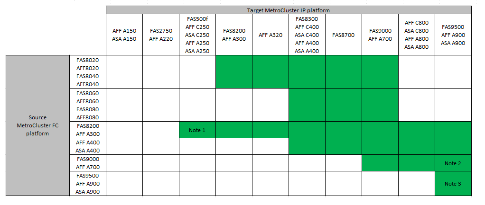

= Auswahl des Migrationsverfahrens
:allow-uri-read: 
:icons: font
:imagesdir: ../media/

[role="lead"]
Beim Umstieg auf eine MetroCluster IP-Konfiguration müssen Sie über eine Kombination unterstützter Plattformmodelle verfügen. Sie sollten außerdem sicherstellen, dass die MetroCluster IP-Plattform für die Auslastung geeignet ist, die Sie von der MetroCluster FC-Konfiguration auf die MetroCluster IP-Konfiguration umstellen.

Die folgende Tabelle zeigt die unterstützten Plattformkombinationen. Sie können von Plattformen in der linken Spalte zu Plattformen wechseln, die in den Spalten unterstützt werden, nach rechts, wie durch die farbigen Tabellenzellen angegeben.

Beispielsweise wird der Wechsel von einer MetroCluster FC-Konfiguration aus AFF8060 Controller-Modulen zu einer IP-Konfiguration aus AFF A400 Controller-Modulen unterstützt.

* Hinweis 1: Diese Plattform erfordert ONTAP 9.11.1 oder höher.
* Hinweis 2: Auf den FC-Nodes ist eine 40-GbE-Schnittstelle für die lokalen Cluster-Schnittstellen erforderlich. Diese Kombination aus dieser Plattform erfordert ONTAP 9.12.1 oder höher.
* Hinweis 3: Auf FC-Nodes ist eine 100-GbE-Schnittstelle für die lokalen Cluster-Schnittstellen erforderlich. Diese Kombination aus dieser Plattform erfordert ONTAP 9.12.1 oder höher.
* Für alle Umstiegsprozesse ist ONTAP 9.8 oder höher erforderlich, sofern in den Hinweisen oder den Voraussetzungen einer einzelnen Plattform nicht anders angegeben.
* Auf allen Nodes in der MetroCluster-Konfiguration muss dieselbe ONTAP-Version ausgeführt werden. Wenn Sie beispielsweise über eine Konfiguration mit acht Nodes verfügen, müssen alle acht Nodes dieselbe ONTAP-Version ausführen.

[NOTE]
====
* Überschreiten Sie keine Objektgrenzen des „unteren“ der Plattformen in der Kombination. Wenden Sie die untere Objektgrenze der beiden Plattformen an.
* Wenn die Grenzen der Zielplattform unter den MetroCluster-Limits liegen, müssen Sie die MetroCluster neu konfigurieren, damit sie die Grenzen der Zielplattform erreichen oder darunter liegen, bevor Sie die neuen Nodes hinzufügen.
* Siehe link:https://hwu.netapp.html["Hardware Universe"^] Für Plattformgrenzen

====
Sie müssen ein Migrationsverfahren je nach Ihrer bestehenden MetroCluster FC-Konfiguration auswählen.

Ein Migrationsverfahren ersetzt das Back-End FC Switch Fabric oder die FC-VI-Verbindung durch ein IP Switch-Netzwerk. Die genaue Vorgehensweise hängt von Ihrer Startkonfiguration ab.

Die ursprünglichen Plattformen und FC Switches (falls vorhanden) werden am Ende des Umstiegsverfahrens außer Betrieb genommen.

[cols="20,20,20,40"]
|===

| Konfiguration wird gestartet | Unterbrechungsfrei oder unterbrechungsfrei | Anforderungen | Verfahren 

 a| 
Acht Nodes
 a| 
Unterbrechungsfrei
 a| 
Unterstützung neuer Storage Shelfs auf neuen Plattformen
 a| 
link:concept_nondisruptively_transitioning_from_a_four_node_mcc_fc_to_a_mcc_ip_configuration.html["Link zum Verfahren"]

 a| 
Vier Nodes
 a| 
Unterbrechungsfrei
 a| 
Unterstützung neuer Storage Shelfs auf neuen Plattformen
 a| 
link:concept_nondisruptively_transitioning_from_a_four_node_mcc_fc_to_a_mcc_ip_configuration.html["Link zum Verfahren"]

 a| 
Zwei Nodes
 a| 
Unterbrechungen
 a| 
Neue Storage Shelves werden sowohl auf ursprünglichen als auch auf neuen Plattformen unterstützt.
 a| 
link:task_disruptively_transition_from_a_two_node_mcc_fc_to_a_four_node_mcc_ip_configuration.html["Link zum Verfahren"]

 a| 
Zwei Nodes
 a| 
Unterbrechungen
 a| 
Neue Storage Shelves werden sowohl auf ursprünglichen als auch auf neuen Plattformen unterstützt. Alte Storage-Shelves müssen außer Betrieb genommen werden.
 a| 
link:task_disruptively_transition_while_move_volumes_from_old_shelves_to_new_shelves.html["Link zum Verfahren"]

 a| 
Zwei Nodes
 a| 
Unterbrechungen
 a| 
Alte Storage-Shelves werden auf neuen Plattformen nicht unterstützt. Alte Storage-Shelves müssen außer Betrieb genommen werden.
 a| 
link:task_disruptively_transition_when_exist_shelves_are_not_supported_on_new_controllers.html["Link zum Verfahren"]

|===