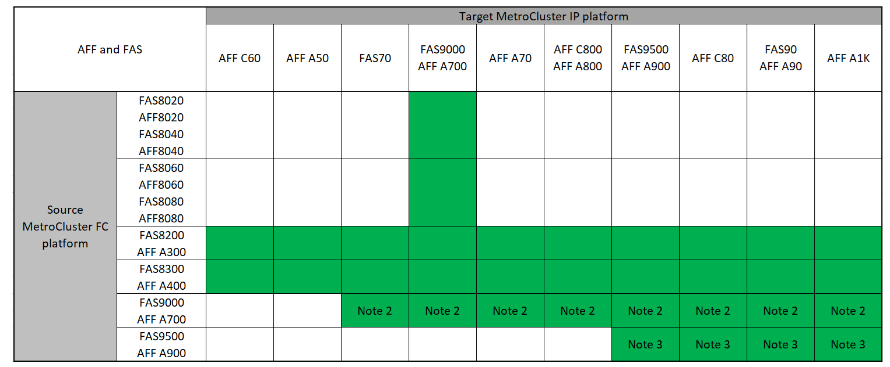

= Wählen Sie Ihr Übergangsverfahren
:allow-uri-read: 
:icons: font
:imagesdir: ../media/

[role="lead"]
Beim Umstieg auf eine MetroCluster IP-Konfiguration müssen Sie über eine Kombination unterstützter Plattformmodelle verfügen.

Sie sollten außerdem sicherstellen, dass die MetroCluster IP-Plattform für die Auslastung geeignet ist, die Sie von der MetroCluster FC-Konfiguration auf die MetroCluster IP-Konfiguration umstellen.

== Unterstützte Plattformkombinationen

* Für alle Umstiegsprozesse ist ONTAP 9.8 oder höher erforderlich, sofern in den Hinweisen oder den Voraussetzungen einer einzelnen Plattform nicht anders angegeben.
* Auf allen Nodes in der MetroCluster-Konfiguration muss dieselbe ONTAP-Version ausgeführt werden. Wenn Sie beispielsweise über eine Konfiguration mit acht Nodes verfügen, müssen alle acht Nodes dieselbe ONTAP-Version ausführen. Die unterstützte Mindestversion ONTAP für Ihre Kombination finden Sie imlink:https://hwu.netapp.com["Hardware Universe"^].

[NOTE]
====
* Überschreiten Sie keine Objektgrenzen des „unteren“ der Plattformen in der Kombination. Wenden Sie die untere Objektgrenze der beiden Plattformen an.
* Wenn die Grenzen der Zielplattform unter den MetroCluster-Limits liegen, müssen Sie die MetroCluster neu konfigurieren, damit sie die Grenzen der Zielplattform erreichen oder darunter liegen, bevor Sie die neuen Nodes hinzufügen.
* Siehe link:https://hwu.netapp.com["Hardware Universe"^] Für Plattformgrenzen

====

=== Unterstützte AFF- und FAS-Übergangskombinationen

Die folgenden Tabellen zeigen die unterstützten Plattformkombinationen. Sie können von Plattformen in der ersten Spalte zu Plattformen wechseln, die in den Spalten nach rechts als unterstützt aufgeführt sind, wie durch die farbigen Tabellenzellen angegeben.

Beispielsweise wird der Wechsel von einer MetroCluster FC-Konfiguration aus AFF8060 Controller-Modulen zu einer IP-Konfiguration aus AFF A400 Controller-Modulen unterstützt.

Die Tabellen sind in zwei Gruppen aufgeteilt:

* *Gruppe 1* zeigt Kombinationen für Übergänge zu AFF A150, AFF A20, FAS2750, FAS8300, FAS500f, AFF C250, AFF A250, FAS50, AFF C30, AFF A30, FAS8200, AFF C400, AFF A400, AFF A220, AFF A300, AFF A320 und FAS8700 Systemen.
* *Gruppe 2* zeigt Kombinationen für Übergänge zu AFF C60, AFF A50, FAS70, FAS9000, AFF A700, AFF A70, AFF C800, AFF A800, FAS9500, AFF A900, AFF C80, FAS90, AFF A90 und AFF A1K Systemen.

Die folgenden Hinweise gelten für beide Gruppen:

* Hinweis 1: Diese Plattform erfordert ONTAP 9.11.1 oder höher.
* Hinweis 2: Auf den FC-Nodes ist eine 40-GbE-Schnittstelle für die lokalen Cluster-Schnittstellen erforderlich.
* Hinweis 3: Auf FC-Nodes ist eine 100-GbE-Schnittstelle für die lokalen Cluster-Schnittstellen erforderlich.

[role="tabbed-block"]
====
.AFF- und FAS-Kombinationen, Gruppe 1
--
Sehen Sie sich die unterstützten Kombinationen für Transitions to AFF A150, AFF A20, AFF C250, FAS8300, FAS500f, FAS2750, AFF A250, FAS50, AFF C30, AFF A30, FAS8200, AFF A300, AFF A400, AFF A220, AFF C400, AFF A320 und FAS8700 an.

image:../media/transition-combinations-group-1.png["Zeigt unterstützte Übergänge für Gruppen-1-Plattformen an"]

--
.AFF und FAS Kombinationsgruppe 2
--
Sehen Sie sich die unterstützten Kombinationen für Übergänge zu AFF C60, AFF A50, FAS70, FAS9000, AFF A700, AFF A70, AFF C800, AFF A800, FAS9500, AFF A900, AFF C80, FAS90, AFF A90 und AFF A1K Systemen an.

--
====

=== Unterstützte ASA-Plattformkombinationen für den Umstieg

In der folgenden Tabelle sind die unterstützten Plattformkombinationen für ASA Systeme aufgeführt.

[cols="3*"]
|===
| Quell-MetroCluster FC-Plattform | MetroCluster IP-Zielplattform | Unterstützt? 

.2+| ASA A400 | ASA A400 | Ja. 

| ASA A900 | Nein 

.2+| ASA A900 | ASA A400 | Nein 

| ASA A900 | Ja. 
|===

== Wählen Sie Ihr Übergangsverfahren

Sie müssen ein Migrationsverfahren je nach Ihrer bestehenden MetroCluster FC-Konfiguration auswählen.

Ein Migrationsverfahren ersetzt das Back-End FC Switch Fabric oder die FC-VI-Verbindung durch ein IP Switch-Netzwerk. Die genaue Vorgehensweise hängt von Ihrer Startkonfiguration ab.

Die ursprünglichen Plattformen und FC Switches (falls vorhanden) werden am Ende des Umstiegsverfahrens außer Betrieb genommen.

[cols="20,20,20,40"]
|===

| Konfiguration wird gestartet | Unterbrechungsfrei oder unterbrechungsfrei | Anforderungen | Verfahren 

 a| 
Vier oder acht Nodes
 a| 
Unterbrechungsfrei
 a| 
Unterstützung neuer Storage Shelfs auf neuen Plattformen
 a| 
link:concept_nondisruptively_transitioning_from_a_four_node_mcc_fc_to_a_mcc_ip_configuration.html["Link zum Verfahren"]

 a| 
Zwei Nodes
 a| 
Unterbrechungen
 a| 
Neue Storage Shelves werden sowohl auf ursprünglichen als auch auf neuen Plattformen unterstützt.
 a| 
link:task_disruptively_transition_from_a_two_node_mcc_fc_to_a_four_node_mcc_ip_configuration.html["Link zum Verfahren"]

 a| 
Zwei Nodes
 a| 
Unterbrechungen
 a| 
Neue Storage Shelves werden sowohl auf ursprünglichen als auch auf neuen Plattformen unterstützt. Alte Storage-Shelves müssen außer Betrieb genommen werden.
 a| 
link:task_disruptively_transition_while_move_volumes_from_old_shelves_to_new_shelves.html["Link zum Verfahren"]

 a| 
Zwei Nodes
 a| 
Unterbrechungen
 a| 
Alte Storage-Shelves werden auf neuen Plattformen nicht unterstützt. Alte Storage-Shelves müssen außer Betrieb genommen werden.
 a| 
link:task_disruptively_transition_when_exist_shelves_are_not_supported_on_new_controllers.html["Link zum Verfahren"]

|===