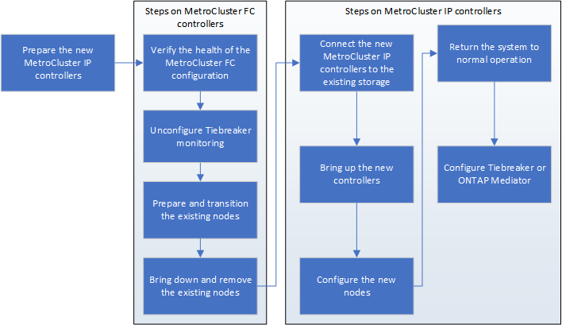

= Vorbereitung auf den Umstieg mit FC-to-IP und Störungen
:allow-uri-read: 
:icons: font
:imagesdir: ../media/

[role="lead"]
Bevor Sie mit dem Umstieg beginnen, müssen Sie sicherstellen, dass die Konfiguration die Anforderungen erfüllt.

== Aktivieren Sie die Konsolenprotokollierung

NetApp empfiehlt dringend, die Konsolenprotokollierung auf den von Ihnen verwendeten Geräten zu aktivieren und folgende Aktionen durchzuführen:

* Lassen Sie AutoSupport während der Wartung aktiviert.
* Lösen Sie vor und nach der Wartung eine Wartungs-AutoSupport-Meldung aus, um die Case-Erstellung für die Dauer der Wartungsaktivität zu deaktivieren.
+
Siehe Knowledge Base-Artikel link:https://kb.netapp.com/Support_Bulletins/Customer_Bulletins/SU92["Wie kann die automatische Case-Erstellung während geplanter Wartungszeiträume unterdrückt werden"^].

* Aktivieren Sie die Sitzungsprotokollierung für jede CLI-Sitzung. Anweisungen zum Aktivieren der Sitzungsprotokollierung finden Sie im Abschnitt „Protokollierung der Sitzungsausgabe“ im Knowledge Base-Artikel link:https://kb.netapp.com/on-prem/ontap/Ontap_OS/OS-KBs/How_to_configure_PuTTY_for_optimal_connectivity_to_ONTAP_systems["So konfigurieren Sie PuTTY für optimale Konnektivität zu ONTAP-Systemen"^].

== Allgemeine Anforderungen für die disruptive FC-to-IP Umstellung

Die vorhandene MetroCluster FC-Konfiguration muss die folgenden Anforderungen erfüllen:

* Die Konfiguration muss zwei Nodes sein, und alle Nodes müssen ONTAP 9.8 oder höher ausführen.
+
Dabei kann es sich um eine Fabric-Attached oder eine Stretch-MetroCluster mit zwei Nodes handelt.

* Er muss alle Anforderungen und Verkabelung erfüllen, wie in den Verfahren _MetroCluster Installation and Configuration_ beschrieben.
+
link:../install-fc/index.html["Installation und Konfiguration von Fabric-Attached MetroCluster"]

+
link:../install-stretch/concept_considerations_differences.html["Installation und Konfiguration von Stretch MetroCluster"]

* Es kann nicht mit NetApp Storage Encryption (NSE) konfiguriert werden.
* Die MDV-Volumes können nicht verschlüsselt werden.

Sie müssen über Remote-Konsolenzugriff für alle sechs Nodes von einem MetroCluster Standort aus verfügen oder Reisen zwischen den Standorten planen, wie im Verfahren erforderlich.

== Wiederverwendung von Festplatten-Shelfs und Festplattenanforderungen für einen unterbrechungsfreien Wechsel von FC zu IP

Es muss sichergestellt werden, dass auf den Storage-Shelves ausreichend freie Laufwerke und Root-Aggregatspeicherplatz zur Verfügung stehen.

=== Wiederverwendung der vorhandenen Storage Shelfs

Bei Verwendung dieses Verfahrens werden die vorhandenen Storage-Shelfs zur Verwendung durch die neue Konfiguration beibehalten. Wenn Node_A_1-FC und Node_B_1-FC entfernt werden, werden die vorhandenen Laufwerk-Shelfs auf Cluster_A_1-IP und Node_A_2-IP auf Cluster_A sowie Node_B_1-IP und Node_B_2-IP auf Cluster_B verbunden

* Die vorhandenen Storage-Shelfs (diejenigen, die an Node_A_1-FC und Node_B_1-FC angeschlossen sind) müssen von den neuen Plattformmodellen unterstützt werden.
+
Wenn die vorhandenen Shelfs nicht von den neuen Plattformmodellen unterstützt werden, finden Sie unter link:task_disruptively_transition_when_exist_shelves_are_not_supported_on_new_controllers.html["Unterbrechungsfreie Transition, wenn vorhandene Shelfs nicht auf neuen Controllern unterstützt werden (ONTAP 9.8 und höher)"].

* Sie müssen sicherstellen, dass Sie die Plattformgrenzen für Laufwerke usw. nicht überschreiten
+
https://hwu.netapp.com["NetApp Hardware Universe"^]

=== Storage-Anforderungen für die zusätzlichen Controller

Falls erforderlich muss zusätzlicher Storage hinzugefügt werden, um die beiden zusätzlichen Controller unterzubringen (Node_A_2-IP und Node_B_2-ip), da die Konfiguration von einer Anordnung mit zwei Nodes auf vier Nodes geändert wird.

* Je nach den in den vorhandenen Shelves verfügbaren Spare-Laufwerken müssen zusätzliche Laufwerke hinzugefügt werden, um die zusätzlichen Controller in der Konfiguration zu unterstützen.
+
Dies erfordert möglicherweise zusätzliche Storage Shelves, wie in der folgenden Abbildung dargestellt.

+
image::../media/transition_2n_4_new_ip_nodes_on_the_shelves.png[Wechsel 2n 4 neue ip-Knoten auf den Regalen]

+
Sie benötigen weitere 14 bis 18 Laufwerke für die dritte und vierte Controller (Node_A_2-IP und Node_B_2-IP):

+
** Drei Pool0-Laufwerke
** Drei Pool1-Laufwerke
** Zwei Ersatzlaufwerke
** Sechs bis zehn Laufwerke für das System-Volume

* Sie müssen sicherstellen, dass die Konfiguration, einschließlich der neuen Nodes, die Plattformlimits für die Konfiguration nicht überschreitet, einschließlich Laufwerksanzahl, Root-Aggregatgröße usw.
+
Diese Informationen sind für jedes Plattformmodell bei _NetApp Hardware Universe_ verfügbar.

+
https://hwu.netapp.com["NetApp Hardware Universe"^]

== Workflow für Unterbrechungen

Um eine erfolgreiche Umstellung sicherzustellen, müssen Sie den spezifischen Workflow einhalten.

Planen Sie bei der Vorbereitung der Transition die Reise zwischen den Standorten ein. Beachten Sie, dass Sie nach dem Rack und verkabelt der Remote-Nodes seriellen Zugriff auf die Nodes benötigen. Der Service-Prozessor-Zugriff ist erst verfügbar, wenn die Nodes konfiguriert sind.

== Zuordnen von Ports von den MetroCluster FC-Nodes zu den MetroCluster IP-Nodes

Sie müssen die Port- und LIF-Konfiguration des MetroCluster FC-Node anpassen, damit er mit dem MetroCluster IP-Node kompatibel ist, der den Node ersetzt.

.Über diese Aufgabe
Wenn die neuen Nodes zum ersten Mal während des Upgrades gebootet werden, verwendet jeder Node die aktuellste Konfiguration des Node, der ausgetauscht wird. Wenn Sie Node_A_1-IP booten, versucht ONTAP, LIFs auf denselben Ports zu hosten, die auf Node_A_1-FC verwendet wurden.

Während des Übergangs führen Sie sowohl für die alten als auch für die neuen Nodes Schritte durch, um eine korrekte Cluster-, Management- und Daten-LIF-Konfiguration sicherzustellen.

.Schritte
. Identifizieren Sie alle Konflikte zwischen der vorhandenen MetroCluster FC-Port-Nutzung und der Portnutzung für die MetroCluster IP-Schnittstellen auf den neuen Nodes.
+
Sie müssen die MetroCluster IP-Ports auf den neuen MetroCluster IP Controllern mithilfe der folgenden Tabelle identifizieren. Überprüfen und protokollieren Sie dann, ob Daten-LIFs oder Cluster-LIFs auf den Ports auf den MetroCluster FC-Nodes vorhanden sind.

+
Diese gegensätzlichen Daten-LIFs oder Cluster-LIFs auf den MetroCluster FC Nodes werden beim entsprechenden Schritt beim Migrationsvorgang verschoben.

+
In der folgenden Tabelle werden die MetroCluster IP-Ports nach Plattformmodell aufgeführt. Sie können die Spalte VLAN-ID ignorieren.

+
|===

| Modell der Plattform | MetroCluster-IP-Port | VLAN-ID |  

.2+| AFF A800  a| 
e0b
.8+| Nicht verwendet  a| 

 a| 
e1b
 a| 

.2+| AFF A700 UND FAS9000  a| 
e5a
 a| 

 a| 
E5b
 a| 

.2+| AFF A320  a| 
e0g.
 a| 

 a| 
e0h
 a| 

.2+| AFF A300 UND FAS8200  a| 
e1a
 a| 

 a| 
e1b
 a| 

.2+| FAS8300/A400/FAS8700  a| 
e1a
 a| 
10
 a| 

 a| 
e1b
 a| 
20
 a| 

.2+| AFF A250 und FAS500f  a| 
e0c
 a| 
10
 a| 

 a| 
e0b
 a| 
20
 a| 

|===
+
Sie können die folgende Tabelle ausfüllen und später im Migrationsverfahren nachschlagen.

+
|===

| Ports | Entsprechende MetroCluster IP-Schnittstellen-Ports (aus Tabelle oben) | LIFs auf diesen Ports auf den MetroCluster FC-Nodes sind widersprüchlich 

 a| 
Erster MetroCluster-IP-Port auf Node_A_1-FC
 a| 
 a| 

 a| 
Zweiter MetroCluster-IP-Port auf Node_A_1-FC
 a| 
 a| 

 a| 
Erster MetroCluster-IP-Port auf Node_B_1-FC
 a| 
 a| 

 a| 
Zweiter MetroCluster-IP-Port auf Node_B_1-FC
 a| 
 a| 

|===
. Legen Sie fest, welche physischen Ports auf den neuen Controllern verfügbar sind und welche LIFs auf den Ports gehostet werden können.
+
Die Port-Nutzung des Controllers hängt vom Plattformmodell und dem IP-Switch-Modell ab, das Sie in der MetroCluster IP-Konfiguration verwenden werden. Sie können die Port-Nutzung der neuen Plattformen von _NetApp Hardware Universe_ erfassen.

+
https://hwu.netapp.com["NetApp Hardware Universe"^]

. Notieren Sie bei Bedarf die Portinformationen für Node_A_1-FC und Node_A_1-IP.
+
Bei der Durchführung des Übergangsverfahrens wird auf die Tabelle verwiesen.

+
Fügen Sie in den Spalten für Node_A_1-IP die physischen Ports für das neue Controller-Modul hinzu und planen Sie die IPspaces und Broadcast-Domänen für den neuen Knoten.

+
|===

|  3+| Node_A_1-FC 3+| Node_A_1-IP 

| LIF | Ports | IPspaces | Broadcast-Domänen | Ports | IPspaces | Broadcast-Domänen 

 a| 
Cluster 1
 a| 
 a| 
 a| 
 a| 
 a| 
 a| 

 a| 
Cluster 2
 a| 
 a| 
 a| 
 a| 
 a| 
 a| 

 a| 
Cluster 3
 a| 
 a| 
 a| 
 a| 
 a| 
 a| 

 a| 
Cluster 4
 a| 
 a| 
 a| 
 a| 
 a| 
 a| 

 a| 
Node-Management
 a| 
 a| 
 a| 
 a| 
 a| 
 a| 

 a| 
Cluster-Management
 a| 
 a| 
 a| 
 a| 
 a| 
 a| 

 a| 
Daten 1
 a| 
 a| 
 a| 
 a| 
 a| 
 a| 

 a| 
Daten 2
 a| 
 a| 
 a| 
 a| 
 a| 
 a| 

 a| 
Daten 3
 a| 
 a| 
 a| 
 a| 
 a| 
 a| 

 a| 
Daten 4
 a| 
 a| 
 a| 
 a| 
 a| 
 a| 

 a| 
San
 a| 
 a| 
 a| 
 a| 
 a| 
 a| 

 a| 
Intercluster-Port
 a| 
 a| 
 a| 
 a| 
 a| 
 a| 

|===
. Notieren Sie ggf. alle Portinformationen für Node_B_1-FC.
+
Sie verweisen auf die Tabelle, während Sie das Upgrade-Verfahren durchführen.

+
Fügen Sie in den Spalten für Node_B_1-IP die physischen Ports für das neue Controller-Modul hinzu und planen Sie die Verwendung des LIF-Ports, IPspaces und Broadcast-Domänen für den neuen Knoten.

+
|===

|  3+| Node_B_1-FC 3+| Node_B_1-IP 

| LIF | Physische Ports | IPspaces | Broadcast-Domänen | Physische Ports | IPspaces | Broadcast-Domänen 

 a| 
Cluster 1
 a| 
 a| 
 a| 
 a| 
 a| 
 a| 

 a| 
Cluster 2
 a| 
 a| 
 a| 
 a| 
 a| 
 a| 

 a| 
Cluster 3
 a| 
 a| 
 a| 
 a| 
 a| 
 a| 

 a| 
Cluster 4
 a| 
 a| 
 a| 
 a| 
 a| 
 a| 

 a| 
Node-Management
 a| 
 a| 
 a| 
 a| 
 a| 
 a| 

 a| 
Cluster-Management
 a| 
 a| 
 a| 
 a| 
 a| 
 a| 

 a| 
Daten 1
 a| 
 a| 
 a| 
 a| 
 a| 
 a| 

 a| 
Daten 2
 a| 
 a| 
 a| 
 a| 
 a| 
 a| 

 a| 
Daten 3
 a| 
 a| 
 a| 
 a| 
 a| 
 a| 

 a| 
Daten 4
 a| 
 a| 
 a| 
 a| 
 a| 
 a| 

 a| 
San
 a| 
 a| 
 a| 
 a| 
 a| 
 a| 

 a| 
Intercluster-Port
 a| 
 a| 
 a| 
 a| 
 a| 
 a| 

|===

== Vorbereiten der MetroCluster IP-Controller

Sie müssen die vier neuen MetroCluster IP-Knoten vorbereiten und die korrekte ONTAP-Version installieren.

.Über diese Aufgabe
Diese Aufgabe muss auf jedem der neuen Knoten ausgeführt werden:

* Node_A_1-IP
* Node_A_2-IP
* Node_B_1-IP
* Node_B_2-IP

Die Nodes sollten mit jedem *neuen* Storage-Shelf verbunden sein. Sie müssen *nicht* an die vorhandenen Storage Shelfs mit Daten angeschlossen sein.

Diese Schritte können Sie jetzt oder später bei der Ablage der Controller und Shelfs durchführen. In jedem Fall müssen Sie sicherstellen, dass Sie die Konfiguration löschen und die Knoten *vorbereiten, bevor* sie mit den vorhandenen Speicher-Shelfs verbinden und *bevor* Änderungen an der Konfiguration an den MetroCluster FC Nodes vornehmen.

NOTE: Führen Sie diese Schritte nicht durch, wenn die MetroCluster IP-Controller mit den vorhandenen Storage-Shelfs verbunden sind, die mit den MetroCluster FC-Controllern verbunden waren.

Löschen Sie in diesen Schritten die Konfiguration auf den Knoten und löschen Sie den Mailbox-Bereich auf neuen Laufwerken.

.Schritte
. Verbinden Sie die Controller-Module mit den neuen Storage Shelfs.
. Zeigen Sie im Wartungsmodus den HA-Status des Controller-Moduls und des Chassis an:
+
`ha-config show`

+
Der HA-Status für alle Komponenten sollte „`mccip`“ sein.

. Wenn der angezeigte Systemzustand des Controllers oder Chassis nicht korrekt ist, setzen Sie den HA-Status ein:
+
`ha-config modify controller mccip``ha-config modify chassis mccip`

. Beenden des Wartungsmodus:
+
`halt`

+
Warten Sie, bis der Node an der LOADER-Eingabeaufforderung angehalten wird, nachdem Sie den Befehl ausgeführt haben.

. Wiederholen Sie die folgenden Teilschritte auf allen vier Knoten, um die Konfiguration zu löschen:
+
.. Legen Sie die Umgebungsvariablen auf Standardwerte fest:
+
`set-defaults`

.. Umgebung speichern:
+
`saveenv`

+
`bye`

. Wiederholen Sie die folgenden Teilschritte, um alle vier Knoten mit der Option 9a im Startmenü zu booten.
+
.. Starten Sie an der LOADER-Eingabeaufforderung das Boot-Menü:
+
`boot_ontap menu`

.. Wählen Sie im Startmenü die Option „`9a`“, um den Controller neu zu booten.

. Starten Sie jeden der vier Knoten in den Wartungsmodus mit der Option „`5`“ im Startmenü.
. Notieren Sie die System-ID und von jedem der vier Knoten:
+
`sysconfig`

. Wiederholen Sie die folgenden Schritte auf Node_A_1-IP und Node_B_1-IP.
+
.. Weisen Sie jedem Standort das Eigentum aller lokalen Festplatten zu:
+
`disk assign adapter.xx.*`

.. Wiederholen Sie den vorherigen Schritt für jeden HBA mit angeschlossenen Laufwerk-Shelfs auf Node_A_1-IP und Node_B_1-IP.

. Wiederholen Sie die folgenden Schritte auf Node_A_1-IP und Node_B_1-IP, um den Mailbox-Bereich auf jeder lokalen Festplatte zu löschen.
+
.. Zerstören Sie den Mailbox-Bereich auf jeder Festplatte:
+
`mailbox destroy local``mailbox destroy partner`

. Beenden aller vier Controller:
+
`halt`

. Zeigen Sie auf jedem Controller das Startmenü an:
+
`boot_ontap menu`

. Löschen Sie bei jedem der vier Controller die Konfiguration:
+
`wipeconfig`

+
Wenn der Wipeconfig-Vorgang abgeschlossen ist, kehrt der Knoten automatisch zum Boot-Menü zurück.

. Wiederholen Sie die folgenden Teilschritte, um alle vier Knoten mithilfe der Option 9a im Startmenü erneut zu booten.
+
.. Starten Sie an der LOADER-Eingabeaufforderung das Boot-Menü:
+
`boot_ontap menu`

.. Wählen Sie im Startmenü die Option „`9a`“, um den Controller neu zu booten.
.. Lassen Sie das Controller-Modul vor dem Wechsel zum nächsten Controller-Modul booten.

+
Nach Abschluss von „`9a`“ kehren die Nodes automatisch zum Startmenü zurück.

. Schalten Sie die Controller aus.

== Überprüfen des Systemzustands der MetroCluster FC-Konfiguration

Sie müssen vor der Umstellung den Zustand und die Konnektivität der MetroCluster FC-Konfiguration überprüfen

Diese Aufgabe wird in der MetroCluster FC-Konfiguration ausgeführt.

. Überprüfen Sie den Betrieb der MetroCluster-Konfiguration in ONTAP:
+
.. Prüfen Sie, ob das System multipathed ist:
+
`node run -node node-name sysconfig -a`

.. Überprüfen Sie auf beiden Clustern auf Zustandswarnmeldungen:
+
`system health alert show`

.. Bestätigen Sie die MetroCluster-Konfiguration und den normalen Betriebsmodus:
+
`metrocluster show`

.. Durchführen einer MetroCluster-Prüfung:
+
`metrocluster check run`

.. Ergebnisse der MetroCluster-Prüfung anzeigen:
+
`metrocluster check show`

.. Prüfen Sie, ob auf den Switches Zustandswarnmeldungen vorliegen (falls vorhanden):
+
`storage switch show`

.. Nutzen Sie Config Advisor.
+
https://mysupport.netapp.com/site/tools/tool-eula/activeiq-configadvisor["NetApp Downloads: Config Advisor"^]

.. Überprüfen Sie nach dem Ausführen von Config Advisor die Ausgabe des Tools und befolgen Sie die Empfehlungen in der Ausgabe, um die erkannten Probleme zu beheben.

. Vergewissern Sie sich, dass sich die Nodes im Non-HA-Modus befinden:
+
`storage failover show`

== Entfernen der vorhandenen Konfiguration über den Tiebreaker oder eine andere Monitoring-Software

Wenn die vorhandene Konfiguration mit der MetroCluster Tiebreaker Konfiguration oder anderen Applikationen anderer Anbieter (z. B. ClusterLion) überwacht wird, die eine Umschaltung initiieren können, müssen Sie die MetroCluster Konfiguration vor dem Umstieg aus dem Tiebreaker oder einer anderen Software entfernen.

.Schritte
. Entfernen Sie die vorhandene MetroCluster-Konfiguration über die Tiebreaker Software.
+
link:../tiebreaker/concept_configuring_the_tiebreaker_software.html#removing-metrocluster-configurations["Entfernen von MetroCluster-Konfigurationen"]

. Entfernen Sie die vorhandene MetroCluster Konfiguration von jeder Anwendung eines Drittanbieters, die eine Umschaltung initiieren kann.
+
Informationen zur Anwendung finden Sie in der Dokumentation.

