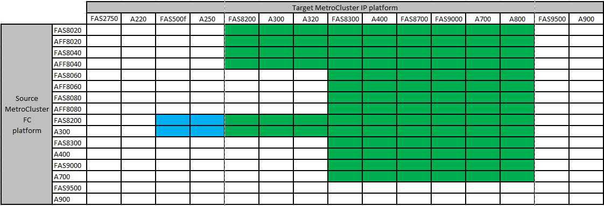

= Unterstützte Plattformen für unterbrechungsfreien Übergang
:allow-uri-read: 
:icons: font
:imagesdir: ../media/

[role="lead"]
Beim Umstieg auf eine MetroCluster IP-Konfiguration müssen Sie über eine Kombination unterstützter Plattformmodelle verfügen. Sie sollten außerdem sicherstellen, dass die MetroCluster IP-Plattform für die Auslastung geeignet ist, die Sie von der MetroCluster FC-Konfiguration auf die MetroCluster IP-Konfiguration umstellen.

Die folgende Tabelle zeigt die unterstützten Plattformkombinationen. Sie können von Plattformen in der linken Spalte zu Plattformen wechseln, die in den Spalten unterstützt werden, nach rechts, wie durch die farbigen Tabellenzellen angegeben.

* Eine grüne Zelle zeigt an, dass die Kombination unterstützt wird.
* Eine weiße (leere) Zelle zeigt an, dass die Kombination nicht unterstützt wird.
* Eine blaue Zelle zeigt, dass die Kombination ab ONTAP 9.11.1 unterstützt wird.

Beispielsweise wird der Wechsel von einer MetroCluster FC-Konfiguration aus AFF8060 Controller-Modulen zu einer IP-Konfiguration aus AFF A400 Controller-Modulen unterstützt.

== Wechsel zu einer gemeinsamen Switch-Konfiguration von Cisco 9336C-FX2

Der Umstieg auf eine Cisco 9336C-FX2 Shared-Switch-Konfiguration wird nicht unterstützt. Eine _Shared Switch-Konfiguration_ ist eine Konfiguration, bei der die Switches sowohl die MetroCluster-Verbindungen als auch die Storage-Shelf-Verbindungen bereitstellen.

Konfigurationen, bei denen der Cisco 9336C-FX2 Switch nur die MetroCluster-Verbindungen bereitstellt, werden unterstützt.
