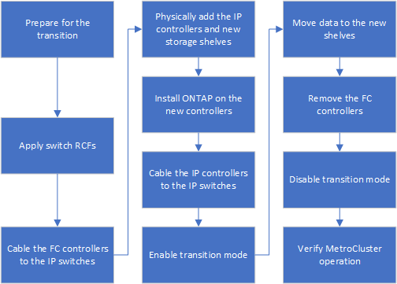

= Workflow für unterbrechungsfreie MetroCluster Transition
:allow-uri-read: 
:icons: font
:imagesdir: ../media/

[role="lead"]
Um einen erfolgreichen unterbrechungsfreien Übergang zu gewährleisten, müssen Sie die jeweiligen Workflows beachten. Wählen Sie den Workflow für Ihre Konfiguration aus:

* <<Workflow zur Migration der FC-Konfiguration mit vier Nodes>>
* <<Workflow zur Migration der FC-Konfiguration mit acht Nodes>>

== Workflow zur Migration der FC-Konfiguration mit vier Nodes

Der Umstellungsprozess beginnt mit einer soliden MetroCluster FC-Konfiguration mit vier Nodes.

image::../media/transition_dr_group_1_fc_nodes.png[Übergangs-FC-Knoten in DR-Gruppe 1]

Die neuen MetroCluster IP Knoten werden als zweite DR-Gruppe hinzugefügt.

image::../media/transition_dr_groups_fc_and_ip.png[Übergangs-DR-Gruppe mit vorhandenen FC- und IP-Knoten]

Die Daten werden von der alten DR-Gruppe zur neuen DR-Gruppe übertragen, gefolgt von den alten Nodes und ihrem Storage werden aus der Konfiguration entfernt und stillgelegt. Der Prozess endet mit einer MetroCluster IP-Konfiguration mit vier Nodes.

image::../media/transition_dr_group_2_ip.png[Übergangs-DR-Gruppe 2 IP-Knoten]

== Workflow zur Migration der FC-Konfiguration mit acht Nodes

Der Wechsel beginnt mit einer funktionierenden MetroCluster FC-Konfiguration mit acht Nodes.

image::../media/mcc_dr_group_c1.png[Acht-Knoten- MetroCluster -FC-Konfiguration vor der Umstellung]

Die neuen MetroCluster IP Nodes werden als dritte DR-Gruppe hinzugefügt.

image::../media/mcc_dr_group_c2.png[Acht-Knoten-Konfiguration mit als dritte DR-Gruppe hinzugefügten IP-Knoten]

Die Daten werden von DR_Group_1-FC zu DR_Group_1-IP übertragen und anschließend die alten Knoten und deren Speicher aus der Konfiguration entfernt und außer Betrieb genommen.

NOTE: Wenn Sie von einer FC-Konfiguration mit acht Knoten auf eine IP-Konfiguration mit vier Knoten umstellen möchten, müssen Sie alle Daten in DR_Group_1-FC und DR_Group_2-FC auf die neue IP DR-Gruppe (DR_Group_1-IP) übertragen. Sie können dann beide FC DR-Gruppen außer Betrieb nehmen. Nachdem die FC DR-Gruppen entfernt wurden, endet der Prozess mit einer MetroCluster IP Konfiguration mit vier Nodes.

image::../media/mcc_dr_group_c8.png[Acht-Knoten-Konfiguration nach dem ersten DR-Gruppenübergang]

Fügen Sie der vorhandenen MetroCluster-Konfiguration die verbleibenden MetroCluster IP-Nodes hinzu. Wiederholen Sie den Vorgang, um Daten von den DR_Group_2-FC-Nodes auf die DR_Group_2-IP-Nodes zu übertragen.

image::../media/mcc_dr_group_c7.png[Acht-Knoten-Konfiguration mit hinzugefügten verbleibenden IP-Knoten]

Nach dem Entfernen von DR_Group_2-FC endet der Prozess mit einer MetroCluster IP-Konfiguration mit acht Knoten.

image::../media/mcc_dr_group_c6.png[Acht-Knoten- MetroCluster IP-Konfiguration nach der Umstellung]

== Workflow für den Umstellungsprozess

Sie verwenden den folgenden Workflow, um die MetroCluster Konfiguration zu wechseln.

