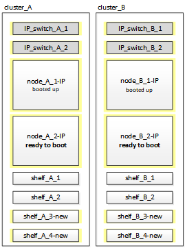

= Anschließen der MetroCluster IP-Controller-Module
:allow-uri-read: 
:icons: font
:imagesdir: ../media/

[role="lead"]
Die Konfiguration muss die vier neuen Controller-Module und alle zusätzlichen Storage Shelfs enthalten. Die neuen Controller-Module werden zwei Mal hinzugefügt.

== Einrichten der neuen Controller

Sie müssen die neuen MetroCluster IP Controller in einem Rack unterbringen und mit den zuvor mit den MetroCluster FC-Controllern verbundenen Storage-Shelfs verkabeln.

.Über diese Aufgabe
Diese Schritte müssen auf jedem der MetroCluster IP Knoten durchgeführt werden.

* Node_A_1-IP
* Node_A_2-IP
* Node_B_1-IP
* Node_B_2-IP

Im folgenden Beispiel werden an jedem Standort zwei zusätzliche Storage Shelfs hinzugefügt, um den Storage für die neuen Controller-Module bereitzustellen.

image::../media/transition_2n_4_new_ip_nodes_and_shelves.png[Wechsel 2n 4 neue ip-Knoten und Shelves]

.Schritte
. Planen Sie die Positionierung der neuen Controller-Module und Storage Shelves je nach Bedarf.
+
Der Rack-Platz hängt vom Plattformmodell der Controller-Module, den Switch-Typen und der Anzahl der Storage-Shelfs in Ihrer Konfiguration ab.

. Richtig gemahlen.
. Rack-Fläche für neue Geräte: Controller, Storage Shelfs und IP Switches.
+
Verkabeln Sie jetzt nicht die Storage-Shelfs oder IP-Switches.

. Schließen Sie die Stromkabel und die Verbindung der Managementkonsole an die Controller an.
. Vergewissern Sie sich, dass alle Storage-Shelfs ausgeschaltet sind.
. Stellen Sie sicher, dass keine Laufwerke verbunden sind, indem Sie die folgenden Schritte auf allen vier Nodes ausführen:
+
.. Starten Sie an der LOADER-Eingabeaufforderung das Boot-Menü:
+
`boot_ontap maint`

.. Vergewissern Sie sich, dass keine Laufwerke angeschlossen sind:
+
`disk show -v`

+
Die Ausgabe sollte keine Laufwerke anzeigen.

.. Stoppen Sie den Knoten:
+
`halt`

. Starten Sie alle vier Knoten mit der Option 9a im Startmenü.
+
.. Starten Sie an der LOADER-Eingabeaufforderung das Boot-Menü:
+
`boot_ontap menu`

.. Wählen Sie im Startmenü die Option „`9a`“, um den Controller neu zu booten.
.. Lassen Sie das Controller-Modul vor dem Wechsel zum nächsten Controller-Modul booten.

+
Nach Abschluss von „`9a`“ kehren die Nodes automatisch zum Startmenü zurück.

. Die Storage-Shelfs verkabeln.
+
Informationen zur Verkabelung finden Sie in den Verfahren zur Controller-Installation und -Einrichtung des Modells.

+
https://["AFF and FAS Documentation Center"^]

. Verbinden Sie die Controller mit den IP-Switches, wie in beschrieben link:../install-ip/using_rcf_generator.html["Verkabeln der IP-Switches"].
. Bereiten Sie die IP-Schalter für die Anwendung der neuen RCF-Dateien vor.
+
Befolgen Sie die Schritte für Ihren Switch-Anbieter:

+
** link:../install-ip/task_switch_config_broadcom.html["Zurücksetzen des Broadcom IP-Switches auf die Werkseinstellungen"]
** link:../install-ip/task_switch_config_cisco.html["Zurücksetzen des Cisco IP-Switches auf die Werkseinstellungen"]

. Laden Sie die RCF-Dateien herunter und installieren Sie sie.
+
Befolgen Sie die Schritte für Ihren Switch-Anbieter:

+
** link:../install-ip/task_switch_config_broadcom.html["Herunterladen und Installieren der Broadcom RCF-Dateien"]
** link:../install-ip/task_switch_config_cisco.html["Herunterladen und Installieren der Cisco IP RCF-Dateien"]

. Schalten Sie den ersten neuen Controller (Node_A_1-IP) ein und drücken Sie Strg-C, um den Boot-Prozess zu unterbrechen und die LOADER-Eingabeaufforderung anzuzeigen.
. Booten des Controllers in den Wartungsmodus:
+
`boot_ontap_maint`

. Zeigen Sie die System-ID für den Controller an:
+
`sysconfig -v`

. Vergewissern Sie sich, dass die Shelfs der vorhandenen Konfiguration über den neuen MetroCluster IP-Node sichtbar sind:
+
`storage show shelf``disk show -v`

. Stoppen Sie den Knoten:
+
`halt`

. Wiederholen Sie die vorherigen Schritte auf dem anderen Node am Partnerstandort (Site_B).

== Verbinden und Booten von Node_A_1-IP und Node_B_1-IP

Nach dem Anschließen der MetroCluster-IP-Controller und IP-Switches wechseln und starten Sie Node_A_1-IP und Node_B_1-IP.

=== Node_A_1-IP wird wieder aktiv

Sie müssen den Node mit der richtigen Übergangsoption booten.

.Schritte
. Boot Node_A_1-IP zum Boot-Menü:
+
`boot_ontap menu`

. Geben Sie den folgenden Befehl an der Eingabeaufforderung des Startmenüs ein, um den Übergang zu initiieren:
+
`boot_after_mcc_transition`

+
** Mit diesem Befehl werden alle Festplatten, die sich im Besitz von Node_A_1-FC befinden, zu Node_A_1-IP neu zugewiesen.
+
*** Node_A_1-FC-Festplatten sind Node_A_1-IP zugewiesen
*** Node_B_1-FC-Festplatten sind Node_B_1-IP zugewiesen

** Der Befehl führt auch automatisch andere erforderliche System-ID-Zuordnungen durch, damit die MetroCluster IP-Knoten an der ONTAP-Eingabeaufforderung booten können.
** Wenn der Befehl Boot_after_mcc_Transition aus irgendeinem Grund ausfällt, sollte er über das Startmenü erneut ausgeführt werden.
+
[NOTE]
====
*** Wenn die folgende Eingabeaufforderung angezeigt wird, geben Sie Strg-C ein, um fortzufahren. MCC DR-Status wird überprüft... [Strg-C (Lebenslauf), S(Status), L(Link)]_ eingeben
*** Wenn das Root-Volume verschlüsselt war, stoppt der Node mit der folgenden Meldung. Beenden des Systems, da das Root-Volume verschlüsselt ist (NetApp Volume Encryption) und der Schlüssel-Import fehlgeschlagen ist. Überprüfen Sie den Systemzustand der Schlüsselserver, wenn dieses Cluster mit einem externen (KMIP) Schlüsselmanager konfiguriert ist.

====
+
[listing]
----

Please choose one of the following:
(1) Normal Boot.
(2) Boot without /etc/rc.
(3) Change password.
(4) Clean configuration and initialize all disks.
(5) Maintenance mode boot.
(6) Update flash from backup config.
(7) Install new software first.
(8) Reboot node.
(9) Configure Advanced Drive Partitioning. Selection (1-9)? `boot_after_mcc_transition`
This will replace all flash-based configuration with the last backup to disks. Are you sure you want to continue?: yes

MetroCluster Transition: Name of the MetroCluster FC node: `node_A_1-FC`
MetroCluster Transition: Please confirm if this is the correct value [yes|no]:? y
MetroCluster Transition: Disaster Recovery partner sysid of MetroCluster FC node node_A_1-FC: `systemID-of-node_B_1-FC`
MetroCluster Transition: Please confirm if this is the correct value [yes|no]:? y
MetroCluster Transition: Disaster Recovery partner sysid of local MetroCluster IP node: `systemID-of-node_B_1-IP`
MetroCluster Transition: Please confirm if this is the correct value [yes|no]:? y
----

. Wenn Daten-Volumes verschlüsselt sind, stellen Sie die Schlüssel mithilfe des richtigen Befehls für Ihre Schlüsselverwaltungskonfiguration wieder her.
+
[cols="1,2"]
|===

| Sie verwenden... | Befehl 

 a| 
* Onboard-Verschlüsselungsmanagement*
 a| 
`security key-manager onboard sync`

Weitere Informationen finden Sie unter https://["Wiederherstellung der integrierten Schlüssel für das Verschlüsselungsmanagement"^].

 a| 
*Externes Schlüsselmanagement*
 a| 
`security key-manager key query -node node-name`

Weitere Informationen finden Sie unter https://["Wiederherstellen der externen Schlüssel für das Verschlüsselungsmanagement"^].

|===
. Wenn das Root-Volume verschlüsselt ist, verwenden Sie das Verfahren unter link:../transition/task_connect_the_mcc_ip_controller_modules_2n_mcc_transition_supertask.html#recovering-key-management-if-the-root-volume-is-encrypted["Wiederherstellung des Verschlüsselungsmanagements bei Verschlüsselung des Root-Volumes"].

=== Wiederherstellung des Verschlüsselungsmanagements bei Verschlüsselung des Root-Volumes

Wenn das Root-Volume verschlüsselt ist, müssen Sie spezielle Boot-Befehle verwenden, um das Verschlüsselungsmanagement wiederherzustellen.

.Bevor Sie beginnen
Sie müssen die Passphrases früher gesammelt haben.

.Schritte
. Wenn die integrierte Schlüsselverwaltung verwendet wird, führen Sie die folgenden Teilschritte durch, um die Konfiguration wiederherzustellen.
+
.. Zeigen Sie von der LOADER-Eingabeaufforderung das Boot-Menü an:
+
`boot_ontap menu`

.. Wählen Sie im Startmenü die Option „`(10) Set Onboard Key Management Recovery Secrets`“.
+
Gehen Sie bei Bedarf auf die Eingabeaufforderungen ein:

+
[listing]
----
This option must be used only in disaster recovery procedures. Are you sure? (y or n): y
Enter the passphrase for onboard key management: passphrase
Enter the passphrase again to confirm: passphrase

Enter the backup data: backup-key
----
+
Das System startet zum Startmenü.

.. Geben Sie im Startmenü die Option „`6`“ ein.
+
Gehen Sie bei Bedarf auf die Eingabeaufforderungen ein:

+
[listing]
----
This will replace all flash-based configuration with the last backup to
disks. Are you sure you want to continue?: y

Following this, the system will reboot a few times and the following prompt will be available continue by saying y

WARNING: System ID mismatch. This usually occurs when replacing a boot device or NVRAM cards!
Override system ID? {y|n} y
----
+
Nach dem Neubooten erhält das System die LOADER-Eingabeaufforderung.

.. Zeigen Sie von der LOADER-Eingabeaufforderung das Boot-Menü an:
+
`boot_ontap menu`

.. Wählen Sie wieder Option „`(10) set Onboard Key Management Recovery Secrets`“ aus dem Boot Menu aus.
+
Gehen Sie bei Bedarf auf die Eingabeaufforderungen ein:

+
[listing]
----
This option must be used only in disaster recovery procedures. Are you sure? (y or n): `y`
Enter the passphrase for onboard key management: `passphrase`
Enter the passphrase again to confirm:`passphrase`

Enter the backup data:`backup-key`
----
+
Das System startet zum Startmenü.

.. Geben Sie im Startmenü die Option „`1`“ ein.
+
Wenn die folgende Eingabeaufforderung angezeigt wird, können Sie Strg+C drücken, um den Vorgang fortzusetzen.

+
....
 Checking MCC DR state... [enter Ctrl-C(resume), S(status), L(link)]
....
+
Das System bootet zur ONTAP-Eingabeaufforderung.

.. Wiederherstellung des Onboard-Verschlüsselungsmanagement:
+
`security key-manager onboard sync`

+
Beantworten Sie die Eingabeaufforderungen entsprechend mit der zuvor erfassten Passphrase:

+
[listing]
----
cluster_A::> security key-manager onboard sync
Enter the cluster-wide passphrase for onboard key management in Vserver "cluster_A":: passphrase
----

. Wenn die externe Schlüsselverwaltung verwendet wird, führen Sie die folgenden Teilschritte durch, um die Konfiguration wiederherzustellen.
+
.. Legen Sie die erforderlichen Bootargs fest:
+
`setenv bootarg.kmip.init.ipaddr ip-address`

+
`setenv bootarg.kmip.init.netmask netmask`

+
`setenv bootarg.kmip.init.gateway gateway-address`

+
`setenv bootarg.kmip.init.interface interface-id`

.. Zeigen Sie von der LOADER-Eingabeaufforderung das Boot-Menü an:
+
`boot_ontap menu`

.. Wählen Sie im Startmenü die Option „`(11) Knoten für externes Verschlüsselungsmanagement` konfigurieren.
+
Das System startet zum Startmenü.

.. Geben Sie im Startmenü die Option „`6`“ ein.
+
Das System bootet mehrmals. Sie können bestätigen, wenn Sie dazu aufgefordert werden, den Bootvorgang fortzusetzen.

+
Nach dem Neubooten erhält das System die LOADER-Eingabeaufforderung.

.. Legen Sie die erforderlichen Bootargs fest:
+
`setenv bootarg.kmip.init.ipaddr ip-address`

+
`setenv bootarg.kmip.init.netmask netmask`

+
`setenv bootarg.kmip.init.gateway gateway-address`

+
`setenv bootarg.kmip.init.interface interface-id`

.. Zeigen Sie von der LOADER-Eingabeaufforderung das Boot-Menü an:
+
`boot_ontap menu`

.. Wählen Sie erneut im Startmenü die Option „`(11) Knoten für die Verwaltung externer Schlüssel konfigurieren`“ aus, und reagieren Sie auf die Eingabeaufforderungen, falls erforderlich.
+
Das System startet zum Startmenü.

.. Stellen Sie das externe Schlüsselmanagement wieder her:
+
`security key-manager external restore`

=== Erstellen der Netzwerkkonfiguration

Sie müssen eine Netzwerkkonfiguration erstellen, die der Konfiguration auf den FC-Nodes entspricht. Dies liegt daran ONTAP, dass der MetroCluster IP-Node beim Booten die gleiche Konfiguration wiedergibt. Dies bedeutet, dass Node_A_1-IP und Node_B_1-IP Boot versuchen wird, LIFs auf denselben Ports zu hosten, die auf Node_A_1-FC und Node_B_1-FC verwendet wurden.

.Über diese Aufgabe
Verwenden Sie beim Erstellen der Netzwerkkonfiguration den in erstellten Plan link:concept_requirements_for_fc_to_ip_transition_2n_mcc_transition.html["Zuordnen von Ports von den MetroCluster FC-Nodes zu den MetroCluster IP-Nodes"] Um Ihnen zu helfen.

NOTE: Nach der Konfiguration der MetroCluster IP-Nodes ist möglicherweise eine zusätzliche Konfiguration erforderlich, um die Daten-LIFs anzuzeigen.

.Schritte
. Vergewissern Sie sich, dass sich alle Cluster-Ports in der entsprechenden Broadcast-Domäne befinden:
+
Zum Erstellen von Cluster-LIFs sind der Cluster-IPspace und die Cluster-Broadcast-Domäne erforderlich

+
.. IP-Bereiche anzeigen:
+
`network ipspace show`

.. Erstellen Sie IP-Leerzeichen und weisen Sie nach Bedarf Cluster-Ports zu.
+
http://["Konfigurieren von IPspaces (nur Cluster-Administratoren)"^]

.. Broadcast-Domänen anzeigen:
+
`network port broadcast-domain show`

.. Fügen Sie je nach Bedarf beliebige Cluster-Ports zu einer Broadcast-Domäne hinzu.
+
https://["Hinzufügen oder Entfernen von Ports aus einer Broadcast-Domäne"^]

.. VLANs und Schnittstellengruppen nach Bedarf neu erstellen.
+
VLAN und Interface Group Mitgliedschaft können sich von der des alten Node unterscheiden.

+
https://["Erstellen eines VLANs"^]

+
https://["Verbinden von physischen Ports zum Erstellen von Schnittstellengruppen"^]

. Überprüfen Sie, ob die MTU-Einstellungen für die Ports und die Broadcast-Domäne korrekt eingestellt sind, und nehmen Sie mithilfe der folgenden Befehle Änderungen vor:
+
`network port broadcast-domain show`

+
`network port broadcast-domain modify -broadcast-domain _bcastdomainname_ -mtu _mtu-value_`

=== Einrichten von Cluster-Ports und Cluster-LIFs

Sie müssen Cluster-Ports und LIFs einrichten. Die folgenden Schritte müssen an dem Standort Eine Node ausgeführt werden, die mit Root-Aggregaten gestartet wurden.

.Schritte
. Identifizieren Sie die Liste der LIFs mithilfe des gewünschten Cluster-Ports:
+
`network interface show -curr-port portname`

+
`network interface show -home-port portname`

. Ändern Sie für jeden Cluster-Port den Home-Port einer der LIFs auf diesem Port in einen anderen Port,
+
.. Rufen Sie den erweiterten Berechtigungsmodus auf, und geben Sie „`y`“ ein, wenn Sie dazu aufgefordert werden, fortzufahren:
+
`set priv advanced`

.. Wenn das bearbeitete LIF eine Daten-LIF ist:
+
`vserver config override -command "network interface modify -lif _lifname_ -vserver _vservername_ -home-port _new-datahomeport_"`

.. Wenn das LIF keine Daten-LIF ist:
+
`network interface modify -lif _lifname_ -vserver _vservername_ -home-port _new-datahomeport_`

.. Zurücksetzen der geänderten LIFs auf ihren Home-Port:
+
`network interface revert * -vserver _vserver_name_`

.. Vergewissern Sie sich, dass am Cluster-Port keine LIFs vorhanden sind:
+
`network interface show -curr-port _portname_`

+
`network interface show -home-port _portname_`

.. Entfernen Sie den Port aus der aktuellen Broadcast-Domäne:
+
`network port broadcast-domain remove-ports -ipspace _ipspacename_ -broadcast-domain _bcastdomainname_ -ports _node_name:port_name_`

.. Fügen Sie den Port dem Cluster-IPspace und der Broadcast-Domäne hinzu:
+
`network port broadcast-domain add-ports -ipspace Cluster -broadcast-domain Cluster -ports _node_name:port_name_`

.. Vergewissern Sie sich, dass sich die Portrolle geändert hat: `network port show`
.. Wiederholen Sie diese Teilschritte für jeden Cluster-Port.
.. Zurück zum Admin-Modus:
+
`set priv admin`

. Erstellen von Cluster-LIFs an den neuen Cluster-Ports:
+
.. Verwenden Sie den folgenden Befehl, um eine automatische Konfiguration mithilfe der Link-lokalen Adresse für Cluster-LIF zu erstellen:
+
`network interface create -vserver Cluster -lif _cluster_lifname_ -service-policy _default-cluster_ -home-node _a1name_ -home-port clusterport -auto true`

.. Verwenden Sie den folgenden Befehl, um eine statische IP-Adresse für die Cluster-LIF zuzuweisen:
+
`network interface create -vserver Cluster -lif _cluster_lifname_ -service-policy default-cluster -home-node _a1name_ -home-port _clusterport_ -address _ip-address_ -netmask _netmask_ -status-admin up`

=== LIF-Konfiguration wird überprüft

Nach der Verschiebung des Storage vom alten Controller bleiben die Node-Management-LIF, die Cluster-Management-LIF und das Intercluster LIF weiterhin vorhanden. Falls erforderlich, müssen Sie LIFs an die entsprechenden Ports verschieben.

.Schritte
. Überprüfen Sie, ob sich die Management-LIF und Cluster-Management-LIFs bereits auf dem gewünschten Port befinden:
+
`network interface show -service-policy default-management`

+
`network interface show -service-policy default-intercluster`

+
Wenn sich die LIFs auf den gewünschten Ports befinden, können Sie die restlichen Schritte dieser Aufgabe überspringen und mit der nächsten Aufgabe fortfahren.

. Ändern Sie für jeden Node, Cluster-Management oder Intercluster-LIFs, die sich nicht am gewünschten Port befinden, den Home Port einer der LIFs auf diesem Port in einen anderen Port.
+
.. Umwidmung des gewünschten Ports durch Verschieben jeder auf dem gewünschten Port gehosteten LIFs zu einem anderen Port:
+
`vserver config override -command "network interface modify -lif _lifname_ -vserver _vservername_ -home-port _new-datahomeport_"`

.. Zurücksetzen der geänderten LIFs auf ihren neuen Home-Port:
+
`vserver config override -command "network interface revert -lif _lifname_ -vserver _vservername"`

.. Wenn sich der gewünschte Port nicht im richtigen IPspace und Broadcast-Domäne befindet, entfernen Sie den Port aus dem aktuellen IPspace und Broadcast-Domain:
+
`network port broadcast-domain remove-ports -ipspace _current-ipspace_ -broadcast-domain _current-broadcast-domain_ -ports _controller-name:current-port_`

.. Verschieben Sie den gewünschten Port in den richtigen IPspace und Broadcast Domain:
+
`network port broadcast-domain add-ports -ipspace _new-ipspace_ -broadcast-domain _new-broadcast-domain_ -ports _controller-name:new-port_`

.. Vergewissern Sie sich, dass sich die Portrolle geändert hat:
+
`network port show`

.. Wiederholen Sie diese Teilschritte für jeden Port.

. Verschieben Sie Node, Cluster-Management-LIFs und Intercluster-LIF zum gewünschten Port:
+
.. Ändern Sie den Home-Port des LIF:
+
`network interface modify -vserver _vserver_ -lif _node_mgmt_ -home-port _port_ -home-node _homenode_`

.. Zurücksetzen des LIF auf seinen neuen Home Port:
+
`network interface revert -lif _node_mgmt_ -vserver _vservername_`

.. Ändern Sie den Home-Port der Cluster-Management-LIF:
+
`network interface modify -vserver _vserver_ -lif _cluster-mgmt-LIF-name_ -home-port _port_ -home-node _homenode_`

.. Zurücksetzen der Cluster-Management-LIF auf seinen neuen Home-Port:
+
`network interface revert -lif _cluster-mgmt-LIF-name_ -vserver _vservername_`

.. Ändern Sie den Home-Port des Intercluster LIF:
+
`network interface modify -vserver _vserver_ -lif _intercluster-lif-name_ -home-node _nodename_ -home-port _port_`

.. Zurücksetzen der Intercluster-LIF auf seinen neuen Home-Port:
+
`network interface revert -lif _intercluster-lif-name_ -vserver _vservername_`

== Node_A_2-IP und Node_B_2-IP werden heraufgebracht

Sie müssen den neuen MetroCluster IP Node an jedem Standort erzeugen und konfigurieren, sodass an jedem Standort ein HA-Paar erstellt wird.

=== Node_A_2-IP und Node_B_2-IP werden heraufgebracht

Sie müssen die neuen Controller-Module nacheinander mit der richtigen Option im Startmenü booten.

.Über diese Aufgabe
In diesen Schritten booten Sie die beiden brandneuen Nodes und erweiterten die bislang eine Konfiguration mit zwei Nodes in eine Konfiguration mit vier Nodes.

Auf den folgenden Knoten werden diese Schritte durchgeführt:

* Node_A_2-IP
* Node_B_2-IP

.Schritte
. Starten Sie die neuen Nodes mithilfe der Boot-Option „`9c`“.
+
[listing]
----
Please choose one of the following:
(1) Normal Boot.
(2) Boot without /etc/rc.
(3) Change password.
(4) Clean configuration and initialize all disks.
(5) Maintenance mode boot.
(6) Update flash from backup config.
(7) Install new software first.
(8) Reboot node.
(9) Configure Advanced Drive Partitioning. Selection (1-9)? 9c
----
+
Der Node initialisiert und bootet den Node-Setup-Assistenten, ähnlich wie folgt.

+
[listing]
----
Welcome to node setup
You can enter the following commands at any time:
"help" or "?" - if you want to have a question clarified,
"back" - if you want to change previously answered questions, and
"exit" or "quit" - if you want to quit the setup wizard.
Any changes you made before quitting will be saved.
To accept a default or omit a question, do not enter a value. .
.
.
----
+
Wenn die Option „`9c`“ nicht erfolgreich ist, führen Sie die folgenden Schritte aus, um möglichen Datenverlust zu vermeiden:

+
** Versuchen Sie nicht, Option 9a auszuführen.
** Trennen Sie physisch die vorhandenen Shelfs, die Daten enthalten, von der ursprünglichen MetroCluster FC-Konfiguration (Shelf_A_1, Shelf_A_2, Shelf_B_1, Shelf_B_2).
** Wenden Sie sich an den technischen Support, und verweisen Sie auf den KB-Artikel https://["Übergang von MetroCluster FC zu IP – Option 9c schlägt fehl"^].
+
https://["NetApp Support"^]

. Aktivieren Sie das AutoSupport-Tool, indem Sie den Anweisungen des Assistenten folgen.
. Befolgen Sie die Aufforderungen zur Konfiguration der Node-Managementoberfläche.
+
[listing]
----
Enter the node management interface port: [e0M]:
Enter the node management interface IP address: 10.228.160.229
Enter the node management interface netmask: 225.225.252.0
Enter the node management interface default gateway: 10.228.160.1
----
. Vergewissern Sie sich, dass der Storage Failover-Modus auf HA eingestellt ist:
+
`storage failover show -fields mode`

+
Wenn der Modus keine HA ist, setzen Sie ihn ein:

+
`storage failover modify -mode ha -node _localhost_`

+
Sie müssen dann den Node neu booten, damit die Änderung wirksam wird.

. Liste der Ports im Cluster:
+
`network port show`

+
Eine vollständige Befehlssyntax finden Sie in der man-Page.

+
Im folgenden Beispiel werden die Netzwerkports in cluster01 angezeigt:

+
[listing]
----

cluster01::> network port show
                                                             Speed (Mbps)
Node   Port      IPspace      Broadcast Domain Link   MTU    Admin/Oper
------ --------- ------------ ---------------- ----- ------- ------------
cluster01-01
       e0a       Cluster      Cluster          up     1500   auto/1000
       e0b       Cluster      Cluster          up     1500   auto/1000
       e0c       Default      Default          up     1500   auto/1000
       e0d       Default      Default          up     1500   auto/1000
       e0e       Default      Default          up     1500   auto/1000
       e0f       Default      Default          up     1500   auto/1000
cluster01-02
       e0a       Cluster      Cluster          up     1500   auto/1000
       e0b       Cluster      Cluster          up     1500   auto/1000
       e0c       Default      Default          up     1500   auto/1000
       e0d       Default      Default          up     1500   auto/1000
       e0e       Default      Default          up     1500   auto/1000
       e0f       Default      Default          up     1500   auto/1000
----
. Beenden Sie den Knoten-Setup-Assistenten:
+
`exit`

. Loggen Sie sich unter Verwendung des Admin-Benutzernamens beim Administratorkonto ein.
. Schließen Sie den vorhandenen Cluster mit dem Cluster-Setup-Assistenten an.
+
[listing]
----
:> cluster setup
Welcome to the cluster setup wizard.
You can enter the following commands at any time:
"help" or "?" - if you want to have a question clarified,
"back" - if you want to change previously answered questions, and "exit" or "quit" - if you want to quit the cluster setup wizard.
Any changes you made before quitting will be saved.
You can return to cluster setup at any time by typing "cluster setup". To accept a default or omit a question, do not enter a value.
Do you want to create a new cluster or join an existing cluster?
{create, join}:
join
----
. Nachdem Sie den Cluster Setup-Assistenten abgeschlossen und den Vorgang beendet haben, vergewissern Sie sich, dass das Cluster aktiv ist und der Node sich in einem ordnungsgemäßen Zustand befindet:
+
`cluster show`

. Automatische Zuordnung der Festplatte deaktivieren:
+
`storage disk option modify -autoassign off -node node_A_2-IP`

. Stellen Sie bei Verwendung der Verschlüsselung die Schlüssel mithilfe des korrekten Befehls für Ihre Verschlüsselungsmanagementkonfiguration wieder her.
+
[cols="1,2"]
|===

| Sie verwenden... | Befehl 

 a| 
* Onboard-Verschlüsselungsmanagement*
 a| 
`security key-manager onboard sync`

Weitere Informationen finden Sie unter https://["Wiederherstellung der integrierten Schlüssel für das Verschlüsselungsmanagement"].

 a| 
*Externes Schlüsselmanagement*
 a| 
`security key-manager key query -node _node-name_`

Weitere Informationen finden Sie unter https://["Wiederherstellen der externen Schlüssel für das Verschlüsselungsmanagement"^].

|===
. Wiederholen Sie die oben genannten Schritte auf dem zweiten neuen Controller-Modul (Node_B_2-IP).

=== MTU-Einstellungen werden überprüft

Überprüfen Sie, ob die MTU-Einstellungen für die Ports und die Broadcast-Domäne korrekt eingestellt sind, und nehmen Sie Änderungen vor.

.Schritte
. Überprüfen Sie die in der Cluster Broadcast-Domäne verwendete MTU-Größe:
+
`network port broadcast-domain show`

. Bei Bedarf die MTU-Größe aktualisieren:
+
`network port broadcast-domain modify -broadcast-domain _bcast-domain-name_ -mtu _mtu-size_`

=== Konfigurieren von Intercluster-LIFs

Konfigurieren Sie die für Cluster-Peering erforderlichen Intercluster LIFs.

Diese Aufgabe muss an beiden neuen Knoten Node_A_2-IP und Node_B_2-IP ausgeführt werden.

.Schritt
. Konfigurieren Sie die Intercluster LIFs. Siehe link:../install-ip/task_sw_config_configure_clusters.html#configuring-intercluster-lifs-for-cluster-peering["Konfigurieren von Intercluster-LIFs"]

=== Cluster-Peering wird überprüft

Vergewissern Sie sich, dass Cluster_A und Cluster_B Peering durchgeführt und Nodes auf jedem Cluster miteinander kommunizieren können.

.Schritte
. Überprüfen Sie die Cluster-Peering-Beziehung:
+
`cluster peer health show`

+
[listing]
----
cluster01::> cluster peer health show
Node       cluster-Name                Node-Name
             Ping-Status               RDB-Health Cluster-Health  Avail…
---------- --------------------------- ---------  --------------- --------
node_A_1-IP
           cluster_B                   node_B_1-IP
             Data: interface_reachable
             ICMP: interface_reachable true       true            true
                                       node_B_2-IP
             Data: interface_reachable
             ICMP: interface_reachable true       true            true
node_A_2-IP
           cluster_B                   node_B_1-IP
             Data: interface_reachable
             ICMP: interface_reachable true       true            true
                                       node_B_2-IP
             Data: interface_reachable
             ICMP: interface_reachable true       true            true
----
. Ping, um zu überprüfen, ob die Peer-Adressen erreichbar sind:
+
`cluster peer ping -originating-node _local-node_ -destination-cluster _remote-cluster-name_`

