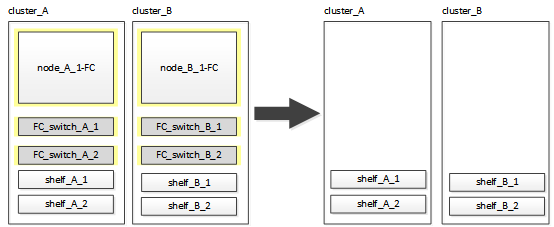

= Umstellung der MetroCluster FC Nodes
:allow-uri-read: 
:icons: font
:imagesdir: ../media/

[role="lead"]
Sie müssen Informationen von den vorhandenen MetroCluster FC Nodes erfassen, eine AutoSupport-Meldung mit Beginn der Wartung senden und die Nodes wechseln.

== Sammeln von Informationen aus den vorhandenen Controller-Modulen vor dem Umstieg

[role="lead"]
Vor dem Übergang müssen Sie Informationen für jeden der Nodes erfassen.

Diese Aufgabe wird auf den vorhandenen Knoten durchgeführt:

* Node_A_1-FC
* Node_B_1-FC
+
.. Sammeln Sie die Ausgabe für die Befehle in der folgenden Tabelle.

|===
| Kategorie | Befehle | Hinweise 

| Lizenz | Systemlizenz anzeigen |  

| Shelfs und Anzahl von Festplatten in jedem Shelf und Flash Storage sowie Arbeitsspeicher, NVRAM und Netzwerkkarten | Auf dem System-Node wird -Node_Name sysconfig ausgeführt |  

| LIFs für das Cluster-Netzwerk- und Node-Management | System Node Run -Node_Name sysconfig Netzwerkschnittstelle show -role „Cluster,Node-mgmt,Daten“ |  

| SVM-Informationen | vserver zeigen |  

| Protokollinformationen | nfs zeigen iscsi zeigen cifs zeigen |  

| Physische Ports | Netzwerk-Port show -Node_Name -type physischer Netzwerk-Port wird angezeigt |  

| Failover-Gruppen | Failover-Gruppen für Netzwerkschnittstellen zeigen -vserver vserver_Name | Notieren Sie die Namen und Ports der Failover-Gruppen, die nicht clusterweit sind. 

| VLAN-Konfiguration | Netzwerk-Port-vlan show -Node_Name | Zeichnen Sie die Paarung jedes Netzwerkports und jeder VLAN-ID auf. 

| Konfiguration der Schnittstellengruppe | Netzwerkport iffrp show -Node Node_Name -instance | Notieren Sie die Namen der Schnittstellengruppen und der ihnen zugewiesenen Ports. 

| Broadcast-Domänen | Netzwerk-Port Broadcast-Domain anzeigen |  

| IP-Bereich | Netzwerk-ipspace wird angezeigt |  

| Volume-Infos | Volume show und Volume show -fields verschlüsseln |  

| Info Zu Aggregaten | Storage Aggregat show und Storage aggr Encryption show andStorage aggregate object Store show |  

| Festplattenbesitzer | Storage Aggregat show und Storage aggr Encryption show andStorage aggregate object Store show |  

| Verschlüsselung | Speicherplatz-Failover-Mailbox-Disk show und Security Key-Manager-Backup zeigen | Bewahren Sie auch die Passphrase auf, die zum Aktivieren des Schlüsselmanagers verwendet wird. Bei einem externen Schlüsselmanager benötigen Sie die Authentifizierungsinformationen für den Client und Server. 

| Verschlüsselung | Security Key-Manager zeigen |  

| Verschlüsselung | Externe Sicherheitstaste-Manager-Show |  

| Verschlüsselung | Systemell lokale kenv kmip.init.ipaddr ip-Adresse |  

| Verschlüsselung | Systemshell lokale kenv kmip.init.netmask Netzmaske |  

| Verschlüsselung | Systemshell lokale kenv kmip.init.gateway Gateway |  

| Verschlüsselung | Systemshell lokale kenv kmip.init.interface-Schnittstelle |  
|===

== Senden einer benutzerdefinierten AutoSupport Meldung vor der Wartung

[role="lead"]
Bevor Sie die Wartung durchführen, sollten Sie eine AutoSupport Meldung ausgeben, um den technischen Support von NetApp über die laufende Wartung zu informieren. Dadurch wird verhindert, dass ein Fall unter der Annahme eröffnet wird, dass eine Störung aufgetreten ist.

Diese Aufgabe muss auf jedem MetroCluster-Standort ausgeführt werden.

. Um eine automatische Erstellung von Support-Cases zu verhindern, senden Sie eine AutoSupport Meldung, damit die Wartung läuft.
+
.. Geben Sie den folgenden Befehl ein: `system node autosupport invoke -node * -type all -message MAINT=maintenance-window-in-hours`
+
Maintenance-Fenster in Stunden gibt die Länge des Wartungsfensters an, mit maximal 72 Stunden. Wenn die Wartung vor dem Vergehen der Zeit abgeschlossen ist, können Sie eine AutoSupport-Meldung mit dem Ende des Wartungszeitraums aufrufen:``system node autosupport invoke -node * -type all -message MAINT=end``

.. Wiederholen Sie den Befehl im Partner-Cluster.

== Umstiegs-, Herunterfahren und Entfernen der MetroCluster FC-Nodes

[role="lead"]
Zusätzlich zum Ausgeben von Befehlen an den MetroCluster FC-Knoten umfasst diese Aufgabe das physische Funktioneln und Entfernen der Controller-Module an jedem Standort.

Diese Aufgabe muss an jedem der alten Knoten ausgeführt werden:

* Node_A_1-FC
* Node_B_1-FC
+
.. Beenden Sie den gesamten Client-Datenverkehr.
.. Aktivieren Sie auf einem der MetroCluster FC-Nodes, z. B. Node_A_1-FC, die Transition.
+
... Legen Sie die erweiterte Berechtigungsebene fest: `set -priv advanced`
... Übergang ermöglichen: `metrocluster transition enable -transition-mode disruptive`
... Zurück zum Admin-Modus: `set -priv admin`

.. Heben Sie das Root-Aggregat auf, indem Sie den Remote Plex der Root-Aggregate löschen.
+
... Root-Aggregate ermitteln: `storage aggregate show -root true`
... Zeigen Sie die Pool1-Aggregate an: `storage aggregate plex show -pool 1`
... Löschen Sie den lokalen Plex des Root-Aggregats: `aggr plex delete aggr-name -plex plex-name`
... Offline der Remote-Plex des Root-Aggregats: `aggr plex offline root-aggregate -plex remote-plex-for-root-aggregate`
+
Beispiel:

+
[listing]
----
 # aggr plex offline aggr0_node_A_1-FC_01 -plex plex4
----

.. Bestätigen Sie die Mailbox-Anzahl, die automatische Zuordnung der Festplatte und den Übergangsmodus, bevor Sie mit den folgenden Befehlen an jedem Controller fortfahren:
+
... Legen Sie die erweiterte Berechtigungsebene fest: `set -priv advanced`
... Vergewissern Sie sich, dass für jedes Controller-Modul nur drei Mailbox-Laufwerke angezeigt werden: `storage failover mailbox-disk show`
... Zurück zum Admin-Modus: `set -priv admin`
... Vergewissern Sie sich, dass der Umstiegmodus störend ist: MetroCluster Transition show

.. Prüfen Sie auf defekte Festplatten: `disk show -broken`
.. Entfernen oder ersetzen Sie alle defekten Festplatten
.. Überprüfen Sie mithilfe der folgenden Befehle auf Node_A_1-FC und Node_B_1-FC, ob die Aggregate ordnungsgemäß sind:``storage aggregate show``/
+
Der Befehl Storage Aggregate show gibt an, dass das Root-Aggregat nicht gespiegelt ist.

.. VLANs oder Schnittstellengruppen prüfen: `network port ifgrp show``network port vlan show`
+
Wenn keine vorhanden sind, überspringen Sie die folgenden beiden Schritte.

.. Zeigen Sie die Liste der LIFs mithilfe von VLANs oder ifgrps an: `network interface show -fields home-port,curr-port``network port show -type if-group | vlan`
.. Entfernen Sie alle VLANs und Schnittstellengruppen.
+
Sie müssen diese Schritte für alle LIFs in allen SVMs durchführen, einschließlich der SVMs mit dem -mc-Suffix.

+
... Verschieben Sie alle LIFs über VLANs oder Schnittstellengruppen zu einem verfügbaren Port: `network interface modify -vserver vserver-name -lif lif_name -home- port port`
... Zeigen Sie die LIFs an, die sich nicht an ihren Home-Ports befinden: `network interface show -is-home false`
... Alle LIFs auf die jeweiligen Home-Ports zurücksetzen: `network interface revert -vserver vserver_name -lif lif_name`
... Vergewissern Sie sich, dass sich alle LIFs auf ihren Home-Ports befinden: `network interface show -is-home false`
+
Es sollten keine LIFs in der Ausgabe angezeigt werden.

... Entfernen Sie VLAN- und iffrp-Ports aus Broadcast-Domäne: `network port broadcast-domain remove-ports -ipspace ipspace -broadcast-domain broadcast-domain-name -ports nodename:portname,nodename:portname,..`
... Vergewissern Sie sich, dass nicht alle vlan- und ifgrp-Ports einer Broadcast-Domäne zugeordnet sind: `network port show -type if-group | vlan`
... Alle VLANs löschen: `network port vlan delete -node nodename -vlan-name vlan-name`
... Löschen von Schnittstellengruppen: `network port ifgrp delete -node nodename -ifgrp ifgrp-name`

.. Verschieben Sie alle LIFs nach Bedarf, um Konflikte mit den MetroCluster IP-Schnittstellen-Ports zu lösen.
+
Sie müssen die in Schritt 1 von identifizierten LIFs verschieben link:concept_requirements_for_fc_to_ip_transition_2n_mcc_transition.html["Zuordnen von Ports von den MetroCluster FC-Nodes zu den MetroCluster IP-Nodes"].

+
... Verschieben Sie alle LIFs, die auf dem gewünschten Port gehostet werden, zu einem anderen Port: `network interface modify -lif lifname -vserver vserver-name -home-port new-homeport``network interface revert -lif lifname -vserver vservername`
... Bewegen Sie den Zielanschluss gegebenenfalls in einen entsprechenden IPspace und Broadcast-Domäne. `network port broadcast-domain remove-ports -ipspace current-ipspace -broadcast-domain current-broadcast-domain -ports controller-name:current-port``network port broadcast-domain add-ports -ipspace new-ipspace -broadcast-domain new-broadcast-domain -ports controller-name:new-port`

.. Beenden Sie die MetroCluster FC-Controller (Node_A_1-FC und Node_B_1-FC): `system node halt`
.. Synchronisieren Sie an der LOADER-Eingabeaufforderung die Hardware-Uhren zwischen den FC- und IP-Controller-Modulen.
+
... Zeigen Sie auf dem alten MetroCluster FC-Knoten (Node_A_1-FC) das Datum an: `show date`
... Legen Sie auf den neuen MetroCluster IP-Controllern (Node_A_1-IP und Node_B_1-IP) das am ursprünglichen Controller angezeigte Datum fest: `set date mm/dd/yy`
... Überprüfen Sie auf den neuen MetroCluster IP-Controllern (Node_A_1-IP und Node_B_1-IP) das Datum: `show date`

.. Anhalten und Abschalten der MetroCluster FC-Controller-Module (Node_A_1-FC und Node_B_1-FC), FC-to-SAS-Bridges (falls vorhanden), FC-Switches (falls vorhanden) und jedes mit diesen Nodes verbundene Storage-Shelf
.. Trennen Sie die Shelfs von den MetroCluster FC Controllern und dokumentieren Sie, welche Shelfs für jedes Cluster lokal sind.
+
Wenn in der Konfiguration FC-to-SAS-Bridges oder FC-Back-End-Switches verwendet werden, trennen und entfernen Sie diese.

.. Vergewissern Sie sich im Wartungsmodus auf den MetroCluster FC Nodes (Node_A_1-FC und Node_B_1-FC), dass keine Festplatten verbunden sind: `disk show -v`
.. Schalten Sie die MetroCluster FC-Nodes aus und entfernen Sie sie.

An diesem Punkt wurden die MetroCluster FC Controller entfernt und die Shelves werden von allen Controllern getrennt.

