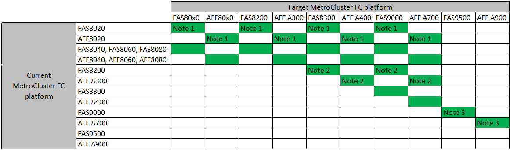

= Wählen Sie ein Controller-Upgrade-Verfahren
:allow-uri-read: 
:icons: font
:imagesdir: ../media/

[role="lead"]
Das von Ihnen verwendete Controller-Upgrade-Verfahren hängt vom Plattformmodell und dem Typ der MetroCluster-Konfiguration ab.

Bei einem Upgrade-Verfahren werden die Controller durch ein neues Controller-Modell ersetzt. Modelle für Storage Shelfs werden nicht aktualisiert.

* Bei Switchover- und Switchover-Prozessen wird der MetroCluster Switchover-Betrieb verwendet, um Clients unterbrechungsfreien Service zu bieten, während die Controller-Module im Partner-Cluster aktualisiert werden.
* Bei einem ARL-basierten Upgrade-Verfahren werden die Aggregatverschiebung verwendet, um Daten unterbrechungsfrei von der alten Konfiguration in die neue, aktualisierte Konfiguration zu verschieben.

== Auswahl eines Verfahrens, bei dem der Switchover- und Switchback-Prozess verwendet wird

Wählen Sie Ihre aktuelle Plattform aus der unten stehenden FC- oder IP-Tabelle aus. Wenn die Schnittmenge der Spalte Aktuelle Plattform und Zielplattform leer ist, wird das Upgrade nicht unterstützt.

=== Unterstützte MetroCluster IP-Controller-Upgrades

image::../media/metrocluster_ip_upgrade_table.PNG[MetroCluster ip-Upgrade-Tabelle]

* Hinweis 1: Verwenden Sie für dieses Upgrade das Verfahren link:task_upgrade_A700_to_A900_in_a_four_node_mcc_ip_us_switchover_and_switchback.html["Controller-Upgrade von AFF A700/FAS9000 auf AFF A900/FAS9500 in einer MetroCluster IP-Konfiguration mit Switchover und Switchback (ONTAP 9.10.1 oder höher)"]

=== Unterstützte MetroCluster FC-Controller-Upgrades

* Hinweis 1: Für das Upgrade von Controllern, wenn FCVI-Verbindungen auf vorhandenen FAS8020 oder AFF8020 Nodes die Ports 1c und 1d verwenden, lesen Sie Folgendeshttps://kb.netapp.com/Advice_and_Troubleshooting/Data_Protection_and_Security/MetroCluster/Upgrading_controllers_when_FCVI_connections_on_existing_FAS8020_or_AFF8020_nodes_use_ports_1c_and_1d["Knowledge Base-Artikel"^].
* Hinweis 2: Controller-Upgrades von AFF A300 oder FAS8200 Plattformen mit integrierten Ports 0e und 0f als FC-VI-Verbindungen werden nur auf Systemen mit ONTAP 9.9 unterstützt. Oder früher. Weitere Informationen finden Sie im link:https://mysupport.netapp.com/site/bugs-online/product/ONTAP/BURT/1507088["Öffentlicher Bericht"^].
* Hinweis 3: Für dieses Upgrade siehe link:task_upgrade_A700_to_A900_in_a_four_node_mcc_fc_us_switchover_and_switchback.html["Controller-Upgrade von AFF A700/FAS9000 auf AFF A900/FAS9500 in einer MetroCluster FC-Konfiguration mittels Umschaltung und Switchback (ONTAP 9.10.1 oder höher)"]

[cols="2,1,1,2"]
|===

| MetroCluster-Typ | Upgrade-Methode | ONTAP-Version | Verfahren 

 a| 
FC
 a| 
Upgrade mit Befehlen zum Ersetzen des System-Controllers
 a| 
9.10.1 und höher
 a| 
link:task_upgrade_controllers_system_control_commands_in_a_four_node_mcc_fc.html["Link zum Verfahren"]

 a| 
FC
 a| 
Manuelles Upgrade mit CLI-Befehlen (nur AFF A700/FAS9000 auf AFF A900/FAS9500)
 a| 
9.10.1 und höher
 a| 
link:task_upgrade_A700_to_A900_in_a_four_node_mcc_fc_us_switchover_and_switchback.html["Link zum Verfahren"]

 a| 
IP
 a| 
Manuelles Upgrade mit CLI-Befehlen (nur AFF A700/FAS9000 auf AFF A900/FAS9500)
 a| 
9.10.1 und höher
 a| 
link:task_upgrade_A700_to_A900_in_a_four_node_mcc_ip_us_switchover_and_switchback.html["Link zum Verfahren"]

 a| 
FC
 a| 
Manuelles Upgrade mit CLI-Befehlen
 a| 
9.8 und höher
 a| 
link:task_upgrade_controllers_in_a_four_node_fc_mcc_us_switchover_and_switchback_mcc_fc_4n_cu.html["Link zum Verfahren"]

 a| 
IP
 a| 
Manuelles Upgrade mit CLI-Befehlen
 a| 
9.8 und höher
 a| 
link:task_upgrade_controllers_in_a_four_node_ip_mcc_us_switchover_and_switchback_mcc_ip.html["Link zum Verfahren"]

|===

== Wählen eines Verfahrens mithilfe der Aggregatverschiebung

Bei einem ARL-basierten Upgrade-Verfahren werden die Aggregatverschiebung verwendet, um Daten unterbrechungsfrei von der alten Konfiguration in die neue, aktualisierte Konfiguration zu verschieben.

|===
| MetroCluster-Typ | Aggregatverschiebung | ONTAP-Version | Verfahren 

 a| 
FC
 a| 
Wird Verwendet `system controller replace` Befehle und Austausch des Controller-Moduls und NVM (Upgrade von AFF A700 auf AFF A900 nur)
 a| 
9.10.1 und höher
 a| 
https://docs.netapp.com/us-en/ontap-systems-upgrade/upgrade-arl-auto-affa900/index.html["Link zum Verfahren"^]

 a| 
FC
 a| 
Wird Verwendet `system controller replace` Befehle
 a| 
9.8 und höher
 a| 
https://docs.netapp.com/us-en/ontap-systems-upgrade/upgrade-arl-auto-app/index.html["Link zum Verfahren"^]

 a| 
FC
 a| 
Wird Verwendet `system controller replace` Befehle
 a| 
9.5 bis 9.7
 a| 
https://docs.netapp.com/us-en/ontap-systems-upgrade/upgrade-arl-auto/index.html["Link zum Verfahren"^]

 a| 
FC
 a| 
Verwenden von manuellen ARL-Befehlen
 a| 
9.8
 a| 
https://docs.netapp.com/us-en/ontap-systems-upgrade/upgrade-arl-manual-app/index.html["Link zum Verfahren"^]

 a| 
FC
 a| 
Verwenden von manuellen ARL-Befehlen
 a| 
9.7 und früher
 a| 
https://docs.netapp.com/us-en/ontap-systems-upgrade/upgrade-arl-manual/index.html["Link zum Verfahren"^]

|===