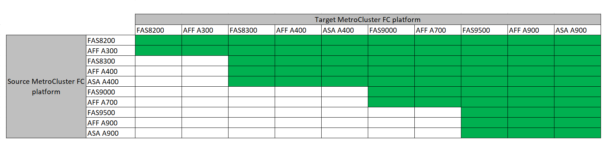

= Auswahl der Methode zur Systemaktualisierung
:allow-uri-read: 
:icons: font
:imagesdir: ../media/

[role="lead"]
Das von Ihnen verwendete Verfahren zur Systemaktualisierung hängt vom Plattformmodell und dem Typ der MetroCluster-Konfiguration ab. Aktualisierungsverfahren gelten für die Controller und die Storage Shelfs. Im Aktualisierungsverfahren werden der MetroCluster Konfiguration neue Controller und Shelves hinzugefügt, eine zweite DR-Gruppe erstellt und die Daten werden unterbrechungsfrei zu den neuen Nodes migriert. Die ursprünglichen Controller werden dann außer Betrieb genommen.

=== Unterstützte Kombinationen von MetroCluster FC-Technologie zur Aktualisierung

* Sie müssen das Verfahren zur Technologieaktualisierung abschließen, bevor Sie eine neue Last hinzufügen.
* Auf allen Nodes in der MetroCluster-Konfiguration muss dieselbe ONTAP-Version ausgeführt werden. Wenn Sie beispielsweise über eine Konfiguration mit acht Nodes verfügen, müssen alle acht Nodes dieselbe ONTAP-Version ausführen.
* Überschreiten Sie keine Objektgrenzen des „unteren“ der Plattformen in der Kombination. Wenden Sie die untere Objektgrenze der beiden Plattformen an.
* Wenn die Grenzen der Zielplattform unter den MetroCluster-Limits liegen, müssen Sie die MetroCluster neu konfigurieren, damit sie die Grenzen der Zielplattform erreichen oder darunter liegen, bevor Sie die neuen Nodes hinzufügen.
* Siehe link:https://hwu.netapp.com["Hardware Universe"^] Für Plattformgrenzen

=== Unterstützte Kombinationen aus MetroCluster IP-technischen Aktualisierungen

image::../media/metrocluster_techref_ip_914.png[MetroCluster IP-Tech Refresh-Kombinationen]

*Anmerkung 1:* Diese Kombination erfordert ONTAP 9.13.1 oder höher.

* Sie müssen das Verfahren zur Technologieaktualisierung abschließen, bevor Sie eine neue Last hinzufügen.
* Auf allen Nodes in der MetroCluster-Konfiguration muss dieselbe ONTAP-Version ausgeführt werden. Wenn Sie beispielsweise über eine Konfiguration mit acht Nodes verfügen, müssen alle acht Nodes dieselbe ONTAP-Version ausführen.
* Überschreiten Sie keine Objektgrenzen des „unteren“ der Plattformen in der Kombination. Wenden Sie die untere Objektgrenze der beiden Plattformen an.
* Wenn die Grenzen der Zielplattform unter den MetroCluster-Limits liegen, müssen Sie die MetroCluster neu konfigurieren, damit sie die Grenzen der Zielplattform erreichen oder darunter liegen, bevor Sie die neuen Nodes hinzufügen.
* Siehe link:https://hwu.netapp.com["Hardware Universe"^] Für Plattformgrenzen

[cols="2,1,1,2"]
|===
| Aktualisierungsmethode | Konfigurationstyp | ONTAP-Version | Verfahren 

 a| 
* Methode: Erweitern Sie die MetroCluster-Konfiguration, und entfernen Sie dann die alten Knoten

 a| 
FC mit vier Nodes
 a| 
9.6 und höher
 a| 
link:task_refresh_4n_mcc_fc.html["Link zum Verfahren"]

 a| 
* Methode: Erweitern Sie die MetroCluster-Konfiguration, und entfernen Sie dann die alten Knoten

 a| 
IP mit vier Nodes
 a| 
9.8 und höher
 a| 
link:task_refresh_4n_mcc_ip.html["Link zum Verfahren"]

|===