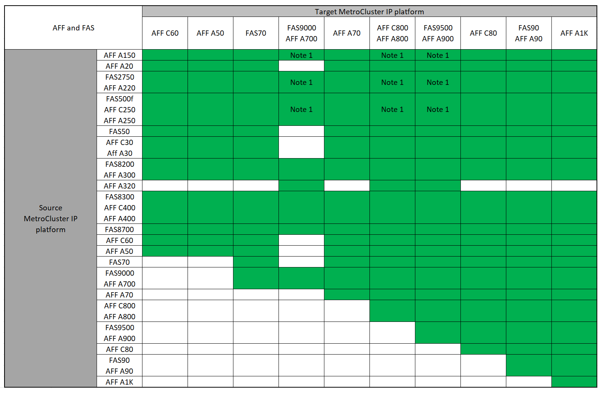

= Auswahl der Methode zur Systemaktualisierung
:allow-uri-read: 
:icons: font
:imagesdir: ../media/

[role="lead"]
Das von Ihnen verwendete Verfahren zur Systemaktualisierung hängt vom Plattformmodell und dem Typ der MetroCluster-Konfiguration ab. Aktualisierungsverfahren gelten für die Controller und die Storage Shelfs. Im Aktualisierungsverfahren werden der MetroCluster Konfiguration neue Controller und Shelves hinzugefügt, eine zweite DR-Gruppe erstellt und die Daten werden unterbrechungsfrei zu den neuen Nodes migriert. Die ursprünglichen Controller werden dann außer Betrieb genommen.

== Unterstützte Kombinationen aus MetroCluster IP-technischen Aktualisierungen

* Sie müssen das Verfahren zur Technologieaktualisierung abschließen, bevor Sie eine neue Last hinzufügen.
* Auf allen Nodes in der MetroCluster-Konfiguration muss dieselbe ONTAP-Version ausgeführt werden. Wenn Sie beispielsweise über eine Konfiguration mit acht Nodes verfügen, müssen alle acht Nodes dieselbe ONTAP-Version ausführen. Die unterstützte Mindestversion ONTAP für Ihre Kombination finden Sie imlink:https://hwu.netapp.com["Hardware Universe"^].
* Überschreiten Sie keine Objektgrenzen des „unteren“ der Plattformen in der Kombination. Wenden Sie die untere Objektgrenze der beiden Plattformen an.
* Wenn die Grenzen der Zielplattform unter den MetroCluster-Limits liegen, müssen Sie die MetroCluster neu konfigurieren, damit sie die Grenzen der Zielplattform erreichen oder darunter liegen, bevor Sie die neuen Nodes hinzufügen.
* Siehe link:https://hwu.netapp.com["Hardware Universe"^] Für Plattformgrenzen

=== Unterstützte Kombinationen aus AFF- und FAS MetroCluster IP-Tech Refresh

Die folgende Tabelle zeigt die unterstützten Plattformkombinationen für die Aktualisierung eines AFF- oder FAS-Systems in einer MetroCluster IP-Konfiguration. Die Tabellen sind in zwei Gruppen aufgeteilt:

* *Gruppe 1* zeigt Kombinationen für AFF A150, AFF A20, FAS2750, FAS8300, FAS500f, AFF C250, AFF A250, FAS50, AFF C30, AFF A30, FAS8200, AFF C400, AFF A400, AFF A220, AFF A300, AFF A320 und FAS8700 Systeme.
* *Gruppe 2* zeigt Kombinationen für AFF C60, AFF A50, FAS70, FAS9000, AFF A700, AFF A70, AFF C800, AFF A800, FAS9500, AFF A900, AFF C80, FAS90, AFF A90 und AFF A1K Systeme.

Die folgenden Hinweise gelten für beide Gruppen:

* Anmerkung 1: Diese Kombination erfordert ONTAP 9.13.1 oder höher.

[role="tabbed-block"]
====
.AFF- und FAS-Kombinationen, Gruppe 1
--
Sehen Sie sich die Kombinationen zur Systemaktualisierung für die Systeme AFF A150, FAS500f A20, AFF C250, FAS8300, AFF, FAS2750, AFF A250, FAS50, AFF C30, AFF A30, FAS8200, AFF A300, AFF A320, AFF A220, AFF C400, AFF A400 und FAS8700 an.

image:../media/tech-refresh-ip-group-1-updated.png["Systemaktualisierungskombinationen für AFF und FAS Gruppe-1-Plattformen"]

--
.AFF und FAS Kombinationsgruppe 2
--
Sehen Sie sich die Kombinationen für die Systemaktualisierung für die Systeme AFF C60, AFF A70 A50, FAS70, AFF C800, AFF A800, AFF, FAS9000, AFF A700, FAS9500, AFF A900, AFF C80, FAS90, AFF A90 und AFF A1K an.

--
====

=== Unterstützte ASA MetroCluster IP-Tech Refresh-Kombinationen

In der folgenden Tabelle sind die unterstützten Plattformkombinationen für die Aktualisierung eines ASA-Systems in einer MetroCluster IP-Konfiguration aufgeführt:

image::../media/mcc-ip-techrefresh-asa-9161.png[MetroCluster IP ASA Tech Refresh-Kombinationen]

== Unterstützte Kombinationen von MetroCluster FC-Technologie zur Aktualisierung

* Sie müssen das Verfahren zur Technologieaktualisierung abschließen, bevor Sie eine neue Last hinzufügen.
* Auf allen Nodes in der MetroCluster-Konfiguration muss dieselbe ONTAP-Version ausgeführt werden. Wenn Sie beispielsweise über eine Konfiguration mit acht Nodes verfügen, müssen alle acht Nodes dieselbe ONTAP-Version ausführen. Die unterstützte Mindestversion ONTAP für Ihre Kombination finden Sie imlink:https://hwu.netapp.com["Hardware Universe"^].
* Überschreiten Sie keine Objektgrenzen des „unteren“ der Plattformen in der Kombination. Wenden Sie die untere Objektgrenze der beiden Plattformen an.
* Wenn die Grenzen der Zielplattform unter den MetroCluster-Limits liegen, müssen Sie die MetroCluster neu konfigurieren, damit sie die Grenzen der Zielplattform erreichen oder darunter liegen, bevor Sie die neuen Nodes hinzufügen.
* Siehe link:https://hwu.netapp.com["Hardware Universe"^] Für Plattformgrenzen

=== Unterstützte Kombinationen aus AFF- und FAS MetroCluster-FC-Technologieaktualisierung

In der folgenden Tabelle sind die unterstützten Plattformkombinationen zum Aktualisieren eines AFF oder FAS Systems in einer MetroCluster FC-Konfiguration aufgeführt:

image::../media/metrocluster_fc_tech_refresh.png[Unterstützte Plattformkombinationen für die technische Aktualisierung von MetroCluster FC]

=== Unterstützte Kombinationen aus FC-Technologieaktualisierung von ASA MetroCluster

In der folgenden Tabelle sind die unterstützten Plattformkombinationen zum Aktualisieren eines ASA Systems in einer MetroCluster FC-Konfiguration aufgeführt:

[cols="3*"]
|===
| Quell-MetroCluster FC-Plattform | Ziel MetroCluster FC-Plattform | Unterstützt? 

.2+| ASA A400 | ASA A400 | Ja. 

| ASA A900 | Nein 

.2+| ASA A900 | ASA A400 | Nein 

| ASA A900 | Ja. 
|===

== Wählen Sie ein Aktualisierungsverfahren

Wählen Sie aus der folgenden Tabelle das Aktualisierungsverfahren für Ihre Konfiguration aus:

[cols="2,1,1,2"]
|===
| Aktualisierungsmethode | Konfigurationstyp | ONTAP-Version | Verfahren 

 a| 
* Methode: Erweitern Sie die MetroCluster-Konfiguration, und entfernen Sie dann die alten Knoten

 a| 
FC mit vier Nodes
 a| 
9.6 und höher
 a| 
link:task_refresh_4n_mcc_fc.html["Link zum Verfahren"]

 a| 
* Methode: Erweitern Sie die MetroCluster-Konfiguration, und entfernen Sie dann die alten Knoten

 a| 
IP mit vier Nodes
 a| 
9.8 und höher
 a| 
link:task_refresh_4n_mcc_ip.html["Link zum Verfahren"]

|===