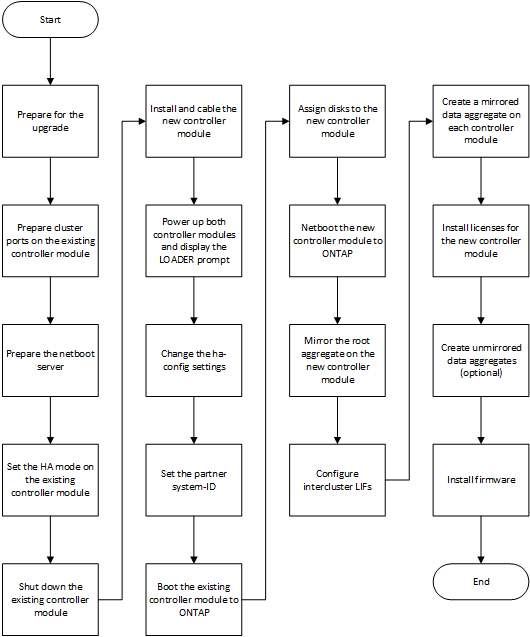

= Hinzufügen eines neuen Controller-Moduls zu jedem Cluster
:allow-uri-read: 
:icons: font
:imagesdir: ../media/

[role="lead"]
Sie müssen jedem Standort ein neues Controller-Modul hinzufügen, wodurch an jedem Standort ein HA-Paar erstellt wird. Dies ist ein mehrstufiger Prozess, der sowohl Hardware- als auch Softwareänderungen einschließt, die in der richtigen Reihenfolge an jedem Standort durchgeführt werden müssen.

.Über diese Aufgabe
* Das neue Controller-Modul muss von NetApp im Rahmen des Upgrade Kits eingehen.
+
Sie sollten überprüfen, ob PCIe-Karten im neuen Controller-Modul kompatibel sind und vom neuen Controller-Modul unterstützt werden.

+
https://hwu.netapp.com["NetApp Hardware Universe"]

* Ihr System muss beim Upgrade auf ein HA-Paar in einem Chassis über einen leeren Steckplatz für das neue Controller-Modul verfügen (ein HA-Paar, in dem sich beide Controller-Module im selben Chassis befinden).
+

NOTE: Diese Konfiguration wird nicht auf allen Systemen unterstützt. In ONTAP 9 unterstützte Plattformen mit Einzel-Chassis sind AFF A300, FAS8200, FAS8300, AFF A400, AFF80xx, FAS8020, FAS8060, FAS8080 UND FAS9000.

* Bei einem Upgrade auf ein HA-Paar mit zwei Chassis (ein HA-Paar, in dem sich die Controller-Module in einem separaten Chassis befinden) müssen Sie Rack-Platz und Kabel für das neue Controller-Modul haben.
+

NOTE: Diese Konfiguration wird nicht auf allen Systemen unterstützt.

* Sie müssen jedes Controller-Modul über seinen e0a Port mit dem Management-Netzwerk verbinden, oder, wenn Ihr System einen hat, können Sie als Management-Port eine Verbindung mit dem E0M Port herstellen.
* Diese Aufgaben müssen an jedem Standort wiederholt werden.
* Die bestehenden Controller-Module werden als _vorhandene_ Controller-Module bezeichnet.
+
Die Beispiele in diesem Verfahren enthalten die Konsolenaufforderung `existing_ctlr>`.

* Die hinzugefügten Controller-Module werden als _neue_ Controller-Module bezeichnet; die Beispiele in diesem Verfahren haben die Konsolenaufforderung `new_ctlr>`.
* Diese Aufgabe verwendet den folgenden Workflow:

