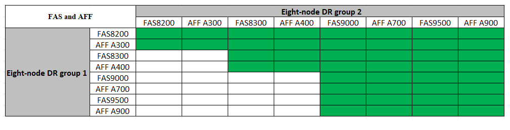

= Erweitern einer MetroCluster FC-Konfiguration mit vier Nodes auf eine Konfiguration mit acht Nodes
:allow-uri-read: 
:icons: font
:imagesdir: ../media/

[role="lead"]
Um eine MetroCluster FC-Konfiguration mit vier Nodes auf eine MetroCluster FC-Konfiguration mit acht Nodes zu erweitern, müssen jedem Cluster zwei Controller hinzugefügt werden. So bilden sie an jedem MetroCluster Standort ein zweites HA-Paar, und anschließend werden der MetroCluster FC-Konfigurationsvorgang ausgeführt.

.Über diese Aufgabe
* Die Knoten müssen ONTAP 9 in einer MetroCluster FC-Konfiguration ausführen.
+
Frühere Versionen von ONTAP oder MetroCluster IP-Konfigurationen unterstützen dieses Verfahren nicht.

* Die vorhandene MetroCluster FC-Konfiguration muss sich in einem ordnungsgemäßen Zustand befindet.
* Die Geräte, die Sie hinzufügen, müssen unterstützt werden und alle in beschriebenen Anforderungen erfüllen link:../install-fc/index.html["Installation und Konfiguration von Fabric-Attached MetroCluster"]
* Sie benötigen verfügbare FC-Switch-Ports, um die neuen Controller und neue Bridges aufnehmen zu können.
* Sie benötigen das Admin-Passwort und den Zugriff auf einen FTP- oder SCP-Server.
* Dieses Verfahren gilt nur für MetroCluster FC-Konfigurationen.
* Diese Vorgehensweise verursacht keine Unterbrechungen und dauert etwa einen Tag (ausgenommen Rack und Stack), wenn Festplatten gelöscht werden.

Bevor Sie dieses Verfahren durchführen, besteht die MetroCluster FC-Konfiguration aus vier Nodes mit einem HA-Paar an jedem Standort:

image::../media/mcc_dr_groups_4_node.gif[MetroCluster FC-Konfiguration mit vier Knoten vor der Erweiterung]

Nach Abschluss dieses Verfahrens besteht die MetroCluster FC-Konfiguration aus zwei HA-Paaren an jedem Standort:

image::../media/mcc_dr_groups_8_node.gif[MetroCluster FC-Konfiguration mit acht Knoten nach der Erweiterung]

Beide Standorte müssen gleichermaßen erweitert werden. Eine MetroCluster FC-Konfiguration darf nicht aus einer ungleichmäßigen Anzahl von Nodes bestehen.

== Unterstützte Plattformkombinationen beim Hinzufügen einer zweiten DR-Gruppe

In der folgenden Tabelle sind die unterstützten Plattformkombinationen für MetroCluster FC-Konfigurationen mit acht Nodes aufgeführt.

[IMPORTANT]
====
* Auf allen Nodes in der MetroCluster-Konfiguration muss dieselbe ONTAP-Version ausgeführt werden. Wenn Sie beispielsweise über eine Konfiguration mit acht Nodes verfügen, müssen alle acht Nodes dieselbe ONTAP-Version ausführen.
* Die Kombinationen in dieser Tabelle gelten nur für normale oder permanente Konfigurationen mit acht Nodes.
* Die Plattformkombinationen in dieser Tabelle *nicht* gelten, wenn Sie die Umstiegs- oder Aktualisierungsverfahren verwenden.
* Alle Nodes in einer DR-Gruppe müssen vom gleichen Typ und von derselben Konfiguration sein.

====
.Unterstützte AFF- und FAS MetroCluster-FC-Erweiterungskombinationen
In der folgenden Tabelle sind die unterstützten Plattformkombinationen zum erweitern eines AFF oder FAS Systems in einer MetroCluster FC-Konfiguration aufgeführt:

.Unterstützte ASA MetroCluster FC-Erweiterungskombinationen
In der folgenden Tabelle sind die unterstützten Plattformkombinationen zum erweitern eines ASA Systems in einer MetroCluster FC-Konfiguration aufgeführt:

[cols="3*"]
|===
| DR-Gruppe 1 mit acht Nodes | DR-Gruppe 2 mit acht Nodes | Unterstützt? 

.2+| ASA A400 | ASA A400 | Ja. 

| ASA A900 | Nein 

.2+| ASA A900 | ASA A400 | Nein 

| ASA A900 | Ja. 
|===