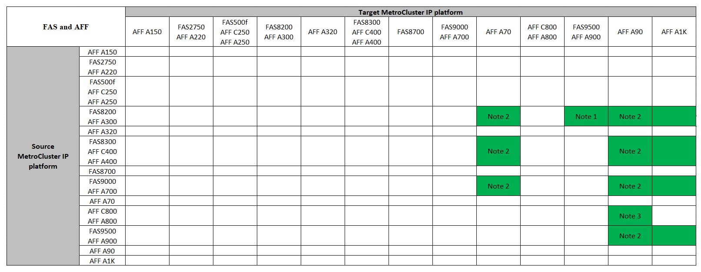
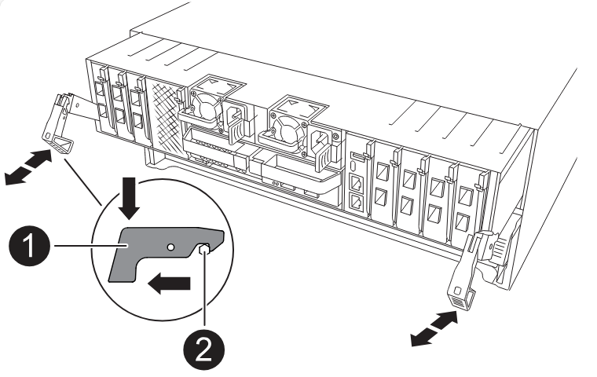

= Aktualisieren Sie Controller in einer MetroCluster IP-Konfiguration mit vier Nodes mithilfe von Switchover und Switchback mit Befehlen, die den System-Controller ersetzen (ONTAP 9.13.1 und höher).
:allow-uri-read: 
:icons: font
:imagesdir: ../media/

[role="lead"]
Sie können diese geführte automatische MetroCluster-Umschaltung verwenden, um ein unterbrechungsfreies Controller-Upgrade für eine MetroCluster IP-Konfiguration mit vier Nodes durchzuführen. Andere Komponenten (wie Storage Shelves oder Switches) können nicht im Rahmen dieses Verfahrens aktualisiert werden.

== Unterstützte MetroCluster IP-Controller-Upgrades mithilfe von Befehlen „System Controller Replace“

Finden Sie Ihre *Source*-Plattform in den MetroCluster Controller-Upgrade-Tabellen in diesem Abschnitt. Wenn die Schnittmenge der Spalte *Source* Platform und *Target* Platform leer ist, wird das Upgrade nicht unterstützt.

Bevor Sie mit dem Upgrade beginnen, überprüfen Sie die folgenden Überlegungen, um sicherzustellen, dass Ihre Konfiguration unterstützt wird.

* Wenn Ihre Plattform nicht aufgeführt ist, gibt es keine unterstützte Kombination für Controller-Upgrades.
* Wenn Sie ein Controller-Upgrade durchführen, stimmen der alte und der neue Plattformtyp *muss* überein:
+
** Sie können ein FAS System auf ein FAS System oder ein AFF A-Series auf ein AFF A-Series System aufrüsten.
** Sie können kein FAS System auf eine AFF A-Serie oder eine AFF A-Serie auf eine AFF C-Serie aufrüsten.
+
Wenn Sie beispielsweise eine FAS8200 als Plattform aktualisieren möchten, können Sie ein Upgrade auf eine FAS9000 durchführen. Sie können kein Upgrade eines FAS8200 Systems auf ein AFF A700 System durchführen.

* Auf allen Knoten (alt und neu) in der MetroCluster-Konfiguration muss dieselbe ONTAP-Version ausgeführt werden.

.Unterstützte AFF- und FAS MetroCluster IP-Controller-Upgrades
Die folgende Tabelle enthält die unterstützten Plattformkombinationen zum Upgrade eines AFF- oder FAS-Systems in einer MetroCluster IP-Konfiguration mit Befehlen „System Controller Replace“:

* Hinweis 1: Controller-Upgrades werden auf Systemen mit ONTAP 9.13.1 oder höher unterstützt.
* Hinweis 2: Die Zielplattform kann erst nach Abschluss des Controller-Upgrades interne Laufwerke haben. Sie können die internen Laufwerke nach dem Upgrade hinzufügen.
* Hinweis 3: Erfordert den Austausch der Controller-Module.

.Unterstützte ASA MetroCluster IP-Controller-Upgrades
Das Upgrade der Controller mithilfe von `system controller replace` Befehlen auf ASA Systemen wird nicht unterstützt.

Siehe link:https://docs.netapp.com/us-en/ontap-metrocluster/upgrade/concept_choosing_an_upgrade_method_mcc.html["Wahl einer Upgrade- oder Aktualisierungsmethode"] Für zusätzliche Verfahren.

== Über diese Aufgabe

* Sie können diese Vorgehensweise nur für Controller-Upgrades verwenden.
+
Andere Komponenten in der Konfiguration, wie z. B. Storage Shelfs oder Switches, können nicht gleichzeitig aktualisiert werden.

* Die MetroCluster IP Switches (Switch-Typ, Hersteller und Modell) und die Firmware-Version müssen von den vorhandenen und neuen Controllern in Ihrer Upgrade-Konfiguration unterstützt werden.
+
Informationen zu unterstützten Switches und Firmware-Versionen finden Sie im link:https://hwu.netapp.com["NetApp Hardware Universe"^] oder im link:https://imt.netapp.com/matrix/["IMT"^] .

* Auf den MetroCluster Systemen muss an beiden Standorten dieselbe ONTAP-Version ausgeführt werden.
* Folgende Vorgehensweise eignet sich zum Upgrade von Controllern in einer MetroCluster IP-Konfiguration mit vier Nodes mithilfe von NSO-basiertem automatischem Switchover und Switchback.
+

NOTE: Ein Upgrade mittels Aggregatverschiebung (Aggregate Relocation, ARL) mit Befehlen „System-Controller ersetzen“ wird für eine MetroCluster IP-Konfiguration mit vier Nodes nicht unterstützt.

* Wenn es auf Ihrem System aktiviert ist, link:../maintain/task-configure-encryption.html#disable-end-to-end-encryption["End-to-End-Verschlüsselung deaktivieren"] bevor Sie das Upgrade durchführen.
* Sie müssen das automatische NSO-Controller-Upgrade durchführen, um die Controller an beiden Standorten nacheinander aktualisieren zu können.
* Durch dieses automatische NSO-basierte Controller-Upgrade-Verfahren können Sie den Controller-Ersatz an einen MetroCluster Disaster Recovery (DR)-Standort initiieren. Sie können jeweils nur einen Controller-Austausch an einem Standort initiieren.
* Um an Standort A einen Controller-Austausch zu initiieren, müssen Sie den Startbefehl für den Controller-Austausch von Standort B ausführen Der Vorgang leitet Sie weiter, Controller beider Nodes nur an Standort A zu ersetzen. Um die Controller an Standort B zu ersetzen, müssen Sie den Startbefehl für den Controller-Ersatz von Standort A ausführen Es wird eine Meldung angezeigt, in der der Standort identifiziert wird, an dem die Controller ersetzt werden.

Folgende Beispielnamen werden in diesem Verfahren verwendet:

* Standort_A
+
** Vor dem Upgrade:
+
*** Node_A_1-alt
*** Node_A_2-alt

** Nach dem Upgrade:
+
*** Node_A_1-neu
*** Node_A_2-neu

* Standort_B
+
** Vor dem Upgrade:
+
*** Node_B_1-alt
*** Node_B_2-alt

** Nach dem Upgrade:
+
*** Node_B_1-neu
*** Node_B_2-neu

== Aktivieren Sie die Konsolenprotokollierung

NetApp empfiehlt dringend, die Konsolenprotokollierung auf den von Ihnen verwendeten Geräten zu aktivieren und folgende Aktionen durchzuführen:

* Lassen Sie AutoSupport während der Wartung aktiviert.
* Lösen Sie vor und nach der Wartung eine Wartungs-AutoSupport-Meldung aus, um die Case-Erstellung für die Dauer der Wartungsaktivität zu deaktivieren.
+
Siehe Knowledge Base-Artikel link:https://kb.netapp.com/Support_Bulletins/Customer_Bulletins/SU92["Wie kann die automatische Case-Erstellung während geplanter Wartungszeiträume unterdrückt werden"^].

* Aktivieren Sie die Sitzungsprotokollierung für jede CLI-Sitzung. Anweisungen zum Aktivieren der Sitzungsprotokollierung finden Sie im Abschnitt „Protokollierung der Sitzungsausgabe“ im Knowledge Base-Artikel link:https://kb.netapp.com/on-prem/ontap/Ontap_OS/OS-KBs/How_to_configure_PuTTY_for_optimal_connectivity_to_ONTAP_systems["So konfigurieren Sie PuTTY für optimale Konnektivität zu ONTAP-Systemen"^].

== Legen Sie den erforderlichen Bootarg auf dem vorhandenen System fest

Wenn Sie ein Upgrade auf ein AFF A70-, AFF A90- oder AFF A1K-System durchführen, befolgen Sie die Schritte zum Einstellen des `hw.cxgbe.toe_keepalive_disable=1` Bootarg.

CAUTION: Wenn Sie ein Upgrade auf ein AFF A70-, AFF A90- oder AFF A1K-System durchführen, müssen Sie diese Aufgabe vor dem Upgrade ausführen. Diese Aufgabe *only* gilt für Upgrades auf ein AFF A70-, AFF A90- oder AFF A1K-System von einem unterstützten System. Für alle anderen Upgrades können Sie diese Aufgabe überspringen und direkt zu gehen <<prepare_system_replace_upgrade,Bereiten Sie sich auf das Upgrade vor>>.

.Schritte
. Halten Sie einen Node an jedem Standort an und erlauben Sie dem HA-Partner, einen Storage-Takeover des Node durchzuführen:
+
`halt  -node <node_name>`

. Geben Sie an `LOADER` der Eingabeaufforderung des angehaltenen Node Folgendes ein:
+
`setenv hw.cxgbe.toe_keepalive_disable 1`

+
`saveenv`

+
`printenv hw.cxgbe.toe_keepalive_disable`

. Booten des Node:
+
`boot_ontap`

. Führen Sie beim Booten des Node ein Giveback für den Node durch, um folgende Eingabeaufforderung zu erhalten:
+
`storage failover giveback -ofnode <node_name>`

. Wiederholen Sie die Schritte für jeden Knoten in der DR-Gruppe, der aktualisiert wird.

== Bereiten Sie sich auf das Upgrade vor

Zur Vorbereitung auf das Controller Upgrade müssen Sie die System-Vorabprüfungen durchführen und die Konfigurationsinformationen erfassen.

Wenn der ONTAP Mediator installiert ist, wird er vor Beginn der Vorabprüfungen automatisch erkannt und entfernt. Um das Entfernen zu bestätigen, werden Sie aufgefordert, einen Benutzernamen und ein Passwort einzugeben. Wenn Sie das Upgrade abgeschlossen haben oder die Vorabprüfungen fehlschlagen oder Sie das Upgrade nicht fortsetzen möchten, müssen Sie dies tun <<man_reconfig_mediator,Konfigurieren Sie ONTAP Mediator manuell neu>>.

Während des Upgrades können Sie die ausführen `system controller replace show` Oder `system controller replace show-details` Befehl von Standort A, um den Status zu überprüfen. Wenn die Befehle eine leere Ausgabe zurückgeben, warten Sie einige Minuten, und führen Sie den Befehl erneut aus.

.Schritte
. Starten Sie das Verfahren zum automatischen Austausch der Controller von Standort A, um die Controller an Standort B zu ersetzen:
+
`system controller replace start -nso true`

+
Der automatisierte Vorgang führt die Vorabprüfungen durch. Wenn keine Probleme gefunden werden, wird der Vorgang angehalten, sodass Sie die konfigurationsbezogenen Informationen manuell erfassen können.

+
[NOTE]
====
** Wenn Sie den nicht ausführen `system controller replace start -nso true` Befehl, das Controller-Upgrade wählt NSO basierte automatische Umschaltung und Switchback als Standardverfahren bei MetroCluster IP-Systemen.
** Das aktuelle Quellsystem und alle kompatiblen Zielsysteme werden angezeigt. Wenn Sie den Quell-Controller durch einen Controller mit einer anderen ONTAP-Version oder einer nicht kompatiblen Plattform ersetzt haben, wird der Automatisierungsvorgang angehalten und ein Fehler meldet, nachdem die neuen Nodes gestartet wurden. Um den Cluster wieder in einen ordnungsgemäßen Zustand zu versetzen, müssen Sie die manuelle Recovery-Prozedur befolgen.
+
Der `system controller replace start` Der Befehl meldet möglicherweise den folgenden Vorprüffehler:

+
[listing]
----
Cluster-A::*>system controller replace show
Node        Status         Error-Action
----------- -------------- ------------------------------------
Node-A-1    Failed         MetroCluster check failed. Reason : MCC check showed errors in component aggregates
----
+
Überprüfen Sie, ob dieser Fehler aufgetreten ist, weil Sie nicht gespiegelte Aggregate oder ein anderes Problem an Aggregaten haben. Vergewissern Sie sich, dass sich alle gespiegelten Aggregate in einem ordnungsgemäßen Zustand befinden und dass sie nicht beeinträchtigt bzw. gespiegelt werden. Wenn dieser Fehler nur auf nicht gespiegelte Aggregate zurückzuführen ist, können Sie diesen Fehler durch Auswahl des überschreiben `-skip-metrocluster-check true` Option auf der `system controller replace start` Befehl. Wenn auf Remote-Storage zugegriffen werden kann, sind die nicht gespiegelten Aggregate nach einer Umschaltung online. Falls die Remote-Storage-Verbindung ausfällt, können die nicht gespiegelten Aggregate nicht online geschaltet werden.

====
. Erfassen Sie manuell die Konfigurationsinformationen, indem Sie sich bei Standort B anmelden und den Befehlen folgen, die in der Konsolenmeldung unter der aufgeführt sind `system controller replace show` Oder `system controller replace show-details` Befehl.

=== Sammeln Sie vor dem Upgrade Informationen

Vor dem Upgrade, wenn das Root-Volume verschlüsselt ist, müssen Sie den Sicherungsschlüssel und andere Informationen sammeln, um die neuen Controller mit den alten verschlüsselten Root-Volumes zu booten.

.Über diese Aufgabe
Diese Aufgabe wird für die bestehende MetroCluster IP-Konfiguration ausgeführt.

.Schritte
. Beschriften Sie die Kabel für die vorhandenen Controller, damit Sie bei der Einrichtung der neuen Controller problemlos die Kabel identifizieren können.
. Zeigen Sie die Befehle an, um den Backup-Schlüssel und weitere Informationen zu erfassen:
+
`system controller replace show`

+
Führen Sie die unter aufgeführten Befehle aus `show` Befehl aus dem Partner-Cluster.

+
Der `show` In der Befehlsausgabe werden drei Tabellen angezeigt, die die MetroCluster-Schnittstellen-IPs, System-IDs und System-UUIDs enthalten. Diese Informationen sind später im Verfahren zum Festlegen der Bootargs erforderlich, wenn Sie den neuen Node booten.

. Ermitteln Sie die System-IDs der Nodes in der MetroCluster-Konfiguration:
+
--
`metrocluster node show -fields node-systemid,dr-partner-systemid`

Während der Aktualisierung ersetzen Sie diese alten System-IDs durch die System-IDs der neuen Controller-Module.

In diesem Beispiel für eine MetroCluster-IP-Konfiguration mit vier Knoten werden die folgenden alten System-IDs abgerufen:

** Node_A_1-alt: 4068741258
** Node_A_2-alt: 4068741260
** Node_B_1-alt: 4068741254
** Node_B_2-alt: 4068741256

[listing]
----
metrocluster-siteA::> metrocluster node show -fields node-systemid,ha-partner-systemid,dr-partner-systemid,dr-auxiliary-systemid
dr-group-id        cluster           node            node-systemid     ha-partner-systemid     dr-partner-systemid    dr-auxiliary-systemid
-----------        ---------------   ----------      -------------     -------------------     -------------------    ---------------------
1                    Cluster_A       Node_A_1-old    4068741258        4068741260              4068741256             4068741256
1                    Cluster_A       Node_A_2-old    4068741260        4068741258              4068741254             4068741254
1                    Cluster_B       Node_B_1-old    4068741254        4068741256              4068741258             4068741260
1                    Cluster_B       Node_B_2-old    4068741256        4068741254              4068741260             4068741258
4 entries were displayed.
----
In diesem Beispiel für eine MetroCluster-IP-Konfiguration mit zwei Knoten werden die folgenden alten System-IDs abgerufen:

** Node_A_1: 4068741258
** Knoten_B_1: 4068741254

[listing]
----
metrocluster node show -fields node-systemid,dr-partner-systemid

dr-group-id cluster    node          node-systemid dr-partner-systemid
----------- ---------- --------      ------------- ------------
1           Cluster_A  Node_A_1-old  4068741258    4068741254
1           Cluster_B  node_B_1-old  -             -
2 entries were displayed.
----
--
. Sammeln von Port- und LIF-Informationen zu jedem alten Node
+
Sie sollten die Ausgabe der folgenden Befehle für jeden Node erfassen:

+
** `network interface show -role cluster,node-mgmt`
** `network port show -node <node-name> -type physical`
** `network port vlan show -node <node-name>`
** `network port ifgrp show -node <node-name> -instance`
** `network port broadcast-domain show`
** `network port reachability show -detail`
** `network ipspace show`
** `volume show`
** `storage aggregate show`
** `system node run -node <node-name> sysconfig -a`
** `aggr show -r`
** `disk show`
** `system node run <node-name> disk show`
** `vol show -fields type`
** `vol show -fields type , space-guarantee`
** `vserver fcp initiator show`
** `storage disk show`
** `metrocluster configuration-settings interface show`

. Wenn sich die MetroCluster-Nodes in einer SAN-Konfiguration befinden, sammeln Sie die relevanten Informationen.
+
Sie sollten die Ausgabe der folgenden Befehle erfassen:

+
** `fcp adapter show -instance`
** `fcp interface show -instance`
** `iscsi interface show`
** `ucadmin show`

. Wenn das Root-Volume verschlüsselt ist, erfassen und speichern Sie die für das Schlüsselmanagement verwendete Passphrase:
+
`security key-manager backup show`

. Wenn die MetroCluster Nodes Verschlüsselung für Volumes oder Aggregate nutzen, kopieren Sie Informationen zu Schlüsseln und Passphrases.
+
Weitere Informationen finden Sie unter https://docs.netapp.com/ontap-9/topic/com.netapp.doc.pow-nve/GUID-1677AE0A-FEF7-45FA-8616-885AA3283BCF.html["Manuelles Backup der integrierten Verschlüsselungsmanagementinformationen"^].

+
.. Wenn Onboard Key Manager konfiguriert ist:
+
`security key-manager onboard show-backup`

+
Sie benötigen die Passphrase später im Upgrade-Verfahren.

.. Wenn das Enterprise-Verschlüsselungsmanagement (KMIP) konfiguriert ist, geben Sie die folgenden Befehle ein:
+
`security key-manager external show -instance`

+
`security key-manager key query`

. Setzen Sie den Vorgang fort, nachdem Sie die Konfigurationsinformationen erfasst haben:
+
`system controller replace resume`

=== Entfernen Sie die vorhandene Konfiguration über den Tiebreaker oder eine andere Monitoring-Software

Wenn die vorhandene Konfiguration mit der MetroCluster Tiebreaker Konfiguration oder anderen Applikationen von Drittanbietern (z. B. ClusterLion) überwacht wird, die eine Umschaltung initiieren können, müssen Sie die MetroCluster Konfiguration über den Tiebreaker oder eine andere Software entfernen, bevor der alte Controller ersetzt wird.

.Schritte
. link:../tiebreaker/concept_configuring_the_tiebreaker_software.html#removing-metrocluster-configurations["Entfernen der vorhandenen MetroCluster-Konfiguration"] Über die Tiebreaker Software.
. Entfernen Sie die vorhandene MetroCluster Konfiguration von jeder Anwendung eines Drittanbieters, die eine Umschaltung initiieren kann.
+
Informationen zur Anwendung finden Sie in der Dokumentation.

== Ersetzen Sie die alten Controller, und starten Sie die neuen Controller

Nachdem Sie Informationen gesammelt und den Vorgang fortgesetzt haben, wird die Automatisierung mit dem Switchover fortgesetzt.

.Über diese Aufgabe
Der Automatisierungsvorgang initiiert die Umschaltvorgänge. Nach Abschluss dieser Vorgänge wird der Vorgang bei *pausiert für Benutzereingriff* angehalten, sodass Sie die Controller racken und installieren können, die Partner-Controller hochfahren und die Root-Aggregat-Festplatten dem neuen Controller-Modul aus dem Flash-Backup mit dem neu zuweisen können `sysids` Früher gesammelt.

.Bevor Sie beginnen
Vor dem Starten der Umschaltung hält der Automatisierungsvorgang pausiert, sodass Sie manuell überprüfen können, ob alle LIFs „`up`“ an Standort B. sind Ggf. Beliebige LIFs mit „`deigenen`“ bis „`up`“ bereitstellen und den Automatisierungsvorgang mit dem fortsetzen `system controller replace resume` Befehl.

=== Vorbereiten der Netzwerkkonfiguration der alten Controller

Um sicherzustellen, dass das Netzwerk auf den neuen Controllern ordnungsgemäß fortgesetzt wird, müssen Sie LIFs auf einen gemeinsamen Port verschieben und dann die Netzwerkkonfiguration der alten Controller entfernen.

.Über diese Aufgabe
* Diese Aufgabe muss an jedem der alten Knoten ausgeführt werden.
* Sie werden die in gesammelten Informationen verwenden <<prepare_system_replace_upgrade,Bereiten Sie sich auf das Upgrade vor>>.

.Schritte
. Booten Sie die alten Nodes, und melden Sie sich dann bei den Nodes an:
+
`boot_ontap`

. Ändern Sie die Intercluster LIFs auf den alten Controllern, um einen anderen Home Port zu verwenden als die Ports, die für HA Interconnect oder MetroCluster IP DR Interconnect auf den neuen Controllern verwendet werden.
+

NOTE: Dieser Schritt ist für ein erfolgreiches Upgrade erforderlich.

+
Die Intercluster LIFs auf den alten Controllern müssen einen anderen Home Port verwenden als die Ports, die für HA Interconnect oder MetroCluster IP DR Interconnect auf den neuen Controllern verwendet werden. Wenn Sie beispielsweise auf AFF A90 Controller aktualisieren, sind die HA Interconnect-Ports e1a und e7a und die MetroCluster IP DR Interconnect-Ports e2b und e3b. Sie müssen die Intercluster LIFs auf den alten Controllern verschieben, wenn sie auf den Ports e1a, e7a, e2b oder e3b gehostet werden.

+
Informationen zur Portverteilung und -Zuweisung auf den neuen Knoten finden Sie im https://hwu.netapp.com["NetApp Hardware Universe"].

+
.. Sehen Sie sich auf den alten Controllern die Intercluster LIFs an:
+
`network interface show  -role intercluster`

+
Je nachdem, ob die Intercluster LIFs auf den alten Controllern die gleichen Ports verwenden, wie die Ports für HA Interconnect oder den MetroCluster IP DR Interconnect auf den neuen Controllern.

+
[cols="2*"]
|===
| Wenn die Intercluster LIFs... | Gehe zu... 

| Verwenden Sie denselben Home-Port | <<controller_replace_upgrade_prepare_network_ports_2b,Unterschritt b>> 

| Verwenden Sie einen anderen Home-Port | <<controller_replace_upgrade_prepare_network_ports_3,Schritt 3>> 
|===
.. [[Controller_replace_Upgrade_prepare_Network_Ports_2b]]Ändern Sie die Intercluster LIFs, um einen anderen Home Port zu verwenden:
+
`network interface modify -vserver <vserver> -lif <intercluster_lif> -home-port <port-not-used-for-ha-interconnect-or-mcc-ip-dr-interconnect-on-new-nodes>`

.. Überprüfen Sie, ob sich alle Intercluster LIFs an ihren neuen Home Ports befinden:
+
`network interface show -role intercluster -is-home  false`

+
Die Befehlsausgabe sollte leer sein und bedeutet, dass sich alle Intercluster LIFs auf ihren jeweiligen Home Ports befinden.

.. Wenn LIFs, die nicht auf den Home-Ports vorhanden sind, setzen Sie sie mit dem folgenden Befehl zurück:
+
`network interface revert -lif <intercluster_lif>`

+
Wiederholen Sie den Befehl für jede Intercluster LIF, die sich nicht im Home Port befindet.

. [[Controller_replace_Upgrade_prepare_Network_Ports_3]]Zuweisen Sie den Home-Port aller Daten-LIFs auf dem alten Controller einem gemeinsamen Port, der sowohl auf den alten als auch auf den neuen Controller-Modulen identisch ist.
+
.. Anzeigen der LIFs:
+
`network interface show`

+
Alle Daten-LIFS einschließlich SAN und NAS sind admin „`up`“ und betrieblich „`down`“, da sie sich am Switchover-Standort (Cluster_A) befinden.

.. Überprüfen Sie die Ausgabe, um einen gemeinsamen physischen Netzwerk-Port zu finden, der auf den alten und den neuen Controllern identisch ist, die nicht als Cluster-Port verwendet werden.
+
„`e0d`“ ist zum Beispiel ein physischer Port an alten Controllern und ist auch auf neuen Controllern vorhanden. „`e0d`“ wird nicht als Cluster-Port oder anderweitig auf den neuen Controllern verwendet.

+
Informationen zur Portnutzung von Plattformmodellen finden Sie im link:https://hwu.netapp.com/["NetApp Hardware Universe"^]

.. Ändern Sie alle Daten-LIFS, um den gemeinsamen Port als Home-Port zu verwenden:
+
`network interface modify -vserver <svm-name> -lif <data-lif> -home-port <port-id>`

+
Im folgenden Beispiel lautet „`e0d`“.

+
Beispiel:

+
[listing]
----
network interface modify -vserver vs0 -lif datalif1 -home-port e0d
----

. Ändern Sie Broadcast-Domänen, um VLAN und physische Ports zu entfernen, die gelöscht werden müssen:
+
`broadcast-domain remove-ports -broadcast-domain <broadcast-domain-name>-ports <node-name:port-id>`

+
Wiederholen Sie diesen Schritt für alle VLAN- und physischen Ports.

. Entfernen Sie alle VLAN-Ports mithilfe von Cluster-Ports als Mitgliedsports und Schnittstellengruppen, die Cluster-Ports als Mitgliedsports verwenden.
+
.. VLAN-Ports löschen:
+
`network port vlan delete -node <node-name> -vlan-name <portid-vlandid>`

+
Beispiel:

+
[listing]
----
network port vlan delete -node node1 -vlan-name e1c-80
----
.. Entfernen Sie physische Ports aus den Schnittstellengruppen:
+
`network port ifgrp remove-port -node <node-name> -ifgrp <interface-group-name> -port <portid>`

+
Beispiel:

+
[listing]
----
network port ifgrp remove-port -node node1 -ifgrp a1a -port e0d
----
.. VLAN- und Schnittstellengruppen-Ports aus der Broadcast-Domäne entfernen:
+
`network port broadcast-domain remove-ports -ipspace <ipspace> -broadcast-domain <broadcast-domain-name>-ports <nodename:portname,nodename:portname>,..`

.. Ändern Sie die Schnittstellengruppen-Ports, um bei Bedarf andere physische Ports als Mitglied zu verwenden:
+
`ifgrp add-port -node <node-name> -ifgrp <interface-group-name> -port <port-id>`

. Anhalten der Knoten:
+
`halt -inhibit-takeover true -node <node-name>`

+
Dieser Schritt muss auf beiden Knoten durchgeführt werden.

. Überprüfen Sie, ob die Nodes an der `LOADER` Eingabeaufforderung angezeigt werden, und sammeln Sie die aktuellen Umgebungsvariablen und behalten Sie sie bei.
. Ermitteln Sie die Bootarg-Werte:
+
`printenv`

. Schalten Sie die Nodes und Shelfs an dem Standort aus, an dem der Controller aktualisiert wird.

=== Richten Sie die neuen Controller ein

Sie müssen die neuen Controller im Rack unterbringen und verkabeln.

.Schritte
. Planen Sie die Positionierung der neuen Controller-Module und Storage Shelves je nach Bedarf.
+
Der Rack-Platz hängt vom Plattformmodell der Controller-Module, den Switch-Typen und der Anzahl der Storage-Shelfs in Ihrer Konfiguration ab.

. Richtig gemahlen.
. Wenn für Ihr Upgrade ein Austausch der Controller-Module erforderlich ist, z. B. ein Upgrade von einem AFF 800 auf ein AFF A90-System, müssen Sie das Controller-Modul aus dem Gehäuse entfernen, wenn Sie das Controller-Modul austauschen. Für alle anderen Upgrades fahren sie mit <<ip_upgrades_replace_4,Schritt 4>>fort.
+
Drücken Sie auf der Vorderseite des Gehäuses die Daumen, um jedes Laufwerk fest einzuschieben, bis Sie einen positiven Stopp spüren. Dadurch wird bestätigt, dass die Laufwerke fest an der Mittelplatine des Gehäuses sitzen.

+
image::../media/drw_a800_drive_seated.png[Zeigt das Entfernen des Controller-Moduls aus dem Chassis]

. [[ip_Upgrades_Replace_4]] Installieren Sie die Controller-Module.
+

NOTE: Welche Installationsschritte Sie befolgen, hängt davon ab, ob Ihr Upgrade den Austausch der Controller-Module erfordert, z. B. ein Upgrade von einem AFF 800 auf ein AFF A90-System.

+
[role="tabbed-block"]
====
.Upgrades, für die ein Austausch von Controller-Modulen erforderlich ist
--
Die separate Installation der neuen Controller ist bei Upgrades integrierter Systeme mit Festplatten und Controllern im selben Chassis, beispielsweise von einem AFF A800 System auf ein AFF A90 System, nicht möglich. Die neuen Controller-Module und I/O-Karten müssen nach dem Ausschalten der alten Controller ausgetauscht werden, wie in der Abbildung unten gezeigt.

Das folgende Beispielbild dient nur zur Darstellung. Die Controller-Module und E/A-Karten können zwischen den Systemen variieren.

--
.Alle anderen Upgrades
--
Installieren Sie die Controller-Module im Rack oder Schrank.

--
====
. Verkabeln Sie die Stromversorgungs-, seriellen Konsolen- und Managementverbindungen der Controller wie in beschrieben link:../install-ip/using_rcf_generator.html["Verkabelung der MetroCluster IP-Switches"]
+
Schließen Sie derzeit keine anderen Kabel an, die von den alten Controllern getrennt wurden.

+
https://docs.netapp.com/us-en/ontap-systems/index.html["Dokumentation zu ONTAP Hardwaresystemen"^]

. Schalten Sie die neuen Nodes ein, und drücken Sie bei der Aufforderung Strg-C, um die Eingabeaufforderung anzuzeigen `LOADER` .

=== Booten Sie die neuen Controller ein

Nachdem Sie die neuen Nodes installiert haben, müssen Sie als Netzboot fahren, damit die neuen Nodes dieselbe Version von ONTAP wie die ursprünglichen Nodes ausführen. Der Begriff Netzboot bedeutet, dass Sie über ein ONTAP Image, das auf einem Remote Server gespeichert ist, booten. Wenn Sie das Netzboot vorbereiten, müssen Sie eine Kopie des ONTAP 9 Boot Images auf einem Webserver ablegen, auf den das System zugreifen kann.

Diese Aufgabe wird an jedem der neuen Controller-Module durchgeführt.

.Schritte
. Auf das zugreifen link:https://mysupport.netapp.com/site/["NetApp Support Website"^] Zum Herunterladen der Dateien zum Ausführen des Netzboots des Systems.
. Laden Sie die entsprechende ONTAP Software aus dem Abschnitt zum Software-Download der NetApp Support-Website herunter und speichern Sie die Datei ontap-Version_image.tgz in einem über Web zugänglichen Verzeichnis.
. Rufen Sie das Verzeichnis mit Webzugriff auf, und stellen Sie sicher, dass die benötigten Dateien verfügbar sind.
+
Ihre Verzeichnisliste sollte einen Netzboot-Ordner mit der Kernel-Datei enthalten: ontap-Version_image.tgz

+
Sie müssen nicht die Datei ontap-Version_image.tgz extrahieren.

. Konfigurieren Sie an der `LOADER` Eingabeaufforderung die Netzboot-Verbindung für eine Management-LIF:
+
** Wenn die IP-Adresse DHCP ist, konfigurieren Sie die automatische Verbindung:
+
`ifconfig e0M -auto`

** Wenn die IP-Adresse statisch ist, konfigurieren Sie die manuelle Verbindung:
+
`ifconfig e0M -addr=ip_addr -mask=netmask` `-gw=gateway`

. Führen Sie den Netzboot aus.
+
`netboot \http://web_server_ip/path_to_web-accessible_directory/ontap-version_image.tgz`

. Wählen Sie im Startmenü die Option *(7) Neue Software zuerst installieren* aus, um das neue Software-Image auf das Boot-Gerät herunterzuladen und zu installieren.
+
 Disregard the following message: "This procedure is not supported for Non-Disruptive Upgrade on an HA pair". It applies to nondisruptive upgrades of software, not to upgrades of controllers.
. Wenn Sie aufgefordert werden, den Vorgang fortzusetzen, geben Sie ein `y`, Und wenn Sie zur Eingabe des Pakets aufgefordert werden, geben Sie die URL der Bilddatei ein: `\http://web_server_ip/path_to_web-accessible_directory/ontap-version_image.tgz`
+
....
Enter username/password if applicable, or press Enter to continue.
....
. Seien Sie dabei `n` So überspringen Sie die Backup-Recovery, wenn eine Eingabeaufforderung wie die folgende angezeigt wird:
+
....
Do you want to restore the backup configuration now? {y|n}
....
. Starten Sie den Neustart durch Eingabe `y` Wenn eine Eingabeaufforderung wie die folgende angezeigt wird:
+
....
The node must be rebooted to start using the newly installed software. Do you want to reboot now? {y|n}
....

=== Löschen Sie die Konfiguration auf einem Controller-Modul

[role="lead"]
Bevor Sie in der MetroCluster-Konfiguration ein neues Controller-Modul verwenden, müssen Sie die vorhandene Konfiguration löschen.

.Schritte
. Halten Sie gegebenenfalls den Node an, um die LOADER-Eingabeaufforderung anzuzeigen:
+
`halt`

. Legen Sie an der Loader-Eingabeaufforderung die Umgebungsvariablen auf Standardwerte fest:
+
`set-defaults`

. Umgebung speichern:
+
`saveenv`

. Starten Sie an der LOADER-Eingabeaufforderung das Boot-Menü:
+
`boot_ontap menu`

. Löschen Sie an der Eingabeaufforderung des Startmenüs die Konfiguration:
+
`wipeconfig`

+
Antworten `yes` An die Bestätigungsaufforderung.

+
Der Node wird neu gebootet, und das Startmenü wird erneut angezeigt.

. Wählen Sie im Startmenü die Option *5*, um das System im Wartungsmodus zu booten.
+
Antworten `yes` An die Bestätigungsaufforderung.

=== Wiederherstellung der HBA-Konfiguration

Je nach Vorhandensein und Konfiguration der HBA-Karten im Controller-Modul müssen Sie diese für die Verwendung Ihres Standorts richtig konfigurieren.

.Schritte
. Konfigurieren Sie im Wartungsmodus die Einstellungen für alle HBAs im System:
+
.. Überprüfen Sie die aktuellen Einstellungen der Ports: `ucadmin show`
.. Aktualisieren Sie die Porteinstellungen nach Bedarf.

+
|===

| Wenn Sie über diese Art von HBA und den gewünschten Modus verfügen... | Befehl 

 a| 
CNA FC
 a| 
`ucadmin modify -m fc -t initiator <adapter-name>`

 a| 
CNA-Ethernet
 a| 
`ucadmin modify -mode cna <adapter-name>`

 a| 
FC-Ziel
 a| 
`fcadmin config -t target <adapter-name>`

 a| 
FC-Initiator
 a| 
`fcadmin config -t initiator <adapter-name>`

|===
. Beenden des Wartungsmodus:
+
`halt`

+
Warten Sie nach dem Ausführen des Befehls, bis der Node an der Eingabeaufforderung angehalten `LOADER` wird.

. Starten Sie den Node wieder in den Wartungsmodus, damit die Konfigurationsänderungen wirksam werden:
+
`boot_ontap maint`

. Überprüfen Sie die vorgenommenen Änderungen:
+
|===

| Wenn Sie über diese Art von HBA verfügen... | Befehl 

 a| 
CNA
 a| 
`ucadmin show`

 a| 
FC
 a| 
`fcadmin show`

|===

=== Legen Sie den HA-Status für die neuen Controller und das Chassis fest

Sie müssen den HA-Status der Controller und des Chassis überprüfen. Bei Bedarf müssen Sie den Status entsprechend Ihrer Systemkonfiguration aktualisieren.

.Schritte
. Zeigen Sie im Wartungsmodus den HA-Status des Controller-Moduls und des Chassis an:
+
`ha-config show`

+
Der HA-Status für alle Komponenten sollte sein `mccip`.

. Wenn der angezeigte Systemzustand des Controllers oder Chassis nicht korrekt ist, setzen Sie den HA-Status ein:
+
`ha-config modify controller mccip`

+
`ha-config modify chassis mccip`

. Überprüfen und ändern Sie die Ethernet-Ports, die mit NS224-Shelfs oder Speicher-Switches verbunden sind.
+
.. Überprüfen Sie die Ethernet-Ports, die mit NS224-Shelfs oder Speicher-Switches verbunden sind:
+
`storage port show`

.. Setzen Sie alle mit Ethernet-Shelfs oder Storage-Switches verbundenen Ethernet-Ports, einschließlich gemeinsam genutzter Switches für Storage und Cluster, auf den `storage` Modus:
+
`storage port modify -p <port> -m storage`

+
Beispiel:

+
[listing]
----
*> storage port modify -p e5b -m storage
Changing NVMe-oF port e5b to storage mode
----
+

NOTE: Dies muss für alle betroffenen Ports festgelegt werden, damit ein Upgrade erfolgreich durchgeführt werden kann.

+
Festplatten aus den an die Ethernet-Ports angeschlossenen Shelfs werden in der Ausgabe gemeldet `sysconfig -v` .

+
Informationen zu den Speicherports für das System, auf das Sie aktualisieren, finden Sie im link:https://hwu.netapp.com["NetApp Hardware Universe"^] .

.. Überprüfen Sie, ob `storage` der Modus festgelegt ist, und vergewissern Sie sich, dass die Ports den Status „Online“ aufweisen:
+
`storage port show`

. Stoppen Sie den Knoten: `halt`
+
Der Node sollte am anhalten `LOADER>` Eingabeaufforderung:

. Überprüfen Sie auf jedem Node das Systemdatum, die Uhrzeit und die Zeitzone: `show date`
. Stellen Sie bei Bedarf das Datum in UTC oder GMT ein: `set date <mm/dd/yyyy>`
. Überprüfen Sie die Zeit mit dem folgenden Befehl an der Eingabeaufforderung der Boot-Umgebung: `show time`
. Stellen Sie bei Bedarf die Uhrzeit in UTC oder GMT ein: `set time <hh:mm:ss>`
. Einstellungen speichern: `saveenv`
. Umgebungsvariablen erfassen: `printenv`

=== Aktualisieren Sie die RCF-Dateien des Switches, um die neuen Plattformen aufzunehmen

Sie müssen die Switches auf eine Konfiguration aktualisieren, die die neuen Plattformmodelle unterstützt.

.Über diese Aufgabe
Diese Aufgabe führen Sie an dem Standort mit den derzeit aktualisierten Controllern durch. In den Beispielen, die in diesem Verfahren gezeigt werden, aktualisieren wir zunächst Site_B.

Bei einem Upgrade der Controller On Site_A werden die Switches von Site_A aktualisiert.

.Schritte
. Bereiten Sie die IP-Schalter für die Anwendung der neuen RCF-Dateien vor.
+
Befolgen Sie die Schritte im Abschnitt für Ihren Switch-Anbieter:

+
** link:../install-ip/task_switch_config_broadcom.html#resetting-the-broadcom-ip-switch-to-factory-defaults["Setzen Sie den Broadcom IP-Switch auf die Werkseinstellungen zurück"]
** link:../install-ip/task_switch_config_cisco.html#resetting-the-cisco-ip-switch-to-factory-defaults["Setzen Sie den Cisco IP-Switch auf die Werkseinstellungen zurück"]
** link:../install-ip/task_switch_config_nvidia.html#reset-the-nvidia-ip-sn2100-switch-to-factory-defaults["Setzen Sie den NVIDIA IP SN2100-Switch auf die Werkseinstellungen zurück"]

. Laden Sie die RCF-Dateien herunter und installieren Sie sie.
+
Befolgen Sie die Schritte im Abschnitt für Ihren Switch-Anbieter:

+
** link:../install-ip/task_switch_config_broadcom.html#downloading-and-installing-the-broadcom-rcf-files["Laden Sie die Broadcom RCF-Dateien herunter, und installieren Sie sie"]
** link:../install-ip/task_switch_config_cisco.html#downloading-and-installing-the-cisco-ip-rcf-files["Laden Sie die Cisco IP RCF-Dateien herunter, und installieren Sie sie"]
** link:../install-ip/task_switch_config_nvidia.html#download-and-install-the-nvidia-rcf-files["Laden Sie die NVIDIA IP RCF-Dateien herunter, und installieren Sie sie"]

=== Legen Sie die MetroCluster-IP-Bootarg-Variablen fest

Für die neuen Controller-Module müssen bestimmte MetroCluster IP-Bootarg-Werte konfiguriert werden. Die Werte müssen mit den auf den alten Controller-Modulen konfigurierten übereinstimmen.

.Über diese Aufgabe
In dieser Aufgabe verwenden Sie die UUIDs und System-IDs, die zuvor im Upgrade-Verfahren in identifiziert wurden <<gather_info_system_replace,Sammeln Sie vor dem Upgrade Informationen>>.

.Schritte
. Am `LOADER>` Eingabeaufforderung: Legen Sie folgende Bootargs auf den neuen Knoten an Standort_B fest:
+
`setenv bootarg.mcc.port_a_ip_config <local-IP-address/local-IP-mask,0,HA-partner-IP-address,DR-partner-IP-address,DR-aux-partnerIP-address,vlan-id>`

+
`setenv bootarg.mcc.port_b_ip_config <local-IP-address/local-IP-mask,0,HA-partner-IP-address,DR-partner-IP-address,DR-aux-partnerIP-address,vlan-id>`

+
Im folgenden Beispiel werden die Werte für Node_B_1 mit VLAN 120 für das erste Netzwerk und VLAN 130 für das zweite Netzwerk festgelegt:

+
[listing]
----
setenv bootarg.mcc.port_a_ip_config 172.17.26.10/23,0,172.17.26.11,172.17.26.13,172.17.26.12,120
setenv bootarg.mcc.port_b_ip_config 172.17.27.10/23,0,172.17.27.11,172.17.27.13,172.17.27.12,130
----
+
Im folgenden Beispiel werden die Werte für Node_B_2 mit VLAN 120 für das erste Netzwerk und VLAN 130 für das zweite Netzwerk festgelegt:

+
[listing]
----
setenv bootarg.mcc.port_a_ip_config 172.17.26.11/23,0,172.17.26.10,172.17.26.12,172.17.26.13,120
setenv bootarg.mcc.port_b_ip_config 172.17.27.11/23,0,172.17.27.10,172.17.27.12,172.17.27.13,130
----
+
Im folgenden Beispiel werden die Werte für Node_B_1 unter Verwendung von Standard-VLANs für alle MetroCluster IP DR-Verbindungen festgelegt:

+
[listing]
----
setenv bootarg.mcc.port_a_ip_config
172.17.26.10/23,0,172.17.26.11,172.17.26.13,172.17.26.12
setenv bootarg.mcc.port_b_ip_config
172.17.27.10/23,0,172.17.27.11,172.17.27.13,172.17.27.12
----
+
Im folgenden Beispiel werden die Werte für Node_B_2 unter Verwendung von Standard-VLANs für alle MetroCluster IP DR-Verbindungen festgelegt:

+
[listing]
----
setenv bootarg.mcc.port_a_ip_config
172.17.26.11/23,0,172.17.26.10,172.17.26.12,172.17.26.13
setenv bootarg.mcc.port_b_ip_config
172.17.27.11/23,0,172.17.27.10,172.17.27.12,172.17.27.13
----
. Bei den neuen Nodes `LOADER` Eingabeaufforderung, UUUIDs festlegen:
+
`setenv bootarg.mgwd.partner_cluster_uuid <partner-cluster-UUID>`

+
`setenv bootarg.mgwd.cluster_uuid <local-cluster-UUID>`

+
`setenv bootarg.mcc.pri_partner_uuid <DR-partner-node-UUID>`

+
`setenv bootarg.mcc.aux_partner_uuid <DR-aux-partner-node-UUID>`

+
`setenv bootarg.mcc_iscsi.node_uuid <local-node-UUID>`

+
.. Legen Sie die UUIDs auf Node_B_1 fest.
+
Im folgenden Beispiel werden die Befehle zum Einstellen der UUIDs auf Node_B_1 gezeigt:

+
[listing]
----
setenv bootarg.mgwd.cluster_uuid ee7db9d5-9a82-11e7-b68b-00a098908039
setenv bootarg.mgwd.partner_cluster_uuid 07958819-9ac6-11e7-9b42-00a098c9e55d
setenv bootarg.mcc.pri_partner_uuid f37b240b-9ac1-11e7-9b42-00a098c9e55d
setenv bootarg.mcc.aux_partner_uuid bf8e3f8f-9ac4-11e7-bd4e-00a098ca379f
setenv bootarg.mcc_iscsi.node_uuid f03cb63c-9a7e-11e7-b68b-00a098908039
----
.. Legen Sie die UUIDs auf Node_B_2 fest:
+
Im folgenden Beispiel werden die Befehle zum Einstellen der UUIDs auf Node_B_2 gezeigt:

+
[listing]
----
setenv bootarg.mgwd.cluster_uuid ee7db9d5-9a82-11e7-b68b-00a098908039
setenv bootarg.mgwd.partner_cluster_uuid 07958819-9ac6-11e7-9b42-00a098c9e55d
setenv bootarg.mcc.pri_partner_uuid bf8e3f8f-9ac4-11e7-bd4e-00a098ca379f
setenv bootarg.mcc.aux_partner_uuid f37b240b-9ac1-11e7-9b42-00a098c9e55d
setenv bootarg.mcc_iscsi.node_uuid aa9a7a7a-9a81-11e7-a4e9-00a098908c35
----

. Bestimmen Sie, ob die ursprünglichen Systeme für die erweiterte Laufwerkpartitionierung (Advanced Drive Partitioning, ADP) konfiguriert wurden, indem Sie den folgenden Befehl vom Standort aus ausführen:
+
`disk show`

+
In der Spalte „Containertyp“ wird in der Ausgabe „freigegeben“ angezeigt `disk show` , wenn ADP konfiguriert ist. Wenn „Containertyp“ einen anderen Wert hat, ist ADP auf dem System nicht konfiguriert. Die folgende Beispielausgabe zeigt ein mit ADP konfiguriertes System:

+
[listing]
----
::> disk show
                    Usable               Disk    Container   Container
Disk                Size       Shelf Bay Type    Type        Name      Owner

Info: This cluster has partitioned disks. To get a complete list of spare disk
      capacity use "storage aggregate show-spare-disks".
----------------    ---------- ----- --- ------- ----------- --------- --------
1.11.0              894.0GB    11    0   SSD      shared     testaggr  node_A_1
1.11.1              894.0GB    11    1   SSD      shared     testaggr  node_A_1
1.11.2              894.0GB    11    2   SSD      shared     testaggr  node_A_1
----
. Wenn die ursprünglichen Systeme für ADP konfiguriert wurden, aktivieren Sie an jeder Eingabeaufforderung des Ersatzknotens `LOADER` ADP:
+
`setenv bootarg.mcc.adp_enabled true`

. Legen Sie die folgenden Variablen fest:
+
`setenv bootarg.mcc.local_config_id <original-sys-id>`

+
`setenv bootarg.mcc.dr_partner <dr-partner-sys-id>`

+

NOTE: Der `setenv bootarg.mcc.local_config_id` Variable muss auf die sys-id des *original* Controller-Moduls Node_B_1 gesetzt werden.

+
.. Setzen Sie die Variablen auf Node_B_1.
+
Im folgenden Beispiel werden die Befehle zum Einstellen der Werte auf Node_B_1 gezeigt:

+
[listing]
----
setenv bootarg.mcc.local_config_id 537403322
setenv bootarg.mcc.dr_partner 537403324
----
.. Setzen Sie die Variablen auf Node_B_2.
+
Im folgenden Beispiel werden die Befehle zum Einstellen der Werte auf Node_B_2 gezeigt:

+
[listing]
----
setenv bootarg.mcc.local_config_id 537403321
setenv bootarg.mcc.dr_partner 537403323
----

. Wenn Sie die Verschlüsselung mit dem externen Schlüsselmanager verwenden, legen Sie die erforderlichen Bootargs fest:
+
`setenv bootarg.kmip.init.ipaddr`

+
`setenv bootarg.kmip.kmip.init.netmask`

+
`setenv bootarg.kmip.kmip.init.gateway`

+
`setenv bootarg.kmip.kmip.init.interface`

=== Neuzuweisung von Root-Aggregat-Festplatten

Weisen Sie die Root-Aggregat-Festplatten dem neuen Controller-Modul mithilfe des neu zu `sysids` Früher gesammelt

.Über diese Aufgabe
Diese Aufgabe wird im Wartungsmodus ausgeführt.

Die alten System-IDs wurden in identifiziert <<gather_info_system_replace,Sammeln Sie vor dem Upgrade Informationen>>.

Die Beispiele in diesem Verfahren verwenden Controller mit den folgenden System-IDs:

|===

| Knoten | Alte System-ID | Neue System-ID 

 a| 
Knoten_B_1
 a| 
4068741254
 a| 
1574774970

|===
.Schritte
. Alle anderen Verbindungen mit den neuen Controller-Modulen (FC-VI, Storage, Cluster Interconnect usw.) verkabeln.
. Halten Sie das System an und starten Sie von der in den Wartungsmodus `LOADER` Eingabeaufforderung:
+
`boot_ontap maint`

. Zeigen Sie die Datenträger von Node_B_1-old an:
+
`disk show -a`

+
Die Befehlsausgabe zeigt die System-ID des neuen Controller-Moduls (1574774970). Allerdings sind die Root-Aggregat-Festplatten immer noch im Besitz der alten System-ID (4068741254). In diesem Beispiel werden keine Laufwerke angezeigt, die sich im Besitz anderer Nodes in der MetroCluster-Konfiguration befinden.

+

CAUTION: Bevor Sie mit der Festplattenzuordnung fortfahren, müssen Sie überprüfen, ob die Pool0- und Pool1-Festplatten, die zum Root-Aggregat des Node gehören, in der Ausgabe angezeigt werden `disk show` . Im folgenden Beispiel werden in der Ausgabe die Laufwerke pool0 und pool1 aufgelistet, die sich im Besitz von Node_B_1-old befinden.

+
[listing]
----
*> disk show -a
Local System ID: 1574774970

  DISK         OWNER                     POOL   SERIAL NUMBER    HOME                      DR HOME
------------   -------------             -----  -------------    -------------             -------------
...
rr18:9.126L44 node_B_1-old(4068741254)   Pool1  PZHYN0MD         node_B_1-old(4068741254)  node_B_1-old(4068741254)
rr18:9.126L49 node_B_1-old(4068741254)   Pool1  PPG3J5HA         node_B_1-old(4068741254)  node_B_1-old(4068741254)
rr18:8.126L21 node_B_1-old(4068741254)   Pool1  PZHTDSZD         node_B_1-old(4068741254)  node_B_1-old(4068741254)
rr18:8.126L2  node_B_1-old(4068741254)   Pool0  S0M1J2CF         node_B_1-old(4068741254)  node_B_1-old(4068741254)
rr18:8.126L3  node_B_1-old(4068741254)   Pool0  S0M0CQM5         node_B_1-old(4068741254)  node_B_1-old(4068741254)
rr18:9.126L27 node_B_1-old(4068741254)   Pool0  S0M1PSDW         node_B_1-old(4068741254)  node_B_1-old(4068741254)
...
----
. Weisen Sie die Root-Aggregat-Festplatten auf den Laufwerk-Shelfs dem neuen Controller zu:
+
`disk reassign -s <old-sysid> -d <new-sysid>`

+

NOTE: Wenn Ihr MetroCluster IP-System mit erweiterter Festplattenpartitionierung konfiguriert ist, müssen Sie die ID des DR-Partnersystems angeben, indem Sie den ausführen `disk reassign -s old-sysid -d new-sysid -r dr-partner-sysid` Befehl.

+
Das folgende Beispiel zeigt die Neuzuweisung von Laufwerken:

+
[listing]
----
*> disk reassign -s 4068741254 -d 1574774970
Partner node must not be in Takeover mode during disk reassignment from maintenance mode.
Serious problems could result!!
Do not proceed with reassignment if the partner is in takeover mode. Abort reassignment (y/n)? n

After the node becomes operational, you must perform a takeover and giveback of the HA partner node to ensure disk reassignment is successful.
Do you want to continue (y/n)? Jul 14 19:23:49 [localhost:config.bridge.extra.port:error]: Both FC ports of FC-to-SAS bridge rtp-fc02-41-rr18:9.126L0 S/N [FB7500N107692] are attached to this controller.
y
Disk ownership will be updated on all disks previously belonging to Filer with sysid 4068741254.
Do you want to continue (y/n)? y
----
. Überprüfen Sie, ob alle Festplatten wie erwartet neu zugewiesen wurden:
+
`disk show`

+
[listing]
----
*> disk show
Local System ID: 1574774970

  DISK        OWNER                      POOL   SERIAL NUMBER   HOME                      DR HOME
------------  -------------              -----  -------------   -------------             -------------
rr18:8.126L18 node_B_1-new(1574774970)   Pool1  PZHYN0MD        node_B_1-new(1574774970)  node_B_1-new(1574774970)
rr18:9.126L49 node_B_1-new(1574774970)   Pool1  PPG3J5HA        node_B_1-new(1574774970)  node_B_1-new(1574774970)
rr18:8.126L21 node_B_1-new(1574774970)   Pool1  PZHTDSZD        node_B_1-new(1574774970)  node_B_1-new(1574774970)
rr18:8.126L2  node_B_1-new(1574774970)   Pool0  S0M1J2CF        node_B_1-new(1574774970)  node_B_1-new(1574774970)
rr18:9.126L29 node_B_1-new(1574774970)   Pool0  S0M0CQM5        node_B_1-new(1574774970)  node_B_1-new(1574774970)
rr18:8.126L1  node_B_1-new(1574774970)   Pool0  S0M1PSDW        node_B_1-new(1574774970)  node_B_1-new(1574774970)
*>
----
. Zeigt den Aggregatstatus an:
+
`aggr status`

+
[listing]
----
*> aggr status
           Aggr            State       Status           Options
aggr0_node_b_1-root        online      raid_dp, aggr    root, nosnap=on,
                           mirrored                     mirror_resync_priority=high(fixed)
                           fast zeroed
                           64-bit
----
. Wiederholen Sie die oben genannten Schritte auf dem Partner-Node (Node_B_2-New).

=== Booten der neuen Controller

Sie müssen die Controller aus dem Boot-Menü neu booten, um das Controller-Flash-Image zu aktualisieren. Bei Konfiguration der Verschlüsselung sind weitere Schritte erforderlich.

Sie können VLANs und Schnittstellengruppen neu konfigurieren. Falls erforderlich, ändern Sie die Ports für die Cluster-LIFs und Broadcast-Domänen manuell, bevor Sie den Vorgang mit der fortsetzen `system controller replace resume` Befehl.

.Über diese Aufgabe
Diese Aufgabe muss für alle neuen Controller ausgeführt werden.

.Schritte
. Stoppen Sie den Knoten:
+
`halt`

. Wenn der externe Schlüsselmanager konfiguriert ist, legen Sie die zugehörigen Bootargs fest:
+
`setenv bootarg.kmip.init.ipaddr <ip-address>`

+
`setenv bootarg.kmip.init.netmask <netmask>`

+
`setenv bootarg.kmip.init.gateway <gateway-address>`

+
`setenv bootarg.kmip.init.interface <interface-id>`

. Anzeigen des Startmenüs:
+
`boot_ontap menu`

. Wenn die Stammverschlüsselung verwendet wird, wählen Sie die Startmenü-Option für Ihre Konfiguration für die Schlüsselverwaltung aus.
+
|===

| Sie verwenden... | Diese Startmenüoption auswählen... 

 a| 
Integriertes Verschlüsselungsmanagement
 a| 
Option „`10`“

Befolgen Sie die Anweisungen, um die erforderlichen Eingaben zur Wiederherstellung und Wiederherstellung der Schlüsselmanager-Konfiguration bereitzustellen.

 a| 
Externes Verschlüsselungskeymanagement
 a| 
Option „`11`“

Befolgen Sie die Anweisungen, um die erforderlichen Eingaben zur Wiederherstellung und Wiederherstellung der Schlüsselmanager-Konfiguration bereitzustellen.

|===
. Führen Sie im Startmenü die Option „`6`“ aus.
+

NOTE: Mit der Option „`6`“ wird der Node vor Abschluss zweimal neu gestartet.

+
Beantworten Sie „`y`“ auf die Eingabeaufforderungen zur Änderung der System-id. Warten Sie auf die zweite Neustartmeldung:

+
[listing]
----
Successfully restored env file from boot media...

Rebooting to load the restored env file...
----
+
Während eines Neustarts nach der Option „`6`“ wird die Bestätigungsaufforderung angezeigt `Override system ID? {y|n}` Angezeigt. Eingabe `y`.

. Wenn die Stammverschlüsselung verwendet wird, wählen Sie die Startmenü-Option erneut für Ihre Schlüsselverwaltungskonfiguration aus.
+
|===

| Sie verwenden... | Diese Startmenüoption auswählen... 

 a| 
Integriertes Verschlüsselungsmanagement
 a| 
Option „`10`“

Befolgen Sie die Anweisungen, um die erforderlichen Eingaben zur Wiederherstellung und Wiederherstellung der Schlüsselmanager-Konfiguration bereitzustellen.

 a| 
Externes Verschlüsselungskeymanagement
 a| 
Option „`11`“

Befolgen Sie die Anweisungen, um die erforderlichen Eingaben zur Wiederherstellung und Wiederherstellung der Schlüsselmanager-Konfiguration bereitzustellen.

|===
+
Führen Sie je nach Einstellung des Schlüsselmanagers den Wiederherstellungsvorgang durch, indem Sie die Option „`10`“ oder die Option „`11`“ wählen, gefolgt von der ersten Eingabeaufforderung im Startmenü die Option „`6`“. Um die Knoten vollständig zu booten, müssen Sie möglicherweise den Wiederherstellungsvorgang mit Option „`1`“ (normaler Start) wiederholen.

. Starten der Knoten:
+
`boot_ontap`

. Warten Sie, bis die ersetzten Nodes gestartet werden.
+
Wenn sich einer der beiden Nodes im Übernahmemodus befindet, geben Sie sie mithilfe der wieder `storage failover giveback` Befehl.

. Vergewissern Sie sich, dass sich alle Ports in einer Broadcast-Domäne befinden:
+
.. Broadcast-Domänen anzeigen:
+
`network port broadcast-domain show`

.. Wenn für die Datenports auf den neu aktualisierten Controllern eine neue Broadcast-Domäne erstellt wird, löschen Sie die Broadcast-Domäne:
+

NOTE: Löschen Sie nur die neue Broadcast-Domäne. Löschen Sie keine der Broadcast-Domänen, die vor dem Start des Upgrades vorhanden waren.

+
`broadcast-domain delete -broadcast-domain <broadcast_domain_name>`

.. Fügen Sie bei Bedarf beliebige Ports zu einer Broadcast-Domäne hinzu.
+
https://docs.netapp.com/ontap-9/topic/com.netapp.doc.dot-cm-nmg/GUID-003BDFCD-58A3-46C9-BF0C-BA1D1D1475F9.html["Hinzufügen oder Entfernen von Ports aus einer Broadcast-Domäne"^]

.. Fügen Sie den physischen Port hinzu, der die Intercluster LIFs der entsprechenden Broadcast-Domäne hostet.
.. Ändern Sie Intercluster LIFs, um den neuen physischen Port als Home-Port zu verwenden.
.. Nachdem die Intercluster LIFs aktiviert sind, prüfen Sie den Cluster Peer-Status und stellen Sie bei Bedarf Cluster-Peering wieder her.
+
Möglicherweise müssen Sie Cluster-Peering neu konfigurieren.

+
link:../install-ip/task_sw_config_configure_clusters.html#peering-the-clusters["Erstellen einer Cluster-Peer-Beziehung"]

.. VLANs und Schnittstellengruppen nach Bedarf neu erstellen.
+
VLAN und Interface Group Mitgliedschaft können sich von der des alten Node unterscheiden.

+
https://docs.netapp.com/ontap-9/topic/com.netapp.doc.dot-cm-nmg/GUID-8929FCE2-5888-4051-B8C0-E27CAF3F2A63.html["Erstellen eines VLANs"^]

+
https://docs.netapp.com/ontap-9/topic/com.netapp.doc.dot-cm-nmg/GUID-DBC9DEE2-EAB7-430A-A773-4E3420EE2AA1.html["Verbinden von physischen Ports zum Erstellen von Schnittstellengruppen"^]

.. Überprüfen Sie, ob das Partner-Cluster erreichbar ist und ob die Konfiguration auf dem Partner-Cluster erfolgreich resynchronisiert ist:
+
`metrocluster switchback -simulate true`

. Stellen Sie bei Verwendung der Verschlüsselung die Schlüssel mithilfe des korrekten Befehls für Ihre Verschlüsselungsmanagementkonfiguration wieder her.
+
|===

| Sie verwenden... | Befehl 

 a| 
Integriertes Verschlüsselungsmanagement
 a| 
`security key-manager onboard sync`

Weitere Informationen finden Sie unter https://docs.netapp.com/ontap-9/topic/com.netapp.doc.pow-nve/GUID-E4AB2ED4-9227-4974-A311-13036EB43A3D.html["Wiederherstellung der integrierten Schlüssel für das Verschlüsselungsmanagement"^].

 a| 
Externes Verschlüsselungskeymanagement
 a| 
`security key-manager external restore -vserver <svm-name> -node <node-name> -key-server <host_name|IP_address:port> -key-id <key_id> -key-tag key_tag <node-name>`

Weitere Informationen finden Sie unter https://docs.netapp.com/ontap-9/topic/com.netapp.doc.pow-nve/GUID-32DA96C3-9B04-4401-92B8-EAF323C3C863.html["Wiederherstellen der externen Schlüssel für das Verschlüsselungsmanagement"^].

|===
. Bevor Sie den Vorgang fortsetzen, überprüfen Sie, ob die MetroCluster ordnungsgemäß konfiguriert ist. Prüfen Sie den Knoten-Status:
+
`metrocluster node show`

+
Überprüfen Sie, ob sich die neuen Knoten (site_B) in *warten auf den Status wechseln* von site_A befinden

. Vorgang fortsetzen:
+
`system controller replace resume`

== Schließen Sie das Upgrade ab

Der Automatisierungsvorgang führt Überprüfungen des Verifikationssystems durch und hält anschließend Pausen ein, um die Erreichbarkeit des Netzwerks zu überprüfen. Nach der Überprüfung wird die Rückgewinnungsphase für die Ressourcen eingeleitet und der Automatisierungsvorgang führt den Wechsel zurück an Standort A durch und hält die Prüfungen nach dem Upgrade an. Nachdem Sie den Automatisierungsvorgang fortgesetzt haben, führt er die Prüfungen nach dem Upgrade durch und markiert, wenn keine Fehler erkannt werden, das Upgrade als abgeschlossen.

.Schritte
. Überprüfen Sie die Netzwerkzuwachbarkeit, indem Sie die Konsolenmeldung ausführen.
. Setzen Sie nach Abschluss der Verifizierung den Vorgang fort:
+
`system controller replace resume`

. Der Automatisierungsvorgang wird durchgeführt `heal-aggregate`, `heal-root-aggregate`, Und die Umschaltung Operationen an Standort A, und die nach dem Upgrade prüft. Wenn der Vorgang angehalten wird, überprüfen Sie den SAN-LIF-Status manuell und überprüfen Sie die Netzwerkkonfiguration anhand der Konsolenmeldung.
. Setzen Sie nach Abschluss der Verifizierung den Vorgang fort:
+
`system controller replace resume`

. Prüfen Sie den Status der Prüfungen nach der Aktualisierung:
+
`system controller replace show`

+
Wenn bei den Prüfungen nach der Aktualisierung keine Fehler gemeldet wurden, ist das Upgrade abgeschlossen.

. Melden Sie sich nach Abschluss des Controller-Upgrades bei Standort B an und überprüfen Sie, ob die ersetzten Controller ordnungsgemäß konfiguriert sind.

=== Konfigurieren Sie ONTAP Mediator neu

Konfigurieren Sie ONTAP Mediator manuell, der vor dem Start des Upgrades automatisch entfernt wurde.

. Verwenden Sie die Schritte in link:../install-ip/task_configuring_the_ontap_mediator_service_from_a_metrocluster_ip_configuration.html["Konfigurieren Sie den ONTAP Mediator-Dienst über eine MetroCluster-IP-Konfiguration"].

=== Wiederherstellung des Tiebreaker Monitoring

Wenn die MetroCluster Konfiguration zuvor für das Monitoring über die Tiebreaker Software konfiguriert war, können Sie die Tiebreaker Verbindung wiederherstellen.

. Verwenden Sie die Schritte in http://docs.netapp.com/ontap-9/topic/com.netapp.doc.hw-metrocluster-tiebreaker/GUID-7259BCA4-104C-49C6-BAD0-1068CA2A3DA5.html["Hinzufügen von MetroCluster Konfigurationen"].

=== Konfigurieren Sie die End-to-End-Verschlüsselung

Falls es von Ihrem System unterstützt wird, können Sie zwischen den MetroCluster IP-Standorten den Back-End-Verkehr, wie NVLOG- und Storage-Replizierungsdaten, verschlüsseln. Siehe link:../maintain/task-configure-encryption.html["Konfigurieren Sie die End-to-End-Verschlüsselung"] Finden Sie weitere Informationen.
