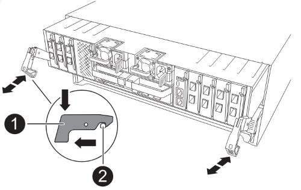

= Richten Sie die neuen MetroCluster IP-Controller ein
:allow-uri-read: 
:icons: font
:imagesdir: ../media/

[role="lead"]
Rack und Verkabelung der neuen MetroCluster IP-Controller

.Schritte
. Planen Sie die Positionierung der neuen Controller-Module und Storage Shelves je nach Bedarf.
+
Der Rack-Platz hängt vom Plattformmodell der Controller-Module, den Switch-Typen und der Anzahl der Storage-Shelfs in Ihrer Konfiguration ab.

. Richtig gemahlen.
. Wenn Ihr Upgrade den Austausch der Controller-Module erfordert, beispielsweise das Upgrade von einem AFF A800 auf ein AFF A90-System oder von einem AFF C800 auf ein AFF C80-System, müssen Sie das Controller-Modul aus dem Gehäuse entfernen, wenn Sie das Controller-Modul austauschen. Für alle anderen Upgrades fahren sie mit <<ip_upgrades_so_sb_4,Schritt 4>>fort.
+
Drücken Sie auf der Vorderseite des Gehäuses die Daumen, um jedes Laufwerk fest einzuschieben, bis Sie einen positiven Stopp spüren. Dadurch wird bestätigt, dass die Laufwerke fest an der Mittelplatine des Gehäuses sitzen.

+
image::../media/drw-a800-drive-seated.png[Zeigt das Entfernen des Controller-Moduls aus dem Chassis]

. [[ip_Upgrades_so_SB_4]] Installieren Sie die Controller-Module.
+
Welche Installationsschritte Sie durchführen, hängt davon ab, ob Ihr Upgrade den Austausch der Controller-Module erfordert oder ob IOM-Module zur Konvertierung der alten Controller in ein externes Shelf erforderlich sind.

+
[cols="2*"]
|===
| Wenn Sie ein Upgrade durchführen... | Folgen Sie den Schritten für ... 

 a| 
** Ein AFF A150 auf ein AFF A20-System
** Ein AFF A220 auf ein AFF A20-System

| Konvertierung von Controller zu externem Shelf 

 a| 
** Ein AFF A800 auf ein AFF A90 System
** Ein AFF C800 auf ein AFF C80-System

| Austausch des Controller-Moduls 

| Beliebige andere Kombinationen für Controller-Upgrades | Alle anderen Upgrades 
|===
+
[role="tabbed-block"]
====
.Konvertierung von Controller zu externem Shelf
--
Bei ursprünglichen MetroCluster IP-Controllern handelt es sich um AFF A150- oder AFF A220-Modelle, können Sie das AFF A150 oder AFF A220 HA-Paar in ein DS224C Laufwerk-Shelf konvertieren und dann zu den neuen Nodes hinzufügen.

Wenn Sie beispielsweise ein Upgrade von einem AFF A150 oder AFF A220 System zu einem AFF A20 System durchführen, können Sie das AFF A150 oder AFF A220 HA-Paar in ein DS224C Shelf konvertieren, indem Sie die AFF A150 oder AFF A220 Controller-Module durch IOM12-Module austauschen.

.Schritte
.. Ersetzen Sie die Controller-Module im Node, den Sie mit IOM12 Shelf-Modulen konvertieren.
+
https://hwu.netapp.com["Hardware Universe"^]

.. Legen Sie die Festplatten-Shelf-ID fest.
+
Jedes Festplatten-Shelf, einschließlich des Chassis, erfordert eine eindeutige ID.

.. Setzen Sie andere Festplatten-Shelf-IDs bei Bedarf zurück.
.. Schalten Sie die Shelfs aus.
.. Verkabeln Sie das umgewandelte Festplatten-Shelf mit einem SAS-Port auf dem neuen System und bei Verwendung von Out-of-Band-ACP-Verkabelung zum ACP-Port auf dem neuen Node.
.. Schalten Sie das umgewandelte Laufwerk-Shelf und alle anderen an die neuen Nodes angeschlossenen Laufwerk-Shelfs ein.
.. Schalten Sie die neuen Nodes ein und unterbrechen Sie dann den Boot-Prozess auf jedem Node, indem Sie Strg-C drücken, um auf die Eingabeaufforderung der Boot-Umgebung zuzugreifen.

--
.Austausch des Controller-Moduls
--
Die separate Installation der neuen Controller ist bei Upgrades integrierter Systeme mit Festplatten und Controllern im selben Chassis, beispielsweise von einem AFF A800 System auf ein AFF A90 System, nicht möglich. Sie müssen die neuen Controller-Module und I/O-Karten nach dem Ausschalten der alten Controller austauschen, wie in der Abbildung unten gezeigt.

Das folgende Beispielbild dient nur zur Darstellung. Die Controller-Module und E/A-Karten können zwischen den Systemen variieren.

--
.Alle anderen Upgrades
--
Installieren Sie die Controller-Module im Rack oder Schrank.

--
====
. Verkabeln Sie die Stromversorgungs-, seriellen Konsolen- und Managementverbindungen der Controller wie in beschriebenlink:../install-ip/using_rcf_generator.html["MetroCluster IP-Switches verkabeln"].
+
Schließen Sie derzeit keine anderen Kabel an, die von den alten Controllern getrennt wurden.

+
https://docs.netapp.com/us-en/ontap-systems/index.html["Dokumentation zu ONTAP Hardwaresystemen"^]

. Starten Sie die neuen Nodes und starten Sie sie in den Wartungsmodus.

.Was kommt als Nächstes?
link:upgrade-mcc-ip-manual-hba-set-ha.html["Stellen Sie die HBA-Konfiguration wieder her, und legen Sie den HA-Status fest"].
