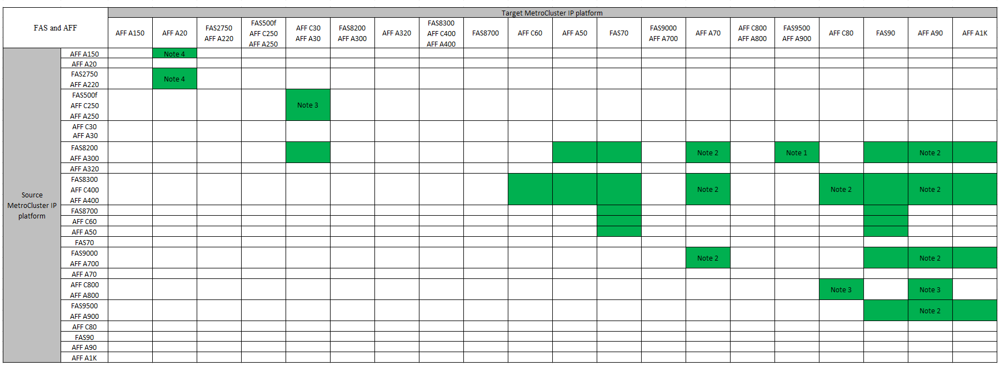

= Unterstützte MetroCluster IP-Controller-Upgrades mithilfe von Befehlen „System Controller Replace“
:allow-uri-read: 
:icons: font
:imagesdir: ../media/

[role="lead"]
Bevor Sie mit dem Upgrade des MetroCluster IP-Controllers beginnen, müssen Sie überprüfen, ob Ihre Upgrade-Kombination unterstützt wird.

Finden Sie Ihre *Source*-Plattform in den MetroCluster Controller-Upgrade-Tabellen in diesem Abschnitt. Wenn die Schnittmenge der Spalte *Source* Platform und *Target* Platform leer ist, wird das Upgrade nicht unterstützt.

Bevor Sie mit dem Upgrade beginnen, überprüfen Sie die folgenden Überlegungen, um sicherzustellen, dass Ihre Konfiguration unterstützt wird.

* Wenn Ihre Plattform nicht aufgeführt ist, gibt es keine unterstützte Kombination für Controller-Upgrades.
* Wenn Sie ein Controller-Upgrade durchführen, stimmen der alte und der neue Plattformtyp *muss* überein:
+
** Sie können ein FAS System auf ein FAS System oder ein AFF A-Series auf ein AFF A-Series System aufrüsten.
** Sie können kein FAS System auf eine AFF A-Serie oder eine AFF A-Serie auf eine AFF C-Serie aufrüsten.
+
Wenn Sie beispielsweise eine FAS8200 als Plattform aktualisieren möchten, können Sie ein Upgrade auf eine FAS9000 durchführen. Sie können kein Upgrade eines FAS8200 Systems auf ein AFF A700 System durchführen.

* Auf allen Knoten (alt und neu) in der MetroCluster-Konfiguration muss dieselbe ONTAP-Version ausgeführt werden. Die unterstützte Mindestversion ONTAP für Ihre Kombination finden Sie imlink:https://hwu.netapp.com["Hardware Universe"^].

.Unterstützte AFF- und FAS MetroCluster IP-Controller-Upgrades
Die folgende Tabelle enthält die unterstützten Plattformkombinationen zum Upgrade eines AFF- oder FAS-Systems in einer MetroCluster IP-Konfiguration mit Befehlen „System Controller Replace“:

* Hinweis 1: Controller-Upgrades werden auf Systemen mit ONTAP 9.13.1 oder höher unterstützt.
* Hinweis 2: Die Zielplattform kann erst nach Abschluss des Controller-Upgrades interne Laufwerke haben. Sie können die internen Laufwerke nach dem Upgrade hinzufügen.
* Hinweis 3: Erfordert den Austausch der Controller-Module.
* Hinweis 4: IOM-Module sind erforderlich, um die alten Controller in ein externes SAS-Shelf zu konvertieren. Informationen zu unterstützten IOM-Modulen finden Sie imlink:https://hwu.netapp.com/["Hardware Universe"^].

.Unterstützte ASA MetroCluster IP-Controller-Upgrades
Das Upgrade der Controller mithilfe von `system controller replace` Befehlen auf ASA Systemen wird nicht unterstützt.

Weitere Verfahren finden Sie unterlink:https://docs.netapp.com/us-en/ontap-metrocluster/upgrade/concept_choosing_an_upgrade_method_mcc.html["Wählen Sie eine Upgrade- oder Aktualisierungsmethode aus"].

.Was kommt als Nächstes?
Lesen Sie die link:upgrade-mcc-ip-system-controller-replace-requirements.html["Voraussetzungen für die Verwendung dieses Upgrade-Verfahrens"].
